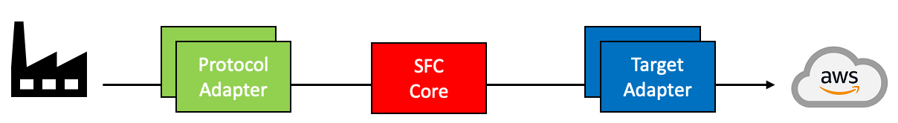

# Shopfloor Connectivity Framework (SFC)

## WIP: Tenets for that README

- KISS
- in describing text - link to docs/README.md using markdown-refs
- Sequence could be:
  - What is SFC?
    - How does it fit into IDF & UNS patterns
  - How can I run it locally to test out things? (for HellowWorld use sfc artifacts from here: <https://dyy8lqvmsyeqk.cloudfront.net/>)
    - show off mock-up data sources like opcua/plcsim and pipe to IoT Core & Sitewise
    - create catchy screen-capture gifs showing sources & target raw data streams
  - How can I configure it?
  - How can I deploy it using Greengrass deployments?
  - How can I build it?
  - How can I write my own adapters?

## Introduction

Shop Floor Connectivity (SFC) is a data ingestion technology that can deliver data to multiple AWS Services.

SFC addresses limitations of, and unifies data collection of our existing IoT data collection services, allowing customers to collect data in a consistent way to any AWS Service, not just the AWS IoT Services, that can collect and process data. It allows customers to collect data from their industrial equipment and deliver it the AWS services that work best for their requirements. Customers get the cost and functional benefits of specific AWS services and save costs on licenses for additional connectivity products.

### SFC Components

There are three main type of components that make up SFC.

- Protocol Adapters
- SFC Core
- Target Adapters

<p align="center">
  
</p>
<p align="center">
    <em>Fig. 1. SFC components</em>
</p>

[Read more](docs/README.md/#introduction)

## Quick start - With SFC Bundles

### Requirements

- Docker
- AWS cli
- java Runtime

### Installation

In this Quick start you will set up following architecture. The local SFC installation will receive data from an OPC UA server and send it according to its' configuration to an S3 Bucket:

<p align="center">
  
</p>

At first we have to download and extract the SFC bundles. These are precompiled executeables to get started quickly:

```shell
# Define sfc Version
export VERSION="1.0.0"

# Download and extract bundles
mkdir sfc && cd sfc
wget https://dyy8lqvmsyeqk.cloudfront.net/55b40a6/bundle/sfc-$VERSION.zip && unzip sfc-$VERSION.zip
rm sfc-$VERSION.zip

for file in *.tar.gz; do
  tar -xf "$file"
  rm "$file"
done
```

### Deploy, Configure, Run

At first we will define the Region the Account and the bucket name we want to send the data to:

```shell
# define basic configuration values
export AWS_REGION="us-east-1"
export ACCOUNT_ID=$(aws sts get-caller-identity --query "Account" --output text)
export SFC_S3_BUCKET_NAME="sfc-s3-bucket-${ACCOUNT_ID}"
export SFC_DEPLOYMENT_DIR=sfc
```

If you do not have a S3 bucket yet, you will have to create one:

```shell
# Create S3 bucket
aws s3api create-bucket --bucket ${SFC_S3_BUCKET_NAME} --region ${AWS_REGION}
```

Next we will have to configure the SFC. This is done via a configuration file you can specify at execution time (e.g. `sfc-main -config example.json`) We are first defining following variables which we will then use in a example configuration file. The following configuration sets SFC up, to connect to a OPCUA-Server and forward it to the S3 Bucket in your AWS Account:
<details>
  <summary>Expand</summary>

```shell


cat << EOF > example.json
  {
    "AWSVersion": "2022-04-02",
    "Name": "OPCUA to S3, using in process source and targets",
    "Version": 1,
    "LogLevel": "Info",
    "ElementNames": {
      "Value": "value",
      "Timestamp": "timestamp",
      "Metadata": "metadata"
    },
    "Schedules": [
      {
        "Name": "OpcuaToS3",
        "Interval": 50,
        "Description": "Read data of all OPCUA data types once per second and send to S3",
        "Active": true,
        "TimestampLevel": "Both",
        "Sources": {
          "OPCUA-SOURCE": [
            "*"
          ]
        },
        "Targets": [
          "S3Target"
        ]
      }
    ],
    "Sources": {
      "OPCUA-SOURCE": {
        "Name": "OPCUA-SOURCE",
        "ProtocolAdapter": "OPC-UA",
        "AdapterOpcuaServer": "OPCUA-SERVER-1",
        "Description": "OPCUA local test server",
        "SourceReadingMode": "Polling",
        "SubscribePublishingInterval": 100,
        "Channels": {
          "ServerStatus": {
            "Name": "ServerStatus",
            "NodeId": "ns=0;i=2256"
          },
          "ServerTime": {
            "Name": "ServerTime",
            "NodeId": "ns=0;i=2256",
            "Selector": "@.currentTime"
          },
          "State": {
            "Name": "State",
            "NodeId": "ns=0;i=2259"
          },
          "Machine1AbsoluteErrorTime": {
            "Name": "AbsoluteErrorTime",
            "NodeId": "ns=21;i=59048"
          },
          "Machine1AbsoluteLength": {
            "Name": "AbsoluteLength",
            "NodeId": "ns=21;i=59066"
          },
          "Machine1AbsoluteMachineOffTime": {
            "Name": "AbsoluteMachineOffTime",
            "NodeId": "ns=21;i=59041"
          },
          "Machine1AbsoluteMachineOnTime": {
            "Name": "AbsoluteMachineOnTime",
            "NodeId": "ns=21;i=59050"
          },
          "Machine1AbsolutePiecesIn": {
            "Name": "AbsolutePiecesIn",
            "NodeId": "ns=21;i=59068"
          },
          "Machine1FeedSpeed": {
            "Name": "FeedSpeed",
            "NodeId": "ns=21;i=59039"
          }
        }
      }
    },
    "Targets": {
      "DebugTarget": {
        "Active": true,
        "TargetType": "DEBUG-TARGET"
      },
      "S3Target": {
        "Active": true,
        "TargetType": "AWS-S3",
        "Region": "us-east-1",
        "BucketName": "${SFC_S3_BUCKET_NAME}",
        "Interval": 60,
        "BufferSize": 1,
        "Prefix": "opcua-data",
        "Compression": "None"
      }
    },
    "TargetTypes": {
      "DEBUG-TARGET": {
        "JarFiles": [
          "${SFC_DEPLOYMENT_DIR}/debug-target/lib"
        ],
        "FactoryClassName": "com.amazonaws.sfc.debugtarget.DebugTargetWriter"
      },
      "AWS-S3": {
        "JarFiles": [
          "${SFC_DEPLOYMENT_DIR}/aws-s3-target/lib"
        ],
        "FactoryClassName": "com.amazonaws.sfc.awss3.AwsS3TargetWriter"
      }
    },
    "AdapterTypes": {
      "OPCUA": {
        "JarFiles": [
          "${SFC_DEPLOYMENT_DIR}/opcua/lib"
        ],
        "FactoryClassName": "com.amazonaws.sfc.opcua.OpcuaAdapter"
      }
    },
    "ProtocolAdapters": {
      "OPC-UA": {
        "AdapterType": "OPCUA",
        "OpcuaServers": {
          "OPCUA-SERVER-1": {
            "Address": "opc.tcp://localhost",
            "Path": "/",
            "Port": 4840,
            "ConnectTimeout": "10000",
            "ReadBatchSize": 500
          }
        }
      }
    }
  }
EOF
```

</details>

With everything being set up you can start the OPC UA server and the SFC itself:

```shell
# start umati opc-ua sample server
docker run -d -p 4840:4840 ghcr.io/umati/sample-server:main

# run sfc
sfc-main/bin/sfc-main -config example.json -info
```
