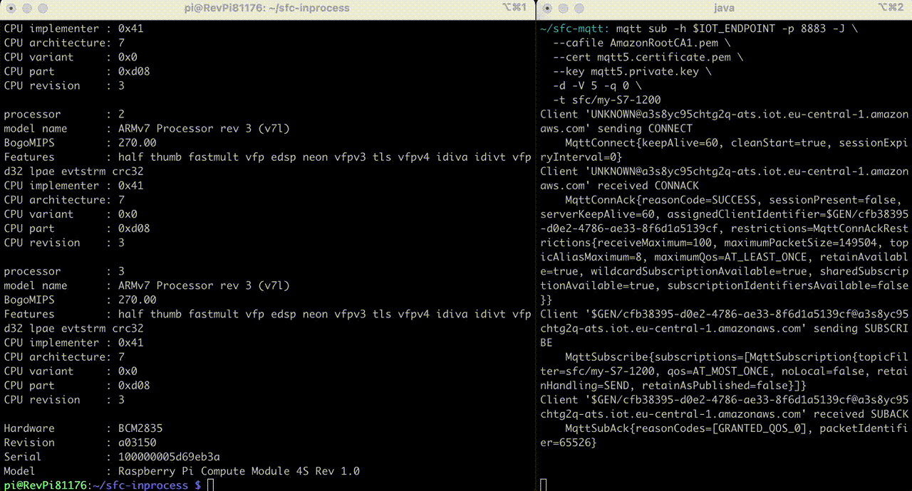

Shop Floor Connectivity (SFC) Framework
=======================================

## Introduction

Shop Floor Connectivity (SFC) is a data ingestion technology that can deliver data to multiple AWS Services.

SFC extends and unifies data collection capabilities additionally to our existing IIoT data collection services, allowing customers to provide data in a consistent way to a wide range of AWS Services. It allows customers to collect data from their industrial equipment and deliver it to the AWS services that work best for their requirements. Customers get the cost and functional benefits of specific AWS services and save costs on licenses for additional connectivity products.

<p align="center">
  
</p>

**Supported protocols:** `Siemens S7`, `Rockwell PCCC`, `Beckhoff ADS`, `SNMP`, `OPC-UA`, `MQTT`, `SQL`,` Modbus-TCP`

**Supported AWS targets:** `IoT Core HTTP`, `IoT Core MQTT`, `Sitewise`, `IoT Analytics`, `Kinesis`, `Firehose`, `Lambda`, `MSK`, `S3`, `SNS`, `SQS`, `Timestream`

### [<code style="background-color:cyan; color:black">SFC Docs</code>](./docs/README.md) ++ [<code style="background-color:cyan; color:black">Greengrass Deployment</code>](./deployment/greengrass-sfc-components/release-version-as-components-cdk/README.md) ++ [<code style="background-color:cyan; color:black">Greengrass Lab</code>](./examples/greengrass-in-process/README.md) ++ [<code style="background-color:cyan; color:black">Siemens S7 sample</code>](./examples/in-process-s7-sitewise/README.md) ++ [<code style="background-color:cyan; color:black">Rockwell PCCC sample</code>](./examples/in-process-pccc-s3/README.md) ++ [<code style="background-color:cyan; color:black">Quickstart</code>](#quickstart-example)

---
&nbsp;

### SFC Components

There are three main types of components that make up SFC:

- `Protocol Adapters`
- `SFC Core`
- `Target Adapters`

Shop Floor Connectivity (SFC) is a versatile data ingestion solution that can be deployed in a variety of environments, including standalone applications, Docker containers, and Kubernetes pods. With no additional requirements beyond a Java JVM 1.8 runtime, SFC can be deployed on Linux and Windows systems. To optimize hardware utilization, SFC uses parallel and non-blocking async patterns in its software.

SFC protocol and target adapters can be implemented as a JVM component or as an external microservices using the gRPC protocol for communication. When running as stand-alone services, protocol adapters can be deployed on separate machines from the SFC Core process, with secure communication facilitated by gRPC (`IPC-mode`). The SFC Core provides a consistent infrastructure allowing all JVM based protocol and target adapters to run in the same process as the SFC Core (`In-Process mode`).

Distributed deployment using microservices is required to deploy in environments that use segregated OT and IT networks, with components connected to devices, protocol adapters, deployed in the OT network and components requiring internet access, targets adapters, in a DMZ.

The SFC core will provide the services, protocol and target adapters, with the required configuration after these are bootstrapped, providing a single, monitored and consistent source and location of configuration.

<p align="center">
  
</p>

>Read more in the [`SFC docs`](./docs/README.md)


## Quickstart Example

>**Requirements**: Docker, Java runtime, aws cli [Credentials Configuration](https://docs.aws.amazon.com/cli/latest/userguide/cli-chap-configure.html#configure-precedence)

### Installation

In this Quick start you will set up following architecture: A local SFC installation will receive data from an OPC-UA server and send it according to its' configuration to an S3 Bucket. *As a side note here: SFC can deal with more industrial protocols - [have a look at the docs here!](./docs/README.md#running-the-jvm-protocol-adapters-as-an-ipc-service)*

At first we have to download and extract the SFC bundles. These are precompiled executables to get started quickly:

```shell
# Define sfc version and directory
export VERSION=$(git describe --tags --abbrev=0)
export SFC_DEPLOYMENT_DIR="./sfc"
```

```shell
# Download and extract bundles into folder ./sfc
mkdir $SFC_DEPLOYMENT_DIR && cd $SFC_DEPLOYMENT_DIR
wget https://github.com/aws-samples/shopfloor-connectivity/releases/download/$VERSION/\
{aws-s3-target,debug-target,opcua,sfc-main}.tar.gz

for file in *.tar.gz; do
  tar -xf "$file"
  rm "$file"
done
cd -
```

### Deploy, Configure, Run

Next we will define the installation directory, the AWS region, the AWS account and the bucket name we want to send the data to:

```shell
# define configuration values
export SFC_DEPLOYMENT_DIR="./sfc"
export AWS_REGION="us-east-1"
export ACCOUNT_ID=$(aws sts get-caller-identity --query "Account" --output text)
export SFC_S3_BUCKET_NAME="sfc-s3-bucket-${AWS_REGION}-${ACCOUNT_ID}"
```

If you do not have a S3 bucket yet, you will have to create one:

```shell
# Create S3 bucket
aws s3api create-bucket --bucket ${SFC_S3_BUCKET_NAME} --region ${AWS_REGION}
```

Next we will have to configure the SFC. This is done via a configuration file you can specify at execution time (e.g. `sfc-main -config example.json`) We are first defining following variables which we will then use in a example configuration file. The following configuration sets SFC up, to connect to a OPCUA-Server and forward it to the S3 Bucket in your AWS Account:
> Note: **Please** expand the section below, to see the json config...
<details>
  <summary><b>Expand</b></summary>

```shell
cat << EOF > $SFC_DEPLOYMENT_DIR/example.json
  {
    "AWSVersion": "2022-04-02",
    "Name": "OPCUA to S3, using in process source and targets",
    "Version": 1,
    "LogLevel": "Info",
    "ElementNames": {
      "Value": "value",
      "Timestamp": "timestamp",
      "Metadata": "metadata"
    },
    "Schedules": [
      {
        "Name": "OpcuaToS3",
        "Interval": 50,
        "Description": "Read data of all OPCUA data types once per second and send to S3",
        "Active": true,
        "TimestampLevel": "Both",
        "Sources": {
          "OPCUA-SOURCE": [
            "*"
          ]
        },
        "Targets": [
          "S3Target"
        ]
      }
    ],
    "Sources": {
      "OPCUA-SOURCE": {
        "Name": "OPCUA-SOURCE",
        "ProtocolAdapter": "OPC-UA",
        "AdapterOpcuaServer": "OPCUA-SERVER-1",
        "Description": "OPCUA local test server",
        "SourceReadingMode": "Polling",
        "SubscribePublishingInterval": 100,
        "Channels": {
          "ServerStatus": {
            "Name": "ServerStatus",
            "NodeId": "ns=0;i=2256"
          },
          "ServerTime": {
            "Name": "ServerTime",
            "NodeId": "ns=0;i=2256",
            "Selector": "@.currentTime"
          },
          "State": {
            "Name": "State",
            "NodeId": "ns=0;i=2259"
          },
          "Machine1AbsoluteErrorTime": {
            "Name": "AbsoluteErrorTime",
            "NodeId": "ns=21;i=59048"
          },
          "Machine1AbsoluteLength": {
            "Name": "AbsoluteLength",
            "NodeId": "ns=21;i=59066"
          },
          "Machine1AbsoluteMachineOffTime": {
            "Name": "AbsoluteMachineOffTime",
            "NodeId": "ns=21;i=59041"
          },
          "Machine1AbsoluteMachineOnTime": {
            "Name": "AbsoluteMachineOnTime",
            "NodeId": "ns=21;i=59050"
          },
          "Machine1AbsolutePiecesIn": {
            "Name": "AbsolutePiecesIn",
            "NodeId": "ns=21;i=59068"
          },
          "Machine1FeedSpeed": {
            "Name": "FeedSpeed",
            "NodeId": "ns=21;i=59039"
          }
        }
      }
    },
    "Targets": {
      "DebugTarget": {
        "Active": true,
        "TargetType": "DEBUG-TARGET"
      },
      "S3Target": {
        "Active": true,
        "TargetType": "AWS-S3",
        "Region": "us-east-1",
        "BucketName": "${SFC_S3_BUCKET_NAME}",
        "Interval": 60,
        "BufferSize": 1,
        "Prefix": "opcua-data",
        "Compression": "None"
      }
    },
    "TargetTypes": {
      "DEBUG-TARGET": {
        "JarFiles": [
          "${SFC_DEPLOYMENT_DIR}/debug-target/lib"
        ],
        "FactoryClassName": "com.amazonaws.sfc.debugtarget.DebugTargetWriter"
      },
      "AWS-S3": {
        "JarFiles": [
          "${SFC_DEPLOYMENT_DIR}/aws-s3-target/lib"
        ],
        "FactoryClassName": "com.amazonaws.sfc.awss3.AwsS3TargetWriter"
      }
    },
    "AdapterTypes": {
      "OPCUA": {
        "JarFiles": [
          "${SFC_DEPLOYMENT_DIR}/opcua/lib"
        ],
        "FactoryClassName": "com.amazonaws.sfc.opcua.OpcuaAdapter"
      }
    },
    "ProtocolAdapters": {
      "OPC-UA": {
        "AdapterType": "OPCUA",
        "OpcuaServers": {
          "OPCUA-SERVER-1": {
            "Address": "opc.tcp://localhost",
            "Path": "/",
            "Port": 4840,
            "ConnectTimeout": "10000",
            "ReadBatchSize": 500
          }
        }
      }
    }
  }
EOF
```

</details>

With everything being set up you can start the OPC UA server and the SFC itself:

```shell
# start umati opc-ua sample server
docker run -d -p 4840:4840 ghcr.io/umati/sample-server:main

# run sfc
sfc/sfc-main/bin/sfc-main -config sfc/example.json
```

### Run Output

The output of your Quick Start SFC run should look like the following. You can also check your S3 bucket (e.g. the first entry of your first file) with the following command:

```shell
# gets a list of entries in your bucket and filters it to the first file with jq
export KEY=$(aws s3api list-objects --bucket $SFC_S3_BUCKET_NAME | jq -r '.Contents[0].Key')

# downloads and prints the first entry of this file into your console
aws s3 cp s3://$SFC_S3_BUCKET_NAME/$KEY - | jq '.[0]'
```

