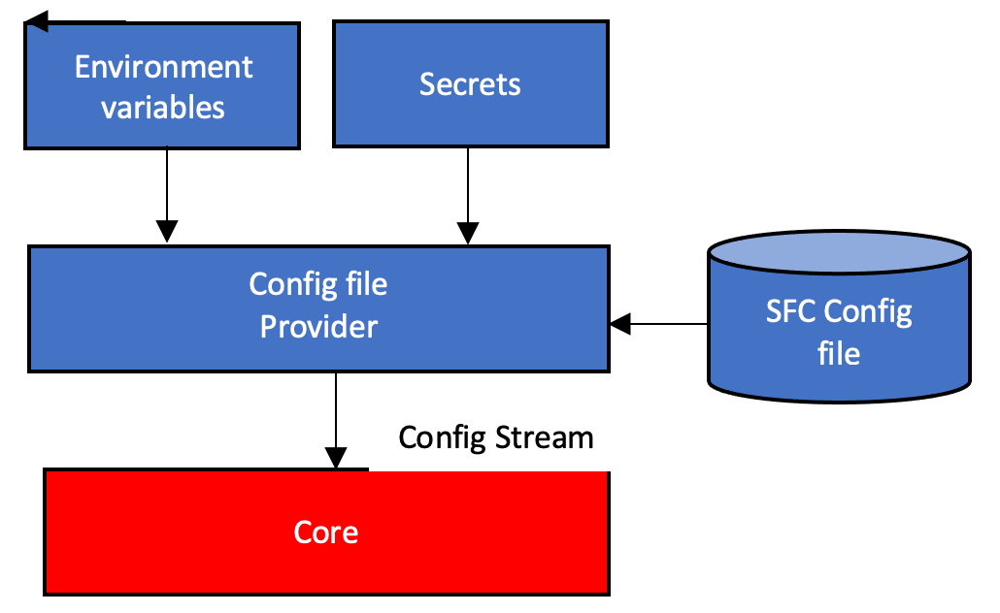
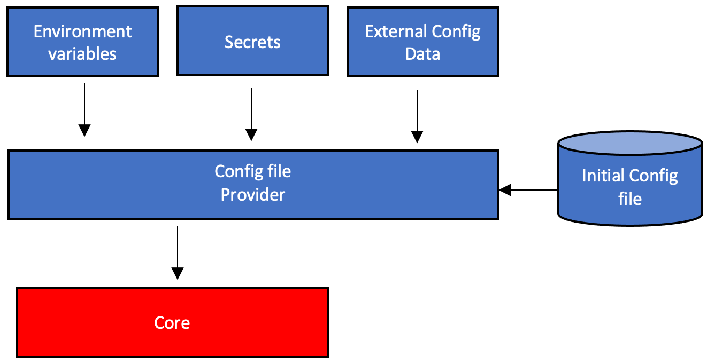
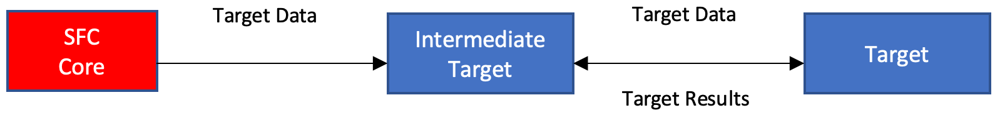

### **`Quicklinks`**

#### SFC Examples
- [**SFC examples collection**](./examples/README.md)

#### SFC Deployment
- [**Greengrass CDK**](../deployment/README.md)
- [**Greengrass Lab**](../examples/greengrass-in-process/README.md)

#### SFC Configuration Spec.
- [**SFC Core**](./core/README.md)
- [**Protocol Adapters**](./adapters/README.md)
- [**Target Adapters**](./targets/README.md)
- [**Metrics**](./metrics/README.md)

...


## Table of Contents

    - [**`Quicklinks`**](#**`quicklinks`**)
      - [SFC Examples](#sfc-examples)
      - [SFC Deployment](#sfc-deployment)
      - [SFC Configuration Spec.](#sfc-configuration-spec.)


SFC Documentation


- [Introduction](#introduction)
  - [SFC Components](#sfc-components)
  - [Protocol Adapters](#protocol-adapters)
  - [Core](#core)
  - [Target Adapters](#target-adapters)
  - [SFC data collection](#sfc-data-collection)
  - [Terminology and concepts](#terminology-and-concepts)
  - [Execution environments](#execution-environments)
- [High level design overview and tenets](#high-level-design-overview-and-tenets)
  - [Execution environment and platform dependencies](#execution-environment-and-platform-dependencies)
  - [Extensibility](#extensibility)
  - [Networking](#networking)
  - [Scalability](#scalability)
  - [Configuration](#configuration)
  - [Logging](#logging)
  - [Metrics](#metrics)
  - [Connectivity](#connectivity)
  - [High availability](#high-availability)
  - [Data types and formats](#data-types-and-formats)
  - [Metadata](#metadata)
- [Deployment](sfc-deployment.md)
- [Running the SFC core process](./sfc-running-core-process.md)
- [Running SFC protocol adapters](./sfc-running-adapters.md)
- [Running SFC targets](./sfc-running-targets.md)
- [Output data format](./sfc-data-format.md)
- [Data processing, transformations and filtering](./sfc-data-processing-filtering.md)
- [Target chaining](./sfc-targets-chaining.md)
- [Configuration](./sfc-configuration.md)
- [Logging and Metrics collection](./sfc-logging-metrics.md)
- [Securing Network Traffic between SFC components](./sfc-securing-component-traffic.md)
- [AWS Service access credentials](sfc-aws-service-credentials.md)
- [Target data transformation templates](./sfc-target-templates.md)
- [Service Health Endpoints](./sfc-health-endpoints.md)
- [SFC tuning](./sfc-tuning.md)


  - [Running Metrics writers as an IPC service.](#running-metrics-writers-as-an-ipc-service.)
  - [Running metric writers in-process](#running-metric-writers-in-process)
- [Extending the SFC Framework](#extending-the-sfc-framework)
  - [Implementing a protocol adapter](#implementing-a-protocol-adapter)
  - [Read function](#read-function)
- [Creating in-process adapter instances](#creating-in-process-adapter-instances)
  - [IPC service adapters](#ipc-service-adapters)
  - [Using JVM protocol adapter classes as IPC services](#using-jvm-protocol-adapter-classes-as-ipc-services)
- [Custom Configuration Handlers](#custom-configuration-handlers)
- [Custom Logging](#custom-logging)
- [Custom Metric Writers](#custom-metric-writers)
- [.NET Core based protocol adapters](#.net-core-based-protocol-adapters)
  - [Running the .NET Core protocol adapters as an IPC Service](#running-the-.net-core-protocol-adapters-as-an-ipc-service)
  - [Output logging format](#output-logging-format)
  - [Implementing a .NET Core Protocol adapter](#implementing-a-.net-core-protocol-adapter)
  - [Service](#service)


SFC Documentation
=================

# Introduction

Shop Floor Connectivity (SFC) is a data ingestion technology that can deliver data to multiple AWS Services.

SFC addresses limitations of, and unifies data collection of our existing IoT data collection services, allowing
customers to collect data in a consistent way to any AWS Service, not just the AWS IoT Services, that can collect and
process data. It allows customers to collect data from their industrial equipment and deliver it the AWS services that
work best for their requirements. Customers get the cost and functional benefits of specific AWS services and save costs
on licenses for additional connectivity products.

[^top](#quicklinks)

## SFC Components

There are three main type of components that make up SFC.

- Protocol Adapters
- SFC Core
- Target Adapters

<p align="center">
  
</p>
<p align="center">
    <em>Fig. 1. SFC components</em>
</p>

## Protocol Adapters

An SFC protocol adapter is used to read data from one or more industrial devices. This adapter interface abstracts the
used protocol from and delivers the data with additional metadata in a common format to the SFC Core. The interface is
designed so that AWS, 3rd parties, or customers can easily extend SFC with new protocol adapters without any
modifications to the rest of the framework.

## Core

The SFC-Core component is the controller of the SFC Framework. It handles configuration and scheduling of the data
collection through the protocol adapters. It can optionally transform each received data value using a combination of
one or more of the 60+ transformation functions available functions, which can address complex data transformations
requirements. The core has end-to-end datatype fidelity, the data can be sent to the targets in the data format it was
read from the source, including complex structured datatypes and multidimensional arrays.

Optionally the data can be buffered and aggregated at the edge to reduce network traffic, by using one or more of the 12
available aggregation functions. After the aggregation has taken place, an additional transformation step can be
performed on the aggregated data. Before sending it to one or more SFC target adapters.

The core integrates with AWS Secrets Manager and allows the use of placeholders for secrets used in the configuration,
which will be transparently retrieved from AWS Secrets manager and substituted into the configuration.

In order to adapt to customer environments, logging, (dynamic) configuration and metrics collection is fully
configurable. Default implementations are provided, but can be replaced by custom ones by implementing a minimal
interface, and adding the implementation (JAR file) to the configuration.

[^top](#quicklinks)

## Target Adapters

SFC target adapters are components that receive the data from the SFC Core and send it to their specific AWS or local
services. Components can optionally apply data transformations using an Apache Velocity template, to deliver the data in
the required format for the receiving service. At the moment of writing there are adapters for the following AWS
Services: IoT Analytics, IoT Core, Kinesis Streams, Kinesis Firehose, Lambda functions, IoT Core, S3, SiteWise,
Timestream, MKS, SNS, and SQS, with additional targets for the local filesystem, terminal output, and MQTT clients.

Target buffering can be applied to reduce the number of required service API calls. All this is part of the SFC
infrastructure and makes it easier to develop new target types for additional AWS services Targets can be daisy-chained
in order to provide additional functionality which is discussed in this document.

## SFC data collection

Configuring data collection with SFC involves defining one or more collection schedules that specify the interval and
sources of data collection, as well as the targets for sending the collected data. These sources can include multiple
protocol adapter types, and individual data items can be transformed, filtered, or aggregated as needed. SFC's active
mode handles all steps defined in the schedules automatically, without requiring additional coding.

## Terminology and concepts

SFC data collection is based on the following concepts

- The SFC Core process runs one or more configured **schedules**.

- A schedule defines from which **sources** the data is read, to **targets** the data is sent and the **interval** at
  which this happens.

- A **source** defines from which protocol adapter the data is read and defines the **channels**, which represent the
  actual values in a protocol agnostic way. A **schedule** can read from multiple sources which can read from different
  protocol adapters.

- A **channel** defines the protocol specific details, like node id's, addresses etc., which are used by the adapter to
  read the values for that channel. Channels also can specify a **transformation** which will be applied to the read
  values, **filters** and **selectors**.

- A **transformation** is a configured set of data transformation operators which can be used to transform each
  individual value read from a **source**.

- A **filter** is a configured set of conditions to filter values based on relative or absolute values changes since the
  last time a value was read, of based on the actual value, defining a combination of boundaries and ranges.

- In order to reduce the amount of data written, or number of write actions to the **targets, aggregation** can be
  applied for a schedule. An aggregation defines the number of values to combine per batch, the aggregation functions
  that are applies to the aggregated data and the **transformations** for these values.

- A **target** defines which target adapter is used to send the data to. It does contain target specific configuration
  for the specific adapter as well as common configuration items as buffer size, compression, applied transformation
  parameters, credentials providers etc.

- A **schedule** can send data to one or more **targets** of different types.

## Execution environments

Shop Floor Connectivity (SFC) is a versatile data ingestion solution that can be deployed in a variety of environments,
including standalone applications, Docker containers, and Kubernetes pods. With no additional requirements beyond a Java
JVM 1.8 runtime, SFC can be deployed on Linux and Windows systems. To optimize hardware utilization, SFC uses parallel
and non-blocking async patterns in its software.

SFC protocol and target adapters can be implemented as a JVM component or as an external microservices using the gRPC
protocol for communication. When running as stand-alone services, protocol adapters can be deployed on separate machines
from the SFC Core process, with secure communication facilitated by gRPC. The SFC Core provides a consistent
infrastructure allowing all JVM based protocol and target adapters to run in the same process as the SFC Core or as a
separate microservice.

Distributed deployment using microservices is required to deploy in environments that use segregated OT and IT networks,
with components connected to devices, protocol adapters, deployed in the OT network and components requiring internet
access, targets adapters, in a DMZ.

The SFC core will provide the services, protocol and target adapters, with the required configuration after these are
bootstrapped, providing a single, monitored and consistent source and location of configuration.

[^top](#quicklinks)

# High level design overview and tenets

SFC design and implementation tenets of the software are based on the experience from working with our industrial
customers. A major learning point is that hardly any assumptions can be made about the environment in which the software
is operated and integrated.

## Execution environment and platform dependencies

Edge software in industrial environments is typically running on a mix of different hardware architectures, operating
systems and runtimes. SFC can be deployed on platforms supporting a JVM and does not have platform or OS specific
requirements. SFC protocol and targets adapters can be implemented and executed in other runtimes, e.g., .NET, as well.

SFC components can be deployed and executed as:

- Standalone applications
- Containers in Docker or Kubernetes
- Greengrass components

## Extensibility

SFC can be extended with additional protocol and target adapters. New adapters can be implemented and added without
modifications to the SFC Core software. Using the infrastructure (JVM) code which is part of the framework, which
reduces the effort to implement new adapters and allows developers to focus on just the protocol or target specific
logic. Adapters can be implemented using a JVM language, or if due to the availability of protocol libraries or other
technical reasons this is not possible, alternative languages and runtimes can be used. JVM based adapters can run
either in-process with the SFC Core or as separate services in their own process. Adapters which are not JVM based
implementations can only run in their own process.

It is also possible to build and configure the following extensions to the SFC Core:

- *Logging*: the standard logging, which writes the output to the process console, can be replaced by a custom logger.
  The SFC configuration allows a custom logger to be configured by adding the library which implements it to the
  configuration.

- *Configuration*: the default configuration is using a JSON file, which is monitored for updates to the actual file, or
  updates to environment variables used for which the configuration file can contain placeholders. As configuration
  data, in customer environments, may be managed and stored in external systems, it is possible to implement and
  configure a custom configuration provider, that can actively and periodically call out to external systems, or wait
  for incoming calls, to obtain the configuration data to build or extend the SFC configuration dynamically.

- *Metrics*: SFC comes with a metrics collector for to the AWS CloudWatch Metrics service, which can be optionally added
  to the SFC configuration. Custom metrics collectors can be implemented and configured.

[^top](#quicklinks)

## Networking

In industrial environments there are two different types of networks that have distinct characteristics and purposes.

IT (Information Technology) networks are used for communication and data management in a traditional office or
enterprise environment. These networks are designed for supporting business processes, data storage and retrieval, and
user communication.

OT (Operational Technology) networks, on the other hand, are used for controlling and monitoring physical processes in
industrial and manufacturing environments. These networks are designed for real-time monitoring and control of
machinery, production processes, and other industrial systems. They typically use specialized protocols and are managed
by operations or engineering departments. OT networks are often modelled after
the [Perdue network model](https://en.wikipedia.org/wiki/Purdue_Enterprise_Reference_Architecture).

In reality in most industrial environments OT and IT networks are not directly connected. Industrial devices are
unlikely to connect to the public internet. Solutions that retrieve data from these devices and submit this machine data
to a cloud service must be capable of handling this network separation, restrictions due to firewalls, proxies, DMZ’s
and offline and/or intermittent connectivity.

SFC is designed so that protocol adapters, the SFC Core and target adapters can be deployed as separate services in
different networking or cloud environments The diagrams below show some of the possible deployment scenarios.
<p align="center">


    <em>Fig. 2. SFC components in different OT/IT contexts</em>
</p>
SFC components running as microservices can explicitly specify which network interface to use for network connections to (OT) data sources and other components. By specifying the network interface, microservices can ensure that their network traffic flows through the desired network path, which can be important for optimizing network performance and ensuring network security.

By configuring the required X509 certificates all network traffic can be secured using server side or mutual TLS.

## Scalability

As protocol and target adapters can run as standalone services, multiple instances can be instantiated on the same
system as the SFC Core, or on external systems to distribute the load and footprint of the components. By distributing
the load and footprint of these components, the overall throughput and scalability of the system can be improved. This
approach also enables better resource utilization and fault tolerance.

[^top](#quicklinks)

## Configuration

SFC is based on the concept of configuration providers, that collect data from internal or external sources. These
providers can constantly monitor resources, periodically make calls or wait for incoming configuration data, and apply
the providers logic to build the actual SFC configuration that is provided to a configuration data stream of the SFC
core. If an updated version of configuration data is provided to the SFC core , it will automatically restart its
internal processes to let the internal and external processes use this updates version of the configuration data,
without the need to restart the core process.

As SFC is deployed in a distributed mode, where protocol and target adapters can be running as standalone services,
potentially on different systems, the SFC core will automatically extract the subsets of relevant data and send this to
the adapter services when the SFC core is started or when it received an update configuration from its configuration
provider. This means that there is no need to manually distribute the confirmation data to these services, even when
they run remotely, as they will automatically and constantly receive a consistent in of the SFC configuration. The only
information that is required to bootstrap these services is the port number on which they can receive the configuration
update.

This feature ensures that the SFC system is always up-to-date with the latest configuration data.

The default SFC configuration provider is based on reading a JSON format configuration file. This file can contain
placeholders for environment variables as well as secrets which are stored in the AWS Secrets Manager's secure store.
The provider is constantly monitoring the actual configuration files, and environment variables for the used
placeholders, and if the files or the environment variables are updated, will provide a new version of the configuration
to the SFC Core.

<p align="center">

</p>
<p align="center">
    <em>Fig. 3. SFC default config provider</em>
</p>

As in customer environment configuration data may be managed and stored in external systems, it is possible to implement
and configure a custom configuration provider to retrieve that data. An instance of a configured custom provider will be
created by the SFC Core at startup. It will receive the content of the initial configuration file, which can be a subset
of the SFC configuration, combined with (or just) custom provider specific configuration data it needs to obtain the
data it will use to build the SFC configuration.

<p align="center">

</p>
<p align="center">
    <em>Fig. 4. Extensible config providers</em>
</p>

As different protocol and target adapters need specific configuration data the SFC configuration data the SFC
configuration consists of generic and non-adapter specific data which is abstract and used by the SFC Core, and
extensions of the generic core data classes that contain additional and specific data for that adapter. The core will
only use the generic configuration data and will pass the adapter specific configuration data to the adapters. The
implementation of the adapters is responsible for handling the specific configuration data. This separation of generic
and specific data makes it possible to add new adapters, using their own specific configuration data, without the need
to make changes to the SFC core. Additionally, the adapter can optionally implement specific logic to validate the
provided configuration data. The SFC Core does provide a configuration reader, which is used by the core, as well as by
the target adapters, to read, validate and replace placeholders in a consistent way.

To protect the configuration from unauthorized modification SFC has tooling and an API to sign the configuration data.
The SFC Core will use the digital signature from the configuration data and reject it verification fails.

[^top](#quicklinks)


## Connectivity

For targets that require network access to send the collected data to their destinations, it is possible to use
intermediate store and forward targets. Intermediate targets can be configured in between the SFC Core and one or more
target adapters by using target daisy-chaining. If the end target loses connectivity the intermediate target will store
the data, optionally encrypted, for a configured amount of time, data volume or number of messages, and will resubmit
the data when the target regains network connectivity, in either FIFO or LIFO mode.
<p align="center">

</p>
<p align="center">
    <em>Fig. 5. Example of target daisy chaining</em>
</p>

Target chaining is generic mechanism in SFC for adding additional processing steps, like store and forwarding as
described above, for target data without changes to the actual end targets.

## High availability

All SFC components that can run as microservices in their own processes can be configured to have an endpoint for
handling health probes. Mechanisms used to manage the service instances, (e.g., Docker Compose, Kubernetes) can use
these endpoints in their configuration to check the status of a service and recycle instances failing to respond to the
health probe requests. This approach can help ensure the reliability and availability of microservices-based systems.

[^top](#quicklinks)

## Data types and formats

SFC provides full end to end data type-fidelity. Data which is read from the protocol adapters is delivered to the
target adapters as the same type of data as it was read. It does support numeric types, (Unicode)strings, time formats,
structured types, as well as vectors of these types.

By applying configured transformations, which consists of a sequence of one or more provided transformation operators,
the SFC can transform every individual value that is read from a protocol adapter. Transformations can be used to
standardize data values and types read from different devices to be delivered in a consistent way to the consuming
target adapters. The SFC framework comes with a set of 80 transformation operators.

A source configuration can be configured to compose structured values from selected individual from that source. Channels, containing structures values,
can be configured to be decomposed into individual values in the output.

The SFC core can also aggregate the data into batches and apply aggregation function to that data, which then can be
sent instead of, or with the individual values. This can be used to reduce the data volume by sending only the output of
selected aggregation functions or the number of data messages to the consuming targets. Additionally, transformations,
as described above, can be applied to the aggregated data.

The data is delivered to the target in a defined hierarchical structure. An additional, template based, transformation,
using Apache Velocity, can be configured for each target to select subsets, restructure or transform the data or
transform it into formats like CSV, YAML or XML.

## Metadata

The data can be enriched with additional information before it is sent to the targets.

In the configuration information at schedule-level, source and channel level maps of (string) data can be configured
that will be added to the output data.

Configuration top-level metadata will be merged with the data at schedule-level and added to the target data under the
metadata node at top-level. If a value is defined at both top-level and schedule-level, the schedule-level value is
used (allowing the overwriting of top-level values at schedule-level).

Metadata at source-level will be added under a metadata node at source-level.

Metadata at channel-level will be added to the values under a metadata-level node at value level.

<p align="center">

</p>
<p align="center">
    <em>Fig. 6. SFC metadata concept</em>
</p>


[^top](#quicklinks)


# Logging

By default, log information is written to the console.

There are 4 trace levels, Error (stderr), Warning(stdout), Info(stdout) and Trace(stdout) which can be specified when
starting the SCF core or a protocol adapter or target writer service.

Logging output will contain the system date and time, the logging level, source of the event and a message. The logging
infrastructure will intercept and blank the values of secrets configured in the SFC configuration.

Instead of writing to the console custom log writer can be implemented and [configured](./core/sfc-top-level-config.md). Details on how to implement a
custom log writer can be found in section [Custom Logging](#custom-logging).

[^top](#quicklinks)

[^top](#quicklinks)


[^top](#quicklinks)

[^top](#quicklinks)

[^top](#quicklinks)

[^top](#quicklinks)

[^top](#quicklinks)


[^top](#quicklinks)

[^top](#quicklinks)

**Example running the adapter and target services as Docker containers:**

- Each project directory for the adapters and targets contains an example Docker file to build a container for the
  service.
- The root of the SFC project contains an example docker-compose.yml file for running an adapter, the SFC core, and
  multiple target processes. The project root also contains an **.env variable file** that defines the variables used in
  the docker-compose.yml file. The directory config-docker contains the configuration for the SFC deployment, it is
  mounted as a volume to give the container running the SFC core access to the config.json file in that directory.
- Note that the SFC configuration file config.json in the config-docker directory uses ${name} placeholders, which are
  replaced by the environment variables set from the docker file for the container running the sfc-main core process.

[^top](#quicklinks)


[^top](#quicklinks)

[^top](#quicklinks)


[^top](#quicklinks)

# .NET Core based protocol adapters

In situations where .NET libraries are used to implement a protocol adapter the SFC framework provides a subset of the
full of classes that are required to implement the adapter, in a consistent with the JVM implementation, way using C#.
As these adapters cannot be loaded into the SFC core process these are implemented as server providing an IPC service
for the SFC core to configure and read the data from the adapter.

This section describes the steps to implement such a server and the key differences with a JVM based adapter.

## Running the .NET Core protocol adapters as an IPC Service

| **Protocol** | **Application name** |
|--------------|----------------------|
| OPCDA        | opdua                |

The applications do have all the following command line parameters in common.

<table>
<colgroup>
<col style="width: 24%" />
<col style="width: 75%" />
</colgroup>
<thead>
<tr class="header">
<th><strong>Parameter</strong></th>
<th><strong>Description</strong></th>
</tr>
</thead>
<tbody>
<tr class="odd">
<td>--cert &lt;cert&gt;</td>
<td><p>PKCS12 Certificate file to secure IPC (gRPC) traffic using SSL (optional). As the gRPC implementation for the .NET framework uses certificates in a pkcs12 format, these might have to be generated first. This can be done using the openssl tool.</p>
<p>openssl pkcs12 -export -out certificate.pfx -inkey privateKey.key -in certificate.crt -certfile CACert.crt</p></td>
</tr>
<tr class="even">
<td>--config &lt;config file&gt;</td>
<td>Name of the configuration file. The only value used from the configuration file is the port number the process will listen on for IPC requests. The SFC core will send an initialization request to the service on this port with the configuration data for the service to initialize its communication with the source device.</td>
</tr>
<tr class="odd">
<td>--envport &lt;envport&gt;</td>
<td>The name of the environment variable that contains the port number for the service to listen on for requests.</td>
</tr>
<tr class="even">
<td>--help</td>
<td>Shows command line parameter help.</td>
</tr>
<tr class="odd">
<td>--password &lt;key&gt;</td>
<td>Password for the PKCS12 certificate file.</td>
</tr>
<tr class="even">
<td>--port</td>
<td>port number for the service to listen on for requests.</td>
</tr>
</tbody>
</table>

The port number, used by the service, can be specified using different methods which are applied in the following order

- The value of the -port command line parameter

- The value of the environment variable specified by the -envport parameter

- From the configuration file, specified by the -config parameter, the port number for the server referred to in the
  ProtocolSource/Server element will be used

To protect the ICP traffic between the core and the adapter SSL can be used. For this, the --cert and if required the
--password parameter must be used to specify the pathname to the certificate and the key file.

## Output logging format

In order to integrate with the Microsoft logging extensions, the command line  
the parameters for logging (-trace, -info, -warning, -error) are not available for
the [.NET Core based adapter](https://docs.microsoft.com/en-us/dotnet/core/extensions/logging?tabs=command-line)
implementations. Instead of these parameters the level of output logging is configured in the appsettings.json file.

## Implementing a .NET Core Protocol adapter

- Create a project for the adapter and reference the sfc-core and sfc-ipc projects

- Build an adapter for the protocol that that implements the SFC IProtocolAdapter interface

- Create the host for the adapter service by creating a class that inherits from ProtocolServiceMain.

  - In this class implement the abstract method named CreateAdapterService that:

  - Sets the ProtocolAdapterServiceImpl.CreateAdapter delegate to a method  
    that does create the instance of the adapter used by the gRPC service.

  - Returns an instance of the Service class passing the  
    ProtocolAdapterServiceImpl class as its type parameter.

- Implement the configuration types required for the adapter. When initializing the adapter using the InitializeAdapter
  service call the JSON configuration for the adapter is passed as JSON data. When the CreateAdapter method (see above)
  is called, an instance of the sfc ConfigReader is passed as a parameter. An instance of the configuration class,
  containing the deserialized data can be obtained by calling the readers GetConfig method, passing the type of the
  configuration class. This configuration data is used to create and initialize the adapter. The configuration class
  must inherit from the SFC BaseConfiguration class. The IValidate class can be implemented which will be called to
  execute the configuration validation  
  logic after reading the data from the JSON configuration data.

- Implement a static main method for the service class that creates a (singleton) instance of that class, and calls it's
  from ProtocolServiceMain inherited Run method to start the service.

```c#
public sealed class OpcdaProtocolService : ProtocolServiceMain
    {
        // Singleton instance with lock
        private static OpcdaProtocolService? _instance;
        private static readonly object InstanceLock = new();

        private OpcdaProtocolService()
        {
        }

        // Override method that creates an instance of the Service that 
        // hosts the gRPC ProtocolAdapter service
        protected override Service<ProtocolAdapterServiceImpl> CreateAdapterService()
        {
            // First set the static property to function delegate that is used by the
            // ProtocolAdapterServiceImpl to
            // create the specific protocol adapter implementation it is using. 
            // This pattern is required die to how dotnet core creates instances of the
            // actual service passing the class, not an instance of the service
            // implementation
            ProtocolAdapterServiceImpl.CreateAdapter = 
                 delegate(ConfigReader reader, ServiceLogger logger)
            {
                var config = reader.GetConfig<OpcdaConfiguration>();
                return OpcdaAdapter.CreateInstance(config, logger);
            };
            return new Service<ProtocolAdapterServiceImpl>();
        }

        private static OpcdaProtocolService Instance
        {
            get
            {
                lock (InstanceLock)
                {
                    return _instance ??= new OpcdaProtocolService();
                }
            }
        }

        public static void Main()
        {
            Instance.Run();
        }
    }
```

[^top](#quicklinks)

## Service

In order to integrate with
the [Microsoft logging extensions](https://docs.microsoft.com/en-us/dotnet/core/extensions/logging?tabs=command-line)the
command line parameters for logging (-trace, -info, -warning, -error) are not available for the .NET Core based adapter
implementations. The level of the logging output is configured in the appsettings.json file.