SFC documentation
=================

### TOC

- [Installation & Deployment tooling](../deployment/README.md)
  - [SFC release as Greengrass components - CDK](../deployment/greengrass-sfc-components/release-version-as-components-cdk/README.md)
  - [SFC local build as Greengrass components - Python](../deployment/greengrass-sfc-components/local-build-as-components-py/README.md)
- [Examples](../examples)
  - [Quickstart Lab](../README.md#quickstart-example)
  - [Greengrass SFC In-Process step-by-step Lab](../examples/greengrass-in-process/README.md)
  - [Greengrass SFC IPC step-by-step Lab](../examples/greengrass-ipc/README.md)
  - [Rockwell PCCC to S3 sample](../examples/in-process-pccc-s3/README.md)
  - [Beckhoff ADS to S3 sample](../examples/in-process-ads-s3/README.md)
  - [Mitsubishi/Melsec SLMP in process sample](../examples/in-process-slmp-s3/README.md)
  - [Mitsubishi/Melsec SLMP IPC sample](../examples/ipc-slmp-s3/README.md)
  - [Siemens S7 to Sitewise sample](../examples/in-process-s7-sitewise/README.md)
  - [OPCUA to MSK In-Process sample](../examples/in-process-opcua-msk/README.md)
  - [OPCUA to MSK IPC sample](../examples/ipc-opcua-msk/README.md)
  - [YAML Custom Configuration Provider](../examples/yaml-custom-config-provider/README.md)
  - [OPCUA Auto Discovery Configuration provider](../examples/opcua-auto-discovery/README.md)
  - [Custom User Interface and API Config Provider](../examples/custom-api-ui-config-provider/README.md)
  - [CSV File Adapter Example](../examples/custom-adapter-csvfile/README.md)
- [Introduction](#introduction)
  - [SFC Components](#sfc-components)
  - [Protocol Adapters](#protocol-adapters)
  - [Core](#core)
  - [Target Adapters](#target-adapters)
  - [SFC data collection](#sfc-data-collection)
  - [Terminology and concepts](#terminology-and-concepts)
  - [Execution environments](#execution-environments)
- [High level design overview and tenets](#high-level-design-overview-and-tenets)
  - [Execution environment and platform dependencies](#execution-environment-and-platform-dependencies)
  - [Extensibility](#extensibility)
  - [Networking](#networking)
  - [Scalability](#scalability)
  - [Configuration](#configuration)
  - [Logging](#logging)
  - [Metrics](#metrics)
  - [Connectivity](#connectivity)
  - [High availability](#high-availability)
  - [Data types and formats](#data-types-and-formats)
  - [Metadata](#metadata)
- [Deployment](#deployment)
  - [In-process and IPC deployment models](#in-process-and-ipc-deployment-models)
  - [Mixed models](#mixed-models)
  - [Target chaining](#target-chaining)
  - [Target chaining and buffering](#target-chaining-and-buffering)
  - [Store and forward target](#store-and-forward-target)
  - [Retention strategies](#retention-strategies)
  - [Router Target](#router-target)
- [Output data format](#output-data-format)
- [Dataflow and processing](#dataflow-and-processing)
- [Data Filtering](#data-filtering)
  - [Data Change Filters](#data-change-filters)
  - [Value Change Filters](#value-change-filters)
  - [Condition Filters](#condition-filters)
- [Configuration](#configuration-1)
  - [Configuration placeholders](#configuration-placeholders)
  - [Configuration secrets](#configuration-secrets)
  - [Deferred placeholder replacement](#deferred-placeholder-replacement)
  - [Configuration templates](#configuration-templates)
  - [Including configuration sections](#including-configuration-sections)
  - [Selective Inclusions](#selective-inclusions)
  - [Combining templates and inclusions](#combining-templates-and-inclusions)
  - [Configuration providers](#configuration-providers)
  - [Custom configuration](#custom-configuration)
  - [Configuration verification](#configuration-verification)
- [Logging](#logging)
- [Metrics collection](#metrics-collection)
- [Securing Network Traffic between SFC components](#securing-network-traffic-between-sfc-components)
  - [Plaintext](#plaintext)
  - [ServerSideTLS](#serversidetls)
  - [MutualTLS](#mutualtls)
- [Providing session credentials for targets accessing AWS Services](#providing-session-credentials-for-targets-accessing-aws-services)
- [Securing the configuration](#securing-the-configuration)
- [Output Structure Transformation](#output-structure-transformation)
  - [CSV output](#csv-output)
  - [XML format](#xml-format)
  - [YAML format](#yaml-format)
- [Service Health Probes](#service-health-probes)
- [OPCUA Alarm and Events types](#opcua-alarm-and-events-types)
- [OPCUA security profiles and certificates](#opcua-security-profiles-and-certificates)
- [SFC Tuning](#sfc-tuning)
  - [SFC Channel Tuning](#sfc-channel-tuning)
  - [SFC Memory Monitoring](#sfc-memory-monitoring)
  - [Concurrent reading from sources](#concurrent-reading-from-sources)
- [SFC configuration](./core/sfc-core-configuration.md)

- [OPCUA Protocol Configuration](./adapters/opcua.md)
- [OPCDA Protocol Configuration](./adapters/opcda.md)
- [S7 Protocol Configuration](#s7-protocol-configuration)
  - [S7SourceConfiguration](#s7sourceconfiguration)
  - [S7FieldChannelConfiguration](#s7fieldchannelconfiguration)
  - [S7AdapterConfiguration](#s7adapterconfiguration)
  - [S7ControllerConfiguration](#s7controllerconfiguration)
- [MQTT Protocol Configuration](#mqtt-protocol-configuration)
  - [MqttSourceConfiguration](#mqttsourceconfiguration)
  - [MqttChannelConfiguration](#mqttchannelconfiguration)
  - [TopicNameMapping](#topicnamemapping)
  - [MqttAdapterConfiguration](#mqttadapterconfiguration)
  - [MqttBrokerConfiguration](#mqttbrokerconfiguration)
- [SQL Adapter Configuration](#sql-adapter-configuration)
  - [SqlSourceConfiguration](#sqlsourceconfiguration)
  - [SqlChannelConfiguration](#sqlchannelconfiguration)
  - [SqlAdapterConfiguration](#sqladapterconfiguration)
  - [DbServerConfiguration](#dbserverconfiguration)
- [Modbus TCP Protocol Configuration](#modbus-tcp-protocol-configuration)
  - [ModbusSourceConfiguration](#modbussourceconfiguration)
  - [ModbusOptimization](#modbusoptimization)
  - [ModbusChannelConfiguration](#modbuschannelconfiguration)
  - [ModbusTcpAdapterConfiguration](#modbustcpadapterconfiguration)
  - [ModbusTcpDeviceConfiguration](#modbustcpdeviceconfiguration)
- [SNMP Protocol Configuration](#snmp-protocol-configuration)
  - [SnmpSourceConfiguration](#snmpsourceconfiguration)
  - [SnmpChannelConfiguration](#snmpchannelconfiguration)
  - [SnmpAdapterConfiguration](#snmpadapterconfiguration)
  - [SnmpDeviceConfiguration](#snmpdeviceconfiguration)
- [PCCC Protocol Configuration](#pccc-protocol-configuration)
  - [PcccSourceConfiguration](#pcccsourceconfiguration)
  - [PcccChannelConfiguration](#pcccchannelconfiguration)
  - [PCCC Addressing](#pccc-addressing)
  - [PcccAdapterConfiguration](#pcccadapterconfiguration)
  - [PcccControllerConfiguration](#pccccontrollerconfiguration)
  - [PcccConnectPathConfiguration](#pcccconnectpathconfiguration)
- [ADS Protocol Configuration](#ads-protocol-configuration)
  - [AdsSourceConfiguration](#adssourceconfiguration)
  - [AdsChannelConfiguratio](#adschannelconfiguration)
  - [AdsAdapterConfiguration](#adsadapterconfiguration)
  - [AdsDeviceConfiguration](#adsdeviceconfiguration)
- [SLMP Protocol Configuration](#slmp-protocol-configuration)
  - [SlmpSourceConfiguration](#slmpsourceconfiguration)
  - [SlmpChannelConfiguratio](#slmpchannelconfiguration)
  - [SLMP channel reading optimization](#slmp-channel-reading-optimization) 
  - [SlmpAdapterConfiguration](#slmpadapterconfiguration)
  - [SlmpControllerConfiguration](#slmpcontrollerconfiguration)
- [AWS IoT Analytics Service Target](#aws-iot-analytics-service-target)
  - [AwsIotAnalyticsTargetConfiguration](#awsiotanalyticstargetconfiguration)
- [AWS IoT Core Service Target](#aws-iot-core-service-target)
  - [AwsIotCoreTargetConfiguration](#awsiotcoretargetconfiguration)
- [AWS MSK Service Target](#aws-msk-service-target)
  - [AwsMskTargetConfiguration](#awsmsktargetconfiguration)
- [AWS Kinesis Firehose Service Target](#aws-kinesis-firehose-service-target)
  - [AwsKinesisFirehoseTargetConfiguration](#awskinesisfirehosetargetconfiguration)
- [AWS Kinesis Service Target](#aws-kinesis-service-target)
  - [AwsKinesisTargetConfiguration](#awskinesistargetconfiguration)
- [AWS Lambda Service Target](#aws-lambda-service-target)
  - [AwsLambdaTargetConfiguration](#awslambdatargetconfiguration)
- [AWS S3 Service Target](#aws-s3-service-target)
  - [Aws3TargetConfiguration](#aws3targetconfiguration)
- [AWS SiteWise Target](#aws-sitewise-target)
  - [AwsSitewiseTargetConfiguration](#awssitewisetargetconfiguration)
  - [AwsSiteWiseAssetCreationConfiguration](#awssitewiseassetcreationconfiguration)
  - [AwsSiteWiseAssetConfiguration](#awssitewiseassetconfiguration)
  - [AwsSiteWiseAssetPropertyConfiguration](#awssitewiseassetpropertyconfiguration)
- [AWS SNS Service Target](#aws-sns-service-target)
- [AWS SQS Service Target](#aws-sqs-service-target)
  - [AwsSqsTargetConfiguration](#awssqstargetconfiguration)
- [AWS Timestream Target](#aws-timestream-target)
  - [AwsTimestreamTargetConfiguration](#awstimestreamtargetconfiguration)
  - [AwsTimestreamRecordConfiguration](#awstimestreamrecordconfiguration)
  - [AwsTimestreamDimensionConfiguration](#awstimestreamdimensionconfiguration)
- [MQTT Target](#mqtt-target)
  - [MqttTargetConfiguration](#mqtttargetconfiguration)
- [File Target](#file-target)
  - [FileConfiguration](#fileconfiguration)
- [Debug Target](#debug-target)
  - [DebugConfiguration](#debugconfiguration)
- [Store and Forward Target](#store-and-forward-target)
  - [StoreForwardTargetConfiguration](#storeforwardtargetconfiguration)
- [ Router Target](#router-target)
  - [RouterTargetConfiguration](#routertargetconfiguration)
  - [RoutesConfiguration](#routesconfiguration)
- [MetricsWriters](#metricswriters)
  - [AwsCloudWatchConfiguration](#awscloudwatchconfiguration)
- [Running the SFC core process](#running-the-sfc-core-process)
- [Running the JVM protocol adapters as an IPC Service](#running-the-jvm-protocol-adapters-as-an-ipc-service)
- [Running targets and as an IPC Service](#running-targets-as-an-ipc-service)
- [Running protocol adapters in-process](#running-protocol-adapters-in-process)
- [Running targets in-process](#running-targets-in-process)
- [Metrics Collection](#metrics-collection)
  - [Running Metrics writers as an IPC service](#running-metrics-writers-as-an-ipc-service)
  - [Running metric writers in-process](#running-metric-writers-in-process)
- [Extending the SFC Framework](#extending-the-sfc-framework)
  - [Implementing a protocol adapter](#implementing-a-protocol-adapter)
  - [Read function](#read-function)
- [Creating in-process adapter instances](#creating-in-process-adapter-instances)
  - [IPC service adapters](#ipc-service-adapters)
  - [Using JVM protocol adapter classes as IPC services](#using-jvm-protocol-adapter-classes-as-ipc-services)
- [Custom Configuration Handlers](#custom-configuration-handlers)
- [Custom Logging](#custom-logging)
- [Custom Metric Writers](#custom-metric-writers)
- [.NET Core based protocol adapters](#net-core-based-protocol-adapters)
  - [Running the .NET Core protocol adapters as an IPC Service](#running-the-net-core-protocol-adapters-as-an-ipc-service)
  - [Output logging format](#output-logging-format)
  - [Implementing a .NET Core Protocol adapter](#implementing-a-net-core-protocol-adapter)
  - [Service](#service)

# Introduction

Shop Floor Connectivity (SFC) is a data ingestion technology that can deliver data to multiple AWS Services.

SFC addresses limitations of, and unifies data collection of our existing IoT data collection services, allowing
customers to collect data in a consistent way to any AWS Service, not just the AWS IoT Services, that can collect and
process data. It allows customers to collect data from their industrial equipment and deliver it the AWS services that
work best for their requirements. Customers get the cost and functional benefits of specific AWS services and save costs
on licenses for additional connectivity products.

[^top](#toc)

## SFC Components

There are three main type of components that make up SFC.

- Protocol Adapters
- SFC Core
- Target Adapters

<p align="center">
  
</p>
<p align="center">
    <em>Fig. 1. SFC components</em>
</p>

## Protocol Adapters

An SFC protocol adapter is used to read data from one or more industrial devices. This adapter interface abstracts the
used protocol from and delivers the data with additional metadata in a common format to the SFC Core. The interface is
designed so that AWS, 3rd parties, or customers can easily extend SFC with new protocol adapters without any
modifications to the rest of the framework.

## Core

The SFC-Core component is the controller of the SFC Framework. It handles configuration and scheduling of the data
collection through the protocol adapters. It can optionally transform each received data value using a combination of
one or more of the 60+ transformation functions available functions, which can address complex data transformations
requirements. The core has end-to-end datatype fidelity, the data can be sent to the targets in the data format it was
read from the source, including complex structured datatypes and multidimensional arrays.

Optionally the data can be buffered and aggregated at the edge to reduce network traffic, by using one or more of the 12
available aggregation functions. After the aggregation has taken place, an additional transformation step can be
performed on the aggregated data. Before sending it to one or more SFC target adapters.

The core integrates with AWS Secrets Manager and allows the use of placeholders for secrets used in the configuration,
which will be transparently retrieved from AWS Secrets manager and substituted into the configuration.

In order to adapt to customer environments, logging, (dynamic) configuration and metrics collection is fully
configurable. Default implementations are provided, but can be replaced by custom ones by implementing a minimal
interface, and adding the implementation (JAR file) to the configuration.

[^top](#toc)

## Target Adapters

SFC target adapters are components that receive the data from the SFC Core and send it to their specific AWS or local
services. Components can optionally apply data transformations using an Apache Velocity template, to deliver the data in
the required format for the receiving service. At the moment of writing there are adapters for the following AWS
Services: IoT Analytics, IoT Core, Kinesis Streams, Kinesis Firehose, Lambda functions, IoT Core, S3, SiteWise,
Timestream, MKS, SNS, and SQS, with additional targets for the local filesystem, terminal output, and MQTT clients.

Target buffering can be applied to reduce the number of required service API calls. All this is part of the SFC
infrastructure and makes it easier to develop new target types for additional AWS services Targets can be daisy-chained
in order to provide additional functionality which is discussed in this document.

## SFC data collection

Configuring data collection with SFC involves defining one or more collection schedules that specify the interval and
sources of data collection, as well as the targets for sending the collected data. These sources can include multiple
protocol adapter types, and individual data items can be transformed, filtered, or aggregated as needed. SFC's active
mode handles all steps defined in the schedules automatically, without requiring additional coding.

## Terminology and concepts

SFC data collection is based on the following concepts

- The SFC Core process runs one or more configured **schedules**.

- A schedule defines from which **sources** the data is read, to **targets** the data is sent and the **interval** at
  which this happens.

- A **source** defines from which protocol adapter the data is read and defines the **channels**, which represent the
  actual values in a protocol agnostic way. A **schedule** can read from multiple sources which can read from different
  protocol adapters.

- A **channel** defines the protocol specific details, like node id's, addresses etc., which are used by the adapter to
  read the values for that channel. Channels also can specify a **transformation** which will be applied to the read
  values, **filters** and **selectors**.

- A **transformation** is a configured set of data transformation operators which can be used to transform each
  individual value read from a **source**.

- A **filter** is a configured set of conditions to filter values based on relative or absolute values changes since the
  last time a value was read, of based on the actual value, defining a combination of boundaries and ranges.

- In order to reduce the amount of data written, or number of write actions to the **targets, aggregation** can be
  applied for a schedule. An aggregation defines the number of values to combine per batch, the aggregation functions
  that are applies to the aggregated data and the **transformations** for these values.

- A **target** defines which target adapter is used to send the data to. It does contain target specific configuration
  for the specific adapter as well as common configuration items as buffer size, compression, applied transformation
  parameters, credentials providers etc.

- A **schedule** can send data to one or more **targets** of different types.

## Execution environments

Shop Floor Connectivity (SFC) is a versatile data ingestion solution that can be deployed in a variety of environments,
including standalone applications, Docker containers, and Kubernetes pods. With no additional requirements beyond a Java
JVM 1.8 runtime, SFC can be deployed on Linux and Windows systems. To optimize hardware utilization, SFC uses parallel
and non-blocking async patterns in its software.

SFC protocol and target adapters can be implemented as a JVM component or as an external microservices using the gRPC
protocol for communication. When running as stand-alone services, protocol adapters can be deployed on separate machines
from the SFC Core process, with secure communication facilitated by gRPC. The SFC Core provides a consistent
infrastructure allowing all JVM based protocol and target adapters to run in the same process as the SFC Core or as a
separate microservice.

Distributed deployment using microservices is required to deploy in environments that use segregated OT and IT networks,
with components connected to devices, protocol adapters, deployed in the OT network and components requiring internet
access, targets adapters, in a DMZ.

The SFC core will provide the services, protocol and target adapters, with the required configuration after these are
bootstrapped, providing a single, monitored and consistent source and location of configuration.

[^top](#toc)

# High level design overview and tenets

SFC design and implementation tenets of the software are based on the experience from working with our industrial
customers. A major learning point is that hardly any assumptions can be made about the environment in which the software
is operated and integrated.

## Execution environment and platform dependencies

Edge software in industrial environments is typically running on a mix of different hardware architectures, operating
systems and runtimes. SFC can be deployed on platforms supporting a JVM and does not have platform or OS specific
requirements. SFC protocol and targets adapters can be implemented and executed in other runtimes, e.g., .NET, as well.

SFC components can be deployed and executed as:

- Standalone applications
- Containers in Docker or Kubernetes
- Greengrass components

## Extensibility

SFC can be extended with additional protocol and target adapters. New adapters can be implemented and added without
modifications to the SFC Core software. Using the infrastructure (JVM) code which is part of the framework, which
reduces the effort to implement new adapters and allows developers to focus on just the protocol or target specific
logic. Adapters can be implemented using a JVM language, or if due to the availability of protocol libraries or other
technical reasons this is not possible, alternative languages and runtimes can be used. JVM based adapters can run
either in-process with the SFC Core or as separate services in their own process. Adapters which are not JVM based
implementations can only run in their own process.

It is also possible to build and configure the following extensions to the SFC Core:

- *Logging*: the standard logging, which writes the output to the process console, can be replaced by a custom logger.
  The SFC configuration allows a custom logger to be configured by adding the library which implements it to the
  configuration.

- *Configuration*: the default configuration is using a JSON file, which is monitored for updates to the actual file, or
  updates to environment variables used for which the configuration file can contain placeholders. As configuration
  data, in customer environments, may be managed and stored in external systems, it is possible to implement and
  configure a custom configuration provider, that can actively and periodically call out to external systems, or wait
  for incoming calls, to obtain the configuration data to build or extend the SFC configuration dynamically.

- *Metrics*: SFC comes with a metrics collector for to the AWS CloudWatch Metrics service, which can be optionally added
  to the SFC configuration. Custom metrics collectors can be implemented and configured.

[^top](#toc)

## Networking

In industrial environments there are two different types of networks that have distinct characteristics and purposes.

IT (Information Technology) networks are used for communication and data management in a traditional office or
enterprise environment. These networks are designed for supporting business processes, data storage and retrieval, and
user communication.

OT (Operational Technology) networks, on the other hand, are used for controlling and monitoring physical processes in
industrial and manufacturing environments. These networks are designed for real-time monitoring and control of
machinery, production processes, and other industrial systems. They typically use specialized protocols and are managed
by operations or engineering departments. OT networks are often modelled after
the [Perdue network model](https://en.wikipedia.org/wiki/Purdue_Enterprise_Reference_Architecture).

In reality in most industrial environments OT and IT networks are not directly connected. Industrial devices are
unlikely to connect to the public internet. Solutions that retrieve data from these devices and submit this machine data
to a cloud service must be capable of handling this network separation, restrictions due to firewalls, proxies, DMZ’s
and offline and/or intermittent connectivity.

SFC is designed so that protocol adapters, the SFC Core and target adapters can be deployed as separate services in
different networking or cloud environments The diagrams below show some of the possible deployment scenarios.
<p align="center">

</p>
<p align="center">
    <em>Fig. 2. SFC components in different OT/IT contexts</em>
</p>
SFC components running as microservices can explicitly specify which network interface to use for network connections to (OT) data sources and other components. By specifying the network interface, microservices can ensure that their network traffic flows through the desired network path, which can be important for optimizing network performance and ensuring network security.

By configuring the required X509 certificates all network traffic can be secured using server side or mutual TLS.

## Scalability

As protocol and target adapters can run as standalone services, multiple instances can be instantiated on the same
system as the SFC Core, or on external systems to distribute the load and footprint of the components. By distributing
the load and footprint of these components, the overall throughput and scalability of the system can be improved. This
approach also enables better resource utilization and fault tolerance.

[^top](#toc)

## Configuration

SFC is based on the concept of configuration providers, that collect data from internal or external sources. These
providers can constantly monitor resources, periodically make calls or wait for incoming configuration data, and apply
the providers logic to build the actual SFC configuration that is provided to a configuration data stream of the SFC
core. If an updated version of configuration data is provided to the SFC core , it will automatically restart its
internal processes to let the internal and external processes use this updates version of the configuration data,
without the need to restart the core process.

As SFC is deployed in a distributed mode, where protocol and target adapters can be running as standalone services,
potentially on different systems, the SFC core will automatically extract the subsets of relevant data and send this to
the adapter services when the SFC core is started or when it received an update configuration from its configuration
provider. This means that there is no need to manually distribute the confirmation data to these services, even when
they run remotely, as they will automatically and constantly receive a consistent in of the SFC configuration. The only
information that is required to bootstrap these services is the port number on which they can receive the configuration
update.

This feature ensures that the SFC system is always up-to-date with the latest configuration data.

The default SFC configuration provider is based on reading a JSON format configuration file. This file can contain
placeholders for environment variables as well as secrets which are stored in the AWS Secrets Manager's secure store.
The provider is constantly monitoring the actual configuration files, and environment variables for the used
placeholders, and if the files or the environment variables are updated, will provide a new version of the configuration
to the SFC Core.

<p align="center">

</p>
<p align="center">
    <em>Fig. 3. SFC default config provider</em>
</p>

As in customer environment configuration data may be managed and stored in external systems, it is possible to implement
and configure a custom configuration provider to retrieve that data. An instance of a configured custom provider will be
created by the SFC Core at startup. It will receive the content of the initial configuration file, which can be a subset
of the SFC configuration, combined with (or just) custom provider specific configuration data it needs to obtain the
data it will use to build the SFC configuration.

<p align="center">

</p>
<p align="center">
    <em>Fig. 4. Extensible config providers</em>
</p>

As different protocol and target adapters need specific configuration data the SFC configuration data the SFC
configuration consists of generic and non-adapter specific data which is abstract and used by the SFC Core, and
extensions of the generic core data classes that contain additional and specific data for that adapter. The core will
only use the generic configuration data and will pass the adapter specific configuration data to the adapters. The
implementation of the adapters is responsible for handling the specific configuration data. This separation of generic
and specific data makes it possible to add new adapters, using their own specific configuration data, without the need
to make changes to the SFC core. Additionally, the adapter can optionally implement specific logic to validate the
provided configuration data. The SFC Core does provide a configuration reader, which is used by the core, as well as by
the target adapters, to read, validate and replace placeholders in a consistent way.

To protect the configuration from unauthorized modification SFC has tooling and an API to sign the configuration data.
The SFC Core will use the digital signature from the configuration data and reject it verification fails.

[^top](#toc)

## Logging

By default, SFC logs its output to the console standard and error output. The logging level determines the type and
level of detail included in the output. However, users can configure SFC to use a custom writer that sends the logging
data, which includes a timestamp, level, source, and message, to alternative destinations.

## Metrics

SFC provides the ability for the core, protocol and targets adapters to gather metrics and send them to a configurable
metrics writer. SFC includes an AWS CloudWatch Metrics writer implementation that can be configured to run in the same
SFC process or as a separate IPC service. Customers can also create their own custom metrics writers to send metrics
data to other destinations.

Metrics collection can be enabled or disabled at the top level, as well as at the protocol or target adapter level.
Customers can specify metrics dimensions at each level.

Furthermore, the metrics collector automatically gathers warning and error messages from the SFC logging.

## Connectivity

For targets that require network access to send the collected data to their destinations, it is possible to use
intermediate store and forward targets. Intermediate targets can be configured in between the SFC Core and one or more
target adapters by using target daisy-chaining. If the end target loses connectivity the intermediate target will store
the data, optionally encrypted, for a configured amount of time, data volume or number of messages, and will resubmit
the data when the target regains network connectivity, in either FIFO or LIFO mode.
<p align="center">

</p>
<p align="center">
    <em>Fig. 5. Example of target daisy chaining</em>
</p>

Target chaining is generic mechanism in SFC for adding additional processing steps, like store and forwarding as
described above, for target data without changes to the actual end targets.

## High availability

All SFC components that can run as microservices in their own processes can be configured to have an endpoint for
handling health probes. Mechanisms used to manage the service instances, (e.g., Docker Compose, Kubernetes) can use
these endpoints in their configuration to check the status of a service and recycle instances failing to respond to the
health probe requests. This approach can help ensure the reliability and availability of microservices-based systems.

[^top](#toc)

## Data types and formats

SFC provides full end to end data type-fidelity. Data which is read from the protocol adapters is delivered to the
target adapters as the same type of data as it was read. It does support numeric types, (Unicode)strings, time formats,
structured types, as well as vectors of these types.

By applying configured transformations, which consists of a sequence of one or more provided transformation operators,
the SFC can transform every individual value that is read from a protocol adapter. Transformations can be used to
standardize data values and types read from different devices to be delivered in a consistent way to the consuming
target adapters. The SFC framework comes with a set of 80 transformation operators.

The SFC core can also aggregate the data into batches and apply aggregation function to that data, which then can be
sent instead of, or with the individual values. This can be used to reduce the data volume by sending only the output of
selected aggregation functions or the number of data messages to the consuming targets. Additionally, transformations,
as described above, can be applied to the aggregated data.

The data is delivered to the target in a defined hierarchical structure. An additional, template based, transformation,
using Apache Velocity, can be configured for each target to select subsets, restructure or transform the data or
transform it into formats like CSV, YAML or XML.

## Metadata

The data can be enriched with additional information before it is sent to the targets.

In the configuration information at schedule-level, source and channel level maps of (string) data can be configured
that will be added to the output data.

Configuration top-level metadata will be merged with the data at schedule-level and added to the target data under the
metadata node at top-level. If a value is defined at both top-level and schedule-level, the schedule-level value is
used (allowing the overwriting of top-level values at schedule-level).

Metadata at source-level will be added under a metadata node at source-level.

Metadata at channel-level will be added to the values under a metadata-level node at value level.

<p align="center">

</p>
<p align="center">
    <em>Fig. 6. SFC metadata concept</em>
</p>

## `TODO`: map SFC metadata approach to Unified Namespace (UNS) & IDF

# Deployment

The SFC core module is implemented to run in a Java virtual machine. Input adapters and targets can be implemented for
the JVM as well, or other runtimes, depending on the platforms where these are deployed and libraries required for the
implementation of the protocol.

JVM implementations only have the option to be loaded in the same processes as the SFC Core. When other runtimes are
used, any language can be used for the implementation. These adapters and targets run as separate processed and use
streaming gRPC IPC to communicate with the SFC core.

The framework contains classes that speed up the development of JVM protocol and target services as well as an
abstraction layer for the GRPC IPC layer.

The components don’t have any runtime environment-specific dependencies, they can be deployed as:

- *Standalone applications* on the target platform supporting the JVM or runtimes are used to implement additional
  adapters and targets.
- *AWS IoT Greengrass v2 components* or containers
- *Docker* or *Kubernetes* containers

[^top](#toc)

## In-process and IPC deployment models

If implemented as jar files containing Java bytecode Protocol, adapters and targets can be configured to be loaded and
executed in the SFC core process. The configuration for the adapter or target type contains a list of jar files, which
are explicitly loaded by the SFC core process, as well as the name of a static factory class that implements a method,
named newInstance, called by the core to create a new instance. The configuration is passed to this method and is used
to initialize the adapter or the target instance.

<p align="center">

</p>
<p align="center">
    <em>Fig. 7. SFC In-process deployment (e.g. in a single host context)</em>
</p>

As an alternative, they can be deployed to run in their processes and communicate with the core using GRPC. Use cases
for this deployment model are to allow the following scenarios:

- Non-JVM execution environment or language to build/execute components
- Flexible deployment on IT/OT networks
- Distribute the load over multiple systems
- Apply lifecycle control with GreenGrass2 or Docker/Kubernetes.

When the processes running the adapter or target services are started, a port number is passed as a parameter on which
the service is listening for requests from the core. Alternatively, the path to a configuration file can be used from
which the process will retrieve just the port number (using an additional target identifier parameter if the
configuration file does contain more than one target for a target type).

When the SFC core initializes it will send an initialization request to the protocol source and/or target servers,
containing just the sections of its configuration that are used by that adapter or target. When the configuration is
modified, and the core process is restarted, it will send an initialization request to each adapter or target with the
newly updated subset of relevant configuration data.

If an adapter or target server is stopped, it will be detected by the SFC Core. It will try to re-connect to the service
and send an initialization request when it succeeds to connect to a new instance of the server.

As the SFC core acts as the provider for configuration data to the servers, these will always work with the latest and
consistent configuration data from a single source. No additions configuration files need to be distributed to the
protocol and adapter processes.

<p align="center">

</p>
<p align="center">
    <em>Fig. 8. SFC IPC deployment (e.g. in a distributed OT/IT context)</em>
</p>

## Mixed models

It is possible to mix instances of in-process and IPC adapters and targets in a single configuration.

<p align="center">

</p>
<p align="center">
    <em>Fig. 9. SFC Mixed deployment options</em>
</p>

## Target chaining

To enable scenarios like store and forward, compression and encryption of data sent to targets, targets can now be
chained. Intermediate adapters can be placed in between the core and the adapters that deliver the data to the actual
destination. These intermediate targets are responsible for creating the adapter instances which are configured to
forward the data to.

When an intermediate target creates the target instances, it can optionally pass an implementation of the
TargetResultHandler interface. The instance of the created targets can use the instance of the passed interface
implementation to acknowledge, dis-acknowledge or report the forwarded data messages as failed back to the forwarding
intermediate target. The same interface can be used to query the data that the result of the forwarding target expects .
This can be just the serial number, the complete message or no data, for acknowledged, dis-acknowledged or error
messages.

[^top](#toc)

## Target chaining and buffering

Targets receive data from the SFC core in order to deliver this data to a target specific destination, which could be a
local store, a local service or a cloud service.

In order to add functionality to the delivery of target data, special targets can be configured in between the sfc-core
and the targets that do the actual delivery of the data. For the sfc-core intermediate targets look like other targets
when writing the data. The intermediate targets implement their specific logic acting on the received data, and pass the
data to the configured next targets in the chain. The intermediate targets do pass a handler to these targets, that
these targets can use to report back the results of delivering the data to their destinations. The data messages can
either be acknowledged if the data was delivered successfully to the destination, not-acknowledged if the destination of
the target was not available ,e.g. due to loss of connectivity, or reported as error if the data could not be processed
by the target (e.g., die to invalid data for that target). The intermediate target can the take action based on the
result received from the next targets in the chain.

Using this strategy additional functionality can be added to delivering data to target destinations without making
changes to the actual end-targets.

<p align="center">

</p>
<p align="center">
    <em>Fig. 10. SFC Target Chaining</em>
</p>

Store and forwarding functionality for SFC targets is implemented using an intermediate target of type
store-forward-target. It will use the returned results from the targets to buffer messages that could not be delivered
to the destinations of the targets behind the store and forward target. When the targets can resume delivering data to
their destinations the store and forward target will resubmit the data to these targets.

[^top](#toc)

## Store and forward target

As described above store and forwarding for SFC targets is implemented by an intermediate target that can be configured
in between the SFC-Core and the actual targets. This target stores the buffered data to disk if it cannot be delivered
to the destination of the targets that are configured as next targets in the chain.

Buffering will also take place in situation where the next targets in the chain are IPC targets which cannot be reached
by the store and forwarding targets die to network issues.

The store and forward target using to following logic:

- In normal situations the target will forward the target data to the next targets.
- For messages that can be delivered to their destinations these targets will send ACKs containing the serial number of
  the delivered messages.
- When the targets cannot deliver messages, NACKS, including the full message will be returned.
- When receiving NACKs the store and forward target will go into buffering mode and will start buffering data received
  by the core to disk.
- In buffering mode, the store and forward target will periodically send a buffered message, which is the oldest message
  that falls in the retention strategy (see below) of the buffer if the buffer is configured to operate in FIFO mode,
  which is the default. In LIFO mode the most recent message is used. An internal flag is set in the message to indicate
  to the target that this message should not be buffered but send directly to their destinations.
- The target will try to deliver this message to the destination and report an ACK or NACK for that message.
- When an ACK is received the store and forward target will switch back from buffering mode into normal mode after
  submitting the buffered data. This will happen in FIFO or LIFO mode based on configuration.
- Messages for which an ERROR is received are not stored and in case they are buffered removed from the store as this
  means they cannot be processed by the target.

[^top](#toc)

## Retention strategies

In order to prevent running out of disk space of the device that is used to store the buffered messages a retention
strategy must be defined for a store and forward target. This can either be a period in minutes, a number of messages
per target the total size in MB per target. Data in the buffer that falls outside the used retention criteria will not
be resubmitted and automatically deleted from the storage device.

In order to reduce the storage of buffered messages the target will try to use hard links for messages that need to be
stored for multiple end targets, if the file system of that device supports it.

*PLEASE NOTE*  
Storing messages to a physical device can reduce the throughput of the SFC deployment. It is strongly recommended to run
process that contains the store and forward target, in memory or as an IPC service, on a device that has a fast storage
device.

## Router Target

The router target can be used to forward data to one or more targets in a target chain. For each target an alternative
target can be configured to which the data is routed if that data cannot be written to its primary target.

Each primary target can also have a target configured to which the data is routed if it has been written successfully to
its primary target or the alternative target of its primary target,

Used cases for the router target are:

- *Bundling* of (compressed) message data over a network to a system on which a group of targets, running as external
  services, are hosted.

<p align="center">
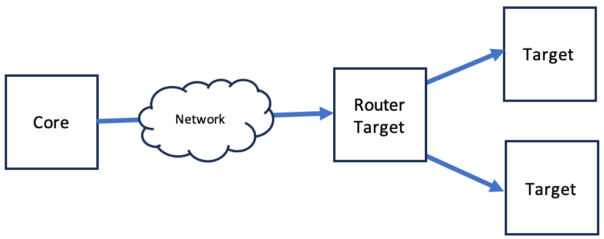
</p>
<p align="center">
    <em>Fig. 11. SFC Router target - bundling data</em>
</p>

- *Routing* of data *to alternative targets* if data cannot be written to primary targets

<p align="center">
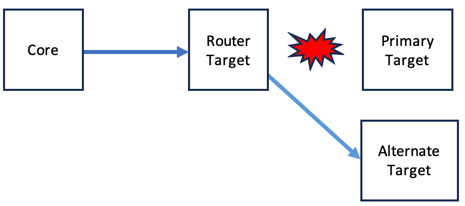
</p>
<p align="center">
    <em>Fig. 12. SFC Router target - failover target</em>
</p>

- *Routing* of data to a *success target* after it has been written to primary targets or their alternative targets. The
  success target can be used to archive delivered messages or a custom target van notify the source of the data that the
  data has been delivered.

<p align="center">
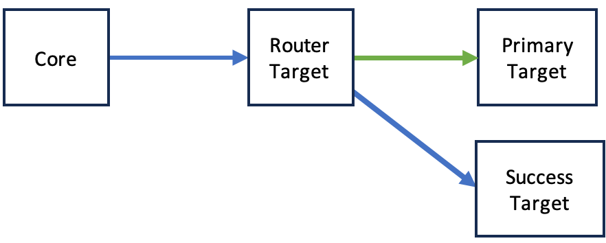
</p>
<p align="center">
    <em>Fig. 13. SFC Router target - routing to a final `success` target</em>
</p>

<p align="center">
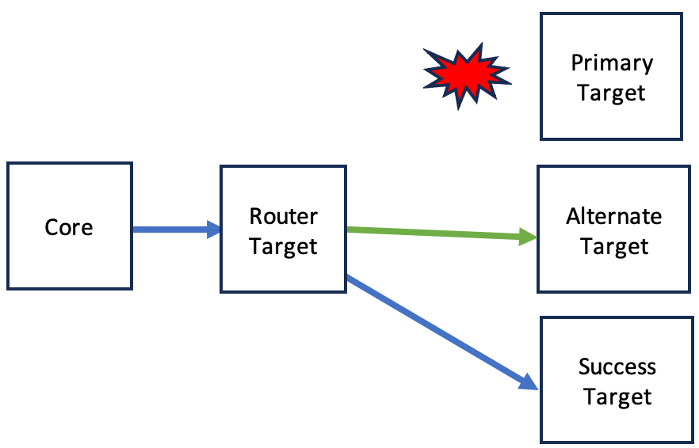
</p>
<p align="center">
    <em>Fig. 14. SFC Router target - routing to a final `success` target</em>
</p>

[^top](#toc)

# Output data format

```sh
[schedule]  -- schedule name
[serial]    -- serial number
[timestamp] -– processing timestamp
[sources]   -- source name* --- [values] -- value name* --- [value]-- value
                            |                           |- [metadata]--name* -- meta value
                            |                           |- [timestamp]-- value timestamp
                            |
                            |- [timestamp] -- source timestamp
                            |- [metadata] -- name* -- value
[metadata] --name* -- value

#When aggregation is used an additional level is used for the values for each applied aggregation

[schedule]  -- schedule name
[serial]    -- serial number
[sources]   -- source name* --- [values] -- value name* --- [value]-- **aggregation name*** --  [value] --- value
                            |                           |                                       [timestamp] -timestamp
                            |                           |- [metadata] -- name* -- meta value
                            |                           |- [timestamp] -- timestamp
                            |
                            |- [timestamp] --- source timestamp
                            |- [metadata] --- name* --- value
[metadata] --name* -- value
```

Custom element names in brackets can be set for all elements above in brackets using the "ElementNames" configuration
setting. The name keys for the sources and value maps get the value of the "Name" element for the source and channel in
their configuration (default is the key used as the id for the source/value in the configuration).

The root contains 4 elements

- **schedule**: This element contains the name of the schedule that outputs the data

- **serial**: A unique serial number for the target data

- **timestamp**: Timestamp when the target output data was created

- **sources**: This element contains a map with a node for each source of the schedule that has output data

  - **values**: The values node contains a map for each channel of its source that has an output value

    - **value**: This node contains the actual value of a channel or an aggregated value

    - **metadata**: This node contains a map with (optional) metadata for a channel

    - **timestamp**: Timestamp for the value (only if timestamp level = "value" or "both")
      For aggregated data the timestamp is only available for the aggregation outputs first, last and values.

- **timestamp**: Timestamp at source level (only if timestamp level = "source" or "both")

- **metadata**: This node contains a map with (optional) metadata for a schedule

# Dataflow and processing

The data collected by the SFC source connector is processed by an internal data pipeline that consists of the following
steps:

- Data collected is read from connector
- Data transformations are applied on individual values if a transformation for a value has been configured.
- Data change filtering is applied at value or source level. Data change filters only let values pass if the new value
  differs from a previously passed value with at least a configured percentage or absolute value, or when a configured
  time period has passed since passing the last value. If a change filter is configured at source and value level, then
  the filter at value level takes precedence.
- Data value filter is applied at value level is applied if a filter has been configured for that value. The value is
  passed if it matches the filter expression which can consist of a combination of one or
  more `==`, `!=`, `>`, `>=`, `<`, `<=`, `&&`, `||` operators. For non-numeric values only the `==` and `!=` operators
  van be used.
- If data aggregation is specified the values are buffered until the specified aggregation size is reached. The output
  of an aggregation can be one or more output values from an aggregation (`avg`, `min`, `max`, etc.) on the collected
  values and/or the collected values.
- Data transformations are applied on the aggregated data output values if a transformation is configured for that
  specific output.
- Data values are named according to their configured names. Metadata and timestamp information is added at configured
  levels (top, source and value) as configured.
- The data is transmitted to the configured targets where additional buffering or target specific processing is done.
  Selected targets support the transformation of the data submitted to their destinations by configuring an Apache
  Velocity template that is applied on that data.

```
Source data -> Transformation(value)(*) -> Change Filter (*) -> Value Filter(*) -> Aggregation(*) -> Transformation (value)(*) -> Naming of data and adding timestamp and metadata -> Transformation template (structure) (*) ->  Data to Target
```

(`*`) optional, only applied if configured

[^top](#toc)

# Data Filtering

The data read from the source can be filtered in two steps. First data change filtering is applied, then data value
filtering. Both steps are optional and can be applied individually.

## Data Change Filters

A data change filter can be configured at source and channel values level. If a filter is configured at source level it
is applied on all values for that source. Filters configured at value level take precedence over a filter at source
level. Values only pass a filter if a value has changed at least, or beyond, a configured value since the last value
that was passed. This value can be a percentage or absolute value. The initial value will always pass the filter. It is
also possible to specify a time interval in which at least a value will pass the filter. These filters can only be
applied on single numeric values.

## Value Change Filters

A value change filter will pass a value if it matches a filter expression. A filter expression can consist of one or
more operators like `==`,`!=`,`>`,`>=`,`<`,`<=`, combined in `&&` and `||` groups. For non-numeric values, only the ==
and != operators can be used.

## Condition Filters

After the Data Change and Value Change filters, if any, have been applied Condition filter can be used to select values
based on other values of the same source. This makes it posible to include or exclude values if other values, or
combinations of values do exist, or do not exist in the same source. Operators that can be used are :

- ***any*** : Any of a list of values must exist

```json
  {
        "Operator" : "any",
        "Value"    : ["a","b"]
  }
```

Both field a and b must exist for this source to include the value on which this filter is applied,

- ***none*** : None of a list of values must exist
```json
{
  "Operator": "none",
  "Value": ["a", "b" ]
}
```

Value a and b must not exist for source to include the value on which this filter is applied

- ***all*** : All values of a list of other values must exist

```json
{
  "Operator": "all",
  "Value": ["a", "b"]
}
```

Both value a and b must exist for source to include the value on which this filter is applied

- ***present*** : A specified value must exist

```json
{
  "Operator": "present",
  "Value": [
    "a"
  ]
}
```

Value a must exist for source to include the value on which this filter is applied

- **absent**:  A specified value may not exist

```json
{
  "Operator": "absent",
  "Value": [
    "a"
  ]
}
```

Value a must not exist for source to include the value on which this filter is applied

- ***only*** : The value must be the only value from a source

```json
{
  "Operator": "only",
  "Value": true
}
```

If value is true then the value on which the filter is applied is only included if it is the only value for that source.

If value is false then the value on which the filter is applied is only included if it is not the only value for that
source.

- ***notonly*** : The value must not be the only value from a source

```json
{
  "Operator": "notonly",
  "Value": true
}
```

If value is true then the value on which the filter is applied is only included if it not the only value for that
source.

If value is false then the value on thich the filter is applied is only included if it is the only value for that
source.

All the operators above can be combined using the ***and*** and ***or*** operator, which take filter or a list of
filters as the filter value.

```json
{
  "Operator": "and",
  "Value": [
    {
      "Operator": "only",
      "Value": "false"
    },
    {
      "Operator": "all",
      "Value": [
        "a",
        "b"
      ]
    }
  ]
}
```

The value on which the filter is applies is include when it is not the only value for that source and value a and b must
exist for that source.

The names as values for the filters are the names which are used as the keys in the channel configuration of the
source (not the name value which is used to set the name of the value in the output). If a value is a structured value,
including sub values these can be specified by adding a "." plus the name of these fields, e.g. ServerStatus.state.

The condition filters use the JMESPath syntax (https://jmespath.org/) to match the name of the values and their sub
values, allowing to use the full JMESPath syntax to build complex filters.

If a name of a field, or a part of it does contain other than alphanumeric characters, then these must be included in
double quotes, e.g. "System-Status", "System-Status".state, "System.Status".state.

Condition filters are as a map in the "ConditionFilters" section of the configuration. The name of the entry which
defines a filter can be used as the value of the "ConditionFilter" for a channel to apply that filter for the channel.

# Configuration

As the core only is aware of its input sources and output targets by name. The parts of the configuration model which
are used by the core do not contain any protocol or target-specific information. The core knows its input and outputs
only by its identifiers.

The configuration model for each type of input protocol and a target does contain their specific details. SFC implements
a configuration layer that gives each adapter or target its specific view of the configuration data.

As a result, the core and each protocol or target can have their view of its specific configuration data, without
dependencies, mix-up, or re-definition of attributes used by other types.

To load the configuration data from a JSON source, the consumer makes a call to the configuration layer, specifying the
class that implements the type-specific model of the data. These classes can optionally implement additional logic to
validate the loaded data, which can raise a configuration exception, including a detailed description if the data is not
valid according to the validation logic.

[^top](#toc)

## Configuration placeholders

The JSON configuration can contain placeholders in the format **${name}**. These placeholders are replaced by the value
of environment variables with the specified name or a configured secret (see below). Using placeholders will help to
keep consistency between (repeated) values in the configuration and values used in other configuration types.

## Configuration secrets

SFC integrates with AWS Secrets Manager following the same logic as used in GreenGrass Secret manager. Secrets are
defined in the configuration file using the SecutityManager Element. This element includes a list of configured secrets.
Each secret has an id, which can either be the arn or name of the secret, and an optional alias. Secrets can be used by
using placeholders of the format \${name} in the configuration file. Name can be the name, arn or alias of the secret.
If just an arn is used for a configured secret either this arn or the name of the secret in the AWS Secrets manager
service can be used as name in the placeholder.

When resolving the placeholders, the configuration manager will first try to replace the placeholder with the value of
an environment variable with that name, or when no variable with that name exists it will try to replace it with
configured secret value.

If the device running SFC does not have access at startup, or when a configuration is updated and reloaded, it uses the
values stored from the last time the secrets were read from the AWS Secrets Manager service.

In order to read the secrets stored in the AWS Secrets Manager service a reference to a Credentials Client, configured
in the configuration, can be used. The certificate/role alias configured for that client must give permission to make a
getSecretValue API request for the configured secrets. Without client the normal credential chain path for the AWS SDK
is used to obtain the required credentials.

Secrets which are stored locally are encrypted using a file with a secret key, which can be configured to point to an
existing file, or as a reference to a GreenGrass deployment in which case the GreenGrass configured private key will be
used. If a path to a file with a private key is used then there is also an option to automatically generate this file
containing the secret key at first use, if it does not exist.

[^top](#toc)

## Deferred placeholder replacement

In normal case placeholders for environment variables and secrets are resolved in the SFC core Configuration logic. When
the core build subsets of the configuration, used to initialize external IPC servers for source protocol adapter or
target IPC services, the placeholders are replaced with their environment variable or secret values. It is possible to
defer the replacement of these placeholders on the receiving service, allowing to resolve environment variables by the
system/process running the service or preventing secret values to be passed over the network. (please note that IPC
traffic between the core and external services can be configured to be encrypted) Deferring placeholder can be done by
using placeholders in the format **${{name}}**. If the placeholders are used for replacement by configured secrets from
AWS Systems Manager, all required configuration elements to resolve the secrets by the service process will be included
in the configuration that is used to initialize it. (SecretsManager with selected configured secrets, credentials
manager client etc.)

## Configuration templates


SFC configuration templates are used to make the configuration more modular and enable re-use of repeating sections of configuration. Replacing repeating sections of a configuration will also reduce the size of the configuration file.

Templates are JSON elements containing configuration data and are defined in the “Templates” section of the SFC configuration file. These templates in the "Templates" section are indexed by a unique name.

Below is a snippet of an SFC configuration file defining an S3 Target
```json
"Targets": {
  "S3Target": {
    "Active": true,
    "TargetType": "AWS-S3",
    "Region": "eu-west-1",
    "BucketName": "sfc-bucket",
    "Interval": 60,
    "BufferSize": 1,
    "Prefix": "data",
    "CredentialProviderClient": "AwsClient",
    "CertificatesAndKeysByFileReference": false,
    "Compression": "Zip"
  }
```

We can define a template for this section:

```json
"Templates" : {
  "S3Target": {
    "Active": true,
    "TargetType": "AWS-S3",
    "Region": "eu-west-1",
    "BucketName": "sfc-bucket",
    "Interval": 60,
    "BufferSize": 1,
    "Prefix": "data",
    "CredentialProviderClient": "AwsIotClient",
    "Compression": "Zip"
  }
}
```

The template can be used from its original location in the Targets section. The syntax for using a template is **"$(name of the template)"**.

```json
"Targets": {
  "S3Target": "$(S3Target)"
}
```


Within a template it is possible to have placeholders for values making these templates more generic. In the example below the name of the bucket and its region are replaces by placeholders. Placeholders consist of the name of the placeholder within a "%" prefix and suffix.


```json
"Templates" : {
  "S3Target": {
    "Active": true,
    "TargetType": "AWS-S3",
    "Region": "%region%",
    "BucketName": "%bucket-name%",
    "Interval": 60,
    "BufferSize": 1,
    "Prefix": "data",
    "CredentialProviderClient": "AwsIotClient",
    "Compression": "Zip"
  }
}
```

Now this template can be used by specifying in an SFC  its name and the names of the placeholders with their values. Below is an example and Targets with two S3 targets defined using the template. The values for the placeholders used by the template are provided by a comma separated list, which is separated from the name of the template by a comma as well, including the names and values of the placeholders. The actual values should nor be included in quotes. Leading and training whitespaces will be trimmed from the values.

```json
"Targets": {
  "S3Target-1": "$(S3Target, bucket-name=sfc-bucket-1, region=eu-west-1)",
  "S3Target-2": "$(S3Target, bucket-name=sfc-bucket-2, region=eu-west-1)"
}
```


It is also possible to use nested  templates within templates, Below is the S3 template using a second template named S3Prefix.

```json
"Templates" : {
  "S3Target": {
    "Active": true,
    "TargetType": "AWS-S3",
    "Region": "%region%",
    "BucketName": "%bucket-name%",
    "Interval": 60,
    "BufferSize": 1,
    "Prefix": "$(S3Prefix)",
    "CredentialProviderClient": "AwsIotClient",
    "CertificatesAndKeysByFileReference": false,
    "Compression": "Zip"
  },

  "S3Prefix" : "data"
}
```


Templates can be used for all values in and SFC configuration file to replace values.

It is possible to partially replace parts of  values. Note that this works only for single value templates, not for structured values. Below is a template used to define the S3 and debug  target types. A third template named "DeploymentDir" is used in the other two templates to specify the directory in which the targets are deployed.

```json
"Templates" : {
  "S3Type" : {
      "JarFiles": ["$(DeploymentDir)/aws-s3-target/lib"],
      "FactoryClassName": "com.amazonaws.sfc.awss3.AwsS3TargetWriter"
  },
  "DebugType" : {
      "JarFiles": ["$(DeploymentDir)/debug-target/lib"],
       "FactoryClassName":"com.amazonaws.sfc.debugtarget.DebugTargetWriter"
  },
  
  "DeploymentDir" : "/sfc"
}
```

When rendering the templates the SFC core will check for circular dependencies between templates. After resolving the templates SFC will remove the “Templates” section from the configuration.


## Including configuration sections


When processing a configuration file, SFC has the option to include sections from external sources. These sources can be external files or content retrieved from making a http get request. The content from the file of the http get response must be a valid JSON object.

In order to include configuration data from an external the file the syntax is **“@file:\<pathname of the file>”**.   For including data from a get request he syntax is **“@http://\<url>”** or **“@https://\<url>**”.
After reading the content from the file or the get response SFC will replace the reference to the file or the url with this content.

Below is an example where the value of “AwsIoTClient” is read from a file named “aws-iot-client.json”.

```json
"AwsIotCredentialProviderClients": {
  "AwsIotClient": "@file:aws-iot-client.json"
}
```

This file contains the following JSON data:

```json
{
  "IotCredentialEndpoint": "abcdefghijklmn.credentials.iot.eu-west-1.amazonaws.com",
  "RoleAlias": "GreengrassV2TokenExchangeRoleAlias",
  "ThingName": "GreengrassCore-1",
  "CertificateFile": "../thingCert.crt",
  "PrivateKeyFile": "../privKey.key",
  "RootCa": "../rootCA.pem"
}
```


For getting the content from a hypothetical configuration server named "config-server" the syntax would be:

```json
"AwsIotCredentialProviderClients": {
  "AwsIotClient": "@https:config-server/sfc/aws-iot-client.json"
}
```


It is possible to nest, mixing includes from files and from get requests, in the included content. When including the content SFC will detect circular references between include sections.

SFC will check if the included configuration content is changed by external processes, and if this is the case reloaded the SFC configuration file. For included files SFC will monitor the file system to detect changes to the included file. Monitoring the included files can be disabled by including a configuration item **"MonitorIncludedConfigFiles" : false** at the top level of the SFC configuration.

To check if the content loaded from he get-request to the configured url is updated, SFC will make a request every 60 seconds to that url. If the content was retrieved successfully, it will compare a checksum of that data with the crc from a previous request to detect changes to the data. If a change is detected then the SFC config will be reloaded. The interval can bet set by including a configuration item **“MonitorIncludedConfigContentInterval” : <interval in seconds>** at the top level of the SFC configuration. To disable set the value to 0.

SFC will cache the content included content, as long as it is not modified, for faster re-loading of the data.

## Selective Inclusions

Instead of including the complete content obtained from an included file or response of a service call it is also possible to select a subset of this content.
In order to select a subset the filename or the url must be followed by a "@" and a valid <a href="https://jmespath.org/">JMESPath expression</a> that selects the section of the content to include.  Selectors allow
to combine related configuration sections in a combined inclusion  content obtained from a file or a service call.

The following included file "s3-inproc.json" contains two elements. The first element "S3TargetType" defined the type of the in-process S3 target. The second element "S3Target" defined the actual S3 target.

```json
{
   "S3TargetType" : {
         "JarFiles": ["/sfc/s3-target/aws-s3-target/lib"],
         "FactoryClassName": "com.amazonaws.sfc.awss3.AwsS3TargetWriter" 
      },

   "S3Target": {
      "TargetType": "AWS-S3",
      "Region": "eu-west-1",
      "BucketName": "sfc-bucket-name",
      "Interval": 60,
      "BufferSize": 1,
      "CredentialProviderClient": "AwsIotClient",
      "Compression": "Zip"
    }

}
```

The "S3TargetType" and "S3Target" are selected in the "TargetTypes" and "Target" sections of the SFC configuration by appending a "@" to the filename followed by the JMESPath expression to select that section, as shown below.

```json
"TargetTypes": {
    "AWS-S3":  "@file:s3-inproc.json@S3TargetType"
  }
```

```json
"Targets": {
   "S3Target": "@file:s3-inproc.json@S3Target"
}
```

## Combining Templates and Inclusions


Templates can be loaded from external sources, making it possible to use them as building blocks in different configuration files.

For example the file s3-target.json does include the following definition of an S3 bucket, and using the **"%region%"** and **"bucket-name"**.

```json
{
  "Active": true,
  "TargetType": "AWS-S3",
  "Region": "%region%",
  "BucketName": "%bucket-name%",
  "Interval": 60,
  "BufferSize": 1,
  "CredentialProviderClient": "AwsIotClient",
  "CertificatesAndKeysByFileReference": false,
  "Compression": "Zip"
}
```


This file is loaded from the templates section:

```json
"Templates" : {
  "S3Target": "@file:s3-target.json"
}
```


The template then can be used as a normal template in the targets section:

```json
"Targets": {
  "S3Target": "$(S3Target, bucket-name=sfc-bucket, region=eu-west-1)"
}
```


When processing a configuration file SFC will first load all included content and then resolve all templates in the file.


## Configuration providers

In the architecture of the SFC core the configuration method is abstracted by using configuration providers. These
plug-able providers read the configuration data from their specific source and method and provide the initial
configuration and updates to an SFC service process, which can be the Service, a source service or a target service, g
as a channel of configuration versions. An SFC service process will receive the new configuration version and apply
these to the internal service stance that will use these new settings without the need to restart the service.

Service providers can read configuration data from files, by making service calls or listening to service requests.

By default, the configuration is read from a configuration file which is specified by the -config command line parameter
for all services. The ConfigFileServiceProvider, which is used for configuration files, will detect updated to the
configuration file, or changes made to environment variables used in placeholders in the configuration file, and provide
the updated configuration data to the service.

## Custom configuration

The ConfigFileServiceProvider, which is used when a config file is specified by using the -config parameter, can be used
to configure a handler for custom or additional processing to the configuration file processing. Example of custom
processing are the dynamic creation of enriching the passed in configuration data with additional data that could come
from an additional source/service/logic.

When such a handler is configured, by specifying the jar files that implement it and a factory class, an instance of
that handler is created. The data that was in the specified configuration file is passed to the instance. The data is
passed "as-is" and could include custom handler specific data. The custom handler is responsible for interpreting this
data and (periodically) returning a valid version of an SFC configuration as a channel.

If the configuration file specified by the -config parameter or its reference environment variables a new instance of
the custom handler is created.

## Configuration verification

In order to secure the content of configuration data passed to the SFC Core the content can be digitally signed with a
secret key. The digital signature, which is added to the configuration, will be checked using the public key related to
the key that was used to sign the configuration data. See
section [Securing the configuration](#securing-the-configuration) for details.

# Logging

By default, log information is written to the console.

There are 4 trace levels, Error (stderr), Warning(stdout), Info(stdout) and Trace(stdout) which can be specified when
starting the SCF core or a protocol adapter or target writer service.

Logging output will contain the system date and time, the logging level, source of the event and a message. The logging
infrastructure will intercept and blank the values of secrets configured in the SFC configuration.

Instead of writing to the console custom log writer can be implemented and configured. Details on how to implement a
custom log writer can be found in section [Custom Logging](#custom-logging).

[^top](#toc)

# Metrics collection

The SFC core, protocol adapters and targets can collect metrics and write these to a configurable metrics writer. SFC
comes with an implementation of a writer for AWS CloudWatch Metrics with can be configured to run in the same process as
the SFC core or as an IPC service. Custom metrics writers can be implemented and configured to collect metrics data, see
details in section [Custom Metrics Writers](#custom-metric-writers).

Metrics collection is enabled by adding a Metrics configuration section in top level of the SFC configuration. In this
section the writer for metrics data is specified, which can an in-process metrics writer (by specifying the jar files
that implement it and a factory class name to create an instance) or a MetricsServer (by specifying the address and port
number of the service). Metrics can be disabled, by setting a property "Enabled", to false.

Metrics collection can be disabled from the metrics sources by setting a property, named Enabled, in the Metrics section
to false. A property metrics Namespace, which defaults to "SFC" can be set for use by the writer implementation.

Every 60 seconds, which is the default which can be modified by setting a property named Interval, to the interval time
in seconds.

For each metrics data point the following information is collected:

- name
- value
- units
- timestamp
- dimensions

By default, the dimensions are:

- source: name of the component that generated the datapoint. For protocol adapters this is the identifier of the
  adapter or the adapter and the source (separated by a ":" ) from the configuration. For targets the source is the
  identifier of the target from the configuration. For the code it is "SfcCore".
- category: can be "Target", "Adapter" or "Core"
- type: the actual type of the connector (e.g., "OpcuaAdapter"), target (e.g., "AwsSqsTargetWriter") or "SfcCore"

Additional dimensions can be added by adding a "CommonDimensions" property in the metrics section which is a map with
name-value pairs.

Additionally, each adapter or target can have a Metrics section with an Enabled property to enable or disable the
collection of metrics for that component, and a map of CommonDimensions which will be added to every data point
collected for that component.

Additional settings can be set for the actual configured writer. For the AWS CloudWatch Metrics writer, a section
named "CloudWatch" can be added with the following properties:

- CredentialProviderClient: name of a configured client in the AwsIotCredentialProviderClients section of the SFC
  configuration to use to obtain credentials to put metrics data. (The role used for the client must give permission for
  calls to the PutMetricData API call for the AWS CloudWatch service). If no client is configured
  the [AWS Java SDK credential provider chain is used](https://docs.aws.amazon.com/sdk-for-java/latest/developer-guide/credentials.html#credentials-chain).
- Region: Region used for the AWS CloudWatch Service
- Interval: Interval in seconds to write to AWS CloudWatch. Metrics are written at least once with this interval or
  earlier if the maximum of 1000 data points or the configured buffer size is reached.
- BatchSize: Size of the buffer used to store data points before these are written to CloudWatch, or earlier if the
  interval period is reached.

The following metric values are collected:

| **Metric name**         | **Description**                                               | **Collected by**                    |
|-------------------------|---------------------------------------------------------------|-------------------------------------|
| BytesReceived           | Bytes read by the adapter                                     | ModbusTCP, PCCC, ADS, SLMP connector                 |
| BytesSend               | Bytes send by the adapter                                     | ModbusTCP, PCCC, ADS, SLMP connector                 |
| BytesWritten            | Bytes written by target                                       | Selected adapters                   |
| Connection              | Number of connections                                         | All connectors                      |
| ConnectionErrors        | Number of failed connections                                  | All connectors                      |
| Errors                  | Number of logged errors                                       | Core and all connectors and targets |
| Memory                  | Used memory by process in MB                                  | Core and all connectors and targets |
| MessageBufferedSize     | Size of buffered messages in bytes                            | StoreForwardTarget                  |
| Messages                | Number of messages processed                                  | All targets                         |
| MessagesBufferedCount   | Number of buffered messages                                   | StoreForwardTarget                  |
| MessagesBufferedDeleted | Number of messaged deleted                                    | StoreForwardTarget                  |
| ReadDuration            | Time in milliseconds used by adapter to read data from source | All adapters                        |
| ReadErrors              | Number of read errors                                         | All adapters                        |
| Reads                   | Number of reads                                               | All adapters                        |
| ReadSuccess             | Number of succeeded reads                                     | All adapters                        |
| Values read             | Number of values read                                         | All adapters                        |
| Warnings                | Number of logged warnings                                     | Core and all connectors and targets |
| WriteDuration           | Time in milliseconds used by target to write data             | All targets                         |
| WriteErrors             | Number of failed writes                                       | All Targets                         |
| Writes                  | Writes by targets                                             | All targets                         |

[^top](#toc)

# Securing Network Traffic between SFC components

All network traffic between SFC components can be secured using encryption. The following options can be used

## PlainText

The network traffic between SFC components is not encrypted.

## ServerSideTLS

The network traffic is encrypted using the private key of the service, the service is providing its X509 server
certificate to the client to decrypt the traffic. The service process needs to be started using the -key and -cert
parameters specifying the files containing servers private key and server certificate. The -connection type parameter
must be set to ServerSideTLS. In the SFC configuration the ConnectionType in the ServiceConfiguration for the server
must be set to ServerSideTLS.

The value used for the connection type parameter used for the service and the configured ConnectionType must match.

Note that the address which is configured to communicate with the service must be present as DNS name or IP address as
one of the Alternative Subject Names in the server certificate.

## MutualTLS

The network traffic is encrypted using the private key of the service and the private key of the client, the service and
service provide their X509 certificates to each other to decrypt the traffic. The service process needs to be started
using the -key, -cert and -ca parameters specifying the files containing servers private key and server and CA
certificates. The -connection type parameter must be set to MutualTLS. In the SFC configuration the ConnectionType in
the ServiceConfiguration for the server must be set to MutualTLS. The ClientPrivateKey, ClientCertificate and
CaCertificate must be set to the files containing the clients private key, client certificate and CA certificate.

The value used for the connection type parameter used for the service and the configured ConnectionType must match.

The address which is configured to communicate with the service must be present as DNS name or IP address as one of the
Alternative Subject Names in the server certificate.

The address of the client must be present as DNS name or IP address as one of the Alternative Subject Names in the
client certificate.

The script below can be used to create the required keys and certificates to which can be used for ServerSideTLS and
MutualTLS connections in test environments

*NOTE*:

- The script is provided to generate self-signed certificates for test purposed only and should not be used in
  production environments.
- For convenience the script includes the IP addresses of all available network interfaces as IP addresses, and the
  hostname (plus localhost) of the system on which the script is executed, in the as IP addresses of the sand DNS names
  as alternative subject names of the generated certificates. This assumes a test setup where both the SFC core and
  service are executed on the same system. When the SFC core and SFC services run on different systems the script must
  be executed on both of the systems and the relevant certificates must be used on that system as key and certificate
  parameters for the server, or configuration values used by the SFC core.
- In production environments the IP addresses and DNS names should be included in the certificate to the expected client
  and service addresses for that environment.

```sh
rrm *.pem
rm *.srl
rm *.cnf

C="NL"
ST="NH"
L="AMS"
O="MYORG"
OU="MYOU"

for i in $(ifconfig | sed -En 's/127.0.0.1//;s/.*inet (addr:)?(([0-9]*\.){3}[0-9]*).*/\2/p')
do
 IP_LIST+="IP:$i,"
done
IP_LIST+="IP:127.0.0.1,"
IP_LIST+="IP:0.0.0.0"

HOST=$(hostname -s)
DNS_NAMES="DNS:$HOST,DNS:localhost"
CN="/C=$C/ST=$ST/L=$L/O=$O/OU=$OU/CN=$HOST"

# CA
# Private key and self-signed certificate
openssl req -x509 -newkey rsa:4096 -days 365 -nodes -keyout ca-key.pem -out ca-cert.pem -subj "$CN"-CA""

echo "CA's self-signed certificate"
openssl x509 -in ca-cert.pem -noout -text


# SERVER
# Private key and certificate signing request
openssl req -newkey rsa:4096 -nodes -keyout server-key.pem -out server-req.pem -subj "$CN"-SERVER""

echo "subjectAltName=$DNS_NAMES,$IP_LIST" > server-ext.cnf

# Create certificate
openssl x509 -req -in server-req.pem -days 365 -CA ca-cert.pem -CAkey ca-key.pem -CAcreateserial -out server-cert.pem -extfile server-ext.cnf

echo "Server's signed certificate"
openssl x509 -in server-cert.pem -noout -text


# CLIENT
# Private key and certificate signing request
openssl req -newkey rsa:4096 -nodes -keyout client-key.pem -out client-req.pem -subj "$CN"-CLIENT""

echo "subjectAltName=$DNS_NAMES,$IP_LIST" > client-ext.cnf

# Create certificate
openssl x509 -req -in client-req.pem -days 365 -CA ca-cert.pem -CAkey ca-key.pem -CAcreateserial -out client-cert.pem -extfile client-ext.cnf

echo "Client's signed certificate"
openssl x509 -in client-cert.pem -noout -text

```

[^top](#toc)

# Providing session credentials for targets accessing AWS Services

Targets publishing their data to AWS services need credentials to get access to these services. Besides using the
standard chain credential (environment variables, credentials files) used by the (Java) AWS SDK's, SFC has additional
support for using device certificates to obtain session credentials from
the [AWS IoT Credentials Provider Service](https://aws.amazon.com/blogs/security/how-to-eliminate-the-need-for-hardcoded-aws-credentials-in-devices-by-using-the-aws-iot-credentials-provider/).
Targets can refer to a client configuration that contains entries for the files with for the required device
certificate, private key and root CA certificate. SFC provides helpers, that can be used by the targets, to obtain
session credentials using these certificates and key files. These client configurations are in the
AwsIotCredentialProviderClients section of the configuration file and are referred by the targets by setting the
CredentialProviderClient to an entry in that section. If the CredentialProviderClient is not set then SFC will fall back
on the default credentials provider chain as
described [here](https://docs.aws.amazon.com/sdk-for-java/v1/developer-guide/credentials.html).

The logic for obtaining the session credentials is ported from Greengrass V2 into SFC and is fully compatible with, but
not dependent on Greengrass. Certificates can be deployed manually to the device running SFC, or in case Greengrass is
deployed on the same machine make use of the Greengrass certificate management and deployment functionality. The
configuration provides a shortcut option to specify that the certificate and key files of a Greengrass deployment on
that device can use, without the need to specify the location of each certificate or key file.

The SFC core will provide the content of the certificate and key files as part of the configuration to the targets. The
targets can use this content to obtain session credentials, using SFC helper classes that will cache the session access
key id, secret access key, and session token, and obtain a new session if it expires.

In scenarios where a target is running as an IPC service on a different device as the device running the SFC core the
configuration data, including the device certificate and private key, over the network, this data needs to be protected.
This can be done using the following methods:

- Protect all data exchanged between the SFC core and the target over the network by specifying a certificate and key
  for that IPC server. If these are used the traffic is encrypted using TLS/SSL.
- Per client configuration, there is the option to set the CertificatesAndKeysByFileReference option to true. When this
  option is set for a target the SFC core will not pass the content of the certificate and key files over the network,
  but only the configured paths for these files. This means that these files should either be accessible in a secure way
  from the device running the target or physically be deployed to that device, manually or using Greengrass certificate
  management.

As targets may need to access the internet over a proxy server, to obtain the session credentials as described above,
and to make the required AWS service calls, the client configuration referred by the target can also include proxy
configuration information.

[^top](#toc)

# Securing the configuration

In order to secure the content of configuration data passed to the SFC Core the content can be digitally signed with a
secret key. The digital signature, which is added to the configuration, will be checked using the public key related to
the key that was used to sign the configuration data.

The configuration can be signed using a command line application as shown below:

```kotlin
import com.amazonaws.sfc.config.ConfigVerification
import File
import kotlin.system.exitProcess

fun main(args: Array<String>) {
    checkArguments(args)
    val privateKeyFile = File(args[0])
    val inputConfigFile = File(args[1])
    val signedConfigFile = File(args[2])
    ConfigVerification.sign(inputConfigFile, privateKeyFile, signedConfigFile)
    println("Signed configuration file written to ${signedConfigFile.* absoluteFile}")

}

private fun checkArguments(args: Array<String>) {
    if (args.size != 3) {
        println("Usage: sign-sfc-config <private-key-file> <config-file> <signed-config-file>")
        exitProcess(0)
    }
}
```

This code loads the input configuration file to be signed, and adds an entry named "ConfigSignature", containing the
digital signature of the configuration data, to the signed configuration output file.

In order to check the digital signature, the -verify parameter of the sfc-main module, which runs the SFC core, is used
to specify the file containing the public key for the private key that was used to sign the configuration.

If the verification of the signature fails, because of the configuration being changed after signing it or the signature
is missing the SFC core will not process the configuration.

In situation where the configuration file is generated programmatically by an application or a custom config provider,
the one of the ConfigVerification's sign methods can be used to calculate and add the digital signature.

```kotlin
fun sign(configFile, privateKeyFile: File, signedConfigFile: File): Unit
fun sign(configFile: File, privateKeyFile: File, signedConfig: OutputStream): Unit
fun sign(configFile: File, privateKey: PrivateKey, signedConfigFile: File): kotlin.
fun sign(configFile: File, privateKey: PrivateKey, signedConfig: OutputStream): Unit
fun sign(config: InputStream, privateKeyFile: File, signedConfigFile: File): Unit
fun sign(configStream: InputStream, privateKeyFile: File, signedConfig: OutputStream): Unit
fun sign(config: InputStream, privateKey: PrivateKey, signedConfigFile: File): Unit
fun sign(configStream: InputStream, privateKey: PrivateKey, signedConfig: OutputStream): Unit
fun sign(configJson: String, privateKeyFile: File): String
fun sign(configJson: String, privateKeyFile: File, signed: OutputStream): Unit
fun sign(configJson: String, privateKey: PrivateKey): String
fun sign(configJson: String, privateKey: PrivateKey, signedConfig: OutputStream): Unit
```

If a custom configuration provider is used, the public key read from the public key file specified by the -very
parameter of the sfc-main application will be passed to the instance of the provider, where it can be used to verify the
initial configuration passed to the instance. If the public key is provided, meaning it was passed to the sfc-main
module for verification pf the configuration, the data which is produced by the provider needs to be signed using one of
the sign methods listed above.

To verify the input configuration passed to the custom provider one of the following ConfigValidation's verify methods
can be used:

```kotlin
fun verify(configFile: File, publicKeyFile: File): Boolean
fun verify(configFile: File, publicKey: PublicKey): Boolean
fun verify(configStream: InputStream, publicKeyFile: File): Boolean
fun verify(configStream: InputStream, publicKey: PublicKey): Boolean
fun verify(configJson: String, publicKeyFile: File): Boolean
fun verify(configJson: String, publicKey: PublicKey): Boolean
```

[^top](#toc)

# Output Structure Transformation

For situations where the structure of the data needs to be converted, this can be another JSON format, XML, CSV etc.,
targets can have a configurable template. This template is the name of
an [Apache Velocity template file](https://velocity.apache.org/engine/2.3/user-guide.html). Before the data is
transmitted the actual destination of the target the template is applied to transform the data.

The context of the input data contains 3 variables:

- "$schedule": Only contains the name of the schedule
- "$sources": Map with an element for each source containing all its values
- "$metadata": Metadata at (schedule) top-level.

Below are examples of templates that transform the data (not-aggregated) into different formats.

## CSV output

This template flattens the data into CSV format. Each line consists of the name of the source, the name of the value,
the actual value and its timestamp.

```vtl
#foreach($sourceName in $sources.keySet())
#foreach($valueName in $sources[$sourceName]["values"].keySet())
#set( $value = $sources[$sourceName]["values"][$valueName])
"$sourceName","$valueName",$value["value"],"$value["timestamp"]"
#end
#end
```

The template below flattens the values for the "`count`", "`avg`", "`min`", "`max`", "`stddev`" aggregations of a
dataset into CSV format.

```vtl
#foreach($sourceName in $sources.keySet())
#foreach($valueName in $sources[$sourceName]["values"].keySet())
#set( $values = $sources[$sourceName]["values"][$valueName])
#set($aggregatedValues="")
#foreach($aggrName in ["count", "avg", "min", "max", "stddev"])
    #set($aggregatedValues = $aggregatedValues + "," + $values["value"][$aggrName]["value"])
#end
"$sourceName","$valueName"$aggregatedValues
    #set($aggregatedValues="")
#end
#end
```

## XML format

The following example template converts the data into XML format, including timestamps and metadata at each level if
these are available

```vtl

<schedule id="$schedule" #metadata_attributes($metadata)>
    #foreach($sourceName in $sources.keySet())
        #set( $source = $sources[$sourceName])
        <source name="sourceName" #metadata_attributes($source["metadata"]) #timestamp_attr($source)>
    #foreach($valueName in $source["values"].keySet())
    #set($value = $source["values"][$valueName])
             <value name="$valueName" #metadata_attributes($value["metadata"])#timestamp_attr($value)>$value["value"]</value>
    #end
        </source>
    #end
</schedule>

#macro(metadata_attributes $metadata)
#set($attrs = "")
#foreach($key in $metadata.keySet())
#set( $attrs = $attrs + $key + "=""" + $metadata[$key] +  """ " )
#end
$attrs#end

#macro(timestamp_attr $item)
#set($timestamp=$item["timestamp"])
#if ($timestamp != "")
#set($timestamp = "timestamp=""" + $timestamp + """")
$timestamp#end
#set($timestamp = "")
#end
```

## YAML format

The following example template converts the data into YAML format, including timestamps and metadata at each level if
these are available

```vtl
---
    $schedule:
sources:
#foreach($sourceName in $sources.keySet())
#set( $source = $sources[$sourceName])
    $sourceName:
      values:
#foreach($valueName in $source["values"].keySet())
#set($value = $source["values"][$valueName])
        $valueName:
          value: $value["value"]
#set($val_timestamp = $value["timestamp"])
#if ($val_timestamp != "")
          timestamp: $val_timestamp
#end
#set($val_metadata = $value["metadata"])
#if( $val_metadata != "")
          metadata:
#foreach($key in $val_metadata.keySet())
            $key: $val_metadata[$key]
#end
#end
#set($val_metadata = "")
#end
#set($src_timestamp = $source["timestamp"])
#if ($src_timestamp != "")
      timestamp: $src_timestamp
#end
#set($src_metadata = $source["metadata"])
#if( $src_metadata != "")
      metadata:
#foreach($key in $src_metadata.keySet§())
        $key: $src_metadata[$key]
#end
#end
#set($src_metadata = "")
#set($src_timestamp = "")
#end
#if( $metadata != "")
metadata:
    #foreach($key in $metadata.keySet())
        $key: $metadata[$key]
    #end
#end
```

[^top](#toc)

# Service Health Probes

In order to check the state of an SFC process (sfc-main service and protocol adapters, target adapters and metric
writer, running as a service on the local or a remote server) each of these can be configured to have a health probe
endpoint. This endpoint can be polled by the platform used to control the service instances (e.g., Docker Compose,
Kubernetes). Servers will respond with a configurable response (default is "OK") if the service is in non-faulty state,
which is determined by the logic of that service implementation.

The health probe endpoints of the adapter, target and metric services, become active after they have been initialized by
the initialization call made by the sfc-main process, as the request for that call contains the required information to
start the health probe.

Optionally the health probe can be configured use a different network adapter/network as used by the data streams
between the core process and the service.

After receiving the initialization data, the health probe will listen for HTTP GET and HEAD requests on the configured
port on the default or explicit configured network interface (`http://address:port/`) . Optionally a path can be
configured to be appended to the endpoint address (`http://address:port/path`)

Optionally a period can be configured after which repeated health probe requests did not return a positive result the
process will be stopped. This option can be used if the environment which is controlling the instances does not try to
stop the unhealthy service instances itself before a new instance is started.

In order to protect the service from extensive load and unwanted the request the handler for this service:

- A configurable rate limiter is used to limit the number of calls per second (default is 10 request/second)
- The status of the service is cached by the probe handler and retained for a configurable period before being
  re-evaluated (default is 1000 milliseconds)
- A list of IP filters can be configured to restrict the IP addresses from which requests can be made
- The handler is restricted to only use a single thread for handling probe requests

Health probe endpoints for SFC service are configured by adding a HealthProbe configuration sections at the following
locations:

<table>
<colgroup>
<col style="width: 24%" />
<col style="width: 37%" />
<col style="width: 37%" />
</colgroup>
<thead>
<tr class="header">
<th><strong>Service</strong></th>
<th>HealthProbe Configuration</th>
<th>Checks</th>
</tr>
</thead>
<tbody>
<tr class="odd">
<td>SFC Core main process</td>
<td>At top level of configuration</td>
<td>Active status of all data read, write and aggregation<sup>(*)</sup> workers and metrics processor<sup>(*)</sup><br />
<sup>(*)</sup> if used</td>
</tr>
<tr class="even">
<td>Protocol Adapters</td>
<td>In the server configuration used by an adapter in the AdapterServers section</td>
<td>Status of listening ports for the hosted gRPC service</td>
</tr>
<tr class="odd">
<td>Target Adapters</td>
<td>In the server configuration used by a target in the TargetServers section</td>
<td>Status of listening ports for the hosted gRPC service</td>
</tr>
<tr class="even">
<td>Metrics writer</td>
<td>In the MetricsServer section for the writer configured in the top level Metrics section.</td>
<td>Status of listening ports for the hosted gRPC service</td>
</tr>
</tbody>
</table>

For details on the HealthProbe configuration see HealthProbeConfiguration table section in this document

[^top](#toc)

# OPCUA Alarm and Events types

The OPCUA protocol adapter supports the collection of data from events and alarms. This can be done by adding the event
name or identifier of the alarm or event type to a node channel configuration. The name of the event can be the name of
the OPCUA alarms from the model at <https://reference.opcfoundation.org/Core/Part9/v105/docs/5.8>, or an OPCUA event
from the model at <https://reference.opcfoundation.org/Core/Part3/v104/docs/9.1>

The adapter will monitor nodes with a specified event type the adapter and add the received to the collected data for
the OPCUA source, using the name for that node. The event data consist of a map of properties, which are based on the
type of the event used for the node. As multiple events may be received during a read interval, the value of these event
nodes is always of type array, containing one or more maps with the event data. The maximum number of items that can be
collected is configurable. If more events are received the oldest event is omitted from the output.

The OPCUA adapter can operate in Polling or Subscription mode to collect data values from the OPCUA server. For events
the adapter will use a subscription with monitored event nodes, independent of in which mode the adapter collects the
data nodes.

As industry specific companion specification define additional event and alarm types, SFC allows configuration of
additional types, which are grouped in server profiles. An event is configured by a given name, the node identifier of
the event type (e.g., ns=99;i=9999), and a list of properties for that event with their qualified names consisting of a
namespace and browse name (e.g., 9:Property1)

In order to reduce the configuration for these events it is possible to inherit from other events in the profile or the
types defined in the OPCUA specifications, by specifying that that type by its type name or node identifier. All
properties defined in the type a type inherits from are added, as well as all other properties in types up in the type
hierarchy.

The names or node identifiers can be used as event types in the nodes for which event and alarm data needs to be
collected. The event name is used to:

- Filter the evens raised by the node, if multiple event types need to be received then a channel needs to be configured
  for each of these event types.

- Collect the values from the received events as defined for that event type.

As for data nodes selectors, it is possible to use a selector to filter specific properties from the events and add
additional metadata at node level. Index ranges and node change filters are not supported for events data.

Example of mixed OPCUA source nodes for an alarm event and two data nodes.

```json
"Channels": {
"LevelAlarm": {
"Name": "LevelAlarm",
"NodeId": "ns=6;s=MyLevel.Alarm",
"EventType": "ExclusiveLevelAlarmType"
},
"SimulationRandom": {
"Name": "Random",
"NodeId": "ns=3;i=1002"
},
"SimulationCounter": {
"Name": "Counter",
"NodeId": "ns=3;i=1001"
}
}
```

The collected data from the event and data nodes is shown below.

```json
{
  "OPCUA-SOURCE": {
    "values": {
      "Random": {
        "value": 0.675842,
        "timestamp": "2023-03-15T11:34:42Z"
      },
      "Counter": {
        "value": 0,
        "timestamp": "2023-03-15T11:34:42Z"
      },
      "LevelAlarm": {
        "value": [
          {
            "HighHighLimit": 90.0,
            "HighLimit": 70.0,
            "LowLimit": 30.0,
            "LowLowLimit": 10.0,
            "InputNode": "ns=0;i=0",
            "Retain": true,
            "EventId": [
              0,
              0,
              0,
              0,
              0,
              0,
              6,
              72,
              0,
              0,
              0,
              0,
              0,
              0,
              6,
              71
            ],
            "EventType": "ns=0;i=9482",
            "SourceNode": "ns=6;s=MyLevel",
            "SourceName": "MyLevel",
            "Time": "2023-03-15T11:34:42.328Z",
            "ReceiveTime": "2023-03-15T11:34:42.328Z",
            "Message": "Level exceeded",
            "Severity": 500
          }
        ],
        "timestamp": "2023-03-15T11:34:42.848Z"
      }
    },
    "timestamp": "2023-03-15T11:34:42.848Z"
  }
}
```

[^top](#toc)

The snippet below shows the configuration of an OPCUA adapter with a profile named "CustomEventsProfile" that defines
two additional event types, "CustomEventType1" and "CustomEventType2", each with two properties. CustomEventType1
inherits from the OPCUA defined BaseEventType type and will contain all properties from that class in addition to the
two properties defined for the event. CustomEventType2 will inherit from and therefore contain all properties from
CustomEventTYpe1 and the two properties defined for the event.

Sources are configured to read from adapter "OPCUA" and server "OPCUA-SERVER", which has a service profile set to "
CustomEventsProfile", can use both defined event types in addition to all OPCUA defined event types, as event type for
their nodes to collect the data in the properties for these events.

```json
{
  "ProtocolAdapters": {
    "OPCUA": {
      "AdapterType": "OPCUA",
      "OpcuaServers": {
        "OPCUA-SERVER": {
          "Address": "opc.tcp://localhost",
          "Path": "OPCUA/SimulationServer",
          "Port": 53530,
          "ServerProfile": "CustomEventsProfile"
        }
      },
      "ServerProfiles": {
        "CustomEventsProfile": {
          "EventTypes": {
            "CustomEventType1": {
              "NodeId": "ns=9;i=9000",
              "Properties": [
                "99:CustomProperty1",
                "99:CustomProperty2"
              ],
              "Inherits": "BaseEventType"
            },
            "CustomEventType2": {
              "NodeId": "ns=9;i=9001",
              "Properties": [
                "99:CustomProperty3",
                "99:CustomProperty4"
              ],
              "Inherits": "CustomEventType1"
            }
          }
        }
      }
    }
  }
}
```

Further details on OPCUA alarms and event can be found in the OPCUA configuration tables in this document.

# OPCUA security profiles and certificates

In order to secure the traffic between the OPCUA protocol adapter and the OPCUA Server it can be signed and encrypted
using certificates.

In the configuration for the OPCUA server in the adapter the security policies can be used by setting the SecurityPolicy
of the server to any of the following policy names:

| Name                | Sign / Encrypt   | Security Policy                                                  |
|---------------------|------------------|------------------------------------------------------------------|
| None                |                  |                                                                  |
| Basic128Rsa15       | Sign             | http://opcfoundation.org/UA/SecurityPolicy#Basic128Rsa15         |
| Basic256            | Sign and encrypt | http://opcfoundation.org/UA/SecurityPolicy#Basic256              |
| Basic256Sha256      | Sign and encrypt | http://opcfoundation.org/UA/SecurityPolicy#Basic256Sha25         |
| Aes128Sha256RsaOaep | Sign             | http://opcfoundation.org/UA/SecurityPolicy#Aes128_Sha256_RsaOaep |

The Certificate section of the OPCUA Server contains the settings for the certificate used by the client of the adapter.

The CertificateName contains the filename of the client certificate, which can be in pem or Pkcs12 format. If a pem
format file is used, additionally the name of the corresponding private key file must be set in PrivateKeyFile. This is
not required for PFX certificates as this type of file is a container which holds the certificate and private key. If
the PFX file is password protected then the Password attribute must be set. (Avoid clear passwords in the configuration,
use placeholders for secrets obtained from AWS Secrets manager instead). If an alias is used in the PFX container the
value of that alias must be set in the Alias attribute of the configuration.

The type of the certificate can be determined by the prefix of the filename (either ".pem "or ".pfx") optionally
followed by ".cer", ".cert" or ".crt"). If another extension is used then the type can be explicitly set by setting the
server configuration's Format attribute to either "Pem" or "Pkcs12".

If either the PEM or PFX certificate file does not exist, it is possible to let the OPCUA adapter generate a self-signed
certificate and store that certificate in the specified file name. For PEM format certificates the name of the private
key file must be set as well. If the private key file does exist it will be used to generate a pem or Pkcs12 formatted
certificate. If it does not exist the keypair is generated and, if a pem formatted certificate is generated, stored in
the specified file. For Pkcs12 formatted certificates the key will be stored with the certificate in the pfx file.

To enable the generation of these self-signed certificates the SelfSignedCertificate section must be present in the
server configuration. In this section the CommonName of the certificate must be set and optionally the X509Name fields
for Organization, OrganizationalUnit, LocalityName, StateName and CountryCode. The default period in which the generated
certificate is valid start from (notBefore) the current date to an end date (notAfter) of the current date plus 3 years.
The duration in which the certificate is valid can be modified by setting the ValidPeriodDays attribute.

A number of days can be set in ExpirationWarningPeriod. At startup and at midnight the OPCUA adapter will check if the
client certificate will expire within that period and generate a warning and metric for an expiring (or expired)
certificate.

If the OPCUA server does validate the DNS name or the DNS name and IP addresses of the client must be present in the
certificate Subject Alternative Names. A list of IP Addresses and DNS names can be set in the SelfSignedCertificate
IpAddresses and DnsNames attributes. If these are not set then all known IP addresses and DNS name of the host on which
the OPCUA adapter generates the certificate will be set as Subject Alternative Names. To exclude the IP addresses and
DNS names from the generated certificate, specify an empty list for these attributes.

If the certificate contains an ApplicationUri as an Alternative Subject Name, the Application Description used by the
OPCUA client will be the name part from that URI. For self-signed certificates the alternative subject name for the
application uri will be set to urn:aws-sfc-opcua@\[hostname\]. (Application Name used by client is
aws-sfc-opcua@\[hostname\]). OPCUA servers van validate the application name used by the client against the
ApplicationUri from the certificate.

*NOTE: The certificate used by the client must be trusted by the OPCUA server, for which the procedure depends on the
used sever. As an example, when a ProSys OPCUA (simulation) server is used, an unknown certificate is rejected but
stored on the server, where it can be manually marked through the UI as trusted.*

The OPCUA adapter can also validate the certificate it receives from the OPCUA server. It will validate it using a set
of know trusted certificates and issuers and certificate revocation lists (CRL). To enable the validation a
CertificateValidation section must be present in the configuration. The Directory attribute in this section is set to
the location where the certificates and revocation lists are stored in a number of subdirectories, which will be created
by the adapter if these do not exist.

```sh
[Configured directory name]
|----- issuers
|        |---- certs
|        |---- crl
|      trusted
|        |---- certs
|        |---- crl
|----- rejected
```

The certs directories contain trusted certificates and certificates of issuers in order to validate signed certificates.
The crl directories contain the certification revocation lists. When a server certificate does not pass the validation
it will be stored in PEM format in the rejected directory, from where it can after inspection be moved into the trusted
certificate directory.

A number of optional checks (see <https://reference.opcfoundation.org/v104/Core/docs/Part4/6.1.3/>) can be configured in
a ValidationOptions section in the CertificateValidation section. It can contain the following attributes that can be
set to a value of false to disable the optional validation, which by default are all enabled.

Validation options:

- HostOrIP: End certificates must contain their host name or IP address in the Subject Alternate Names which will be
  validated
- Validity: Checks certificate expiry
- KeyUsageEndEntity: Key usage extensions for end entity certificates must be present and will be checked.
- ExtKeyUsageEndEntity: : Extended key usage extensions for end entity certificates must be present and will be checked.
- KeyUsageIssuer: Key usage extensions must be present and will be checked for CA certificates.
- Revocation: Revocation will be checked against CLRs.
- ApplicationUri: Checks the Application name in the Subject Alternative Names against the Application description.

Example of OPCUA server configuration using Basic256Sha256 security profile for signed and encrypted traffic using a
X509 certificate and private key, which can be generated by the adapter as a self-signed certificated which is valid for
365 days. A daily warning and metric value will be generated staring 30 days before the certificate expires. Server
certificates will be checked using certificates and certificate revocation lists stored in subdirectories under the
specified base directory for that server.

```json
"OPCUA-SERVER-1": {
"Address": "opc.tcp://myserver.com",
"Path": "OPCUA/SimulationServer",
"Port": 53530,
"SecurityPolicy": "Basic256Sha256",
"CertificateValidation": {
"Directory": "/etc/certificates/opcua1 ",
"ValidationOptions": {
"HostOrIP": true,
"Validity": true,
"KeyUsageEndEntity": true,
"ExtKeyUsageEndEntity" : true,
"KeyUsageIssuer": true,
"Revocation": true,
"ApplicationUri": true
}
},
"Certificate": {
"CertificateFile": "/etc/certificates/certificate.pem",
"PrivateKeyFile": "/etc/certificates/ /private-key.pem",
"ExpirationWarningPeriod": 30,
"SelfSignedCertificate": {
"CommonName": "OPCUA-CONNECTOR",
"Organization": "AWS",
"OrganizationalUnit": "AIP",
"LocalityName": "AMS",
"StateName": "NH",
"CountryCode": "NL",
"ValidPeriodDays": 365
}
}
}
```

[^top](#toc)

# SFC tuning

This section describes the tuning of SFC using the elements of the “Tuning” configuration at the top level of the SFC
configuration file.

## SFC channel tuning

The internal processes of SFC use memory buffered channels to communicate. These channels are used to decouple the
process and allow processing of the data in parallel. When SFC is writing data to a channel then it first makes a
non-blocking call to send the data to the channel. If this fails, because the channel has reached it maximum capacity,
as warning is generated, which included the name of the channel, the current size of the parameter and the name of the
tuning parameter that can be used to change the capacity of the channel. SFC will then make blocking call to send the
data to the channel, waiting for available capacity in the channel. If a timeout whilst waiting for the item to be sent
occurs an error message is generated. The message includes the name of the channel, the timeout period and the name of
the tuning parameter to change the timeout period.

As the sizing of the channels is specified by the number of items the actual memory used by the channels depends on the
size of the items which are sent to the channel. All timeouts are specified in milliseconds.

The channel warning and errors typically occur when SFC collects data from the sources faster than it can process and
deliver it to the targets. If this happens incidentally, due to peaks in collected data or targets temporary processing
the data slower, size of the buffer can be incremented.
Other solutions are reducing the interval the schedule uses to read the data or enable batching for targets which support
it.

### Channel capacity warnings

Channel reached full capacity and data cannot be sent directly
Sending data to channelName is blocking, consider setting tuning parameter tuningChannelSizeName to a higher value,
current value is currentChannelSize

Data was sent to channel after waiting for available capacity in channel
Sending date to channelName was blocking for duration, consider setting tuning parameter tuningChannelSizeName to a
higher value, current value is currentChannelSize

### Channel capacity errors

Timeout occurred whilst waiting for capacity in channel.
Sending data to channelName timeout after timeout, consider setting tuning parameter tuningChannelTimeoutName to a
longer value

Out of memory occurred sending the data to the channel
Out of memory while submitting element to channelName, outIfMemoryError, consider setting tuning parameter
tuningChannelSizeName to a lower value, current value is currentChannelSize

The picture below shows the main channels used by SFC.


**Aggregation Channel**

When a schedule is configured to apply aggregation on the collected data then this channel is used to send the data to
the aggregation process. Note that the aggregation process reads the data from the channel and stores it until the
configured size is reached and the data is aggregated.
Tuning parameters: AggregatorChannelSize/AggregatorChannelTimeout

**Writer Channel**

Processed data from either the reading or aggregation process is sent to this channel from where the SFC writer will
read it and send it to the configured targets
Tuning parameters: WriterInputChannelSize / WriterInputChannelTimeout

**Target Output Channel**

Target output data is written to the target output channel of a target from where it is read for sending it to the
target’s specific destination.
Tuning parameters: TargetChannelSize/TargetChannelTimeout

**Metrics Output Channel**

If metrics collection is enabled then this channel is used to send data to an instance of a metrics writer that writes
the metrics data.
Tuning parameters : ChannelSizePerMetricsProvider/MetricsChannelTimeout

**Targets Results Channel**

This channel is used to receive the results from delivering the data by the targets.
Tuning parameters: TargetResultsChannelSize/TargetResultsChannelTimeout

**Additional channel parameters (not in picture)**

Tuning parameters: TargetForwardingChannelSize/TargetForwardingChannelTimeout
Used by targets that do forward data (e.g. store-and-forward-target and router-target) to the next adapter in a
configured adapter chain.

Tuning parameters: TargetResubmitChannelSize/TargetResubmitChannelTimeout
Used by targets that do resubmit data (e.g. store-and-forward-target) to the next adapter in a configured adapter chain.

## SFC memory monitoring

Every minute each SFC component will check the amount of memory it is using. At 10-minute interval the memory allocation
trend will be calculated for the last 10 and 60 minutes. The trend will be a number which is positive if the amount of
memory increases, or negative if it decreases. If the memory usage trend over the last 60 minutes goes up then a warning
is generated. This situation will typically happen if SFC collects data faster than is can process and deliver it to
targets. As too much data in flight will be stored in the channels further in the processing pipeline, the memory used
by these items may cause out of memory errors.
It the memory usage trend goes up over a 60-minute period a warning will be generated.

If tracing is enabled for logging then each minute interval sampling and 10-minute trends will be sent to the logging
output.

## Concurrent reading from sources.

When a schedule is reading data from multiple sources then this will happen in parallel. By default, the maximum number
of sources that are read in parallel is 5. This number can be modified by setting the MaxConcurrentSourceReaders tuning
parameter. This number can be increased to read from more sources at the same time. This number is typically lowered to
limit the load on network and system resources.
The parameter AllSourcesReadTimeout can be used to specify the period within reading from all sources must be completed.


# S7 Protocol Configuration

This section describes the configuration types for the S7 protocol adapter and contains the extensions and specific
configuration types

## S7SourceConfiguration

<table>
<colgroup>
<col style="width: 19%" />
<col style="width: 25%" />
<col style="width: 32%" />
<col style="width: 22%" />
</colgroup>
<thead>
<tr class="header">
<th colspan="4"><p>Extends SourceConfiguration</p>
<p>The S7SourceConfiguration extends the common Source configuration with S7 specific source configuration data</p></th>
</tr>
</thead>
<tbody>
<tr class="odd">
<td><strong>Name</strong></td>
<td><strong>Description</strong></td>
<td><strong>Type</strong></td>
<td><strong>Comments</strong></td>
</tr>
<tr class="even">
<td>Channels</td>
<td><p>The channels configuration for an S7 source holds configuration data to read values from fields on the source PLC.</p>
<p>The element is a map indexed by the channel identifier.</p>
<p>Channels can be "commented" out by adding a "#" at the beginning of the identifier of that channel.</p></td>
<td>Map[String,<a href="#s7fieldchannelconfiguration">S7FieldChannelConfiguration</a>]</td>
<td>At least 1 channel must be configured.</td>
</tr>
<tr class="odd">
<td>AdapterController</td>
<td>Server Identifier for the PLC to read from. This referenced server must be present in the Controllers section of the adapter referred to by the ProtocolAdapter attribute of the source.</td>
<td>String</td>
<td>Must be an identifier of a server in the Controllers section of the S7 adapter used by the source.</td>
</tr>
</tbody>
</table>

## S7FieldChannelConfiguration

<table>
<colgroup>
<col style="width: 15%" />
<col style="width: 19%" />
<col style="width: 22%" />
<col style="width: 43%" />
</colgroup>
<thead>
<tr class="header">
<th colspan="4"><p><strong>Extends ChannelConfiguration</strong></p>
<p>The S7FieldChannelConfiguration extends the common Channel configuration with S7 specific channel configuration data</p></th>
</tr>
</thead>
<tbody>
<tr class="odd">
<td><strong>Name</strong></td>
<td><strong>Description</strong></td>
<td><strong>Type</strong></td>
<td><strong>Comments</strong></td>
</tr>
<tr class="even">
<td>Address</td>
<td>A string containing the address of the field to read from the PLC</td>
<td>String</td>
<td><p>Address of the fields to read in the same format as used in TIA portal.</p>
<p>%{Memory-Area}{start-address}:{Data-Type}[{array-size}]</p>
<ul>
<li><p>For reading from Global Memory blocks the block must be configured as non-optimized</p></li>
<li><p>The size of the data (length of string, array size) must exactly match the sizes used in the controller.</p></li>
<li><p>For strings if no length is specified the default length of 254 characters is used.</p></li>
<li><p>Arrays indexes are zero based.</p></li>
</ul>
<p>The shorter syntax for addresses as used by PLC4J are also supported</p>
<p>DB{Data-Block-Number}:{Start-Byte-Address}.{Bit-Offset}:BOOL[{Count}] DB{Data-Block-Number}:{Start-Byte-Address}:{Data-Type-Code}[{Count}] DB{Data-Block-Number}:{Start-Byte-Address}:STRING({string-length})[{Count}]</p>
<p>The TIME data type values are returned as a string in ISO-8601 duration format. IsoTimeStrToSeconds, IsoTimeStrToMilliSeconds and IsoTimeStrToNanoSeconds transformation operators to convert the string to the numeric value.</p>
<p>The DATE type values are returned as a time string in the format yyyy-mm-dd</p>
<p>The TIME_OF_DAY type values are returned as strings in the format hh:mm:ss</p>
<p>BYTE, WORD, DWORD and LWORD type values are returned as an of 8, 16, 32 and 64 Boolean values</p></td>
</tr>
</tbody>
</table>

## S7AdapterConfiguration

##  

<table>
<colgroup>
<col style="width: 14%" />
<col style="width: 19%" />
<col style="width: 26%" />
<col style="width: 40%" />
</colgroup>
<thead>
<tr class="header">
<th colspan="4"><p><strong>Extends ProtocolAdapterConfiguration</strong></p>
<p>The S7AdapterConfiguration extends the common adapter configuration with S7 specific adapter configuration settings. The AdapterType to use for this adapter is "S7".</p></th>
</tr>
</thead>
<tbody>
<tr class="odd">
<td><strong>Name</strong></td>
<td><strong>Description</strong></td>
<td><strong>Type</strong></td>
<td><strong>Comments</strong></td>
</tr>
<tr class="even">
<td>Controllers</td>
<td>PLCs servers configured for this adapter. The S7 source using the adapter must have a reference to one of these in its AdapterController attribute.</td>
<td>Map[String,<a href="#s7controllerconfiguration">S7ControllerConfiguration</a>]</td>
<td></td>
</tr>
<tr class="odd">
<td>WaitAfterErrors</td>
<td>Time in milliseconds to wait before reading after a read or connection error has occurred,</td>
<td>Integer</td>
<td>Default is 10000 (milliseconds)</td>
</tr>
</tbody>
</table>

## S7ControllerConfiguration

<table>
<colgroup>
<col style="width: 18%" />
<col style="width: 27%" />
<col style="width: 28%" />
<col style="width: 25%" />
</colgroup>
<thead>
<tr class="header">
<th colspan="4">Configuration data for connecting to and reading from source S7 PLCs</th>
</tr>
</thead>
<tbody>
<tr class="odd">
<td><strong>Name</strong></td>
<td><strong>Description</strong></td>
<td><strong>Type</strong></td>
<td>Comments</td>
</tr>
<tr class="even">
<td>Address</td>
<td>IP Address of the PLC</td>
<td>String</td>
<td><p>IP address in format aaa.bbb.ccc.ddd,</p>
<p>"s7://" prefix is optional</p></td>
</tr>
<tr class="odd">
<td>LocalRack</td>
<td>Rack value for PLC</td>
<td>Integer</td>
<td>Default is 1</td>
</tr>
<tr class="even">
<td>LocalSlot</td>
<td>Slot value for PLC</td>
<td>Integer</td>
<td>Default is 1</td>
</tr>
<tr class="odd">
<td>RemoteRack</td>
<td>Rack value for remote PLC</td>
<td>Integer</td>
<td>Default is 0</td>
</tr>
<tr class="even">
<td>RemoteSlot</td>
<td>Slot value for remote PLC</td>
<td></td>
<td>Default is 0</td>
</tr>
<tr class="odd">
<td>MaxPduSize</td>
<td>Max size of data-packet sent to or received from PLC. The actual used size is negotiated when connecting to the PLC</td>
<td></td>
<td>Default is 1024</td>
</tr>
<tr class="even">
<td>MaxAmqCaller</td>
<td>Max outstanding calls the PLC will accept in parallel. The actual used value is negotiated when connecting to the PLC</td>
<td>Integer</td>
<td>Default is 8</td>
</tr>
<tr class="odd">
<td>MaxAmqCallee</td>
<td>Max outstanding calls the adapter will accept. The actual used by the adapter is the minimum value of this parameter and the MaxAmqCaller value negotiated with the PLC</td>
<td>Integer</td>
<td>Default is 8</td>
</tr>
<tr class="even">
<td>ConnectTimeout</td>
<td>Timeout in milliseconds for connecting to the PLC</td>
<td>Integer</td>
<td>Default is 10000</td>
</tr>
<tr class="odd">
<td>ReadPerSingleField</td>
<td><p>Flag to let the connector read fields from the one at a time. Normally fields are combined up the maximum PDU size of the controller to reduce the number of read actions. When the data for a field in a combined set cannot be read or decoded by the PLC then the read for the full set will fail with a single error. In order to find the field that is causing the issue this field can be set to true in which case the connector log an error for the specific field that is causing the issue.</p>
<p>In normal operations it is strongly recommended to set this flag to a value of false to reduce the number of read action performed on the PLC</p></td>
<td>Boolean</td>
<td>Default is false</td>
</tr>
<tr class="even">
<td>ReadTimeout</td>
<td>Timeout in milliseconds for reading from the PLC</td>
<td>Integer</td>
<td>Default is 1000</td>
</tr>
<tr class="odd">
<td>ControllerType</td>
<td>The PLC4J S7 driver normally identifies the type of PLC as part of the connection process. As for some devices this can cause hang up or other problems, the type can be set to skip the identification process.</td>
<td><p>String</p>
<p>"S7-300" (*)</p>
<p>"S7-400" (*)</p>
<p>"S7-1200"</p>
<p>"S7-1500"</p>
<p>"LOGO" (*)</p>
<p>Supported by PLC4J but not yet verified for this adapter</p></td>
<td></td>
</tr>
</tbody>
</table>

[^top](#toc)

# MQTT Protocol Configuration

This section describes the configuration types for the MQTT protocol adapter and contains the extensions and specific
configuration types

## MqttSourceConfiguration

<table>
<colgroup>
<col style="width: 18%" />
<col style="width: 0%" />
<col style="width: 27%" />
<col style="width: 0%" />
<col style="width: 28%" />
<col style="width: 0%" />
<col style="width: 24%" />
</colgroup>
<thead>
<tr class="header">
<th colspan="7"><p><strong>Extends Source configuration</strong></p>
<p>The MqttSourceConfiguration extends the common Source configuration with MQTT specific source configuration data</p></th>
</tr>
</thead>
<tbody>
<tr class="odd">
<td colspan="2"><strong>Name</strong></td>
<td colspan="2"><strong>Description</strong></td>
<td colspan="2"><strong>Type</strong></td>
<td><strong>Comments</strong></td>
</tr>
<tr class="even">
<td colspan="2">Channels</td>
<td colspan="2"><p>The channels configuration for an MQTT source holds configuration data to read values from topics on the source MQTT broker.</p>
<p>The element is a map indexed by the channel identifier.</p>
<p>Channels can be "commented" out by adding a "#" at the beginning of the identifier of that channel.</p></td>
<td colspan="2">Map[String,<a href="#mqttchannelconfiguration">MqttChannelConfiguration</a>]</td>
<td>At least 1 channel must be configured.</td>
</tr>
<tr class="odd">
<td>AdapterBroker</td>
<td colspan="2">Broker Identifier for the MQTT server to read from. This referenced server must be present in the Brokers section of the adapter referred to by the ProtocolAdapter attribute of the source.</td>
<td colspan="2">String</td>
<td colspan="2">Must be an identifier of a broker in the Brokers section of the MQTT adapter used by the source.</td>
</tr>
</tbody>
</table>

## MqttChannelConfiguration

<table>
<colgroup>
<col style="width: 17%" />
<col style="width: 29%" />
<col style="width: 27%" />
<col style="width: 25%" />
</colgroup>
<thead>
<tr class="header">
<th colspan="4"><p><strong>Extends Channel configuration</strong></p>
<p>The MqttChannelConfiguration extends the common Channel configuration with MQTT specific channel configuration data</p></th>
</tr>
</thead>
<tbody>
<tr class="odd">
<td><strong>Name</strong></td>
<td><strong>Description</strong></td>
<td><strong>Type</strong></td>
<td><strong>Comments</strong></td>
</tr>
<tr class="even">
<td>Topics</td>
<td>A string containing the topics to subscribe to. The topic names may contain single-level (+) and multi-level (#) wildcards</td>
<td>String[]</td>
<td>The must be at least one topic in the list of topics.</td>
</tr>
<tr class="odd">
<td>Json</td>
<td>Set to true if data received from topics is in JSON format</td>
<td>Boolean</td>
<td>Default is true</td>
</tr>
<tr class="even">
<td>TopicNameMapping</td>
<td>Mapping from topic names to alternative names. As a channel can have multiple topics, that also can include wildcards, this mapping can be used to build consistent and expected value names.</td>
<td><a href="#topicnamemapping">TopicNameMapping</a></td>
<td></td>
</tr>
<tr class="odd">
<td>Selector</td>
<td><p>Evaluate a <a href="https://jmespath.org/">JMESpath</a> query against the value of a structured data type and returns the result.</p>
<p>The selector can be used to restructure or select values from structured data types.</p></td>
<td>Datatype: Structure or array</td>
<td>Parameter: <a href="https://jmespath.org/">JMESPath</a> expression, see https://jmespath.org/</td>
</tr>
</tbody>
</table>

## TopicNameMapping

<table>
<colgroup>
<col style="width: 17%" />
<col style="width: 29%" />
<col style="width: 27%" />
<col style="width: 25%" />
</colgroup>
<thead>
<tr class="header">
<th colspan="4">The mapping of topic names of received data updates to data value names</th>
</tr>
</thead>
<tbody>
<tr class="odd">
<td><strong>Name</strong></td>
<td><strong>Description</strong></td>
<td><strong>Type</strong></td>
<td><strong>Comments</strong></td>
</tr>
<tr class="even">
<td>Mappings</td>
<td><p>Mapping table for mapping the topic names of received topic data updates to data value names. As a channel can subscribe to multiple topics, that can also include wildcards, updates from different topics can be received.</p>
<p>This element is a map that uses regular expression strings as indexes. The entries in the map are strings that will be used as replacement strings if the regular expression of the entry matches the name of the topic for an update.</p>
<p>The replacement string can include substitution parameters for capturing groups in the regular expression.</p></td>
<td>Map[String,String]</td>
<td>The must be at least one topic in the list of topics.</td>
</tr>
<tr class="odd">
<td>Json</td>
<td>Set to true if data received from topics is in JSON format</td>
<td>Boolean</td>
<td>Default is true</td>
</tr>
<tr class="even">
<td>TopicNameMapping</td>
<td>Mapping from topic names to alternative names. As a channel can have multiple topics, that also can include wildcards, this mapping can be used to build consistent and expected value names.</td>
<td><a href="#topicnamemapping">TopicNameMapping</a></td>
<td><p>Example:</p>
<p>Channel subscription is:</p>
<p>"Topics" :[ "test"/#"]</p>
<p>The mapping is:</p>
<p>"Mappings": {<br />
"test/(\\w+)": "test-$1"<br />
}</p>
<p>The mapping above matches updates for sub-levels of the test topic, it will use the name of the sub-level to create a name for the received data.</p>
<p>If an update is received for data in topic "test/a" then the name of the data value will be "test-a"</p></td>
</tr>
<tr class="odd">
<td>IncludeUnmappedTopics</td>
<td>If set to false, updates for values from topics that do not match any of the expressions in the mapping's element will be dropped. If set to true then the name of the value will be the name of the topic the update was received for.</td>
<td>Boolean</td>
<td>Default is false</td>
</tr>
<tr class="even">
<td>Selector</td>
<td><p>Evaluate a <a href="https://jmespath.org/">JMESpath</a> query against the value of a structured data type and returns the result.</p>
<p>The selector can be used to restructure or select values from structured data types.</p></td>
<td>Datatype: Structure or array</td>
<td>Parameter: <a href="https://jmespath.org/">JMESPath</a> expression, see https://jmespath.org/</td>
</tr>
</tbody>
</table>

[^top](#toc)

## MqttAdapterConfiguration

<table>
<colgroup>
<col style="width: 14%" />
<col style="width: 19%" />
<col style="width: 25%" />
<col style="width: 40%" />
</colgroup>
<thead>
<tr class="header">
<th colspan="4"><p><strong>Extends ProtocolAdapterConfiguration</strong></p>
<p>The MqttAdapterConfiguration extends the common adapter configuration with MQTT specific adapter configuration settings. The AdapterType to use for this adapter is "MQTT".</p></th>
</tr>
</thead>
<tbody>
<tr class="odd">
<td><strong>Name</strong></td>
<td><strong>Description</strong></td>
<td><strong>Type</strong></td>
<td><strong>Comments</strong></td>
</tr>

<tr class="even">
<td>Brokers</td>
<td>Brokers configured for this adapter. The mqtt source using the adapter must refer to one of these servers with the AdapterBroker attribute.</td>
<td>Map[String,<a href="#mqttbrokerconfiguration">MqttBrokerConfiguration</a>]</td>
<td></td>
</tr>

<tr class="odd">
<td>ReceivedDataChannelSize</td>
<td>Size of internal buffer to receive data for topic subscriptions</td>
<td>Int</td>
<td>Default is 1000</td>
</tr>

<tr class="odd">
<td>ReceivedDataChannelTimeout</td>
<td>Timeout in milliseconds to send data to internal buffer for received data for topic subscriptions</td>
<td>Int</td>
<td>Default is 1000</td>
</tr>

</tbody>
</table>

## MqttBrokerConfiguration

<table>  
<colgroup>  
<col style="width: 17%" />  
<col style="width: 29%" />  
<col style="width: 20%" />  
<col style="width: 32%" />  
</colgroup>   
<tbody>  
<tr class="odd">  
<td><strong>Name</strong></td>  
<td><strong>Description</strong></td>  
<td><strong>Type</strong></td>  
<td><strong>Comments</strong></td>  
</tr>  
<tr class="even">  
<td>EndPoint</td>  
<td>Broker endpoint address</td>  
<td>String</td>  
<td>Optionally with training port number (see Port)


If no scheme is specified in the address, then it will be added based on the Connection type.
("tcp://" for PlainText or "ssl://" for ServerSideTLS or MutualTLS)</td>
</tr>  
<tr class="odd">  
<td>Port</td>  
<td>Port on MQTT broker</td>  
<td>Integer</td>  
<td>

Commonly port numbers are

- 1883 for PlaintText
- 8883 for ServerSideTLS
- 8884 for MutualTLS.
- 443 for AWS IoT Core endpoints

In no port number is specified then the EndPoint address is searched for a training port number.

</td> 
</tr>  
<tr class="even">  
<td>Connection</td>  
<td>Connection type</td>  
<td>String</td>  
<td>

- "PlainText" (Default)
- "ServerSideTLS"
- "MutualTLS"

</td>  
</tr>  
<tr class="even">  
<td>SslServerCertificate</td>  
<td>Path to server certificate file to verify the identity of the broker.</td>  
<td>String</td>  
<td>If no certificate file is specified it is obtained from the server.
<p>Used for connections of type ServerSideTLS and MutualTLS</p></td>  
</tr>  
<tr class="odd">  
<td>PrivateKey</td>  
<td>Path to client private key file</td>  
<td>String</td>  
<td></td>  
</tr>  
<tr class="even">  
<td>RootCA</td>  
<td>Path to root certificate file. The Root CA file in an MQTT client is used for server certificate verification when establishing a secure connection with the broker (using TLS/SSL)</td>  
<td>String</td>  
<td></td>  
</tr>  
<tr class="odd">  
<td>Certificate</td>  
<td>Path to client certificate file. Used if broker used certificate authentication</td>  
<td>String</td>  
<td></td>  
</tr>  
<tr class="even">  
<td>Username</td>  
<td>Username if broker is using username and password authentication</td>  
<td>String</td>  
<td>Username and password should not be included as clear text in the configuration. It is strongly recommended to use placeholders and use the SFC integration with the AWS secrets manager.</td>
<tr class="odd">  
<td>Password</td>  
<td>Password if broker is using username and password authentication</td>  
<td>String</td>  
<td>Username and password should not be included as clear text in the configuration. It is strongly recommended to use placeholders and use the SFC integration with the AWS secrets manager.</td>  
</tr>  
<tr class="even">  
<td>ConnectionTimeout</td>  
<td>Timeout for connecting to the broker in seconds</td>  
<td>Int</td>  
<td>Default is 10 seconds</td>
<tr class="odd">  
<td>WaitAfterConnectError</td>  
<td>Period in seconds to wait before trying to connect after a connection failure</td>  
<td>Int</td>  
<td>Default is 60 seconds</td>

</tr>  
</tbody>  
</table>

[^top](#toc)

# SQL Adapter Configuration

This section describes the configuration types for the SQL adapter and contains the extensions and specific
configuration types

## SqlSourceConfiguration

<table>
<colgroup>
<col style="width: 19%" />
<col style="width: 27%" />
<col style="width: 0%" />
<col style="width: 28%" />
<col style="width: 0%" />
<col style="width: 24%" />
</colgroup>
<thead>
<tr class="header">
<th colspan="6"><p><strong>Extends Source configuration</strong></p>
<p>The SqlSourceConfiguration extends the common Source configuration with SQL specific source configuration data</p></th>
</tr>
</thead>
<tbody>
<tr class="odd">
<td><strong>Name</strong></td>
<td colspan="2"><strong>Description</strong></td>
<td colspan="2"><strong>Type</strong></td>
<td><strong>Comments</strong></td>
</tr>
<tr class="even">
<td>Channels</td>
<td colspan="2">The channels configuration for an SQL source holds configuration data to read values through SQL statements. "commented" out by adding a "#" at the beginning of the identifier of that channel.</td>
<td colspan="2">Map[String,<a href="#sqlchannelconfiguration">SqlChannelConfiguration</a>]</td>
<td>At least 1 channel must be configured.</td>
</tr>
<tr class="odd">
<td>AdapterDbServer</td>
<td>Database Server Identifier for the Database server to read from. This referenced server must be present in the DbServers section of the adapter referred to by the ProtocolAdapter attribute of the source.</td>
<td colspan="2">String</td>
<td colspan="2">Must be an identifier of a database in the DbServers section of the SQL adapter used by the source.</td>
</tr>
<tr class="even">
<td>SqlReadStatement</td>
<td>This is the SQL statement that is executed to retrieve the values from the database. It can either be a SELECT statement selecting data from a table or a stored procedure</td>
<td colspan="2">String</td>
<td colspan="2">The logic of the statement or is responsible that records are only read once or any other reading strategy. For example, the procedure can mark or delete the read records when returning the read records.</td>
</tr>
<tr class="odd">
<td>SqlReadParameters</td>
<td>List of parameters that for SqlReadStatement.</td>
<td colspan="2">List[Any]</td>
<td colspan="2">The number of items in the list must match the number of "?" placeholders in the SqlReadStatement.</td>
</tr>
<tr class="even">
<td>SingleRow</td>
<td>Set to true to only return the first retrieved record by the SqlReadStatement. As the selects statement potentially will return multiple records, the values for each channel, will be of an array of values, even if only a single row is read. By setting this value to true it is guaranteed to only return the first row of the result set and the value of a channel is a single value e, not an array.</td>
<td colspan="2">Boolean</td>
<td colspan="2">Default is false.</td>
</tr>
</tbody>
</table>

[^top](#toc)

## SqlChannelConfiguration

<table>
<colgroup>
<col style="width: 17%" />
<col style="width: 29%" />
<col style="width: 27%" />
<col style="width: 25%" />
</colgroup>
<thead>
<tr class="header">
<th colspan="4"><p><strong>Extends Channel configuration</strong></p>
<p>The SqlChannelConfiguration extends the common Channel configuration with SQL specific channel configuration data</p></th>
</tr>
</thead>
<tbody>
<tr class="odd">
<td><strong>Name</strong></td>
<td><strong>Description</strong></td>
<td><strong>Type</strong></td>
<td><strong>Comments</strong></td>
</tr>
<tr class="even">
<td>ColumnNames</td>
<td><p>List of column names to include in the value of the channel. A single value of "*" will retrieve all columns returned in the result set of the executed SqlReadStatement.</p>
<p>If the list contains a single column name, the value of the channel will be the native value retrieved from the column.</p>
<p>If multiple column names are specified, or "*" is used, then the value will be a map. The keys of the entries will be the name of the column and the value will be the native value retrieved for that column from the result set.</p></td>
<td>String[]</td>
<td>Default value is ["*"]</td>
</tr>
</tbody>
</table>

## SqlAdapterConfiguration

<table>
<colgroup>
<col style="width: 14%" />
<col style="width: 19%" />
<col style="width: 24%" />
<col style="width: 41%" />
</colgroup>
<thead>
<tr class="header">
<th colspan="4"><p><strong>Extends ProtocolAdapterConfiguration</strong></p>
<p>The SqlAdapterConfiguration extends the common adapter configuration with SQL specific adapter configuration settings. The AdapterType to use for this adapter is "SQL".</p></th>
</tr>
</thead>
<tbody>
<tr class="odd">
<td><strong>Name</strong></td>
<td><strong>Description</strong></td>
<td><strong>Type</strong></td>
<td><strong>Comments</strong></td>
</tr>
<tr class="even">
<td>DbServers</td>
<td>Database servers configured for this adapter. The sql source using the adapter must refer to one of these servers with the AdapterDbServer attribute.</td>
<td>Map[String,<a href="#dbserverconfiguration">DbServerConfiguration</a>]</td>
<td></td>
</tr>
</tbody>
</table>

[^top](#toc)

## DbServerConfiguration

<table>
<colgroup>
<col style="width: 18%" />
<col style="width: 27%" />
<col style="width: 28%" />
<col style="width: 25%" />
</colgroup>
<thead>
<tr class="header">
<th colspan="4">Configuration data for connecting to and reading from source SQL servers</th>
</tr>
</thead>
<tbody>
<tr class="odd">
<td><strong>Name</strong></td>
<td><strong>Description</strong></td>
<td><strong>Type</strong></td>
<td>Comments</td>
</tr>
<tr class="even">
<td>Host</td>
<td>Database server host</td>
<td>String</td>
<td></td>
</tr>
<tr class="odd">
<td>Port</td>
<td>Database server port number</td>
<td>Integer</td>
<td></td>
</tr>
<tr class="even">
<td>DatabaseType</td>
<td><p>Type of the JDBC driver used to connect to the database. Possible values are:</p>
<ul>
<li><p>postgresql</p></li>
<li><p>mariadb</p></li>
<li><p>sqlserver</p></li>
<li><p>mysql</p></li>
<li><p>oracle</p></li>
</ul></td>
<td>String</td>
<td></td>
</tr>
<tr class="odd">
<td>DatabaseName</td>
<td>Name of the database, or SID for Oracle databases</td>
<td>String</td>
<td></td>
</tr>
<tr class="even">
<td>UserName</td>
<td>Database username</td>
<td>String</td>
<td><strong>For this value it is strongly recommended to use a placeholder for a value stored in AWS Secrets manager.</strong></td>
</tr>
<tr class="odd">
<td>Password</td>
<td>Database password</td>
<td>String</td>
<td><strong>For this value it is strongly recommended to use a placeholder for a value stored in AWS Secrets manager.</strong></td>
</tr>
<tr class="even">
<td>InitScript</td>
<td>Pathname of a script file executed when a connection is made to the database.</td>
<td>String</td>
<td><p>If both InitScript and InitSql are specified, Init SQL takes precedence.</p>
<p>The content of the InitScript file can <strong>not</strong> contain placeholders for secrets or environment placeholders</p></td>
</tr>
<tr class="odd">
<td>InitSql</td>
<td>Text of a script executed when a connection is made to the database.</td>
<td>String</td>
<td><p>If both InitScript and InitSql are specified, Init SQL takes precedence.</p>
<p>Placeholders for secrets and environment variables are supported for IniSql.</p></td>
</tr>
<tr class="even">
<td>ConnectTimeout</td>
<td>Timeout in milliseconds to connect to the database server.</td>
<td>Integer</td>
<td>Minimum is 1000, default is 10000</td>
</tr>
</tbody>
</table>


[^top](#toc)

# Modbus TCP Protocol Configuration

This section describes the configuration types for the Modbus TCP protocol adapter and contains the extensions and
specific configuration types

## ModbusSourceConfiguration

<table>
<colgroup>
<col style="width: 18%" />
<col style="width: 0%" />
<col style="width: 27%" />
<col style="width: 0%" />
<col style="width: 28%" />
<col style="width: 0%" />
<col style="width: 24%" />
</colgroup>
<thead>
<tr class="header">
<th colspan="7"><p><strong>Extends Source configuration</strong></p>
<p>The ModbusSourceConfiguration extends the common Source configuration with Modbus specific source device configuration data</p></th>
</tr>
</thead>
<tbody>
<tr class="odd">
<td colspan="2"><strong>Name</strong></td>
<td colspan="2"><strong>Description</strong></td>
<td colspan="2"><strong>Type</strong></td>
<td><strong>Comments</strong></td>
</tr>
<tr class="even">
<td colspan="2">Channels</td>
<td colspan="2"><p>The channels hold configuration data to read values from the Modbus source device.</p>
<p>The element is a map indexed by the channel identifier.</p>
<p>Channels can be "commented" out by adding a "#" at the beginning of the identifier of that channel.</p></td>
<td colspan="2">Map[String,<a href="#modbuschannelconfiguration">ModbusChannelConfiguration</a>]</td>
<td>At least 1 channel must be configured.</td>
</tr>
<tr class="odd">
<td>AdapterDevice</td>
<td colspan="2">Identifier for the device to read from. This referenced device must be present in the Devices section of the adapter referred to by the ProtocolAdapter attribute of the source.</td>
<td colspan="2">String</td>
<td colspan="2"><p>Must be an identifier of a device in the Devices section of the MODBUS-TCP adapter used by the source.</p>
<p>Note this is not the modbus device is, this id is set in the DeviceId attribute of the referenced device.</p></td>
</tr>
<tr class="even">
<td colspan="2">Optimization</td>
<td colspan="2">Optimization for combining reading values from adjacent or near adjacent in a single read request.</td>
<td colspan="2"><a href="#modbusoptimization">ModbusOptimization</a></td>
<td>Default optimization is enabled with a RegisterMaxGapSize of 8 and a CoilMaxGapSize of 16.</td>
</tr>
<tr class="odd">
<td colspan="2">ReadTimeout</td>
<td colspan="2">Timeout for reading from Modbus device in milliseconds.</td>
<td colspan="2">Integer</td>
<td>Default is 10000.</td>
</tr>
</tbody>
</table>

[^top](#toc)

## ModbusOptimization

| The ModbusOptimization contains the optimization parameters for combining reading values from adjacent or near adjacent addresses in a single read request. |                                                                                                            |          |                  |
|-------------------------------------------------------------------------------------------------------------------------------------------------------------|------------------------------------------------------------------------------------------------------------|----------|------------------|
| **Name**                                                                                                                                                    | **Description**                                                                                            | **Type** | **Comments**     |
| Active                                                                                                                                                      | State of optimization.                                                                                     | Boolean  | Default is true. |
| RegisterMaxGapSize                                                                                                                                          | The maximum gap between register addresses to combine read actions in a single request.                    | Integer  | Default is 8.    |
| CoilMaxGapSize                                                                                                                                              | The maximum gap between the coil and distinct input addresses to combine read actions in a single request. | Integer  | Default is 16.   |

## ModbusChannelConfiguration

##  

<table>
<colgroup>
<col style="width: 17%" />
<col style="width: 29%" />
<col style="width: 26%" />
<col style="width: 26%" />
</colgroup>
<thead>
<tr class="header">
<th colspan="4"><p><strong>Extends ChannelConfiguration</strong></p>
<p>The ModbusChannelConfiguration extends the common Channel configuration with Modbus specific channel configuration data</p></th>
</tr>
</thead>
<tbody>
<tr class="odd">
<td><strong>Name</strong></td>
<td><strong>Description</strong></td>
<td><strong>Type</strong></td>
<td><strong>Comments</strong></td>
</tr>
<tr class="even">
<td>Type</td>
<td>Modbus channel type to read from</td>
<td>String, any of “Coil”, “DiscreteInput”, “HoldingRegister” or “InputRegister”</td>
<td></td>
</tr>
<tr class="odd">
<td>Address</td>
<td>Modbus address of the channel.</td>
<td>Integer</td>
<td></td>
</tr>
<tr class="even">
<td>Size</td>
<td>The number of values to read.</td>
<td>Integer</td>
<td><p>Default is 1.</p>
<p>The maximum for reading coils and discrete inputs is 2000.</p>
<p>The maximum for reading registers is 125.</p></td>
</tr>
</tbody>
</table>

## ModbusTcpAdapterConfiguration

<table>
<colgroup>
<col style="width: 13%" />
<col style="width: 18%" />
<col style="width: 29%" />
<col style="width: 37%" />
</colgroup>
<thead>
<tr class="header">
<th colspan="4"><p><strong>Extends ProtocolAdapterConfiguration</strong></p>
<p>The ModbusTcpAdapterConfiguration extends the common adapter configuration with Modbus TCP specific adapter configuration settings. The AdapterType to use for this adapter is "MODBUS-TCP".</p></th>
</tr>
</thead>
<tbody>
<tr class="odd">
<td><strong>Name</strong></td>
<td><strong>Description</strong></td>
<td><strong>Type</strong></td>
<td><strong>Comments</strong></td>
</tr>
<tr class="even">
<td>Devices</td>
<td>Modbus devices configured for this adapter. The modbus tcp source using the adapter must refer to one of these servers with the AdapterDevice attribute.</td>
<td>Map[String,<a href="#modbustcpdeviceconfiguration">ModbusTcpDeviceConfiguration</a>]</td>
<td></td>
</tr>
</tbody>
</table>

## ModbusTcpDeviceConfiguration

##  

| Configuration data for connecting to and reading from a Modbus TCP device. |                                                                |          |                                             |
|----------------------------------------------------------------------------|----------------------------------------------------------------|----------|---------------------------------------------|
| **Name**                                                                   | **Description**                                                | **Type** | Comments                                    |
| Address                                                                    | Address of the device                                          | String   |                                             |
| Port                                                                       | The port on the device                                         | Integer  | Default is 502                              |
| DeviceId                                                                   | Modbus device identifier                                       | Integer  | Default is 1.                               |
| ConnectTimeout                                                             | The timeout period in milliseconds to connect to the device.   | Integer  | Default is 1000, the minimum value is 1000  |
| WaitAfterConnectError                                                      | The period in milliseconds to wait after a connection failure. | Integer  | Default is 10000, the minimum value is 1000 |
| WaitAfterReadError                                                         | The period in milliseconds to wait after a read failure.       | Integer  | Default is 10000, the minimum value is 1000 |

[^top](#toc)

# SNMP Protocol Configuration

This section describes the configuration types for the SNMP protocol adapter and contains the extensions and specific
configuration types. The SNMP protocol adapter can be configured as an in-process, as well as an ipc server running as a
service.

## SnmpSourceConfiguration

<table>
<colgroup>
<col style="width: 18%" />
<col style="width: 0%" />
<col style="width: 27%" />
<col style="width: 0%" />
<col style="width: 28%" />
<col style="width: 0%" />
<col style="width: 24%" />
</colgroup>
<thead>
<tr class="header">
<th colspan="7"><p><strong>Extends Source configuration</strong></p>
<p>The SnmpSourceConfiguration extends the common Source configuration with SNMP specific source device configuration data</p></th>
</tr>
</thead>
<tbody>
<tr class="odd">
<td colspan="2"><strong>Name</strong></td>
<td colspan="2"><strong>Description</strong></td>
<td colspan="2"><strong>Type</strong></td>
<td><strong>Comments</strong></td>
</tr>
<tr class="even">
<td colspan="2">Channels</td>
<td colspan="2"><p>The channels hold configuration data to read values from the SNMP source devices.</p>
<p>The element is a map indexed by the channel identifier.</p>
<p>Channels can be "commented" out by adding a "#" at the beginning of the identifier of that channel.</p></td>
<td colspan="2">Map[String,<a href="#snmpchannelconfiguration">SnmpChannelConfiguration</a>]</td>
<td>At least 1 channel must be configured.</td>
</tr>
<tr class="odd">
<td>AdapterDevice</td>
<td colspan="2">Identifier for the device to read from. This referenced device must be present in the Devices section of the adapter referred to by the ProtocolAdapter attribute of the source.</td>
<td colspan="2">String</td>
<td colspan="2"><p>Must be an identifier of a device in the Devices section of the SNMP adapter used by the source.</p>
<p>Note this is not the modbus device is, this id is set in the DeviceId attribute of the referenced device.</p></td>
</tr>
</tbody>
</table>

## SnmpChannelConfiguration

##  

<table>
<colgroup>
<col style="width: 17%" />
<col style="width: 29%" />
<col style="width: 26%" />
<col style="width: 26%" />
</colgroup>
<thead>
<tr class="header">
<th colspan="4"><p><strong>Extends ChannelConfiguration</strong></p>
<p>The SnmpChannelConfiguration extends the common Channel configuration with Modbus specific channel configuration data</p></th>
</tr>
</thead>
<tbody>
<tr class="odd">
<td><strong>Name</strong></td>
<td><strong>Description</strong></td>
<td><strong>Type</strong></td>
<td><strong>Comments</strong></td>
</tr>
<tr class="even">
<td>ObjectId</td>
<td>ID of the object to read</td>
<td>string</td>
<td>Must be in valid dot format notation</td>
</tr>
</tbody>
</table>

##  

## SnmpAdapterConfiguration

##  

<table>
<colgroup>
<col style="width: 14%" />
<col style="width: 19%" />
<col style="width: 25%" />
<col style="width: 40%" />
</colgroup>
<thead>
<tr class="header">
<th colspan="4"><p><strong>Extends ProtocolAdapterConfiguration</strong></p>
<p>The SnmpAdapterConfiguration extends the common adapter configuration with SNMP specific adapter configuration settings. The AdapterType to use for this adapter is "SNMP".</p></th>
</tr>
</thead>
<tbody>
<tr class="odd">
<td><strong>Name</strong></td>
<td><strong>Description</strong></td>
<td><strong>Type</strong></td>
<td><strong>Comments</strong></td>
</tr>
<tr class="even">
<td>Devices</td>
<td>Snmp devices configured for this adapter. The modbus tcp source using the adapter must refer to one of these servers with the AdapterDevice attribute.</td>
<td>Map[String,<a href="#snmpdeviceconfiguration">SnmpDeviceConfiguration</a>]</td>
<td></td>
</tr>
</tbody>
</table>

## SnmpDeviceConfiguration

| Configuration data for connecting to and reading from a SNMP device. |                                                             |          |                                              |
|----------------------------------------------------------------------|-------------------------------------------------------------|----------|----------------------------------------------|
| **Name**                                                             | **Description**                                             | **Type** | Comments                                     |
| Address                                                              | IP Address of the device                                    | String   |                                              |
| Port                                                                 | The port on the device                                      | Integer  | Default is 161                               |
| NetworkProtocol                                                      | UDP or TCP protocol                                         | String   | Default is UDP                               |
| Timeout                                                              | The timeout period in milliseconds to read from the device. | Integer  | Default is 10000                             |
| Retries                                                              | Number of retries to read from the device                   | Integer  | Default is 2                                 |
| ReadBatchSize                                                        | Number of values to read in a batch                         | Integer  | Default is 100                               |
| SnmpVersion                                                          | Used SNMP version                                           | Integer  | Supported versions are 1 and 2, default is 2 |
| Community                                                            | SNMP community string for SNMP V1 and V2                    | String   | Default is "public"                          |

[^top](#toc)

# PCCC Protocol Configuration

This section describes the configuration types for the PCCC protocol adapter and contains the extensions and specific
configuration types

## PcccSourceConfiguration

<table>
<colgroup>
<col style="width: 19%" />
<col style="width: 25%" />
<col style="width: 32%" />
<col style="width: 22%" />
</colgroup>
<thead>
<tr class="header">
<th colspan="4"><p><strong>PCCCSourceConfiguration</strong> Extends SourceConfiguration</p>
<p>The PCCCSourceConfiguration extends the common Source configuration with PCCC specific source configuration data</p></th>
</tr>
</thead>
<tbody>
<tr class="odd">
<td><strong>Name</strong></td>
<td><strong>Description</strong></td>
<td><strong>Type</strong></td>
<td><strong>Comments</strong></td>
</tr>
<tr class="even">
<td>Channels</td>
<td><p>The channels configuration for a PCCC source holds configuration data to read values from fields on the source controller.</p>
<p>The element is a map indexed by the channel identifier.</p>
<p>Channels can be "commented" out by adding a "#" at the beginning of the identifier of that channel.</p></td>
<td>Map[String,<a href="#pcccchannelconfiguration">PcccChannelConfiguration</a>]</td>
<td>At least 1 channel must be configured.</td>
</tr>
<tr class="odd">
<td>AdapterController</td>
<td>Server Identifier for the controller to read from. This referenced server must be present in the Controllers section of the adapter referred to by the ProtocolAdapter attribute of the source.</td>
<td>String</td>
<td>Must be an identifier of a server in the Controllers section of the PCCC adapter used by the source.</td>
</tr>
</tbody>
</table>

[^top](#toc)

## PcccChannelConfiguration

<table>
<colgroup>
<col style="width: 15%" />
<col style="width: 19%" />
<col style="width: 22%" />
<col style="width: 43%" />
</colgroup>
<thead>
<tr class="header">
<th colspan="4"><p><strong>PcccChannelConfiguration</strong></p>
<p><strong>Extends ChannelConfiguration</strong></p>
<p>The PcccChannelConfiguration extends the common Channel configuration with PCCC specific channel configuration data</p></th>
</tr>
</thead>
<tbody>
<tr class="odd">
<td><strong>Name</strong></td>
<td><strong>Description</strong></td>
<td><strong>Type</strong></td>
<td><strong>Comments</strong></td>
</tr>
<tr class="even">
<td>Address</td>
<td>A string containing the address of the field to read from the controller.</td>
<td>String</td>
<td>For supported datatype and address syntax see <a href="#pccc-addressing">PCCC Addressing section below.</a></td>
</tr>
</tbody>
</table>

[^top](#toc)

## PCCC Addressing

The following datatype with their addresses can be used as the value of “Address” in a PcccChannel.

Datatype OUPUT, Prefix O

Default file number 0

Syntax: 0\<filenumber\>:\<element index\>\[/bit offset\]\[,arraylen\]

**O0:0** First 16 output bits as Boolean values in logical order, the bit at offset 0 becomes the first item in the
array.

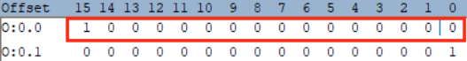

**O0:0.1** Second set of 16 output bites as 16 Boolean values in logical order


**O0:0,2** First 32 output bits as 2 sets of 16 Boolean values in logical order


**O0:0/0** First output at offset 0 bit as Boolean value

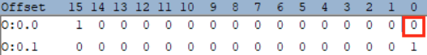

**O0:0/15** Fifteenth output bit at offset 15 as Boolean value

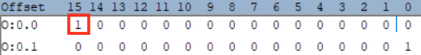

**Datatype INPUT, Prefix I**

Default file number 1

Syntax: 0\<file number\>:\<element index\>\[/bit offset\]\[,array len\]

**I1:0** First 16 input bits as Boolean values in logical order, the bit at offset 0 becomes the first item in the
array.

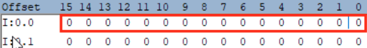

**I1:0.1.** Second set of 16 input bites as 16 Boolean values in logical

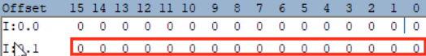

**I1:0,2** First 32 input bits as 2 sets of 16 Boolean values in logical order

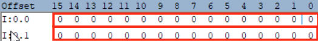

**I1:0/0**. First input bit at offset 0 as Boolean value


**O0:0/15** Fifteenth output at offset 15 bit as Boolean value


**Datatype BINARY, Prefix B**

Default file number 3

Syntax: B\<file number\>:\<element index\>\[/bit offset\]

**B3:0** First 16 binary bits as Boolean values in logical order, the bit shown below at offset 0 becomes the first item
in the array.

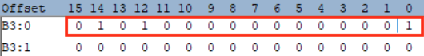

**B3:0.1** Second set of 16 binary bites as 16 Boolean values in logical

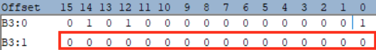

**B3:0/0.** First binary bit at offset as Boolean value


**B3:0/15** Fifteenth binary bit at offset 15 as Boolean value

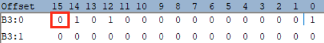

**Datatype TIMER, Prefix T**

Default file number 4

Syntax: T\<file number\>:\<element index\>\[/bit offset\] for bit values

T\<file number\>:\<element index\>\[.value by name\] for named numeric values

**T4:0** Timer as a structure containing all elements

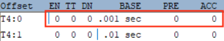

**T4:0.ACC** Timer numeric ACC value.

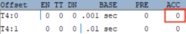

**T4:0.EN** Timer Boolean EN bit value

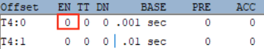

**Datatype COUNTER, Prefix C**

Default file number 5

Syntax: C\<file number\>:\<element index\>\[/bit offset\] for bit values

C\<file number\>:\<element index\>\[.value by name\] for named numeric values

**C5:0** Counter as a structure containing all elements


**C5:0.ACC Counter ACC numeric value**

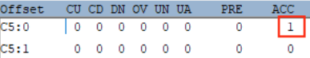

**C5:0.ACC Counter CU bit value**


**Datatype CONTROL, Prefix R**

Default file number 6

Syntax: R\<file number\>:\<element index\>\[/bit offset\] for bit values

R\<file number\>:\<element index\>\[.value by name\] for named numeric values

**R6:0** Control as a structure containing all elements

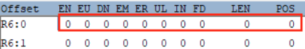

**R6:0.POS Counter POS numeric value**

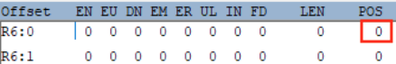

**R6:0.ACC Control EN bit value**


**Datatype INTEGER, Prefix N (16 bit)**

Default file number 7

Syntax: N\<file number\>:\<element index\>\[\<array len\>\]

**N7:0 First 16 bits integer value**

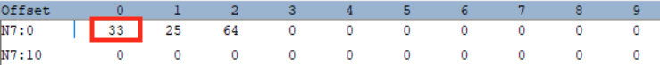

**N7:1 Second 16 bits integer value**

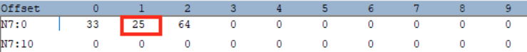

**N7:0,3 First 3 16 bits integer values**


**Datatype FLOAT, Prefix F**

Syntax: F\<file number\>:\<element index\>\[\<array len\>\]

**F8:0 First float value**


**F8:1 Second float value**

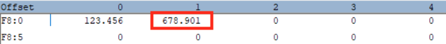

**F8:0,2 First 2 float value**


**Datatype STRING, Prefix ST**

Syntax: ST\<file number\>:\<element index\>

**ST9:0 First string value**


**ST9:1 Second string value**

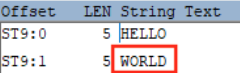

**Datatype LONG, Prefix L (32 bit)**

Syntax: L\<file number\>:\<element index\>\[\<array len\>\]

**L10:0 First 32 bits integer value**

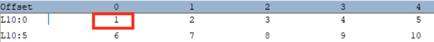

**L10:1 Second 32 bits integer value**


**L10:0,3 First 3 32 bits integer values**


**Datatype ASCII, Prefix A**

Default file number 11

Syntax: A\<file number\>:\<element index\>\[/character offset\]

**A11:0 First character pair**

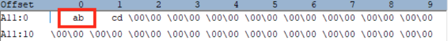

**A11:0 Second character pair**

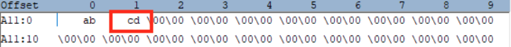

**A11:0/0 First character of in first character pair**


**A11:0/0 Second character of in seconds character pair**

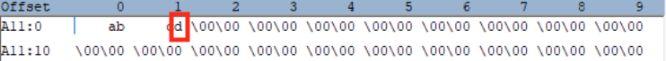

[^top](#toc)

## PcccAdapterConfiguration

<table>
<colgroup>
<col style="width: 14%" />
<col style="width: 19%" />
<col style="width: 27%" />
<col style="width: 39%" />
</colgroup>
<thead>
<tr class="header">
<th colspan="4"><p><strong>PcccAdapterConfiguration</strong></p>
<p><strong>Extends ProtocolAdapterConfiguration</strong></p>
<p>The PcccAdapterConfiguration extends the common adapter configuration with PCCC specific adapter configuration settings. The AdapterType to use for this adapter is "PCCC".</p></th>
</tr>
</thead>
<tbody>
<tr class="odd">
<td><strong>Name</strong></td>
<td><strong>Description</strong></td>
<td><strong>Type</strong></td>
<td><strong>Comments</strong></td>
</tr>
<tr class="even">
<td>Controllers</td>
<td>PLCs servers configured for this adapter. The PCCC source using the adapter must have a reference to one of these in its AdapterController attribute.</td>
<td>Map[String,<a href="#pccccontrollerconfiguration">PcccControllerConfiguration</a>]</td>
<td></td>
</tr>
</tbody>
</table>

[^top](#toc)

## PcccControllerConfiguration

<table>
<colgroup>
<col style="width: 18%" />
<col style="width: 27%" />
<col style="width: 28%" />
<col style="width: 25%" />
</colgroup>
<thead>
<tr class="header">
<th colspan="4"><p><strong>PcccControllerConfiguration</strong></p>
<p>Configuration data for connecting to and reading from sources for controllers using PCCC</p></th>
</tr>
</thead>
<tbody>
<tr class="odd">
<td><strong>Name</strong></td>
<td><strong>Description</strong></td>
<td><strong>Type</strong></td>
<td>Comments</td>
</tr>
<tr class="even">
<td>Address</td>
<td>IP Address of the controller</td>
<td>String</td>
<td>IP address in format aaa.bbb.ccc.ddd</td>
</tr>
<tr class="odd">
<td>Port</td>
<td>Port number</td>
<td>Integer</td>
<td>Default is 44818</td>
</tr>
<tr class="even">
<td>ConnectPath</td>
<td>Connect path for controller</td>
<td><a href="#pcccconnectpathconfiguration">PcccConnectPathConfiguration</a></td>
<td>Optional</td>
</tr>
<tr class="odd">
<td>ConnectTimeout</td>
<td>Timeout for connecting to the controller in milliseconds</td>
<td>Integer</td>
<td>Default is 10000</td>
</tr>
<tr class="even">
<td>ReadTimeout</td>
<td>Timeout for reading response packets from the controller in milliseconds</td>
<td>Integer</td>
<td>Default is 10000</td>
</tr>
<tr class="odd">
<td>WaitAfterConnectError</td>
<td>Time to wait before (re)connecting after a connection error in milliseconds</td>
<td>Integer</td>
<td>Default is 10000</td>
</tr>
<tr class="even">
<td>WaitAfterReadError</td>
<td>Time to wait before reading values from the controller after a read error in milliseconds</td>
<td>Integer</td>
<td>Default is 10000</td>
</tr>
<tr class="odd">
<td>WaitAfterWriteError</td>
<td>Time to wait after an error writing request packets to the controller in milliseconds</td>
<td>Integer</td>
<td>Default is 10000</td>
</tr>
<tr class="even">
<td>OptimizeReads</td>
<td>Optimized the reading of data from the controller by combining the reads for (near) adjacent fields in a single read request.</td>
<td>Boolean</td>
<td><p>Default is true</p>
<p>Optimization reduces the calls made to the controller to read data. When troubleshooting optimization it can be disabled to find specific fields that make the (combined) reads to fail.</p></td>
</tr>
<tr class="odd">
<td>MaxReadGap</td>
<td>When optimization is used this specified the max number of bytes between near adjacent fields that may be combined in a single read.</td>
<td>Integer</td>
<td>Default is 32</td>
</tr>
</tbody>
</table>

[^top](#toc)

## PcccConnectPathConfiguration

<table>
<colgroup>
<col style="width: 18%" />
<col style="width: 27%" />
<col style="width: 28%" />
<col style="width: 25%" />
</colgroup>
<thead>
<tr class="header">
<th colspan="4"><p><strong>PcccConnectPathConfiguration</strong></p>
<p>Configuration connect path of a controller used for routing.</p></th>
</tr>
</thead>
<tbody>
<tr class="odd">
<td><strong>Name</strong></td>
<td><strong>Description</strong></td>
<td><strong>Type</strong></td>
<td>Comments</td>
</tr>
<tr class="even">
<td>Backplane</td>
<td>Backplane number</td>
<td>Integer</td>
<td>Default is 1</td>
</tr>
<tr class="odd">
<td>Slot</td>
<td>Slot number</td>
<td>Integer</td>
<td>Default is 0</td>
</tr>
</tbody>
</table>

# ADS Protocol Configuration

This section describes the configuration types for the ADS protocol adapter and contains the extensions and specific
configuration types

## AdsSourceConfiguration

<table>
<colgroup>
<col style="width: 19%" />
<col style="width: 25%" />
<col style="width: 32%" />
<col style="width: 22%" />
</colgroup>
<thead>
<tr class="header">
<th colspan="4"><p><strong>AdsSourceConfiguration</strong> Extends SourceConfiguration</p>
<p>The AdsSourceConfiguration extends the common Source configuration with ADS specific source configuration data.</p></th>
</tr>
</thead>
<tbody>
<tr class="odd">
<td><strong>Name</strong></td>
<td><strong>Description</strong></td>
<td><strong>Type</strong></td>
<td><strong>Comments</strong></td>
</tr>
<tr class="even">
<td>Channels</td>
<td><p>The channels configuration for an ADS source holds configuration data to read values from fields on the source controller.</p>
<p>The element is a map indexed by the channel identifier.</p>
<p>Channels can be "commented" out by adding a "#" at the beginning of the identifier of that channel.</p></td>
<td>Map[String,<a href="#adschannelconfiguration">AdsChannelConfiguration</a>]</td>
<td>At least 1 channel must be configured.</td>
</tr>
<tr class="odd">
<td>AdapterDevice</td>
<td>Device Identifier for the controller to read from. This referenced server must be present in the Devices section of the adapter referred to by the ProtocolAdapter attribute of the source.</td>
<td>String</td>
<td>Must be an identifier of a server in the Controllers section of the ADS adapter used by the source.</td>
</tr>


<tr class="even">
<td>SourceAmsId</td>
<td><p>The Ams netID of the device.</p>
</td>
<td>String</td>
<td>The AMS Net ID consists of 6 bytes and is represented in a dot notation.</td>
</tr>
<tr class="odd">
<td>SourceAmsPort</td>
<td>The ADS port number. ADS devices in the TwinCAT network are identified by an AMS network address and a port number.</td>
<td>Integer</td>
<td>The following decimal port numbers are invariantly defined on each TwinCAT single system.

- Runtime system 1: 851 (in TwinCAT 2: 801)
- Runtime system 2: 852 (in TwinCAT 2: 811)
- Runtime system 3: 853 (in TwinCAT 2: 821)
- Runtime system 4: 854 (in TwinCAT 2: 831)
- Runtime system 5: 855
- Runtime system n: 850 + n, etc.</td>

</tr>

<tr class="even">
<td>TargetAmsId</td>
<td><p>The AMS Net ID of the client.</p>
</td>
<td>String</td>
<td>The AMSNetID consists of 6 bytes and is represented in a dot notation. For clients this is typically the network address + .1.1, e.g. 192.168.1.65.1.1<p>
To authorize the client this AMS Net ID must be added as an AMS route in the SYSTEM/Routes of the Twincat target.</p></td>
</tr>
<tr class="odd">
<td>TargetAmsPort</td>
<td>Contains the ADS port number of the client.</td>
<td>Integer</td>
<td> This can be any value.</td>
</tr>

</tbody>
</table>

[^top](#toc)

## AdsChannelConfiguration

<table>
<colgroup>
<col style="width: 15%" />
<col style="width: 19%" />
<col style="width: 22%" />
<col style="width: 43%" />
</colgroup>
<thead>
<tr class="header">
<th colspan="4"><p><strong>AdsChannelConfiguration</strong></p>
<p><strong>Extends ChannelConfiguration</strong></p>
<p>The AdsChannelConfiguration extends the common Channel configuration with ADS specific channel configuration data</p></th>
</tr>
</thead>
<tbody>
<tr class="odd">
<td><strong>Name</strong></td>
<td><strong>Description</strong></td>
<td><strong>Type</strong></td>
<td><strong>Comments</strong></td>
</tr>
<tr class="even">
<td>SymbolName</td>
<td>A string containing the name of the symbol to read from the device.</td>
<td>String</td>
<td></td>
</tr>
</tbody>
</table>


[^top](#toc)

## AdsAdapterConfiguration

<table>
<colgroup>
<col style="width: 14%" />
<col style="width: 19%" />
<col style="width: 27%" />
<col style="width: 39%" />
</colgroup>
<thead>
<tr class="header">
<th colspan="4"><p><strong>AdsAdapterConfiguration</strong></p>
<p><strong>Extends ProtocolAdapterConfiguration</strong></p>
<p>The AdsAdapterConfiguration extends the common adapter configuration with ADS specific adapter configuration settings. The AdapterType to use for this adapter is "ADS".</p></th>
</tr>
</thead>
<tbody>
<tr class="odd">
<td><strong>Name</strong></td>
<td><strong>Description</strong></td>
<td><strong>Type</strong></td>
<td><strong>Comments</strong></td>
</tr>
<tr class="even">
<td>Controllers</td>
<td>Devices configured for this adapter. The ADS source using the adapter must have a reference to one of these in its AdapterDevice attribute.</td>
<td>Map[String,<a href="#adsdeviceconfiguration">AdsDeviceConfiguration</a>]</td>
<td></td>
</tr>
</tbody>
</table>

[^top](#toc)

## AdsDeviceConfiguration

<table>
<colgroup>
<col style="width: 18%" />
<col style="width: 27%" />
<col style="width: 28%" />
<col style="width: 25%" />
</colgroup>
<thead>
<tr class="header">
<th colspan="4"><p><strong>AdsDeviceConfiguration</strong></p>
<p>Configuration data for connecting to and reading from sources from devices using ADS protocol</p></th>
</tr>
</thead>
<tbody>
<tr class="odd">
<td><strong>Name</strong></td>
<td><strong>Description</strong></td>
<td><strong>Type</strong></td>
<td>Comments</td>
</tr>
<tr class="even">
<td>Address</td>
<td>IP Address of the device</td>
<td>String</td>
<td>IP address in format aaa.bbb.ccc.ddd</td>
</tr>
<tr class="odd">
<td>Port</td>
<td>Port number</td>
<td>Integer</td>
<td>Default is 48898</td>
</tr>
<tr class="even">
<td>CommandTimeout</td>
<td>Timeout for executing commands in millisecond fs</td>
<td>Integer</td>
<td>Default is 10000 milliseconds</td>
</tr>
<tr class="odd">
<td>ConnectTimeout</td>
<td>Timeout for connecting to the device in milliseconds</td>
<td>Integer</td>
<td>Default is 10000</td>
</tr>
<tr class="even">
<td>ReadTimeout</td>
<td>Timeout for reading response packets from the controller in milliseconds</td>
<td>Integer</td>
<td>Default is 10000</td>
</tr>
<tr class="odd">
<td>WaitAfterConnectError</td>
<td>Time to wait before (re)connecting after a connection error in milliseconds</td>
<td>Integer</td>
<td>Default is 10000</td>
</tr>
<tr class="even">
<td>WaitAfterReadError</td>
<td>Time to wait before reading values from the controller after a read error in milliseconds</td>
<td>Integer</td>
<td>Default is 10000</td>
</tr>
<tr class="odd">
<td>WaitAfterWriteError</td>
<td>Time to wait after an error writing request packets to the controller in milliseconds</td>
<td>Integer</td>
<td>Default is 10000</td>
</tr>
</tbody>
</table>


[^top](#toc)


---


# SLMP Protocol Configuration

This section describes the configuration types for the SLMP protocol adapter and contains the extensions and specific
configuration types.


**IMPORTANT : SLMP controllers only supports a single concurrent session with the controller. When reading data by multiple schedules or adapters instances, or from another SLMP client, from the same controller, timeout and 
broken TCP pipe errors will occur.**


## SlmpSourceConfiguration

<table>
<colgroup>
<col style="width: 19%" />
<col style="width: 25%" />
<col style="width: 32%" />
<col style="width: 22%" />
</colgroup>
<thead>
<tr class="header">
<th colspan="4"><p><strong>SlmpSourceConfiguration</strong> Extends SourceConfiguration</p>
<p>The SLMPSourceConfiguration extends the common Source configuration with SLMP specific source configuration data.</p></th>
</tr>
</thead>
<tbody>
<tr class="odd">
<td><strong>Name</strong></td>
<td><strong>Description</strong></td>
<td><strong>Type</strong></td>
<td><strong>Comments</strong></td>
</tr>
<tr class="even">
<td>Channels</td>
<td><p>The channels configuration for an SLMP source holds configuration data to read values from fields on the source controller.</p>
<p>The element is a map indexed by the channel identifier.</p>
<p>Channels can be "commented" out by adding a "#" at the beginning of the identifier of that channel.</p></td>
<td>Map[String,<a href="#slmpchannelconfiguration">SLMPChannelConfiguration</a>]</td>
<td>At least 1 channel must be configured.</td>
</tr>
<tr class="odd">
<td>AdapterController</td>
<td>Controller Identifier for the controller to read from. This referenced server must be present in the Devices section of the adapter referred to by the ProtocolAdapter attribute of the source.</td>
<td>String</td>
<td>Must be an identifier of a server in the Controllers section of the SLMP adapter used by the source.</td>
</tr>


</tbody>
</table>

[^top](#toc)

## SlmpChannelConfiguration

<table>
<colgroup>
<col style="width: 15%" />
<col style="width: 19%" />
<col style="width: 22%" />
<col style="width: 43%" />
</colgroup>
<thead>
<tr class="header">
<th colspan="4"><p><strong>SlmpChannelConfiguration</strong></p>
<p><strong>Extends ChannelConfiguration</strong></p>
<p>The SlmpChannelConfiguration extends the common Channel configuration with SLMP specific channel configuration data</p></th>
</tr>
</thead>
<tbody>
<tr class="odd">
<td><strong>Name</strong></td>
<td><strong>Description</strong></td>
<td><strong>Type</strong></td>
<td><strong>Comments</strong></td>
</tr>
<tr class="even">
<td>AccessPoint</td>
<td>A string containing the access point for the value to read from the device.</td>
<td>String</td>
<td>
An access points consists of a device code and a decimal device number, e.g. "D200" for Data register 200, "X0" for Input 0 and "Y0" for output 0.
<p>
<p>Valid devices codes and their data types are listed below.
<p>

- "B" 		Link relay (BIT)
- "CC"		Counter coil (BIT)
- "CN"		Counter timer current value (WORD)
- "CS"		Counter contact (BIT)
- "D"		Data register (WORD)
- "DX"		Direct access input (BIT)
- "DY"		Direct access output (BIT)
- "F" 		Alarm (BIT)
- "L" 		Latching relay (BIT)
- "LCC"	    Counter coil (BIT)
- "LCN"	    Counter timer current value (DOUBLEWORD)
- "LCS"	    Counter contact (BIT)
- "LSTC"	Long retentive timer coil (BIT)
- "LSTN"	Long retentive timer current value (DOUBLEWORD)
- "LSTS"	Long retentive timer contact (BIT)
- "LTC"	    Long timer coil (BIT)
- "LTN"	    Long timer current value (DOUBLEWORD)
- "LTS"	    Long timer contact (BIT)
- "LZ"		Long index register (DOUBLEWORD)
- "M" 		Internal relay (BIT)
- "R"		File register (WORD)
- "S"		Step relay (BIT)
- "SB"		Link special relay (BIT)
- "SD"  	Special register (WORD)
- "SM"     	Special relay (Bit)
- "SW"		Link special register (WORD)
- "TC"		Timer coil (BIT)
- "TN"		Timer current value (WORD)
- "TS"		Timer contact (BIT)
- "V" 		Edge relay (BIT)
- "W"		Link register (WORD)
- "X"   	Input (BIT)
- "Y" 		Output (BIT)
- "Z"		Index register (WORD)
- "ZR"		File register ZR (WORD)
 </td>
</tr>


<tr class="odd">
<td>DataType</td>
<td>The type of data to read from the device. If no type is specified then a single value of the default type of the device is read.</td>
<td>String</td>
<td>
Valid data types are:
<p>

- "BIT" (read as a boolean value)
- "WORD" (read as a 16-bit integer value)
- "DOUBLEWORD" (read as 32-bit integer)
- "STRING(x)" (read as words and decoded to as a string of length x or shorter if the string is zero terminated)

It is possible to define custom structures and use these as a data type as well. These structures are defined in the "Structures" section of the SLMP adapter configuration. All fiels which can be any the types mentioned above, or another custom structure type, are mapped from the read word data to the fields of the structure in the order in which they are declared in the type.

<p>
In order to read multiple values, returned as an array, starting at the specified access point the number of items can be appended to the data type.

E.g. <p>
"BIT[4]" reads 4 BIT values and returns an array of 4 boolean values.
"WORD[8]" reads 16 word values and returns an array of 8 16-bit integers.
"STRING(16)[2]" reads and array of 16 characters

 </td>
</tr>

<tr class="even">
<td>Size</td>
<td>The number of values to read starting from the access point.</td>
<td>Integer</td>
<td>
The number of items to read can be specified as well in the DataType of the channel, e.g. WORD[size]. The Size setting can be used if the DataType field is ommitted to read the default data type for the device. If the length is both specified in the DataType in both the Size setting a configuration error is raised.
 </td>
</tr>

</tbody>
</table>


### SLMP channel reading optimization
In order to reduce the number of interactions between the adapter and the controller  read action for  single BIT, WORD and DOUBLEWORD elements are combined in batches of maximum 192 values using the SLMP Read Random request.   For reading arrays of multiple values, STRING values and values of custom structured types a per channel SLMP Read request is used.


[^top](#toc)

## SlmpAdapterConfiguration

<table>
<colgroup>
<col style="width: 14%" />
<col style="width: 19%" />
<col style="width: 27%" />
<col style="width: 39%" />
</colgroup>
<thead>
<tr class="header">
<th colspan="4"><p><strong>SlmpAdapterConfiguration</strong></p>
<p><strong>Extends ProtocolAdapterConfiguration</strong></p>
<p>The SlmpAdapterConfiguration extends the common adapter configuration with SLMP specific adapter configuration settings. The AdapterType to use for this adapter is "SLMP".</p></th>
</tr>
</thead>
<tbody>
<tr class="odd">
<td><strong>Name</strong></td>
<td><strong>Description</strong></td>
<td><strong>Type</strong></td>
<td><strong>Comments</strong></td>
</tr>
<tr class="even">
<td>Controllers</td>
<td>Controllers configured for this adapter. The SLMP source using the adapter must have a reference to one of these in its AdapterController attribute.</td>
<td>Map[String,<a href="#slmpdeviceconfiguration">SlmpControllerConfiguration</a>]</td>
<td></td>
</tr>
<tr class="odd">
<td>Structures</td>
<td>Custom data structures configured for this adapter. Structured defined in this section can be uses as custom structured data types for channel values. If a structure has a field which is of a custome structure type,t hen this type must be defined first.</td>
<td>Map[String,Map{String,String]]</td>
<td>
Below is an example defining a custom structure "STRUCT1" containing two fields "A1" and "B1" of type word. This type used in a second type "STRUCT2" having a field "A2" containing an array of size 2 containing values of "STRUCT1", as well as a field "B2", containing 16 words and a field "C2" containing a 32 character string.


```json
 "Structures": {
   "STRUCT1": {
      "A1": "WORD",
      "B1" : "WORD"
    },
    "STRUCT2": {
      "A2": "STRUCT1[2]",
      "B2": "WORD[16]",
      "C2": "STRING(32)"
    }
}
```

A SLMP channel can now use both type "STRUCT1" as "STRUCT2" as a DataType. The data is returned as a map of values indexed by the names of the fields.

</td>
</tr>

</tbody>
</table>

[^top](#toc)

## SlmpControllerConfiguration

<table>
<colgroup>
<col style="width: 18%" />
<col style="width: 27%" />
<col style="width: 28%" />
<col style="width: 25%" />
</colgroup>
<thead>
<tr class="header">
<th colspan="4"><p><strong>SlmpControllerConfiguration</strong></p>
<p>Configuration data for connecting to and reading from sources from devices using SLMP protocol</p></th>
</tr>
</thead>
<tbody>
<tr class="odd">
<td><strong>Name</strong></td>
<td><strong>Description</strong></td>
<td><strong>Type</strong></td>
<td>Comments</td>
</tr>
<tr class="even">
<td>Address</td>
<td>IP Address of the device</td>
<td>String</td>
<td>IP address in format aaa.bbb.ccc.ddd or a hostname</td>
</tr>
<tr class="odd">
<td>Port</td>
<td>Port number</td>
<td>Integer</td>
<td>Default is 48898</td>
</tr>
<tr class="even">
<td>CommandTimeout</td>
<td>Timeout for executing commands in milliseconds</td>
<td>Integer</td>
<td>Default is 10000 milliseconds</td>
</tr>
<tr class="odd">
<td>ConnectTimeout</td>
<td>Timeout for connecting to the device in milliseconds</td>
<td>Integer</td>
<td>Default is 10000</td>
</tr>
<tr class="even">
<td>ReadTimeout</td>
<td>Timeout for reading response packets from the controller in milliseconds</td>
<td>Integer</td>
<td>Default is 50000</td>
</tr>
<tr class="odd">
<td>WaitAfterConnectError</td>
<td>Time to wait before (re)connecting after a connection error in milliseconds</td>
<td>Integer</td>
<td>Default is 10000</td>
</tr>
<tr class="even">
<td>WaitAfterReadError</td>
<td>Time to wait before reading values from the controller after a read error in milliseconds</td>
<td>Integer</td>
<td>Default is 10000</td>
</tr>
<tr class="odd">
<td>WaitAfterWriteError</td>
<td>Time to wait after an error writing request packets to the controller in milliseconds</td>
<td>Integer</td>
<td>Default is 10000</td>
</tr>
<tr class="even">
<td>NetworkNumber</td>
<td>Request destination network number</td>
<td>Integer</td>
<td>Default is 0 (0x00)</td>
</tr>
<tr class="odd">
<td>StationNumber</td>
<td>Request station number</td>
<td>Integer</td>
<td>Default is 255 (0xFF) </td>
</tr>
<tr class="even">
<td>ModuleNumber</td>
<td>Request module number</td>
<td>Integer</td>
<td>Default is 1023 (0x03FF) </td>
</tr>
<tr class="odd">
<td>MultiDropStationNumber</td>
<td>Request multidrop station number</td>
<td>Integer</td>
<td>Default is 0 (0x00)</td>
</tr>
<tr class="even">
<td>MonitoringTimer</td>
<td>Timer to set the waiting time until the access destination send back a response after the SLMP compatible device
which received a request message from the external device requests a processing to the destination in units of 250ms</td>
<td>Integer</td>
<td>Default is 0 (unlimited wait)</td>
</tr>

</tbody>
</table>


[^top](#toc)

---


# AWS IoT Analytics Service Target

## AwsIotAnalyticsTargetConfiguration

<table>
<colgroup>
<col style="width: 18%" />
<col style="width: 27%" />
<col style="width: 29%" />
<col style="width: 23%" />
</colgroup>
<thead>
<tr class="header">
<th colspan="4"><p>AwsIotAnalyticsTargetConfiguration extends the type TargetConfiguration with specific configuration data for sending data to an IoT Analytics channel. The Targets configuration element can contain entries of this type, the TargetType of these entries must be set to <strong>"AWS-IOT-ANALYTICS"</strong></p>
<p>Requires IAM permission iotanalytics:BatchPutMessage to write to the configured channel</p></th>
</tr>
</thead>
<tbody>
<tr class="odd">
<td><strong>Name</strong></td>
<td><strong>Description</strong></td>
<td><strong>Type</strong></td>
<td>Comments</td>
</tr>
<tr class="even">
<td>ChannelName</td>
<td>Name of the IoT Analytics channel</td>
<td>String</td>
<td></td>
</tr>
<tr class="odd">
<td>Region</td>
<td>AWS Region for channel</td>
<td>String</td>
<td></td>
</tr>
<tr class="even">
<td>BatchSize</td>
<td>Number of output messages to combine in a single BatchPutMessage API call.</td>
<td>Integer</td>
<td>Default is 10</td>
</tr>
</tbody>
</table>

[^top](#toc)

# AWS IoT Core Service Target

## AwsIotCoreTargetConfiguration

<table>
<colgroup>
<col style="width: 18%" />
<col style="width: 27%" />
<col style="width: 29%" />
<col style="width: 23%" />
</colgroup>
<thead>
<tr class="header">
<th colspan="4"><p>AwsIotCoreTargetConfiguration extends the type TargetConfiguration with specific configuration data for connecting to and sending to AWS IoT core topic using HTTP dataplane API. The Targets configuration element can contain entries of this type, the TargetType of these entries must be set to <strong>"AWS-IOT-CORE"</strong></p>
<p>Requires IAM permission iot:Publish for the topic the data is published to.</p></th>
</tr>
</thead>
<tbody>
<tr class="odd">
<td><strong>Name</strong></td>
<td><strong>Description</strong></td>
<td><strong>Type</strong></td>
<td>Comments</td>
</tr>
<tr class="even">
<td>TopicName</td>
<td>Name of the topic</td>
<td>String</td>
<td>Topic names must not start with "$" as these are reserved for topics used only by AWS IoT Core</td>
</tr>
<tr class="odd">
<td>Region</td>
<td>AWS Region for IoT Core service</td>
<td>Integer</td>
<td></td>
</tr>


<tr class="even">  
<td>BatchCount</td>  
<td>Number of messages to buffer before sending data as a batch  to topic.</td>  
<td>Int</td>  
<td>Batching is enabled by setting a value for one or more of BatchSize, BatchCount and BatchInterval.
Whenever the number of messages, total message size or an interval is reached the buffered data is sent as an array of messages to the topic.</td>
</tr>

<tr class="odd">  
<td>BatchSize</td>  
<td>Payload size in KB of messages to batch before sending data as a batch to topic.</td>  
<td>Int</td>  
<td>Batching is enabled by setting a value for one or more of BatchSize, BatchCount and BatchInterval.
Whenever the number of messages, total message size or an interval is reached the buffered data is sent as an array of messages to the topic.
The size is calculated on the uncompressed payload of the messages.</td>
</tr>

<tr class="even">  
<td>BatchInterval</td>  
<td>Interval in milliseconds after which a batch of messages is sent to the topic, even when the BatchSize or BatchCount limit is not reached.</td>  
<td>Int</td>  
<td>Batching is enabled by setting a value for one or more of BatchSize, BatchCount and BatchInterval.
Whenever the number of messages, total message size or an interval is reached the buffered data is sent as an array of messages to the topic.
</td>
</tr>

<tr class="odd">  
<td>Compression</td>  
<td>Compression method for MQTT message payloads.</td>  
<td>String

- "None"
- "Zip"
- "GZip"

</td>  
<td>Default is "None"</td>
</tr> 

</tbody>
</table>

[^top](#toc)

# AWS MSK Service Target

## AwsMskTargetConfiguration

<table>
<colgroup>
<col style="width: 14%" />
<col style="width: 17%" />
<col style="width: 13%" />
<col style="width: 55%" />
</colgroup>
<thead>
<tr class="header">
<th colspan="4"><p>AwsMskTargetConfiguration extends the type TargetConfiguration with specific configuration data for connecting to and sending to an AWS MSK topic. The Targets configuration element can contain entries of this type, the TargetType of these entries must be set to <strong>"AWS-MSK"</strong></p>
</tr>
</thead>
<tbody>
<tr class="odd">
<td><strong>Name</strong></td>
<td><strong>Description</strong></td>
<td><strong>Type</strong></td>
<td>Comments</td>
</tr>
<tr class="even">
<td>TopicName</td>
<td>Name of the MSK topic</td>
<td>String</td>
<td></td>
</tr>
<tr class="odd">
<td>BootstrapBrokers</td>
<td>Addresses with port number for bootstrap brokers for AWS MSK cluster. (bootstrap.servers)</td>
<td>List[String]</td>
<td><p>To get the broker addresses for a cluster use the CLI command <br />
aws kafka get-bootstrap-brokers --cluster-arn `ClusterArn` and use the addresses returned in `"BootstrapBrokerStringPublicSaslIam"'.</p>
<p><a href="https://docs.aws.amazon.com/msk/latest/developerguide/msk-get-bootstrap-brokers.html">Getting the bootstrap brokers for an Amazon MSK cluster"</a></p></td>
</tr>
<tr class="even">
<td>Key</td>
<td>Key used for the written records</td>
<td>String</td>
<td>Optional</td>
</tr>
<tr class="odd">
<td>Partition</td>
<td>Optional partition key</td>
<td>Integer</td>
<td></td>
</tr>
<tr class="even">
<td>Serialization</td>
<td>Serialization <a href="https://kafka.apache.org/documentation/#producerconfigs_value.serializer">(value.serializer)</a></td>
<td>String</td>
<td>

- "json" (default)
- "protobuf", see [protobuf schema](../core/sfc-ipc/src/main/proto/TargetAdapterService.proto)

If a [Template](#targetconfiguration) is specified to transform the data for this target then this setting is not used
and the transformation output is written as a string to the topic.</td>
</tr>
<tr class="odd">
<td>Acknowledgements</td>
<td>Acknowledgements <a href="https://kafka.apache.org/documentation/#producerconfigs_acks">(acks)</a></td>
<td>String</td>
<td>

- "all" = 0
- "leader" = 1 (default)
- "all" = -1

</td>
</tr>
<tr class="even">
<td>ProviderProperties</td>
<td>Map of provider properties used to create the Kafka producer</td>
<td>Map[String,String]</td>
<td>Default is an empty map

A description af producer options can be found in the <a href="https://kafka.apache.org/documentation/#producerconfigs">
Kafka documentation</a>

The following properties are set by the adapter

- bootstrap.servers from `BootstrapBrokers`
- client.id = "sfc-msk-target_" + hostname
- security.protocol = "SASL_SSL"
- acks from `Acknowledgements`
- compression.type from `Compression`
- key.serializer = "org.apache.kafka.common.serialization.StringSerializer"
- value.serializer = "org.apache.kafka.common.serialization.ByteArraySerializer"
- sasl.client.callback.handler.class = "software.amazon.msk.auth.iam.IAMClientCallbackHandler"
- sasl.jaas.config =  "software.amazon.msk.auth.iam.IAMLoginModule required;"
- sasl.mechanism = "AWS_MSK_IAM"
- batch.size from `BatchSize`

</td>
</tr>
<tr class="odd">
<td>Headers</td>
<td>Map of headers set for written records</td>
<td>Map[String,String]</td>
<td>Default = empty map</td>
</tr>
<tr class="even">
<td>Compression</td>
<td>Compression type <a href="https://kafka.apache.org/documentation/#producerconfigs_compression.type">(compression.type)</a></td>
<td>String</td>
<td>Possible values:

- none (default)
- snappy
- lz4
- gzip
- zstd

</td>
</tr>
<tr class="odd">
<td>BatchSize</td>
<td>Batch size <a href="https://kafka.apache.org/documentation/#producerconfigs_batch.size">(batch.size)</a></td>
<td>Integer</td>
<td></td>
</tr>
<tr class="even">
<td>Interval</td>
<td>Interval in milliseconds in which adapter will flush the producer even when the batch size is not reached.</td>
<td>Integer</td>
<td></td>
</tr>
</tbody>
</table>

[^top](#toc)

# AWS Kinesis Firehose Service Target

## AwsKinesisFirehoseTargetConfiguration

<table>
<colgroup>
<col style="width: 18%" />
<col style="width: 27%" />
<col style="width: 29%" />
<col style="width: 23%" />
</colgroup>
<thead>
<tr class="header">
<th colspan="4"><p>AwsKinesisFirehoseTargetConfiguration extends the type TargetConfiguration with specific configuration data for sending to a delivery stream for the AWS Kinesis Firehose service. The Targets configuration element can contain entries of this type, the TargetType of these entries must be set to <strong>"AWS-FIREHOSE"</strong></p>
<p>Requires IAM permission firehose:PutRecordBatch for the delivery stream the data is sent to.</p></th>
</tr>
</thead>
<tbody>
<tr class="odd">
<td><strong>Name</strong></td>
<td><strong>Description</strong></td>
<td><strong>Type</strong></td>
<td>Comments</td>
</tr>
<tr class="even">
<td>StreamName</td>
<td>Name of the delivery stream</td>
<td>String</td>
<td></td>
</tr>
<tr class="odd">
<td>Region</td>
<td>AWS Region for Kinesis Firehose service</td>
<td>String</td>
<td></td>
</tr>
<tr class="even">
<td>BatchSize</td>
<td><p>Number of output messages to combine in a single putRecordBatch API call.</p>
<p>The target will send buffered data before the batch size is reached if the entire size of the message will exceed the maximum size for a single request.</p></td>
<td>Integer</td>
<td>Default is 10</td>
</tr>
</tbody>
</table>

[^top](#toc)

# AWS Kinesis Service Target

## AwsKinesisTargetConfiguration

<table>
<colgroup>
<col style="width: 18%" />
<col style="width: 27%" />
<col style="width: 29%" />
<col style="width: 23%" />
</colgroup>
<thead>
<tr class="header">
<th colspan="4"><p>AwsKinesisTargetConfiguration extends the type TargetConfiguration with specific configuration data for sending to a stream for the AWS Kinesis service. The Targets configuration element can contain entries of this type, the TargetType of these entries must be set to <strong>"AWS-KINESIS"</strong></p>
<p>Requires IAM permission kinesis:PutRecords for the stream the data is sent to.</p></th>
</tr>
</thead>
<tbody>
<tr class="odd">
<td><strong>Name</strong></td>
<td><strong>Description</strong></td>
<td><strong>Type</strong></td>
<td>Comments</td>
</tr>
<tr class="even">
<td>StreamName</td>
<td>Name of the Kinesis stream</td>
<td>String</td>
<td></td>
</tr>
<tr class="odd">
<td>Region</td>
<td>AWS Region for Kinesis service</td>
<td>String</td>
<td></td>
</tr>
<tr class="even">
<td>BatchSize</td>
<td>Number of output messages to combine in a single putRecordBatch API call.</td>
<td>Integer</td>
<td>Default is 10, Maximum is 500</td>
</tr>
<tr class="odd">
<td>Compression</td>
<td>Compression used to compress the data in the submitted items</td>
<td>"None" | "GZip" | "Zip"</td>
<td>Default is "None"</td>
</tr>
<tr class="even">
<td>Interval</td>
<td>Interval in milliseconds after which data is sent to stream even if the buffer is not full</td>
<td>Integer</td>
<td>Optional, if not set only BatchSize is used</td>
</tr>
</tbody>
</table>

[^top](#toc)

# AWS Lambda Service Target

## AwsLambdaTargetConfiguration

<table>
<colgroup>
<col style="width: 18%" />
<col style="width: 27%" />
<col style="width: 29%" />
<col style="width: 23%" />
</colgroup>
<thead>
<tr class="header">
<th colspan="4"><p>AwsLambdaFunctionConfiguration extends the type TargetConfiguration with specific configuration data for calling an AWS lambda function. The Targets configuration element can contain entries of this type, the TargetType of these entries must be set to <strong>"AWS-LAMBDA"</strong></p>
<p>Requires IAM permission lambda:InvokeFunction for the lambda function that is called.</p></th>
</tr>
</thead>
<tbody>
<tr class="odd">
<td><strong>Name</strong></td>
<td><strong>Description</strong></td>
<td><strong>Type</strong></td>
<td>Comments</td>
</tr>
<tr class="even">
<td>FunctionName</td>
<td>Name of the Lambda function</td>
<td>String</td>
<td></td>
</tr>
<tr class="odd">
<td>Qualifier</td>
<td>AWS Region for Lambda service</td>
<td>String</td>
<td>Default is latest</td>
</tr>
<tr class="even">
<td>Region</td>
<td>AWS Region for Lambda service</td>
<td>String</td>
<td></td>
</tr>
<tr class="odd">
<td>BatchSize</td>
<td>Number of output messages to combine in a single invoke request for the lambda function. If BatchSize is greater than 1, then the output records are combined in a JSON array. The function will be called before the batch size is reached if the maximum payload size will be exceeded.</td>
<td>Integer</td>
<td>Default is 10</td>
</tr>
<tr class="even">
<td>Compression</td>
<td><p>Compression used to compress invocation payload.</p>
<p>As this payload needs to be valid JSON.</p>
<p>The data is wrapped in structure with the following fields:</p>
<p>- "compression" : Used compression</p>
<p>- "payload": Compressed data as a base64 encoded string.</p>
<p>When using compression for the lambda payload verify if actual compression out weights the overhead of the base64 encoded of the compressed data.</p></td>
<td>"None" | "GZip" | "Zip"</td>
<td>Default is "None"</td>
</tr>
<tr class="odd">
<td>Interval</td>
<td>Interval in milliseconds after which data is sent to stream even if the buffer is not full</td>
<td>Integer</td>
<td>Optional, if not set only BatchSize is used, minimum value is 10</td>
</tr>
</tbody>
</table>

[^top](#toc)

# AWS S3 Service Target

## Aws3TargetConfiguration

<table>
<colgroup>
<col style="width: 18%" />
<col style="width: 27%" />
<col style="width: 29%" />
<col style="width: 23%" />
</colgroup>
<thead>
<tr class="header">
<th colspan="4"><p>AwsS3TargetConfiguration extends the type TargetConfiguration with specific configuration data for sending data to an S3 bucket. The Targets configuration element can contain entries of this type, the TargetType of these entries must be set to <strong>"AWS-S3"</strong></p>
<p>Requires IAM permission s3:putObject to write to the configured bucket</p></th>
</tr>
</thead>
<tbody>
<tr class="odd">
<td><strong>Name</strong></td>
<td><strong>Description</strong></td>
<td><strong>Type</strong></td>
<td>Comments</td>
</tr>
<tr class="even">
<td>BucketName</td>
<td>Name of the bucket to write to</td>
<td>String</td>
<td></td>
</tr>
<tr class="odd">
<td>Prefix</td>
<td>S3 key objects prefix</td>
<td></td>
<td>optional</td>
</tr>
<tr class="even">
<td>Region</td>
<td>AWS Region for S3 Bucket</td>
<td>String</td>
<td></td>
</tr>
<tr class="odd">
<td>BufferSize</td>
<td>Size in MB that triggers writing data to an S3 Object</td>
<td>Integer</td>
<td>Default is 1, maximum is 128</td>
</tr>
<tr class="even">
<td>Interval</td>
<td>Interval in seconds that triggers writing data to an S3 Object</td>
<td>Integer</td>
<td>Default is 60, maximum is 900</td>
</tr>
<tr class="odd">
<td>Compression</td>
<td>Compression used to compress the data in the S3 object</td>
<td>"None" | "GZip" | "Zip"</td>
<td>Default is "None"</td>
</tr>
<tr class="even">
<td>ContentType</td>
<td>Content Type Mime type of S3 object</td>
<td>String</td>
<td>When using compression, the value is set to the mime type of the used compression method. The main purpose of this setting is to explicitly set the value in case the data is transformed into a specific format, e.g. xml, yaml</td>
</tr>
</tbody>
</table>

[^top](#toc)

# AWS SiteWise Target

## AwsSitewiseTargetConfiguration

<table>
<colgroup>
<col style="width: 18%" />
<col style="width: 27%" />
<col style="width: 29%" />
<col style="width: 23%" />
</colgroup>
<thead>
<tr class="header">
<th colspan="4"><p>AwsSitewiseTargetConfiguration extends the type TargetConfiguration with specific configuration data for sending data to Timestream tables. The Targets configuration element can contain entries of this type, the TargetType of these entries must be set to <strong>"AWS-SITEWISE"</strong></p>
<p></p>
<p style='text-align: justify;'>Required IAM permissions</p>

- <p style='text-align: justify;'>iotsitewise:BatchPutAssetPropertyValue</p>
- <p style='text-align: justify;'>iotsitewise:CreateAsset (*)</p>
- <p style='text-align: justify;'>iotsitewise:CreateAssetModel (*)</p>
- <p style='text-align: justify;'>iotsitewise:DescribeAsset (*) (**)</p>
- <p style='text-align: justify;'>iotsitewise:DescribeAssetModel (*) (**)</p>
- <p style='text-align: justify;'>iotsitewise:DescribeEndpoint</p>
- <p style='text-align: justify;'>iotsitewise:ListAssetModels (*) (**)</p>
- <p style='text-align: justify;'>iotsitewise:ListAssetModelProperties (*) (**)</p>
- <p style='text-align: justify;'>iotsitewise:ListAssets (*) (**)</p>
- <p style='text-align: justify;'>iotsitewise:UpdateAssetModel (*)</p>
- <p style='text-align: justify;'>iotsitewise:UpdateAssetModelProperty (*)</p>
- <p style='text-align: justify;'>iotsitewise:TagResource (*)</p>
  

<p style='text-align: justify;'>(*) required when using Asset creation</p>
<p style='text-align: justify;'>(**) required when  using AssetName, AssetExternalId, AssetPropertyName,AssetPropertyExternalId in asset and asset property configuration.</p>
</th>
</tr>
</thead>
<tbody>

<tr class="odd">
<td><strong>Name</strong></td>
<td><strong>Description</strong></td>
<td><strong>Type</strong></td>
<td>Comments</td>
</tr>

<tr class="even">
<td>Assets</td>
<td>Assets to write to</td>
<td>List of <a href="#awssitewiseassetconfiguration">AwsSiteWiseAssetConfiguration</a></td>
<td>This setting is used to map data to existing assets and asset properties. It is possible to combine these with assets 
 which are automatically created by the target adapter using the <a href="#AwsSiteWiseAssetCreationConfiguration">
AssetCreation</a> setting. 
</td>
</tr>

<tr class="odd">
<td>AssetCreation</td>
<td>Settings for AssetModels and Assets automatically created by the adapter.</td>
<td><a href="#AwsSiteWiseAssetCreationConfiguration">
AwsSiteWiseAssetCreationConfiguration</a></td>
<td>When present automatic creation of AssetModels and Assets is enabled, can be empty when using the default settings.</td>
</tr>
<tr class="even">
<td>Region</td>
<td>AWS Region for SiteWise service</td>
<td>String</td>
<td></td>
</tr>
<tr class="odd">
<td>Interval</td>
<td>Interval in milliseconds after which data is sent to stream even if the buffer is not full</td>
<td>Integer</td>
<td>Optional, if not set only BatchSize is used, minimum value is 10</td>
</tr>
<tr class="even">
<td>Batch Size</td>
<td>Batch size for writing asset data</td>
<td>Integer</td>
<td>Default is 10</td>
</tr>
</tbody>
</table>

[^top](#toc)

## AwsSiteWiseAssetCreationConfiguration

<table>
<col style="width: 18%" />
<col style="width: 27%" />
<col style="width: 29%" />
<col style="width: 23%" />
<tbody>
<tr>
<td colspan="4"><p>The SiteWise target adapter can automatically create and update AssetModels and Assets using the target data received by the adapter.
Each source in the target  data will be mapped to a SiteWise AssetModel and Asset using configurable naming templates.</p>

</td>

<tr class="odd">
<td><strong>Name</strong></td>
<td><strong>Description</strong></td>
<td><strong>Type</strong></td>
<td>Comments</td>
</tr>

<tr class="even">
<td>AssetName</td>
<td>Template for name of created or updated assets.</td>
<td>String</td>
<td>
The value is as template used to create the name for the created or updated asset.
In template, besides placeholders for environment variables (${name}) the following placeholders are
available:

- %schedule%
- %target%
- %source%

To use the values of metadata at the top or source level of the target data, the name af the metadata value can be used with a '%' prefix and postfix.

The default value is "%target%-%schedule%-%source%"
</td>
</tr>

<tr class="odd">
<td>AssetExternalId</td>
<td>Template for external ID  of created or updated assets.</td>
<td>String</td>
<td>
The value is as template used to create the external ID for the created or updated asset.
In template, besides placeholders for environment variables (${name}) the following placeholders are
available:

- %schedule%
- %target%
- %source%

To use the values of metadata at the top or source level of the target data, the name af the metadata value can be used with a '%' prefix and postfix.

If this setting is not used then no external ID will be created for the asset.
</td>
</tr>


<tr class="even">
<td>AssetDescription </td>
<td>Template for description of created assets.</td>
<td>String</td>
<td>
The value is as template used tro create the name for a created asset.
In template, besides placeholders for environment variables (${name}) the following placeholders are
available:

- %schedule%
- %target%
- %source%
- %datetime%

To use the values of metadata at the top or source level of the target data, the name af the metadata value can be used with a '%' prefix and postfix.

The default value is "Asset for target %target%, schedule %schedule%, source %source%"
</td>
</tr>


<tr class="odd">
<td>AssetTags</td>
<td>Map containing the names and value templates to add to an Asset when it is created by the adapter.</td>
<td>Map[String,String]</td>
<td>
Optional

The value is as template used tro create the tag values for the created measurement assets,
In template, besides placeholders for environment variables (${name}) the following placeholders are
available:

- %schedule%
- %target%
- %source%

To use the values of metadata at the top or source level of the target data, the name af the metadata value can be used with a '%' prefix and postfix.

</td>
</tr>


<tr class="even">
<td>AssetPropertyName</td>
<td>Template for name of created measurement asset properties.</td>
<td>String</td>
<td>
The value is as template used tro create the name for the created measurement asset properties,
In template, besides placeholders for environment variables (${name}) the following placeholders are
available:

- %schedule%
- %target%
- %source%
- %channel%

To use the values of metadata at the top, source or channel level of the target data, the name af the metadata value can be used with a '%' prefix and postfix.

The default value is "%target%-%schedule%-%source%-%channel%"
</td>
</tr>

<tr class="odd">
<td>AssetPropertyAlias</td>
<td>Template for alias  of created or updated asset properties.</td>
<td>String</td>
<td>
The value is as template used to create the external ID for the created asset property.
In template, besides placeholders for environment variables (${name}) the following placeholders are
available:

- %schedule%
- %target%
- %source%
- %channel%
- %uuid% (random uuid)
- %assetid% (ID of the asset of the property)

To use the values of metadata at the top or source level of the target data, the name af the metadata value can be used with a '%' prefix and postfix.

If this setting is not used then no alias will be created for the asset property.
</td>
</tr>


<tr class="odd">
<td>AssetPropertyTimestamp</td>
<td>Specified which value to use for the timestamp of the measurement values written to the asset properties.</td>
<td>String</td>
<td>

The value specifies the starting point in the target output data from where a timestamp is searched for. The following values
can be used. If no timestamp is available at the level in the output data the next level up is tried. Depending on configuration
and availability at the source it can happen that a timestamp is not available at source or channel level. The Schedule timestamp, which is at the top level of the
target output data, is always available as it is added by the SFC core.

- "Channel" : Value timestamp, Source timestamp, Schedule timestamp
- "Source" : Source timestamp, Schedule timestamp
- "Schedule" : Schedule timestamp
- "System": Current UTC date and time


Default value is "Channel"

</td>
</tr>


<tr class="odd">
<td>AssetModelName</td>
<td>Template for name of created or updated asset models.</td>
<td>String</td>
<td>
The value is as template used tro create the name for the created or updated asset model.
In template, besides placeholders for environment variables (${name}) the following placeholders are
available:

- %schedule%
- %target%
- %source%

To use the values of metadata at the top or source level of the target data, the name af the metadata value can be used with a '%' prefix and postfix.

The default value is "%target%-%schedule%-%source%-model"
</td>
</tr>
<tr class="odd">
<td>AssetModelDescription </td>
<td>Template for description of created asset models.</td>
<td>String</td>
<td>
The value is as template used tro create the name for a created asset model.
In template, besides placeholders for environment variables (${name}) the following placeholders are
available:

- %schedule%
- %target%
- %source%
- %datetime%

To use the values of metadata at the top or source level of the target data, the name af the metadata value can be used with a '%' prefix and postfix.


The default value is "Asset model for target %target%, schedule %schedule%, source %source%"
</td>
</tr>

<tr class="odd">
<td>AssetModelExternalId</td>
<td>Template for external ID  of created or updated asset models.</td>
<td>String</td>
<td>
The value is as template used to create the external ID for the created or updated asset model.
In template, besides placeholders for environment variables (${name}) the following placeholders are
available:

- %schedule%
- %target%
- %source%

To use the values of metadata at the top or source level of the target data, the name af the metadata value can be used with a '%' prefix and postfix.

If this setting is not used then no external ID will be created for the asset model.
</td>
</tr>

<tr class="even">
<td>AssetModelTags</td>
<td>Map containing the names and value templates to add to an AssetModel when it is created by the adapter.</td>
<td>Map[String,String]</td>
<td>
Optional

The value is as template used tro create the tag values for the created measurement asset models,
In template, besides placeholders for environment variables (${name}) the following placeholders are
available:

- %schedule%
- %target%
- %source%

To use the values of metadata at the top or source level of the target data, the name af the metadata value can be used with a '%' prefix and postfix.

</td>
</tr>


</tbody>
</table>

[^top](#toc)

## AwsSiteWiseAssetConfiguration
<table>
<colgroup>
<col style="width: 18%" />
<col style="width: 27%" />
<col style="width: 29%" />
<col style="width: 23%" />
</colgroup>
<thead>
<tr class="header">
<th colspan="4">SiteWise asset to write to</th>
</tr>
</thead>
<tbody>
<tr class="odd">
<td><strong>Name</strong></td>
<td><strong>Description</strong></td>
<td><strong>Type</strong></td>
<td>Comments</td>
</tr>

<tr class="even">
<td>AssetId</td>
<td>ID of the asset</td>
<td>String</td>
<td>Either the asset's id, name or external id must be specified. If all properties for the asset use the property alias then AssetId must NOT be specified.</td>
</tr>

<tr class="odd">
<td>AssetName</td>
<td>Name of the asset</td>
<td>String</td>
<td>The asset's id, name OR external id must be specified, not both. If all properties for the asset use the property alias then AssetName must NOT be specified.</td>
</tr>

<tr class="even">
<td>AssetExternalId</td>
<td>External id of the asset</td>
<td>String</td>
<td>The asset's id, name or external id must be specified, noth both. If all properties for the asset use the property alias then ExternalId must NOT be specified.</td>
</tr>

<tr class="odd">
<td>Properties</td>
<td>Properties to write to the asset</td>
<td>List of AwsSiteWiseAssetPropertyConfiguration]</td>
<td>Either property id or alias must be specified, but not both</td>
</tr>

</tbody>
</table>

## AwsSiteWiseAssetPropertyConfiguration

<table>
<colgroup>
<col style="width: 18%" />
<col style="width: 27%" />
<col style="width: 29%" />
<col style="width: 23%" />
</colgroup>
<thead>
<tr class="header">
<th colspan="4">SiteWise asset property to write to</th>
</tr>
</thead>
<tbody>
<tr class="odd">
<td><strong>Name</strong></td>
<td><strong>Description</strong></td>
<td><strong>Type</strong></td>
<td>Comments</td>
</tr>

<tr class="even">
<td>PropertyId</td>
<td>Id of the asset property</td>
<td>String</td>
<td>Only one of the property id, name, external id or alias must be specified</td>
</tr>

<tr class="odd">
<td>PropertyName</td>
<td>Name of the asset property</td>
<td>String</td>
<td>Only one of the property id, name, external id or alias must be specified</td>
</tr>

<tr class="even">
<td>PropertyExternalId</td>
<td>External id of the asset property</td>
<td>String</td>
<td>Only one of the property id, name, external id or alias must be specified</td>
</tr>

<tr class="odd">
<td>PropertyAlias</td>
<td>Alias of the asset property</td>
<td>String</td>
<td>Only one of the property id, name, external id or alias must be specified
If ProperyAlias is used for all properties of an asset then the AssetId, AssetName and AssetExternalId must not be configured for that asset.</td>
</tr>

<tr class="even">
<td>DataType</td>
<td>SiteWise data type</td>
<td>string, integer, double, boolean</td>
<td>If no type is specified the type of the value is used to determine type that is used</td>
</tr>

<tr class="odd">
<td>DataPath</td>
<td>JMES path that selects the value to write to the property from the data received by the target writer</td>
<td>String</td>
<td><p><a href="https://jmespath.org/">https://jmespath.org/</a></p>
<p>A path typically has the format "sources.< source name >.values< value name >.value or sourcename.valuename.value"
<p>Note that JMESPath syntax treats chacteres like '-' as special characters and therefore the element in the path must be in quotes,</p></td>
</tr>

<tr class="even">
<td>TimestampPath</td>
<td>JMES path that selects the timestamp to use with to the property value from the data received by the target writer.
<td>String</td>
<td><p><a href="https://jmespath.org/">https://jmespath.org/</a></p>
A path typically has the format "sources.< source name >.values< value name >.timestamp"
<p>If not specified the adapter will look for a timestamp in the order, value level, source level, root level.
<p>Note that JMESPath syntax treats characters like '-' as special characters and therefore the element in the path must be in quotes,</p>

<tr>
<td>WarnIfNotPresent</td>
<td>A warning is generated if the data path does not return a value for the data being handled by the adapter. This warning can be dissabled for 
fields that are not always present by setting this setting to false.
<td>Boolean</td>
<td>
Default is true
</td>
</tr>
</tbody>
</table>


[^top](#toc)

# AWS SNS Service Target

<table>
<colgroup>
<col style="width: 22%" />
<col style="width: 26%" />
<col style="width: 28%" />
<col style="width: 22%" />
</colgroup>
<thead>
<tr class="header">
<th colspan="4"><p><strong>AwsSnsTargetConfiguration</strong></p>
<p>AwsSnsTargetConfiguration extends the type TargetConfiguration with specific configuration data for sending data to an SNS topic queue. The Targets configuration element can contain entries of this type, the TargetType of these entries must be set to <strong>"AWS-SNS"</strong></p>
<p>Requires IAM permission sqs:putMessage for the receiving topic.</p></th>
</tr>
</thead>
<tbody>
<tr class="odd">
<td><strong>Name</strong></td>
<td><strong>Description</strong></td>
<td><strong>Type</strong></td>
<td>Comments</td>
</tr>
<tr class="even">
<td>TopicArn</td>
<td>Arn of the receiving topic</td>
<td>String</td>
<td></td>
</tr>
<tr class="odd">
<td>Region</td>
<td>AWS Region for SNS service</td>
<td>String</td>
<td></td>
</tr>
<tr class="even">
<td>Subject</td>
<td>Topic message subject</td>
<td>String</td>
<td>Optional</td>
</tr>
<tr class="odd">
<td>MessageGroupId</td>
<td><p>This parameter applies only to FIFO (first-in-first-out) topics.</p>
<p>The tag that specifies that a message belongs to a specific message group</p></td>
<td>String</td>
<td>Optional</td>
</tr>
<tr class="even">
<td>SerialAsMessageDeduplicationId</td>
<td>Used the unique serial number of the SFC MessageDeduplicationId, if set to false ContentBasedDeduplication is used</td>
<td>Boolean</td>
<td>true</td>
</tr>
<tr class="odd">
<td>BatchSize</td>
<td>Number of output messages to combine in a publishBatch call. The data will be written to the queue before the batch size is reached if the maximum payload size will be exceeded.</td>
<td>Integer</td>
<td>Default is 10, maximum is 10</td>
</tr>
<tr class="even">
<td>Compression</td>
<td><p>Compression used to compress message.</p>
<p>The data in the messages is wrapped in structure with the following fields:</p>
<p>- "compression" : Used compression</p>
<p>- "payload": Compressed data as a base64 encoded string.</p>
<p>When using compression for the message verify if actual compression out weights the overhead of the base64 encoded of the compressed data.</p></td>
<td>"None" | "GZip" | "Zip"</td>
<td>Default is "None"</td>
</tr>
<tr class="odd">
<td>Interval</td>
<td>Interval in milliseconds after which data is sent to stream even if the buffer is not full</td>
<td>Integer</td>
<td>Optional, if not set only BatchSize is used</td>
</tr>
</tbody>
</table>

[^top](#toc)

# AWS SQS Service Target

## AwsSqsTargetConfiguration

<table>
<colgroup>
<col style="width: 18%" />
<col style="width: 28%" />
<col style="width: 29%" />
<col style="width: 23%" />
</colgroup>
<thead>
<tr class="header">
<th colspan="4"><p>AwsSqsTargetConfiguration extends the type TargetConfiguration with specific configuration data for sending data to an SQS queue. The Targets configuration element can contain entries of this type, the TargetType of these entries must be set to <strong>"AWS-SQS"</strong></p>
<p>Requires IAM permission sqs:SendMessageBatch for the receiving queue.</p></th>
</tr>
</thead>
<tbody>
<tr class="odd">
<td><strong>Name</strong></td>
<td><strong>Description</strong></td>
<td><strong>Type</strong></td>
<td>Comments</td>
</tr>
<tr class="even">
<td>QueueUrl</td>
<td>Url of the receiving queue</td>
<td>String</td>
<td></td>
</tr>
<tr class="odd">
<td>Region</td>
<td>AWS Region for SQS service</td>
<td>String</td>
<td></td>
</tr>
<tr class="even">
<td>BatchSize</td>
<td>Number of output messages to combine in a sendMessageBatch. The data will be written to the queue before the batch size is reached if the maximum payload size will be exceeded.</td>
<td>Integer</td>
<td>Default is 10, maximum is 10</td>
</tr>
<tr class="odd">
<td>Compression</td>
<td><p>Compression used to compress message payload.</p>
<p>The data in the messages is wrapped in structure with the following fields:</p>
<p>- "compression" : Used compression</p>
<p>- "payload": Compressed data as a base64 encoded string.</p>
<p>When using compression for the message verify if actual compression out weights the overhead of the base64 encoded of the compressed data.</p></td>
<td>"None" | "GZip" | "Zip"</td>
<td>Default is "None"</td>
</tr>
<tr class="even">
<td>Interval</td>
<td>Interval in milliseconds after which data is sent to queue even if the buffer is not full</td>
<td>Integer</td>
<td>Optional, if not set only BatchSize is used</td>
</tr>
</tbody>
</table>

[^top](#toc)

# AWS Timestream Target

## AwsTimestreamTargetConfiguration

<table>
<colgroup>
<col style="width: 18%" />
<col style="width: 27%" />
<col style="width: 29%" />
<col style="width: 23%" />
</colgroup>
<thead>
<tr class="header">
<th colspan="4"><p>AwsSTimestreamTargetConfiguration extends the type TargetConfiguration with specific configuration data for sending data to a Timestream table. The Targets configuration element can contain entries of this type, the TargetType of these entries must be set to <strong>"AWS-TIMESTREAM"</strong></p>
<p>Requires IAM timestream:WriteRecords permission for the configures table as well timestream:DescribeEndpoints</p></th>
</tr>
</thead>
<tbody>
<tr class="odd">
<td><strong>Name</strong></td>
<td><strong>Description</strong></td>
<td><strong>Type</strong></td>
<td>Comments</td>
</tr>
<tr class="even">
<td>Database</td>
<td>Timestream database</td>
<td>String</td>
<td></td>
</tr>
<tr class="odd">
<td>TableName</td>
<td>Timestream table</td>
<td>String</td>
<td></td>
</tr>
<tr class="even">
<td>Batch Size</td>
<td>Batch size for writing records to table</td>
<td>Integer</td>
<td>Default is 10</td>
</tr>
<tr class="odd">
<td>Interval</td>
<td>Interval in milliseconds after which data is written even if the buffer is not full</td>
<td>Integer</td>
<td>Optional, if not set only BatchSize is used, minimum value is 10</td>
</tr>
<tr class="even">
<td>Records</td>
<td>Records to write to table</td>
<td>List of <a href="#awstimestreamrecordconfiguration">AwsTimestreamRecordConfiguration</a></td>
<td></td>
</tr>
</tbody>
</table>

## AwsTimestreamRecordConfiguration

<table>
<colgroup>
<col style="width: 18%" />
<col style="width: 27%" />
<col style="width: 29%" />
<col style="width: 23%" />
</colgroup>
<thead>
<tr class="header">
<th colspan="4">Timestream records to write</th>
</tr>
</thead>
<tbody>
<tr class="odd">
<td><strong>Name</strong></td>
<td><strong>Description</strong></td>
<td><strong>Type</strong></td>
<td>Comments</td>
</tr>
<tr class="even">
<td>MeasureName</td>
<td>Measure name for the value</td>
<td>String</td>
<td></td>
</tr>
<tr class="odd">
<td>MeasureValuePath</td>
<td>JMES path that selects the value to write to the record from the data received by the target writer</td>
<td>String</td>
<td><p><a href="https://jmespath.org/">https://jmespath.org/</a></p>
<p>A path typically has the format sourcename.valuename or sourcename.valuename.value (If the data entries contain both value and timestamp, in case TimestampLevel "channel" or "both" is used in the root of the configuration file) the writer will automatically look for a field with the name used for data values specified in "ElementNames" at the top level of the configuration for a path sourcename.valuename)</p></td>
</tr>
<tr class="even">
<td>MeasureValueType</td>
<td>Type of the value</td>
<td>DOUBLE, BIGINT,VARCHAR,BOOLEAN</td>
<td></td>
</tr>
<tr class="odd">
<td>MeasureTimePath</td>
<td>JMES path that selects the timestamp to use with to the property value from the data received by the target writer</td>
<td>String</td>
<td><p><a href="https://jmespath.org/">https://jmespath.org/</a></p>
<p>If the data entries contain both value and timestamp, in case TimestampLevel "channel" or "both" is used in the root of the configuration file) the writer will automatically look for a field with the name used for timestamp values specified in "ElementNames" at the top level of the configuration for a path sourcename.valuename)</p></td>
</tr>
<tr class="even">
<td>Dimensions</td>
<td>Record dimensions</td>
<td>List of <a href="#awstimestreamdimensionconfiguration">AwsTimestreamDimensionConfiguration</a></td>
<td></td>
</tr>
</tbody>
</table>

## AwsTimestreamDimensionConfiguration

<table>
<colgroup>
<col style="width: 18%" />
<col style="width: 27%" />
<col style="width: 29%" />
<col style="width: 23%" />
</colgroup>
<thead>
<tr class="header">
<th colspan="4">Timestream record dimensions</th>
</tr>
</thead>
<tbody>
<tr class="odd">
<td><strong>Name</strong></td>
<td><strong>Description</strong></td>
<td><strong>Type</strong></td>
<td>Comments</td>
</tr>
<tr class="even">
<td>DimensionName</td>
<td>Name for the dimensions</td>
<td>String</td>
<td></td>
</tr>
<tr class="odd">
<td>DimensionValue</td>
<td>Fixed dimension value</td>
<td>String</td>
<td>Either DimensionValue or DimensionValuePath (see below) can be used.</td>
</tr>
<tr class="even">
<td>DimensionValuePath</td>
<td>JMES path that selects the value to write to the dimensions from the data received by the target writer</td>
<td>String</td>
<td><p><a href="https://jmespath.org/">https://jmespath.org/</a></p>
<p>A path typically has the format sourcename.valuename or sourcename.valuename.value (If the data entries contain both value and timestamp, in case TimestampLevel "channel" or "both" is used in the root of the configuration file) the writer will automatically look for a field with the name used for data values specified in "ElementNames" at the top level of the configuration for a path sourcename.valuename)</p></td>
</tr>
</tbody>
</table>

[^top](#toc)

# MQTT Target

## MqttTargetConfiguration

<table>
<colgroup>
<col style="width: 14%" />
<col style="width: 17%" />
<col style="width: 13%" />
<col style="width: 55%" />
</colgroup>
<thead>
<tr class="header">
<th colspan="4"><p>MqttTargetConfiguration extends the type TargetConfiguration with specific configuration data for connecting to and sending to MQTT topic. The Targets configuration element can contain entries of this type, the TargetType of these entries must be set to <strong>"MQTT-TARGET"</strong></p></th>
</tr>
</thead>
<tbody>
<tr class="odd">
<td><strong>Name</strong></td>
<td><strong>Description</strong></td>
<td><strong>Type</strong></td>
<td>Comments</td>
</tr>
<tr class="even">
<td>TopicName</td>
<td>Name of the topic</td>
<td>String</td>
<td></td>
</tr>

<tr class="odd">
<td>EndPoint</td>  
<td>Broker endpoint address</td>  
<td>String</td>  
<td>Optionally with training port number (see Port)

If no scheme is specified in the address, then it will be added based on the Connection type.
("tcp://" for PlainText or "ssl://" for ServerSideTLS or MutualTLS)
<p>To get the ATS endpoint for an account use the AWS CLI command<br />
aws iot describe-endpoint --endpoint-type iot:Data-ATS</p>
<p><a href="https://awscli.amazonaws.com/v2/documentation/api/latest/reference/iot/describe-endpoint.html">https://awscli.amazonaws.com/v2/documentation/api/latest/reference/iot/describe-endpoint.html</a></p>
</td>
</tr>  
<tr class="even">  
<td>Port</td>  
<td>Port on MQTT broker</td>  
<td>Integer</td>  
<td>

Commonly port numbers are

- 1883 for PlainText
- 8883 for ServerSideTLS
- 8884 for MutualTLS.
- 443 for AWS IoT Core endpoints

In no port number is specified then the EndPoint address is searched for a training port number.

</td> 
</tr>  
<tr class="odd">  
<td>Connection</td>  
<td>Connection type</td>  
<td>String</td>  
<td>

- "PlainText" (Default)
- "ServerSideTLS"
- "MutualTLS"

</td>  
</tr>  
<tr class="even">  
<td>SslServerCertificate</td>  
<td>Path to server certificate file to verify the identity of the broker.</td>  
<td>String</td>  
<td>If no certificate file is specified it is obtained from the server.
<p>Used for connections of type ServerSideTLS and MutualTLS</p></td>  
</tr>  
<tr class="odd">  
<td>PrivateKey</td>  
<td>Path to client private key file</td>  
<td>String</td>  
<td></td>  
</tr>  
<tr class="even">  
<td>RootCA</td>  
<td>Path to root certificate file. The Root CA file in an MQTT client is used for server certificate verification when establishing a secure connection with the broker (using TLS/SSL)</td>  
<td>String</td>  
<td></td>  
</tr>  
<tr class="odd">  
<td>Certificate</td>  
<td>Path to client certificate file. Used if broker used certificate authentication</td>  
<td>String</td>  
<td></td>  
</tr>  
<tr class="even">
<td>QoS</td>
<td>Quality of service</td>
<td>Integer</td>
<td>Default is 0

<p>0 = At most once</p>
<p>1 = At least once</p>
<p>2 = Exactly once</p></td>
</tr>
<tr class="odd">  
<td>Username</td>  
<td>Username if broker is using username and password authentication</td>  
<td>String</td>  
<td>Username and password should not be included as clear text in the configuration. It is strongly recommended to use placeholders and use the SFC integration with the AWS secrets manager.</td>
<tr class="even">  
<td>Password</td>  
<td>Password if broker is using username and password authentication</td>  
<td>String</td>  
<td>Username and password should not be included as clear text in the configuration. It is strongly recommended to use placeholders and use the SFC integration with the AWS secrets manager.</td>  
</tr>  
<tr class="odd">  
<td>ConnectionTimeout</td>  
<td>Timeout for connecting to the broker in seconds</td>  
<td>Int</td>  
<td>Default is 10 seconds</td>
<tr class="even">  
<td>WaitAfterConnectError</td>  
<td>Period in seconds to wait before trying to connect after a connection failure</td>  
<td>Int</td>  
<td>Default is 60 seconds</td>
</tr>  
<tr class="odd">  
<td>ConnectRetries</td>  
<td>Number of retries to connect to MQTT broker</td>  
<td>Int</td>  
<td>Default is 10</td>
</tr>  
<tr class="odd">
<td>PublishTimeout</td>
<td>Timeout in seconds for publishing</td>
<td>Long</td>
<td>Default is 10 seconds</td>
</tr>


<tr class="even">  
<td>BatchCount</td>  
<td>Number of messages to buffer before sending data as a batch  to topic.</td>  
<td>Int</td>  
<td>Batching is enabled by setting a value for one or more of BatchSize, BatchCount and BatchInterval.
Whenever the number of messages, total message size or an interval is reached the buffered data is sent as an array of messages to the topic.</td>
</tr>

<tr class="odd">  
<td>BatchSize</td>  
<td>Payload size in KB of messages to batch before sending data as a batch to topic.</td>  
<td>Int</td>  
<td>Batching is enabled by setting a value for one or more of BatchSize, BatchCount and BatchInterval.
Whenever the number of messages, total message size or an interval is reached the buffered data is sent as an array of messages to the topic.
The size is calculated on the uncompressed payload of the messages.</td>
</tr>

<tr class="even">  
<td>BatchInterval</td>  
<td>Interval in milliseconds after which a batch of messages is sent to the topic, even when the BatchSize or BatchCount limit is not reached.</td>  
<td>Int</td>  
<td>Batching is enabled by setting a value for one or more of BatchSize, BatchCount and BatchInterval.
Whenever the number of messages, total message size or an interval is reached the buffered data is sent as an array of messages to the topic.
</td>
</tr>

<tr class="odd">
<td>MaxPayloadSize</td>
<td>Max payload size in KB for MQTT messages.</td>
<td>Int</td>
<td>Note if compression is enabled the payload size of a single target data message, or a batch of messages can be larger, than this value. When batching of messages is enabled, without compression a batch
of messages will be sent to the topic when this size is reached.</td>
</tr>

<tr class="even">  
<td>Compression</td>  
<td>Compression method for MQTT message payloads.</td>  
<td>String

- "None"
- "Zip"
- "GZip"

</td>  
<td>Default is "None"</td>
</tr> 


</tbody></table>

[^top](#toc)

# File Target

## FileConfiguration

<table>
<colgroup>
<col style="width: 18%" />
<col style="width: 26%" />
<col style="width: 28%" />
<col style="width: 26%" />
</colgroup>
<thead>
<tr class="header">
<th colspan="4">FileConfiguration extends the type TargetConfiguration with specific configuration data for writing data to the local file system. The Targets configuration element can contain entries of this type, the TargetType of these entries must be set to <strong>"FILE-TARGET".</strong></th>
</tr>
</thead>
<tbody>
<tr class="odd">
<td><strong>Name</strong></td>
<td><strong>Description</strong></td>
<td><strong>Type</strong></td>
<td>Comments</td>
</tr>
<tr class="even">
<td>BufferSize</td>
<td>Size in KB after which the internal buffer is written to an output file</td>
<td>Int</td>
<td>Must be in range 1-1024KB, default is 16KB</td>
</tr>
<tr class="odd">
<td>Directory</td>
<td>Directory where the output files are created.</td>
<td>String</td>
<td>The name of the output files in the directory will be yyyy/mm/dd/hh/mn/uuid.&lt;extension&gt;</td>
</tr>
<tr class="even">
<td>Extension</td>
<td>Extension used for the output files</td>
<td>String</td>
<td>If no extension is specified, but the file is compressed then the corresponding extension for the compression method is used. For compression types that support entry names (e.g., zip) the extension of the entry will be set to ".json" if the Json field is true,</td>
</tr>
<tr class="odd">
<td>Interval</td>
<td>Interval in seconds after which the internal buffer is written to an output file.</td>
<td>Int</td>
<td>Must be in range 60-900 seconds, default is 60 seconds</td>
</tr>
<tr class="even">
<td>Compression</td>
<td>Compression used to compress the data in the file</td>
<td>"None" | "GZip" | "Zip"</td>
<td>Default is "None"</td>
</tr>
<tr class="odd">
<td>Json</td>
<td><p>Flag to indicate if the lines in the output file must form a valid JSON document. The target does this by wrapping the output in a '[' and ']' character and separating each line by a ',' character, making the output a JSON array.</p>
<p>If not set the output may be processed as JSONP or text file.</p></td>
<td>Boolean</td>
<td>Default is true</td>
</tr>
<tr class="even">
<td>UtcTime</td>
<td>If set to true then UTC time is used to build the name of the output file, otherwise the local date and time of the system running the adapter is used.</td>
<td>Boolean</td>
<td>Default is false</td>
</tr>
</tbody>
</table>

[^top](#toc)

# Debug Target

## DebugConfiguration

| AwsQueueConfiguration extends the type TargetConfiguration. The Targets configuration element can contain entries of this type, the TargetType of these entries must be set to **"DEBUG-TARGET".** This target type does not have additional elements. Output messages will be written to standard output. |
|------------------------------------------------------------------------------------------------------------------------------------------------------------------------------------------------------------------------------------------------------------------------------------------------------------|

[^top](#toc)

# Store and Forward Target

## StoreForwardTargetConfiguration

<table>
<colgroup>
<col style="width: 18%" />
<col style="width: 26%" />
<col style="width: 28%" />
<col style="width: 26%" />
</colgroup>
<thead>
<tr class="header">
<th colspan="4">StoreForwardTargetConfiguration extends the type TargetConfiguration with specific configuration data for forwarding and buffering target data to next targets configured for this target. The Targets configuration element can contain entries of this type, the TargetType of these entries must be set to <strong>"STORE-FORWARD".</strong></th>
</tr>
</thead>
<tbody>
<tr class="odd">
<td><strong>Name</strong></td>
<td><strong>Description</strong></td>
<td><strong>Type</strong></td>
<td>Comments</td>
</tr>
<tr class="even">
<td>Directory</td>
<td>Pathname of the directory in which to store buffered messages.</td>
<td>String</td>
<td>This directory must already exist and the process running the Store and Forward target must have read and write access</td>
</tr>
<tr class="odd">
<td>Targets</td>
<td>Targets for which to store and forward target data messages.</td>
<td>String[]</td>
<td>The targets must be targets that are configured either as in-process or IPC service targets in the same configuration.</td>
</tr>
<tr class="even">
<td>WriteTimeout</td>
<td>Timeout for write actions to the storage device in seconds</td>
<td>Int</td>
<td>Default is 10</td>
</tr>
<tr class="odd">
<td>RetainPeriod</td>
<td>Period in minutes in which buffered messages are kept in the buffer before deleted.</td>
<td>Int</td>
<td><p>Minimum is 1 (minute)</p>
<p>At least one, but not more than one retention strategy must be used.</p></td>
</tr>
<tr class="even">
<td>RetainFiles</td>
<td>Number of files per target to buffer for a target before they are deleted from the buffer.</td>
<td>Int</td>
<td><p>Minimum is 100</p>
<p>At least one, but not more than one retention strategy must be used.</p></td>
</tr>
<tr class="odd">
<td>RetainSize</td>
<td>Size of files in MB per target to buffer for a target before they are deleted from the buffer.</td>
<td>Int</td>
<td><p>Minimum is 1 (MB)</p>
<p>At least one, but not more than one retention strategy must be used.</p></td>
</tr>
<tr class="even">
<td>Fifo</td>
<td>If true the buffer operates in FIFO mode, meaning oldest messages that fall into the retention strategy are resubmitted first. If false then the most recent messages are sent first.</td>
<td>Boolean</td>
<td>Default is true</td>
</tr>
<tr class="odd">
<td>CleanupInterval</td>
<td>Interval in seconds in which the internal cleanup procedure is executed when the target is in buffering mode.</td>
<td>Int</td>
<td>Default is 60</td>
</tr>
</tbody>
</table>

[^top](#toc)

# Router Target

## RouterTargetConfiguration

<table>
<colgroup>
<col style="width: 18%" />
<col style="width: 26%" />
<col style="width: 28%" />
<col style="width: 26%" />
</colgroup>
<thead>
<tr class="header">
<th colspan="4">RouterTargetConfiguration extends the type TargetConfiguration with specific configuration data for routing target data to next (primary) targets and alternative and success targets for this these targets. The Targets configuration element can contain entries of this type, the TargetType of these entries must be set to <strong>"ROUTER".</strong></th>
</tr>
</thead>
<tbody>
<tr class="odd">
<td><strong>Name</strong></td>
<td><strong>Description</strong></td>
<td><strong>Type</strong></td>
<td>Comments</td>
</tr>
<tr class="even">
<td>Routes</td>
<td><p>Target routing.</p>
<p>This map is indexed by the target IDs of primary targets to which data is routed.</p>
<p>Each entry can have an alternative route to which the data is routed if writing to the primary target fails.</p>
<p>A success target can be specified to which data is routed if the data was written successfully to the primary or alternative target.</p></td>
<td>Map[String, <a href="#routesconfiguration">RoutesConfiguration</a>]</td>
<td>The targets must be targets that are configured either as in-process or IPC service targets in the same configuration.</td>
</tr>
<tr class="odd">
<td>ResultHandlerPolicy</td>
<td><p>Policy used to determine result of routing the data.</p>
<p>AllTargets: Routing is successful if data is written to all configured primary targets or an alternative route for the primary targets</p>
<p>AnyTarget: Routing is successful if data is written to at least one configured primary target or an alternative route for any of the primary targets</p></td>
<td>String</td>
<td>Default is "AllTargets"</td>
</tr>
</tbody>
</table>

## RoutesConfiguration

| RoutesConfiguration contains alternative and success routes for primary targets. |                                                                                                                    |          |          |
|----------------------------------------------------------------------------------|--------------------------------------------------------------------------------------------------------------------|----------|----------|
| **Name**                                                                         | **Description**                                                                                                    | **Type** | Comments |
| Alternate                                                                        | TargetID for a target to which data is routed if the data cannot be written to a primary target.                   | String   | Optional |
| Success                                                                          | TargetID for a target to which data is routed if the data is written to a primary target or its alternative target |          | Optional |

[^top](#toc)

# MetricsWriters

## AwsCloudWatchConfiguration

| AwsCloudWatchConfiguration configures the settings used by the AWS CloudWatch Metrics writer. It is used as a section names "CloudWatch" in the Metrics section of the SFC configuration |                                                                                                                    |          |                                                           |                                      |
|------------------------------------------------------------------------------------------------------------------------------------------------------------------------------------------|--------------------------------------------------------------------------------------------------------------------|----------|-----------------------------------------------------------|--------------------------------------|
| **Name**                                                                                                                                                                                 | **Description**                                                                                                    | **Type** |                                                           | Comments                             |
| Region                                                                                                                                                                                   | AWS CloudWatch service region                                                                                      | String   |                                                           | Default is region setup for AWS SDK. |
| Interval                                                                                                                                                                                 | Interval in seconds in which metrics are written to the service (or earlier if buffer size is reached)             | Integer  |                                                           | Default is 60                        |
| BatchSize                                                                                                                                                                                | Number of data points to buffer to write as a batch to CloudWatch service                                          | Int      |                                                           | Default and max value is 1000        |
| CredentialProviderClient                                                                                                                                                                 | Name of configured credentials client that will be used to read secrets stored in the AWS Secrets Manager service. |          | If not set the AWS SDK credential provider chain is used. |                                      |
| CloudWatchMetricsChannelSize                                                                                                                                                             | Size of internal buffer to send metrics  data to CloudWatch                                                        | Int      | Default is 1000                                           |
| CloudWatchMetricsChannelTimeout                                                                                                                                                          | Time in milliseconds to send data to internal buffer                                                               | Int      | Default = 10000                                           |

[^top](#toc)

---

# Running the SFC core process

The main class for running the SFC core process is `com.amazonaws.sfc.MainController`. The build process creates a
sfc-main application in the sfc-main/build/distributions directory. The sfc-main.tar.gz file contains script files (*
*bin/sfc-main** and **bin/sfc-main.bat**) to launch the applications, and all required libraries (/lib/*.jar)

The main class for running the SFC core is `com.amazonaws.sfc.MainController`

The `sfc-main` application has the following command-line arguments:

| **Parameter**           | **Description**                                                                                                                              |
|-------------------------|----------------------------------------------------------------------------------------------------------------------------------------------|
| -config \<config file\> | Name of SFC configuration file.                                                                                                              |
| -verify                 | Pathname of file containing the public key to verify the digital signature of the configuration passed to the sfc core by the config handler |
| -error                  | Set log output level to error level. (Error message only)                                                                                    |
| -h, -help               | Shows command line parameter help.                                                                                                           |
| -info                   | Set log output level to info level. (Info, warning and error messages)                                                                       |
| -trace                  | Set log output level to most detailed trace level (Info, warning, error, and detailed trace messages)                                        |
| -warning                | Set log output level to warning level. (Error and warning messages)                                                                          |

[^top](#toc)

# Running the JVM protocol adapters as an IPC Service

The adapters have a service wrapper that enables these adapters can be executed as an IPC Service process. For each
adapter, a tar file is generated by the build process that includes the application script file to start the service, as
well as all required library files. The application tar file contains script files (`bin/<adapter type>`
*and* `bin/<adaptertype>.bat`) to launch the applications, and all required libraries (`/lib/*.jar`).

| **Protocol** | **Application name** | **Main class**                                         |
|--------------|----------------------|--------------------------------------------------------|
| OPCUA        | opcua                | com.amazonaws.sfc.opcua.OpcuaProtocolService           |
| Modbus TCP   | modbus-tcp           | com.amazonaws.sfc.modbus.tcp. ModbusTcpProtocolService |
| MQTT         | mqtt                 | com.amazonaws.sfc.mqtt.MqttProtocolService             |
| S7           | s7                   | com.amazonaws.sfc.s7.S7ProtocolService                 |
| SNMP         | snmp                 | com.amazonaws.sfc.snmp.SnmpProtocolService             |
| SQL          | sql                  | Com.amazonaws.sfc.sql.SqlProtocolService               |
| PCCC         | pccc                 | com.amazonaws.sfc.pccc.PcccProtocolService             |

The applications do have all the following command line parameters in common.

<table>
<colgroup>
<col style="width: 24%" />
<col style="width: 75%" />
</colgroup>
<thead>
<tr class="header">
<th><strong>Parameter</strong></th>
<th><strong>Description</strong></th>
</tr>
</thead>
<tbody>
<tr class="odd">
<td>-config &lt;config file&gt;</td>
<td>Name of the configuration file. The only value used from the configuration file is the port number the process will listen on for IPC requests. The SFC core will send an initialization request to the service on this port with the configuration data for the service to initialize its communication with the source device.</td>
</tr>
<tr class="even">
<td>-connection</td>
<td><p>Security level used to secure traffic between SFC core and protocol adapter service.</p>
<p>PlainText : No encryption</p>
<p>ServerSideTLS : Data is encrypted, requires -cert and -key parameters</p>
<p>MutualTLS : Data is encrypted, required -cert, ca and -key parameters</p>
<p>The connection type must match the connection type, as set to the ConnectionType attribute for the client, to communicates with the protocol adapter service.</p></td>
</tr>
<tr class="odd">
<td>-cert &lt;cert&gt;</td>
<td>Server certificate file to secure IPC (gRPC) traffic for connection types ServerSideTLS and MutualTLS</td>
</tr>
<tr class="even">
<td>-key &lt;key&gt;</td>
<td>Server private file to secure IPC (gRPC) traffic for connection types ServerSideTLS and MutualTLS</td>
</tr>
<tr class="odd">
<td>-ca &lt;cert&gt;</td>
<td>CA certificate file to secure IPC (gRPC) traffic for connection type MutualTLS</td>
</tr>
<tr class="even">
<td>-interface</td>
<td>Name of the network interface used by SFC IPC communication (e.g., en0)</td>
</tr>
<tr class="odd">
<td>-envport &lt;envport&gt;</td>
<td>The name of the environment variable that contains the port number for the service to listen on for requests.</td>
</tr>
<tr class="even">
<td>-error</td>
<td>Set log output level to error level. (Error message only)</td>
</tr>
<tr class="odd">
<td>-h, -help</td>
<td>Shows command line parameter help.</td>
</tr>
<tr class="even">
<td>-info</td>
<td>Set log output level to info level. (Info, warning and error messages)</td>
</tr>
<tr class="odd">
<td>-key &lt;key&gt;</td>
<td>Server key file to secure IPC (gRPC) traffic using SSL (optional).</td>
</tr>
<tr class="even">
<td>-cert</td>
<td>Server Certificate file to secure IPC (gRPC) traffic using SSL (optional).</td>
</tr>
<tr class="odd">
<td>-port</td>
<td>port number for the service to listen on for requests.</td>
</tr>
<tr class="even">
<td>-trace</td>
<td>Set log output level to most detailed trace level (Info, warning, error, and detailed trace messages)</td>
</tr>
<tr class="odd">
<td>-warning</td>
<td>Set log output level to warning level. (Error and warning messages)</td>
</tr>
</tbody>
</table>

The port number, used by the service, can be specified using different methods which are applied in the following order:

- The value of the `-port` command line parameter
- The value of the environment variable specified by the `-envport` parameter
- From the `configuration file`, specified by the `-config` parameter, the port number for the server referred to in the
  ProtocolSource/Server element will be used

To protect the ICP traffic between the core and the adapter SSL can be used. For this, both the -cert and the -key
parameter must be used to specify the pathname to the certificate and the key file. If the -conf parameter is used then
the values of the Cert and Key elements of the server referred to in the ProtocolSource/Server element will be used.

[^top](#toc)

# Running targets as an IPC Service

The adapters have a service wrapper that enables these targets can be executed as an IPC Service process. For each
target, a tar file is generated by the build process that includes the application script file to start the service, as
well as all required library files. The application tar file contains script files (`bin/<targettype>`
*and* `bin/<targettype>.bat`) to launch the applications, and all required libraries (/lib/*.jar)

| **Target**    | **Application name**        | **Main class**                                                |
|---------------|-----------------------------|---------------------------------------------------------------|
| Analytics     | aws-iot-analytics           | com.amazonaws.sfc.awsiota.AwsIotAnalyticsTargetService        |
| IoT Core      | aws-iotcore-target          | com.amazonaws.sfc.awsiotcore.AwsIoCoreTargetService           |
| MSK           | aws-msk-target              | com.amazonaws.sfc.awsiot.msk.AwsMskTargetService              |
| File          | File-target                 | com.amazonaws.sfc.awsiot.mqtt.FileTargetService               |
| Firehose      | aws-kinesis-target          | com.amazonaws.sfc.awsfirehose.AwsKinesisFirehoseTargetService |
| Kinesis       | aws-kinesis-firehose-target | com.amazonaws.sfc.awskinesis.AwsKinesisTargetService          |
| Lambda        | aws-lambda-target           | com.amazonaws.sfc.awslambda.AwsLambdaTargetService            |
| S3            | aws-kinesis-target          | com.amazonaws.sfc.awss3.AwsKinesisTargetService               |
| SiteWise      | aws-sitewise-target         | com.amazonaws.sfc.awssitewise.AwsSiteWiseTargetService        |
| SNS           | Aws-sns-target              | com.amazonaws.sfc.awssns.AwsSnsTargetService                  |
| SQS           | aws-sqs-target              | com.amazonaws.sfc.awssqs.AwsSqsTargetService                  |
| Timestream    | aws-timestream-target       | com.amazonaws.sfc.awstimestream.AwsTimestreamTargetService    |
| MQTT          | mqtt-target                 | com.amazonaws.sfc.mqtt.MqttTargetService                      | 
| File system   | file-target                 | com.amazonaws.sfc.filetarget.TargetService                    |
| Console       | debug-target                | com.amazonaws.sfc.debugtarget.DebugTargetService              |
| Store&Forward | Storeforward-target         | com.amazonaws.sfc.storeforward. AwsStoreForwardTargetService  |

The applications do have all the following command line parameters in common.

<table>
<colgroup>
<col style="width: 24%" />
<col style="width: 75%" />
</colgroup>
<thead>
<tr class="header">
<th><strong>Parameter</strong></th>
<th><strong>Description</strong></th>
</tr>
</thead>
<tbody>
<tr class="odd">
<td>-config &lt;config file&gt;</td>
<td>Name of the configuration file. The only value used from the configuration file is the port number the process will listen on for IPC requests. The SFC core will send an initialization request to the service on this port with the configuration data for the service to initialize its communication with the actual output of the target.</td>
</tr>
<tr class="even">
<td>-connection</td>
<td><p>Security level used to secure traffic between SFC core and target service.</p>
<p>PlainText : No encryption</p>
<p>ServerSideTLS : Data is encrypted, requires -cert and -key parameters</p>
<p>MutualTLS : Data is encrypted, required -cert, ca and -key parameters</p>
<p>The connection type must match the connection type, as set to the ConnectionType attribute for the client, to communicates with the target service.</p></td>
</tr>
<tr class="odd">
<td>-cert &lt;cert&gt;</td>
<td>Server certificate file to secure IPC (gRPC) traffic for connection types ServerSideTLS and MutualTLS</td>
</tr>
<tr class="even">
<td>-key &lt;key&gt;</td>
<td>Server private file to secure IPC (gRPC) traffic for connection types ServerSideTLS and MutualTLS</td>
</tr>
<tr class="odd">
<td>-ca &lt;cert&gt;</td>
<td>CA certificate file to secure IPC (gRPC) traffic for connection type MutualTLS</td>
</tr>
<tr class="even">
<td>-envport &lt;envport&gt;</td>
<td>The name of the environment variable that contains the port number for the service to listen on for requests.</td>
</tr>
<tr class="odd">
<td>-error</td>
<td>Set log output level to error level. (Error message only)</td>
</tr>
<tr class="even">
<td>-h, -help</td>
<td>Shows command line parameter help.</td>
</tr>
<tr class="odd">
<td>-info</td>
<td>Set log output level to info level. (Info, warning and error messages)</td>
</tr>
<tr class="even">
<td>-key &lt;key&gt;</td>
<td>Key file to secure IPC (gRPC) traffic using SSL (optional).</td>
</tr>
<tr class="odd">
<td>-port</td>
<td>port number for the service to listen on for requests.</td>
</tr>
<tr class="even">
<td>-target</td>
<td>Target identifier</td>
</tr>
<tr class="odd">
<td>-trace</td>
<td>Set log output level to most detailed trace level (Info, warning, error, and detailed trace messages)</td>
</tr>
<tr class="even">
<td>-warning</td>
<td>Set log output level to warning level. (Error and warning messages)</td>
</tr>
</tbody>
</table>

The port number, used by the service, can be specified using different methods which are applied in the following order

- The value of the` -port` command line parameter
- The value of the environment variable specified by the `-envport` parameter
- From the configuration file, specified by the `-config` parameter, the port number for the server referred to in the
  target element will be used. As a configuration can contain multiple targets the following methods are used to
  determine the target.
  - The value of the -target command line parameter
  - If the configuration file contains a single target then that target is used

To protect the ICP traffic between the core and the adapter SSL can be used. For this, both the -cert and the -key
parameter must be used to specify the pathname to the certificate and the key file. If the -conf parameter is used then
the values of the Cert and Key elements of the server referred to in the ProtocolSource/Server element will be used.

**Example running the adapter and target services as Docker containers:**

- Each project directory for the adapters and targets contains an example Docker file to build a container for the
  service.
- The root of the SFC project contains an example docker-compose.yml file for running an adapter, the SFC core, and
  multiple target processes. The project root also contains an **.env variable file** that defines the variables used in
  the docker-compose.yml file. The directory config-docker contains the configuration for the SFC deployment, it is
  mounted as a volume to give the container running the SFC core access to the config.json file in that directory.
- Note that the SFC configuration file config.json in the config-docker directory uses ${name} placeholders, which are
  replaced by the environment variables set from the docker file for the container running the sfc-main core process.

[^top](#toc)

# Running protocol adapters in-process

To run protocol adapters in the same process as the SFC core, they need to be implemented for the same JDK as used for
the core. To make it possible to add new adapters without making changes to the SFC code, there are no links in the core
to the libraries that implement the adapters. In the configuration of an in-process adapter type, the pathnames of the
jar files that contain the classes that implement the adapter need to be explicitly configured. When the SFC core
creates an instance of the adapter, it loads the configured jar files and uses a static factory method to create the
actual instance. The name of the factory class, which could be the actual adapter class itself, needs to be configured
as well. The name of the factory method is "newInstance" and has 3 parameters:

- **configReader**: ConfigReader, the reader used by the adapter to read its configuration
- **scheduleName**: String, the schedule name that is using the adapter
- **logger**: Logger, the logger for output of the newly created adapter instance

The jar files are part of the adapter deployment and can be found in the lib directory of the deployment package. To
specify the path to the jar files it is recommended to use a placeholder, instead of hard-coding, the directory where
the adapter, and targets, are deployed and set an environment variable for this directory.

```sh
${<environment variable name>}/adapter name/lib/<jar file>
```

e.g., if the adapter is deployment tar file for an adapter, mqtt in this example, is deployed in `/sfc/mqtt` the
environment variable is set to "/sfc". In the configuration for the jar pathnames, this variable can be used as a
placeholder in the pathname of the jar file.

```sh
SFC_DEPLOYMENT_DIR=/sfc
```

In the configuration, the values for the jar files are "${SFC_DEPLOYMENT_DIR}/mqtt/lib".

Example AdapterTypes section, including all in-process protocol configuration with environment variable placeholders.
Each adapter is in a subdirectory with the name of the adapter in the deployment directory. It is not required to
include all adapter type, the ones that are not needed can be removed from this section.

Used environment variable

SFC_DEPLOYMENT_DIR: Directory in which deployment packed is deployed, with the subdirectory for the adapter.

```json
 
  "AdapterTypes": {
    "MQTT": {
      "JarFiles": [
        "${SFC_DEPLOYMENT_DIR}/mqtt/lib"
      ],
      "FactoryClassName": "com.amazonaws.sfc.mqtt.MqttAdapter"
    },
    "MODBUS-TCP": {
      "JarFiles": [
        "${SFC_DEPLOYMENT_DIR}/modbus-tcp/lib/"
      ],
      "FactoryClassName": "com.amazonaws.sfc.modbus.tcp.ModbusTcpAdapter"
    },
    "OPCUA": {
      "JarFiles": [
        "${SFC_DEPLOYMENT_DIR}/opcua/lib"
      ],
      "FactoryClassName": "com.amazonaws.sfc.opcua.OpcuaAdapter"
    },
    "SNMP": {
      "JarFiles": [
        "${SFC_DEPLOYMENT_DIR}/snmp/lib"
      ],
      "FactoryClassName": "com.amazonaws.sfc.snmp.SnmpAdapter"
    },
    "SQL": {
      "JarFiles": [
        "${SFC_DEPLOYMENT_DIR}/sql/lib"
      ],
      "FactoryClassName": "com.amazonaws.sfc.sql.SqlAdapter"
    },
    "S7": {
      "JarFiles": [
        "${SFC_DEPLOYMENT_DIR}/s7/lib"
      ],
      "FactoryClassName": "com.amazonaws.sfc.s7.S7Adapter"
    },
    "PCCC": {
      "JarFiles": [
        "${SFC_DEPLOYMENT_DIR}/pccc/lib"
      ],
      "FactoryClassName": "com.amazonaws.sfc.pccc.PcccAdapter"
    },
    "ADS": {
      "JarFiles": [
        "${SFC_DEPLOYMENT_DIR}/ads/lib"
      ],
      "FactoryClassName": "com.amazonaws.sfc.ads.AdsAdapter"
    },
    "SMLP": {
      "JarFiles": [
        "${SFC_DEPLOYMENT_DIR}/slmp/lib"
      ],
      "FactoryClassName": "com.amazonaws.sfc.slmp.SlmpAdapter"
    }
  }

```

[^top](#toc)

# Running targets in-process

To run targets in the same process as the SFC core, they need to be implemented for the same JDK as used for the core.
To make it possible to add a new target without making changes to the SFC code, there are no links in the core to the
libraries that implement the target. In the configuration of an in-process target type, the pathnames of the jar files
that contain the classes that implement the target need to be explicitly configured. When the SFC core creates an
instance of the target, it loads the configured jar files and uses a static factory method to create the actual
instance. The name of the factory class, which could be the actual target class itself, needs to be configured as well.

The signature if the function is:

```kotlin
fun newInstance(vararg createParameters: Any?): TargetWriter? {}
```

The core passes values to the function through the createParameters parameter.

- **configReader**: ConfigReader, the reader used by the target to read its configuration
- **targetID**: String, the target identifier
- **logger**: Logger, the logger for output of the newly created target instance
- **resultHandler**: TargetResultHandler?, a handler passed to the writer to pass the result of delivering the data by
  the data back to a previous target in a target chain.

The jar files are part of the target deployment and can be found in the lib directory of the deployment package. To
specify the path to the jar files it is recommended to use a placeholder, instead of hard-coding, the directory where
the adapter, and targets, are deployed and set an environment variable for this directory.

**Example configurations for in-process targets configuration with environment variable placeholders:**

- Used environment variable is `SFC_DEPLOYMENT_DIR`: Directory in which deployment packed is deployed, with a
  subdirectory for each target.

*<u>Note that only target types which are used, and run in-process with the SFC core need to be included in the
configuration file.</u>*

```json


  "TargetTypes": {
    "DEBUG-TARGET": {
      "JarFiles": [
        "${SFC_DEPLOYMENT_DIR}/debug-target/lib"
      ],
      "FactoryClassName": "com.amazonaws.sfc.debugtarget.DebugTargetWriter"
    },
    "AWS-FIREHOSE": {
      "JarFiles": [
        "${SFC_DEPLOYMENT_DIR}/aws-kinesis-firehose-target/lib"
      ],
      "FactoryClassName": "com.amazonaws.sfc.awsfirehose.AwsFirehoseTargetWriter"
    },
    "AWS-IOT-CORE": {
      "JarFiles": [
        "${SFC_DEPLOYMENT_DIR}/aws-iot-core-target/lib"
      ],
      "FactoryClassName": "com.amazonaws.sfc.awsiocore.AwsIotCoreTargetWriter"
    },
    "MQTT-TARGET": {
      "JarFiles": [
        "${SFC_DEPLOYMENT_DIR}/mqtt-target/lib/"
      ],
      "FactoryClassName": "com.amazonaws.sfc.awsiot.mqtt.MqttTargetWriter"
    },
    "AWS-MSK": {
      "JarFiles": [
        "${SFC_DEPLOYMENT_DIR}/aws-msk-target/lib/"
      ],
      "FactoryClassName": "com.amazonaws.sfc.awsiot.msk.AwsMskTargetWriter"
    },
    "AWS-KINESIS": {
      "JarFiles": [
        "${SFC_DEPLOYMENT_DIR}/aws-kinesis-target/lib"
      ],
      "FactoryClassName": "com.amazonaws.sfc.awskinesis.AwsKinesisTargetWriter"
    },
    "AWS-LAMBDA": {
      "JarFiles": [
        "${SFC_DEPLOYMENT_DIR}/aws-lambda-target/lib"
      ],
      "FactoryClassName": "com.amazonaws.sfc.awslambda.AwsLambdaTargetWriter"
    },
    "AWS-SQS": {
      "JarFiles": [
        "${SFC_DEPLOYMENT_DIR}/aws-sqs-target/lib"
      ],
      "FactoryClassName": "com.amazonaws.sfc.awssqs.AwsSqsTargetWriter"
    },
    "AWS-IOT-ANALYTICS": {
      "JarFiles": [
        "${SFC_DEPLOYMENT_DIR}/debug-target/lib"
      ],
      "FactoryClassName": "com.amazonaws.sfc.awsiota.AwsIotAnalyticsTargetWriter"
    },
    "AWS-S3": {
      "JarFiles": [
        "${SFC_DEPLOYMENT_DIR}/aws-s3-target/lib"
      ],
      "FactoryClassName": "com.amazonaws.sfc.awsfirehose.AwsS3TargetWriter"
    },
    "AWS-SITEWISE": {
      "JarFiles": [
        "${SFC_DEPLOYMENT_DIR}/aws-sitewise-target/lib"
      ],
      "FactoryClassName": "com.amazonaws.sfc.awssitewise.AwsSiteWiseTargetWriter"
    },
    "AWS-SNS": {
      "JarFiles": [
        "${SFC_DEPLOYMENT_DIR}/aws-sns-target/lib/"
      ],
      "FactoryClassName": "com.amazonaws.sfc.awssns.AwsSnsTargetWriter"
    },
    "AWS-TIMESTREAM": {
      "JarFiles": [
        "${SFC_DEPLOYMENT_DIR}/aws-timestream-target/lib"
      ],
      "FactoryClassName": "com.amazonaws.sfc.awstimestream.AwsTimestreamTargetWriter"
    },
    "FILE-TARGET": {
      "JarFiles": [
        "${SFC_DEPLOYMENT_DIR}/aws-file-target/lib"
      ],
      "FactoryClassName": "com.amazonaws.sfc.filetarget.FileTargetWriter"
    },
    "ROUTER": {
      "JarFiles": [
        "${SFC_DEPLOYMENT_DIR}/router-target/lib"
      ],
      "FactoryClassName": "com.amazonaws.sfc.router.RouterTargetWriter"
    },
    "STORE-FORWARD": {
      "JarFiles": [
        "${SFC_DEPLOYMENT_DIR}/store-forward-target/lib"
      ],
      "FactoryClassName": "com.amazonaws.sfc.storeforward.StoreForwardTargetWriter"
    }
  }


```

[^top](#toc)

# Metrics Collection

Protocol adapters and targets which do support the collection of metrics must return a non-null instance of an
implementation of the MetricsProvider interface as defined in the ProtocolAdapter or TargetWriter interface. The
component using the adapter or the target will use the interface to read the collected metrics.

If the adapter or target is hosted in an IPC service process, then the base classes for these services will provide the
metrics provider as part of the exposed service that will provide metrics as a server-side streaming methos. The IPC
client classes for adapters and targets,do implement a MetricsProvider implementation that will invoke and read the data
from the method that will stream the data to the client.

## Running Metrics writers as an IPC service.

The writers have a service wrapper that enables these targets can be executed as an IPC Service process. For each
writer, a tar file is generated by the build process that includes the application script file to start the service, as
well as all required library files. The application tar file contains script files (`bin/<targettype>`
*and* `bin/<targettype>.bat`) to launch the applications, and all required libraries (/lib/*.jar)

| **Writer**             | **Application name**   | **Main class**                                                 |
|------------------------|------------------------|----------------------------------------------------------------|
| AWS CloudWatch Metrics | Aws-cloudwatch-metrics | com.amazonaws.sfc.cloudwatch.AwsCloudWatchMetricsWriterService |

The writers do have all the following command line parameters in common.

<table>
<colgroup>
<col style="width: 24%" />
<col style="width: 75%" />
</colgroup>
<thead>
<tr class="header">
<th><strong>Parameter</strong></th>
<th><strong>Description</strong></th>
</tr>
</thead>
<tbody>
<tr class="odd">
<td>-connection</td>
<td><p>Security level used to secure traffic between SFC core and metrics service.</p>
<p>PlainText : No encryption</p>
<p>ServerSideTLS : Data is encrypted, requires -cert and -key parameters</p>
<p>MutualTLS : Data is encrypted, required -cert, ca and -key parameters</p>
<p>The connection type must match the connection type, as set to the ConnectionType attribute for the client, to communicates with the metrics service.</p></td>
</tr>
<tr class="even">
<td>-cert &lt;cert&gt;</td>
<td>Server certificate file to secure IPC (gRPC) traffic for connection types ServerSideTLS and MutualTLS</td>
</tr>
<tr class="odd">
<td>-key &lt;key&gt;</td>
<td>Server private file to secure IPC (gRPC) traffic for connection types ServerSideTLS and MutualTLS</td>
</tr>
<tr class="even">
<td>-ca &lt;cert&gt;</td>
<td>CA certificate file to secure IPC (gRPC) traffic for connection type MutualTLS</td>
</tr>
<tr class="odd">
<td>-envport &lt;envport&gt;</td>
<td>The name of the environment variable that contains the port number for the service to listen on for requests.</td>
</tr>
<tr class="even">
<td>-error</td>
<td>Set log output level to error level. (Error message only)</td>
</tr>
<tr class="odd">
<td>-h, -help</td>
<td>Shows command line parameter help.</td>
</tr>
<tr class="even">
<td>-info</td>
<td>Set log output level to info level. (Info, warning and error messages)</td>
</tr>
<tr class="odd">
<td>-key &lt;key&gt;</td>
<td>Key file to secure IPC (gRPC) traffic using SSL (optional).</td>
</tr>
<tr class="even">
<td>-port</td>
<td>port number for the service to listen on for requests.</td>
</tr>
<tr class="odd">
<td>-trace</td>
<td>Set log output level to most detailed trace level (Info, warning, error, and detailed trace messages)</td>
</tr>
<tr class="even">
<td>-warning</td>
<td>Set log output level to warning level. (Error and warning messages)</td>
</tr>
</tbody>
</table>

The port number, used by the service, can be specified using different methods which are applied in the following order

- The value of the `-port` command line parameter
- The value of the environment variable specified by the `-envport` parameter

After the service is started is it waiting for an initialization call on the specified port. The core is using an IPC
client to send the configuration data, which has common but also writer type specific elements, to the service that will
use it to initialize the actual writer. The client will use a client streaming method call to stream the metrics data to
the writer.

## Running metric writers in-process

To run metric writers in the same process as the SFC core, they need to be implemented for the same JDK as used for the
core. To make it possible to use a custom writer without making changes to the SFC code, there are no links in the core
to the libraries that implement the target. In the configuration of an in-process metric writer type, the pathnames of
the jar files that contain the classes that implement the writer need to be explicitly configured. When the SFC core
creates an instance of the writer, it loads the configured jar files and uses a static factory method to create the
actual instance. The name of the factory class, which could be the actual writer class itself, needs to be configured as
well.

The jar files are part of the target deployment and can be found in the lib directory of the deployment package. To
specify the path to the jar files it is recommended to use a placeholder, instead of hard-coding, the directory where
the adapter, and targets, are deployed and set an environment variable for this directory.

[^top](#toc)

# Extending the SFC Framework

This section describes how additional protocol adapters and targets can be implemented.

Both protocol adapters and targets can be implemented in languages like Java, Kotlin, or any other JVM language. These
adapters and targets have the option to run in the same process as the SFC core module or as an external IPC service.
The SFC framework, which is a JVM-based application, provides a set of classes that implements most of the
infrastructure for adapter and target servers, logging, and configuration, so developers can focus on implementing the
actual protocol.

For protocols or targets that require libraries or languages that cannot be executed in a JVM environment, an IPC server
implementation can be used. The requirement is that the language and runtime must support the gRPC protocol.

## Implementing a protocol adapter

The main activity of a protocol adapter is to read data from industrial devices using a specific protocol. The SFC core
instructs the protocol adapter which data to read. The core itself is not aware of the actual protocol used by the
adapter and the instructions are generic, so they can be used for any type of adapter. The implementation of an adapter
will use these instructions, and its specific configuration data, to translate to execute protocol-specific API or
service calls to read the data. The data is returned to the SFC core in a format that is not specific to the used
protocol.

For JVM implementations the SFC core defines the following interface:

```kotlin
interface ProtocolAdapter {
  // Read channel values from a source
  suspend fun read(sourceID: String, channels: List<String>?): SourceReadResult

  // Stop the adapter
  suspend fun stop(timeout: Duration)
}
```

Protocol implementations **need to implement** this interface.

## Read function

This method takes the source ID which refers to a protocol-specific source configuration. The schedules running in the
SFC core can request data from multiple sources that use the same protocol, so the adapter may receive requests for
different sources. The channels parameter is a list of value names, which are a part of the source configuration. Note
that all of these values are simple protocol agnostic string identifiers. The adapter implementation will need to map
these identifiers, using its specific configuration for the source and values to the required API or service calls.

Examples of sources and channels for protocols are:

- OPCUA, sources are OPCUA server, channels are OPCUA nodes
- MODBUS, sources are MODBUS devices, channels are (ranges of) registers or discrete input or outputs
- MQTT, sources are brokers, channels are topic names

The returned SourceReadResult can be an instance of either a SourceReadSuccess if the values were read successfully from
the source, or a SourceReadError if the reading of the values failed.

A SourceReadSuccess contains a map of ChannelReadValues, indexed by their abstract channel name. Each ChannelReadValue
holds the actual value that was read, which could be of any type, and optionally a timestamp for that value. The besides
this per value timestamp, the SourceReadSuccess also contains a timestamp at the source level. If the timestamp is the
same for each read value are the same then this source level timestamp can be used to reduce the volume of data. The SFC
core will automatically use the source level timestamp if a value does not have a per value timestamp.

If no timestamps are set by the adapter the SFC core will use the local date and time as the moment of reading.

The SourceReadError, which is returned if reading from a source failed, contains a description of the error and a
timestamp. The SFC core will automatically log these errors.

When the SFC core is stopped it will create the adapter stop method to let the adapter cleanup resources or close any
sessions.

[^top](#toc)

# Creating in-process adapter instances

The SFC core is responsible for creating and closing down instances of adapters that run in the same process. As the SFC
core is not aware of the actual protocol it depends solely on the InProcess configuration for the protocol source. This
configuration contains which jar files that implement the adapter will need to be explicitly loaded by the SCF core
process and the name of a factory class. After loading the jar files the core will create an instance of the factory
class and call it the static "newInstance" method.

Each adapter implementation must implement a factory class that implements this method with the following signature:

```kotlin
fun newInstance(vararg createParameters: Any?): SourceValuesReader?
```

4 values are passed through createParameters by the core when creating an in-process instance of the adapter.

These values are:

- *configReader*: ConfigReader,
- *scheduleName*: String,
- *logger*: Logger
- *resultHandler*: TargetResultHandler

The *configReader* is an abstraction of the SFC configuration, as each protocol implementation has, besides the common
SFC core values, its specific configuration and overridden configuration types. The adapter implementation can simply
obtain an instance of its configuration by calling the getConfig method, specifying configuration type to return parsed
from the JSON data held by the configReader.

The *scheduleName* is the name of the schedule which is using the protocol adapter.

The *logger* is an abstraction for logging error, information, warning, and trace level messages.

The *resultHandler* is an interface that can be passed by a previous intermediate target if the target is part of a
chain of targets. The interface is used to return the results from delivering the data to the destination, e.g. a cloud
service, of the target. The interface has two methods:

- *returnedData*: which returns an instance of ResultHandlerData that contains information that the calling target
  expects to receive for acknowledged (ack), not acknowledged (nack) or error messages (error). This can either be the
  complete message, or just the serial number of the message or nothing.

- *handleResult*: is called by the target to result of delivering the message to the previous target in a chain. An
  instance of the TargetResult class is passed a parameter that includes the ID of the target and a list of serials
  numbers , or complete messages (see returnedData above) for delivered messages (ack), messages that could not be
  delivered due to loss of network connection or the destination service not available (nack) or messages that could not
  be processed by the target (error).

The TargetResultHelper and TargetBufferedResultHelper classes can be used to simplify reporting the result data by the
target.

The newInstance method uses the configuration to create an instance of adapter class that implements the
SourceValuesReader. If creating the instance fails due to configuration or other issues the reason can be logged using
the provided logger and the method returns null.

## IPC service adapters

To run the adapter in a different process, or on a different device, as the SFC core, for reasons of scaling,
runtime/JVM requirements, etc., it needs to implement a gRPC IPC service. The service needs to be started explicitly by
a system service, as a GreenGrass component or a Docker container.

The gRPC service, which can be implemented in any language or runtime supporting gRPC, needs to implement the
ProtocolAdapterService:

```kotlin
service ProtocolAdapterService {
  // Reads values, server-side streaming
  rpc ReadValues (ReadValuesRequest) returns (stream ReadValuesReply) {}
  rpc InitializeAdapter (InitializeAdapterRequest) returns (InitializeAdapterResponse){}
}
```

The InitializeAdapter message is sent by the core to the service, providing it with the subset of the configuration
information that is relevant for the adapter instance. This allows the service to bootstrap with a minimum of
configuration, just enough to bootstrap and listen for the InitializeAdapter request. When the SFC core starts, it will
send a specific InitializeAdapterRequest to the adapter service. The service uses the configuration information in the
request to (re-)configure the protocol adapter. The service returns a response containing an indication of whether the
configuration of the adapter was successful, and if this is not the case additional error information. When the request
fails, a timeout occurs or the service is not reachable, then the SFC core will periodically retry by re-sending the
request. The configuration, as JSON format in the adapterConfiguration field, contains all relevant configuration data
selected by the SFC core for that adapter. The adapter can use an instance of the SFC ConfigReader class, to read the
configuration data as an instance of the configuration type class for the adapter.

The ReadValues method is a streaming server request, meaning that after receiving the ReadValues request from the SCF
core it can stream values it read with the specified interval back to the client, that resides in the SFC core until the
SFC core closes the connection. The SourceReadValueRequest contains the identifier of the source and a list of channels
to read for that source, similar to the ProtocolAdapters interface read method parameters, used for JVM implementations
of an adapter. This makes it possible to provide a JVM implementation of an adapter that can run in the SFC core
process, as well as an IPC service, with little effort as the SFC implementation contains generic Service helper classes
to wrap the adapter classes.

The data returned by the service as stream to the core contains the ID of the source, a map indexed by the channel names
containing the values, a timestamp, and in case of an error description. The structure of the returned data is the same
as returned by the ProtocolAdapters read method. A major difference is that, to provide type-fidelity between the data
read by the adapter and received by the SFC core, that the message for returning the ChannelValues has a specific one-of
field in the message for every datatype supported by the SFC core. The SFC framework has helpers that abstract storing
the value in the distinctive field for the type of the data by the adapter. The SFC core has internal helpers to extract
the data in the original format. Additional wrappers for other than JVM implementation will be part of future adapter
implementations.

## Using JVM protocol adapter classes as IPC services

An adapter class that implements the ProtocolAdapter interface can simply be wrapped in a ServiceMain class to execute
it as a gRPC IPC service.

The code below shows the implementation of the MQTT service that uses the ServiceMain class to wrap an instance of the
MqttAdapter class as a standalone service application.

```kotlin
class MqttServiceMain(logger: Logger) : ServiceMain(logger) {

  override fun createServiceInstance(args: Array<String>, logger: Logger): Service {
    return ProtocolAdapterService.createProtocolAdapterService(
      args,
      logger
    ) { _configReader: ConfigReader, _logger: Logger ->
      MqttAdapter.createMqttAdapter(_configReader, _logger)

    }
  }

  companion object {
    @JvmStatic
    @JvmName("main")
    fun main(args: Array<String>) = runBlocking {
      MqttServiceMain(logger = Logger.defaultLogger()).run(args)
    }
  }
}
```

The MqttServiceMain class simply inherits from the Service main class. It overrides the createServiceInstance method so
that it creates an instance of the MqttAdapter class returned by the ProtocolAdapterService.createProtocolAdapterService
helper method. The MqttAdapter.createMqttAdapter is a static method of the MqttAdapter that hides the actual creation of
the instance.

```kotlin
fun createMqttAdapter(configReader: ConfigReader, logger: Logger): ProtocolAdapter {

  // obtain mqtt configuration
  val config: MqttConfiguration = try {
    configReader.getConfig()
  } catch (e: Exception) {
    throw Exception("Error loading configuration: ${e.message}")
  }
  // create instance of adapter    
  return MqttAdapter(config, logger)
}
```

The main method of the server application can simply create an instance of the class, passing the command line
parameters which are parsed consistently for all servers and call the run method to run the service.

[^top](#toc)

# Custom Configuration Handlers

Custom configuration handlers can be configured for custom handling, modifying or creating SFC configurations. The jar
files that implement the handler and the factory class to create instances of the handler can be configured in the
configuration file.

A custom handler is a class that implements the ConfigProviderInterface

```kotlin
interface ConfigProvider {
  val configuration: Channel<String>?
}
```

This interface has a single property, which is a channel to which versions of the configuration file are written. Each
time a new version of the configuration data, which must be a valid SFC configuration file, it is read by the SFC core
which will apply the changed configuration. The handler can use the date from the configuration file, which may contain
specific sections for this the type of handler, which is passed as a configuration string when the instance is created.

Each handler implementation must implement a factory class that implements a method with the following signature:

```kotlin
fun newInstance(vararg createParameters: Any?): ConfigProvider?
```

2 values are passed through createParameters by the core when creating an in-process instance of the adapter.

These values are:

- configString : String containing the input data from the configuration file
- configVerificationKey: PublicKey? Used to verify the content of the configuration
- logger: Logger, Logger log results of handler

[^top](#toc)

# Custom Logging

Custom logging writers can be configured for writing log data, which is by default written to the console. The jar files
that implement the writer and the factory class to create instances of the writer can be configured in the configuration
file.

A custom writer is a class that implements the ConfigWriter interface

```kotlin
interface LogWriter {
  fun write(logLevel: LogLevel, timestamp: Long, source: String?, message: String)
  fun close()
}
```

Each writer implementation must implement a factory class that implements a method with the following signature:

```kotlin
fun newInstance(vararg createParameters: Any?): ConfigWriter?
```

A single value is through createParameters by the core when creating an in-process instance of the writer which is the
configuration that may contain specific section for the type of the writer.

[^top](#toc)

# Custom Metric Writers

Metrics Writers are used to write metrics datapoints collected by SFC to a metrics storage or processing destination (
e.g., AWS CloudWatchMetrics)

A metrics Writer is a class that implements the MetricWriter Interface

```kotlin
interface MetricsWriter {
  suspend fun writeMetricsData(metricsData: MetricsData)
  suspend fun close()
}
```

Each metrics writer implementation must implement a factory class that implements a static method with the following
signature:

```kotlin
fun newInstance(configReader: ConfigReader): MetricsWriter?
```

The core passes a configuration reader to the method that the implementation can use to load a (writer specific)
configuration from the SFC configuration.

An implementation of a metrics writer can be exposed as an IPC service. This IPC service is defined in Metrics.proto as
MetricsWriterService

```kotlin
Service MetricsWriterService {
  rpc WriteMetrics (stream MetricsDataMessage) returns (google.protobuf.Empty)
  rpc InitializeMetricsWriter (InitializeMetricsWriterRequest) returns (InitializeMetricsWriterResponse){}
}
```

For the service base class provided by the SFC framework can be used. The Service class for the writer needs to override
the abstract method createServiceInstance of that class by a method that creates an instance of the actual writer.

```kotlin
class AwsCloudWatchMetricsWriterService : ServiceMain() {

  override fun createServiceInstance(args: Array<String>, configuration: String, logger: Logger): Service? {
    return createIpcMetricsServer(args, configuration, logger) { _configReader, _logger ->
      AwsCloudWatchMetricsWriter.newInstance(_configReader, _logger)
    }
  }

  companion object {
    @JvmStatic
    @JvmName("main")
    fun main(args: Array<String>): Unit = runBlocking {
      AwsCloudWatchMetricsWriterService().run(args)
    }
  }
}
```

The method creating the instance of the writer is provided as function parameter of the createIpcMetricsServer method.
This method is receiving a config reader and a logger instance.

[^top](#toc)

# .NET Core based protocol adapters

In situations where .NET libraries are used to implement a protocol adapter the SFC framework provides a subset of the
full of classes that are required to implement the adapter, in a consistent with the JVM implementation, way using C#.
As these adapters cannot be loaded into the SFC core process these are implemented as server providing an IPC service
for the SFC core to configure and read the data from the adapter.

This section describes the steps to implement such a server and the key differences with a JVM based adapter.

## Running the .NET Core protocol adapters as an IPC Service

| **Protocol** | **Application name** |
|--------------|----------------------|
| OPCDA        | opdua                |

The applications do have all the following command line parameters in common.

<table>
<colgroup>
<col style="width: 24%" />
<col style="width: 75%" />
</colgroup>
<thead>
<tr class="header">
<th><strong>Parameter</strong></th>
<th><strong>Description</strong></th>
</tr>
</thead>
<tbody>
<tr class="odd">
<td>--cert &lt;cert&gt;</td>
<td><p>PKCS12 Certificate file to secure IPC (gRPC) traffic using SSL (optional). As the gRPC implementation for the .NET framework uses certificates in a pkcs12 format, these might have to be generated first. This can be done using the openssl tool.</p>
<p>openssl pkcs12 -export -out certificate.pfx -inkey privateKey.key -in certificate.crt -certfile CACert.crt</p></td>
</tr>
<tr class="even">
<td>--config &lt;config file&gt;</td>
<td>Name of the configuration file. The only value used from the configuration file is the port number the process will listen on for IPC requests. The SFC core will send an initialization request to the service on this port with the configuration data for the service to initialize its communication with the source device.</td>
</tr>
<tr class="odd">
<td>--envport &lt;envport&gt;</td>
<td>The name of the environment variable that contains the port number for the service to listen on for requests.</td>
</tr>
<tr class="even">
<td>--help</td>
<td>Shows command line parameter help.</td>
</tr>
<tr class="odd">
<td>--password &lt;key&gt;</td>
<td>Password for the PKCS12 certificate file.</td>
</tr>
<tr class="even">
<td>--port</td>
<td>port number for the service to listen on for requests.</td>
</tr>
</tbody>
</table>

The port number, used by the service, can be specified using different methods which are applied in the following order

- The value of the -port command line parameter

- The value of the environment variable specified by the -envport parameter

- From the configuration file, specified by the -config parameter, the port number for the server referred to in the
  ProtocolSource/Server element will be used

To protect the ICP traffic between the core and the adapter SSL can be used. For this, the --cert and if required the
--password parameter must be used to specify the pathname to the certificate and the key file.

## Output logging format

In order to integrate with the Microsoft logging extensions, the command line  
the parameters for logging (-trace, -info, -warning, -error) are not available for
the [.NET Core based adapter](https://docs.microsoft.com/en-us/dotnet/core/extensions/logging?tabs=command-line)
implementations. Instead of these parameters the level of output logging is configured in the appsettings.json file.

## Implementing a .NET Core Protocol adapter

- Create a project for the adapter and reference the sfc-core and sfc-ipc projects

- Build an adapter for the protocol that that implements the SFC IProtocolAdapter interface

- Create the host for the adapter service by creating a class that inherits from ProtocolServiceMain.

  - In this class implement the abstract method named CreateAdapterService that:

  - Sets the ProtocolAdapterServiceImpl.CreateAdapter delegate to a method  
    that does create the instance of the adapter used by the gRPC service.

  - Returns an instance of the Service class passing the  
    ProtocolAdapterServiceImpl class as its type parameter.

- Implement the configuration types required for the adapter. When initializing the adapter using the InitializeAdapter
  service call the JSON configuration for the adapter is passed as JSON data. When the CreateAdapter method (see above)
  is called, an instance of the sfc ConfigReader is passed as a parameter. An instance of the configuration class,
  containing the deserialized data can be obtained by calling the readers GetConfig method, passing the type of the
  configuration class. This configuration data is used to create and initialize the adapter. The configuration class
  must inherit from the SFC BaseConfiguration class. The IValidate class can be implemented which will be called to
  execute the configuration validation  
  logic after reading the data from the JSON configuration data.

- Implement a static main method for the service class that creates a (singleton) instance of that class, and calls it's
  from ProtocolServiceMain inherited Run method to start the service.

```c#
public sealed class OpcdaProtocolService : ProtocolServiceMain
    {
        // Singleton instance with lock
        private static OpcdaProtocolService? _instance;
        private static readonly object InstanceLock = new();

        private OpcdaProtocolService()
        {
        }

        // Override method that creates an instance of the Service that 
        // hosts the gRPC ProtocolAdapter service
        protected override Service<ProtocolAdapterServiceImpl> CreateAdapterService()
        {
            // First set the static property to function delegate that is used by the
            // ProtocolAdapterServiceImpl to
            // create the specific protocol adapter implementation it is using. 
            // This pattern is required die to how dotnet core creates instances of the
            // actual service passing the class, not an instance of the service
            // implementation
            ProtocolAdapterServiceImpl.CreateAdapter = 
                 delegate(ConfigReader reader, ServiceLogger logger)
            {
                var config = reader.GetConfig<OpcdaConfiguration>();
                return OpcdaAdapter.CreateInstance(config, logger);
            };
            return new Service<ProtocolAdapterServiceImpl>();
        }

        private static OpcdaProtocolService Instance
        {
            get
            {
                lock (InstanceLock)
                {
                    return _instance ??= new OpcdaProtocolService();
                }
            }
        }

        public static void Main()
        {
            Instance.Run();
        }
    }
```

[^top](#toc)

## Service

In order to integrate with
the [Microsoft logging extensions](https://docs.microsoft.com/en-us/dotnet/core/extensions/logging?tabs=command-line)the
command line parameters for logging (-trace, -info, -warning, -error) are not available for the .NET Core based adapter
implementations. The level of the logging output is configured in the appsettings.json file.