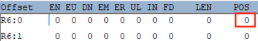

SFC documentation
=================

### TOC
  - [Installation & Deployment tooling](../deployment/README.md)
    - [SFC release as Greengrass components - CDK](../deployment/greengrass-sfc-components/release-version-as-components-cdk/README.md)
    - [SFC local build as Greengrass components - Python](../deployment/greengrass-sfc-components/local-build-as-components-py/README.md)
  - [Examples](../examples)
    - [Quickstart Lab](../README.md#quick-start---with-sfc-binaries)
    - [Greengrass SFC In-Process step-by-step Lab](../examples/greengrass-in-process/README.md)
    - [Greengrass SFC IPC step-by-step Lab](../examples/greengrass-ipc/README.md)
    - [Rockwell PCCC to S3 sample](../examples/in-process-pccc-s3/README.md)
    - [Beckhoff ADS to S3 Example](../examples/in-process-ads-s3/README.md)
    - [Siemens S7 to Sitewise sample](../examples/in-process-s7-sitewise/README.md)
    - [YAML Custom Configuration Provider](../examples/yaml-custom-config-provider/README.md)
    - [OPCUA Auto Discovery Configuration provider](../examples/opcua-auto-discovery/README.md)
    - [CSV File Adapter Example](../examples/custom-adapter-csvfile/README.md)
  - [Introduction](#introduction)
    - [SFC Components](#sfc-components)
    - [Protocol Adapters](#protocol-adapters)
    - [Core](#core)
    - [Target Adapters](#target-adapters)
    - [SFC data collection](#sfc-data-collection)
    - [Terminology and concepts](#terminology-and-concepts)
    - [Execution environments](#execution-environments)
  - [High level design overview and tenets](#high-level-design-overview-and-tenets)
    - [Execution environment and platform dependencies](#execution-environment-and-platform-dependencies)
    - [Extensibility](#extensibility)
    - [Networking](#networking)
    - [Scalability](#scalability)
    - [Configuration](#configuration)
    - [Logging](#logging)
    - [Metrics](#metrics)
    - [Connectivity](#connectivity)
    - [High availability](#high-availability)
    - [Data types and formats](#data-types-and-formats)
    - [Metadata](#metadata)
  - [Deployment](#deployment)
    - [In-process and IPC deployment models](#in-process-and-ipc-deployment-models)
    - [Mixed models](#mixed-models)
    - [Target chaining](#target-chaining)
    - [Target chaining and buffering](#target-chaining-and-buffering)
    - [Store and forward target](#store-and-forward-target.)
    - [Retention strategies](#retention-strategies)
    - [Router Target](#router-target)
  - [Output data format](#output-data-format)
  - [Dataflow and processing](#dataflow-and-processing)
  - [Data Filtering](#data-filtering)
    - [Data Change Filters](#data-change-filters)
    - [Value Change Filters](#value-change-filters)
  - [Configuration](#configuration-1)
    - [Configuration placeholders](#configuration-placeholders)
    - [Configuration secrets](#configuration-secrets)
    - [Deferred placeholder replacement](#deferred-placeholder-replacement)
    - [Configuration providers](#configuration-providers)
    - [Custom configuration](#custom-configuration)
    - [Configuration verification](#configuration-verification)
  - [Logging](#logging)
  - [Metrics collection](#metrics-collection)
  - [Securing Network Traffic between SFC components](#securing-network-traffic-between-sfc-components)
    - [Plaintext](#plaintext)
    - [ServerSideTLS](#serversidetls)
    - [MutualTLS](#mutualtls)
  - [Providing session credentials for targets accessing AWS Services](#providing-session-credentials-for-targets-accessing-aws-services)
  - [Securing the configuration](#securing-the-configuration)
  - [Output Structure Transformation](#output-structure-transformation)
    - [CSV output](#csv-output)
    - [XML format](#xml-format)
    - [YAML format](#yaml-format)
  - [Service Health Probes](#service-health-probes)
  - [OPCUA Alarm and Events types](#opcua-alarm-and-events-types)
  - [OPCUA security profiles and certificates](#opcua-security-profiles-and-certificates)
  - [SFC configuration](#sfc-configuration)
    - [SFC top level configuration](#sfc-top-level-configuration)
    - [Schedule](#schedule)
    - [SourceConfiguration](#sourceconfiguration)
    - [ChannelConfiguration](#channelconfiguration)
    - [Aggregation](#aggregation)
    - [ProtocolAdapterConfiguration](#protocoladapterconfiguration)
    - [TargetConfiguration](#targetconfiguration)
    - [SecretsManagerConfiguration](#secretsmanagerconfiguration)
    - [CloudSecretConfiguration](#cloudsecretconfiguration)
    - [MetricsConfiguration](#metricsconfiguration)
    - [MetricsWriterConfiguration](#metricswriterconfiguration)
    - [HealthProbeConfiguration](#healthprobeconfiguration)
    - [AwsIotCredentialProviderClientConfiguration](#awsiotcredentialproviderclientconfiguration)
    - [ClientProxyConfiguration](#clientproxyconfiguration)
    - [InProcessConfiguration](#inprocessconfiguration)
    - [ServerConfiguration](#serverconfiguration)
    - [ChangeFilterConfiguration](#changefilterconfiguration)
    - [ValueFilterConfiguration](#valuefilterconfiguration)
    - [TransformationOperator](#transformationoperator)
  - [OPCUA Protocol Configuration](#opcua-protocol-configuration)
    - [OpcuaSourceConfiguration](#opcuasourceconfiguration)
    - [OpcuaNodeChannelConfiguration](#opcuanodechannelconfiguration)
    - [OpcuaNodeChangeFilter](#opcuanodechangefilter)
    - [OpcuaAdapterConfiguration](#opcuaadapterconfiguration)
    - [OpcuaServerProfileConfiguration](#opcuaserverprofileconfiguration)
    - [OpcuaEventTypeConfiguration](#opcuaeventtypeconfiguration)
    - [OpcuaServerConfiguration](#opcuaserverconfiguration)
    - [CertificateConfiguration](#certificateconfiguration)
    - [SelfSignedCertificateConfiguration](#selfsignedcertificateconfiguration)
    - [CertificateValidationConfiguration](#certificatevalidationconfiguration)
    - [CertificateValidationOptions](#certificatevalidationoptions)
  - [OPCDA Protocol Configuration](#opcda-protocol-configuration)
    - [OpcdaSourceConfiguration](#opcdasourceconfiguration)
    - [OpcdaChannelConfiguration](#opcdachannelconfiguration)
    - [OpcdaAdapterConfiguration](#opcdaadapterconfiguration)
    - [OpcdaServerConfiguration](#opcdaserverconfiguration)
  - [S7 Protocol Configuration](#s7-protocol-configuration)
    - [S7SourceConfiguration](#s7sourceconfiguration)
    - [S7FieldChannelConfiguration](#s7fieldchannelconfiguration)
    - [S7AdapterConfiguration](#s7adapterconfiguration)
    - [S7ControllerConfiguration](#s7controllerconfiguration)
  - [MQTT Protocol Configuration](#mqtt-protocol-configuration)
    - [MqttSourceConfiguration](#mqttsourceconfiguration)
    - [MqttChannelConfiguration](#mqttchannelconfiguration)
    - [TopicNameMapping](#topicnamemapping)
    - [MqttAdapterConfiguration](#mqttadapterconfiguration)
    - [MqttBrokerConfiguration](#mqttbrokerconfiguration)
  - [SQL Adapter Configuration](#sql-adapter-configuration)
    - [SqlSourceConfiguration](#sqlsourceconfiguration)
    - [SqlChannelConfiguration](#sqlchannelconfiguration)
    - [SqlAdapterConfiguration](#sqladapterconfiguration)
    - [DbServerConfiguration](#dbserverconfiguration)
  - [Modbus TCP Protocol Configuration](#modbus-tcp-protocol-configuration)
    - [ModbusSourceConfiguration](#modbussourceconfiguration)
    - [ModbusOptimization](#modbusoptimization)
    - [ModbusChannelConfiguration](#modbuschannelconfiguration)
    - [ModbusTcpAdapterConfiguration](#modbustcpadapterconfiguration)
    - [ModbusTcpDeviceConfiguration](#modbustcpdeviceconfiguration)
  - [SNMP Protocol Configuration](#snmp-protocol-configuration)
    - [SnmpSourceConfiguration](#snmpsourceconfiguration)
    - [SnmpChannelConfiguration](#snmpchannelconfiguration)
    - [SnmpAdapterConfiguration](#snmpadapterconfiguration)
    - [SnmpDeviceConfiguration](#snmpdeviceconfiguration)
  - [PCCC Protocol Configuration](#pccc-protocol-configuration)
    - [PcccSourceConfiguration](#pcccsourceconfiguration)
    - [PcccChannelConfiguration](#pcccchannelconfiguration)
    - [PCCC Addressing](#pccc-addressing)
    - [PcccAdapterConfiguration](#pcccadapterconfiguration)
    - [PcccControllerConfiguration](#pccccontrollerconfiguration)
    - [PcccConnectPathConfiguration](#pcccconnectpathconfiguration)
  - [ADS Protocol Configuration](#ads-protocol-configuration)
    - [AdsSourceConfiguration](#adssourceconfiguration)
    - [AdsChannelConfiguratio](#adschannelconfiguration)
    - [AdsAdapterConfiguration](#adsadapterconfiguration)
    - [AdsDeviceConfiguration](#adsdeviceconfiguration)
  - [AWS IoT Analytics Service Target](#aws-iot-analytics-service-target)
    - [AwsIotAnalyticsTargetConfiguration](#awsiotanalyticstargetconfiguration)
  - [AWS IoT Core Service Target](#aws-iot-core-service-target)
    - [AwsIotHttpTargetConfiguration](#awsiothttptargetconfiguration)
  - [AWS MQTT Service Target](#aws-mqtt-service-target)
    - [AwsMqttTargetConfiguration](#awsmqtttargetconfiguration)
  - [AWS Kinesis Firehose Service Target](#aws-kinesis-firehose-service-target)
    - [AwsKinesisFirehoseTargetConfiguration](#awskinesisfirehosetargetconfiguration)
  - [AWS Kinesis Service Target](#aws-kinesis-service-target)
    - [AwsKinesisTargetConfiguration](#awskinesistargetconfiguration)
  - [AWS Lambda Service Target](#aws-lambda-service-target)
    - [AwsLambdaTargetConfiguration](#awslambdatargetconfiguration)
  - [AWS S3 Service Target](#aws-s3-service-target)
    - [Aws3TargetConfiguration](#aws3targetconfiguration)
  - [AWS SiteWise Target](#aws-sitewise-target)
    - [AwsSitewiseTargetConfiguration](#awssitewisetargetconfiguration)
    - [AwsSiteWiseAssetConfiguration](#awssitewiseassetconfiguration)
    - [AwsSiteWiseAssetPropertyConfiguration](#awssitewiseassetpropertyconfiguration)
  - [AWS SNS Service Target](#aws-sns-service-target)
  - [AWS SQS Service Target](#aws-sqs-service-target)
    - [AwsSqsTargetConfiguration](#awssqstargetconfiguration)
  - [AWS Timestream Target](#aws-timestream-target)
    - [AwsTimestreamTargetConfiguration](#awstimestreamtargetconfiguration)
    - [AwsTimestreamRecordConfiguration](#awstimestreamrecordconfiguration)
    - [AwsTimestreamDimensionConfiguration](#awstimestreamdimensionconfiguration)
  - [File Target](#file-target)
    - [FileConfiguration](#fileconfiguration)
  - [Debug Target](#debug-target)
    - [DebugConfiguration](#debugconfiguration)
  - [Store and Forward Target](#store-and-forward-target)
    - [StoreForwardTargetConfiguration](#storeforwardtargetconfiguration)
  - [ Router Target](#-router-target)
    - [RouterTargetConfiguration](#routertargetconfiguration)
    - [RoutesConfiguration](#routesconfiguration)
  - [MetricsWriters](#metricswriters)
    - [AwsCloudWatchConfiguration](#awscloudwatchconfiguration)
  - [Running the SFC core process](#running-the-sfc-core-process)
  - [Running the JVM protocol adapters as an IPC Service](#running-the-jvm-protocol-adapters-as-an-ipc-service)
  - [Running targets and as an IPC Service](#running-targets-and-as-an-ipc-service)
  - [Running protocol adapters in-process](#running-protocol-adapters-in-process)
  - [Running targets in-process](#running-targets-in-process)
  - [Metrics Collection](#metrics-collection)
    - [Running Metrics writers as an IPC service](#running-metrics-writers-as-an-ipc-service)
    - [Running metric writers in-process](#running-metric-writers-in-process)
  - [Extending the SFC Framework](#extending-the-sfc-framework)
    - [Implementing a protocol adapter](#implementing-a-protocol-adapter)
    - [Read function](#read-function)
  - [Creating in-process adapter instances](#creating-in-process-adapter-instances)
    - [IPC service adapters](#ipc-service-adapters)
    - [Using JVM protocol adapter classes as IPC services](#using-jvm-protocol-adapter-classes-as-ipc-services)
  - [Custom Configuration Handlers](#custom-configuration-handlers)
  - [Custom Logging](#custom-logging)
  - [Custom Metric Writers](#custom-metric-writers)
  - [.NET Core based protocol adapters](#net-core-based-protocol-adapters)
    - [Running the .NET Core protocol adapters as an IPC Service](#running-the-net-core-protocol-adapters-as-an-ipc-service)
    - [Output logging format](#output-logging-format)
    - [Implementing a .NET Core Protocol adapter](#implementing-a-net-core-protocol-adapter)
    - [Service](#service)


# Introduction 

Shop Floor Connectivity (SFC) is a data ingestion technology that can deliver data to multiple AWS Services.

SFC addresses limitations of, and unifies data collection of our existing IoT data collection services, allowing customers to collect data in a consistent way to any AWS Service, not just the AWS IoT Services, that can collect and process data. It allows customers to collect data from their industrial equipment and deliver it the AWS services that work best for their requirements. Customers get the cost and functional benefits of specific AWS services and save costs on licenses for additional connectivity products.

[^top](#toc)

## SFC Components

There are three main type of components that make up SFC.

-   Protocol Adapters
-   SFC Core
-   Target Adapters
<p align="center">
  
</p>
<p align="center">
    <em>Fig. 1. SFC components</em>
</p>


## Protocol Adapters

A SFC protocol adapter is used to read data from one or more industrial devices. This adapter interface abstracts the used protocol from and delivers the data with additional metadata in a common format to the SFC Core. The interface is designed so that AWS, 3rd parties, or customers can easily extend SFC with new protocol adapters without any modifications to the rest of the framework.

## Core

The SFC-Core component is the controller of the SFC Framework. It handles configuration and scheduling of the data collection through the protocol adapters. It can optionally transform each received data value using a combination of one or more of the 60+ transformation functions available functions, which can address complex data transformations requirements. The core has end-to-end datatype fidelity, the data can be sent to the targets in the data format it was read from the source, including complex structured datatypes and multi-dimensional arrays.

Optionally the data can be buffered and  aggregated at the edge to reduce network traffic, by using one or more of the 12 available aggregation functions. After the aggregation has taken place, an additional transformation step can be performed on the aggregated data. Before sending it to one or more SFC target adapters.

The core integrates with AWS Secrets Manager and allows the use of placeholders for secrets used in the configuration, which will be transparently retrieved from AWS Secrets manager and substituted into the configuration.  
  
In order to adapt to customer environments, logging, (dynamic) configuration and metrics collection is fully configurable. Default implementations are provided, but can be replaced by custom ones by implementing a minimal interface, and adding the implementation (JAR file) to the configuration.

[^top](#toc)

## Target Adapters

SFC target adapters are components that receive the data from the SFC Core and send it to their specific AWS or local services. Components can optionally apply data transformations using an Apache Velocity template, to deliver the data in the required format for the receiving service. At the moment of writing there are adapters for the following AWS Services: IoT Analytics, IoT Core, Kinesis Streams, Kinesis Firehose, Lambda functions, IoT Core, S3, SiteWise, Timestream, SNS, and SQS, with additional targets for the local filesystem, terminal output, and MQTT clients.

Target buffering can be applied to reduce the number of required service API calls. All this is part of the SFC infrastructure and makes it easier to develop new target types for additional AWS services Targets can be daisy-chained in order to provide additional functionality which is discussed in this document.

##  SFC data collection

Configuring data collection with SFC involves defining one or more collection schedules that specify the interval and sources of data collection, as well as the targets for sending the collected data. These sources can include multiple protocol adapter types, and individual data items can be transformed, filtered, or aggregated as needed. SFC's active mode handles all steps defined in the schedules automatically, without requiring additional coding.

## Terminology and concepts

SFC data collection is based on the following concepts

-   The SFC Core process runs one or more configured **schedules**.

-   A schedule defines from which **sources** the data is read, to **targets** the data is send and the **interval** at which this happens.

-   A **source** defines from which protocol adapter the data is read and defines the **channels**, which represent the actual values in a protocol agnostic way. A **schedule** can read from multiple sources which can read from different protocol adapters.

-   A **channel** defines the protocol specific details, like node id's, addresses etc., which are used by the adapter to read the values for that channel. Channels also can specify a **transformation** which will be applied to the read values, **filters** and **selectors**.

-   A **transformation** is a configured set of data transformation operators which can be used to transform each individual value read from a **source**.

-   A **filter** is a configured set of conditions to filter values based on relative or absolute values changes since the last time a value was read, of based on the actual value, defining a combination of boundaries and ranges.

-   In order to reduce the amount of data written, or number of write actions to the **targets, aggregation** can be applied for a schedule. An aggregation defines the number of values to combine per batch, the aggregation functions that are applies to the aggregated data and the **transformations** for these values.

-   A **target** defines which target adapter is used to send the data to. It does contain target specific configuration for the specific adapter as well as common configuration items as buffer size, compression, applied transformation parameters, credentials providers etc.

-   A **schedule** can send data to one or more **targets** of different types.

## Execution environments

Shop Floor Connectivity (SFC) is a versatile data ingestion solution that can be deployed in a variety of environments, including standalone applications, Docker containers, and Kubernetes pods. With no additional requirements beyond a Java JVM 1.8 runtime, SFC can be deployed on Linux and Windows systems. To optimize hardware utilization, SFC uses parallel and non-blocking async patterns in its software.


SFC protocol and target adapters can be implemented as a JVM component or as an external microservices using the gRPC protocol for communication. When running as stand-alone services, protocol adapters can be deployed on separate machines from the SFC Core process, with secure communication facilitated by gRPC. The SFC Core provides a consistent infrastructure allowing all JVM based protocol and target adapters to run in the same process as the SFC Core or as a separate microservice.

Distributed deployment using microservices is required to deploy in environments that use segregated OT and IT networks, with components connected to devices, protocol adapters, deployed in the OT network and components requiring internet access, targets adapters, in a DMZ.

The SFC core will provide the services, protocol and target adapters, with the required configuration after these are bootstrapped, providing a single, monitored and consistent source and location of configuration.

[^top](#toc)

# High level design overview and tenets

SFC design and implementation tenets of the software are based on the experience from working with our industrial customers. A major learning point is that hardly any assumptions can be made about the environment in which the software is operated and integrated.

## Execution environment and platform dependencies

Edge software in industrial environments is typically running on a mix of different hardware architectures, operating systems and runtimes. SFC can be deployed on platforms supporting a JVM and does not have platform or OS specific requirements. SFC protocol and targets adapters can be implemented and executed in other runtimes, e.g., .NET, as well.

SFC components can be deployed and executed as:

-   Standalone applications
-   Containers in Docker or Kubernetes
-   Greengrass components

## Extensibility

SFC can extended with additional protocol and target adapters. New adapters can be implemented and added without modifications to the SFC Core software. Using the infrastructure (JVM) code which is part of the framework, which reduces the effort to implement new adapters and allows developers to focus on just the protocol or target specific logic. Adapters can be implemented using a JVM language, or if due to the availability of protocol libraries or other technical reasons this is not possible, alternative languages and runtimes can be used. JVM based adapters can run either in-process with the SFC Core or as separate services in their own process. Adapters which are not JVM based implementations can only run in their own process.

It is also possible to build and configure the following extensions to the SFC Core:

-   *Logging*: the standard logging, which writes the output to the process console, can be replaced by a custom logger. The SFC configuration allows a custom logger to be configured by adding the library which implements it to the configuration.

-   *Configuration*: the default configuration is using a JSON file, which is monitored for updates to the actual file, or updates to environment variables used for which the configuration file can contain placeholders. As configuration data, in customer environments, may be managed and stored in external systems, it is possible to implement and configure a custom configuration provider, that can actively and periodically call out to external systems, or wait for incoming calls, to obtain the configuration data to build or extend the SFC configuration dynamically.

-   *Metrics*: SFC comes with a metrics collector for to the AWS CloudWatch Metrics service, which can be optionally added to the SFC configuration. Custom metrics collectors can be implemented and configured.

[^top](#toc)

## Networking 

In industrial environments there are two different types of networks that have distinct characteristics and purposes.

IT (Information Technology) networks are used for communication and data management in a traditional office or enterprise environment. These networks are designed for supporting business processes, data storage and retrieval, and user communication.

OT (Operational Technology) networks, on the other hand, are used for controlling and monitoring physical processes in industrial and manufacturing environments. These networks are designed for real-time monitoring and control of machinery, production processes, and other industrial systems. They typically use specialized protocols and are managed by operations or engineering departments. OT networks are often modelled after the [Perdue network model](https://en.wikipedia.org/wiki/Purdue_Enterprise_Reference_Architecture).

In reality in most industrial environments OT and IT networks are not directly connected. Industrial devices are unlikely to connect to the public internet. Solutions that retrieve data from these devices and submit this machine data to a cloud service must be capable of handling this network separation, restrictions due to firewalls, proxies, DMZ’s and offline and/or intermittent connectivity.

SFC is designed so that protocol adapters, the SFC Core and target adapters can be deployed as separate services in different networking or cloud environments The diagrams below show some of the possible deployment scenarios.
<p align="center">

</p>
<p align="center">
    <em>Fig. 2. SFC components in different OT/IT contexts</em>
</p>
SFC components running as microservices can explicitly specify which network interface to use for network connections to (OT) data sources and other components. By specifying the network interface, microservices can ensure that their network traffic flows through the desired network path, which can be important for optimizing network performance and ensuring network security.

By configuring the required X509 certificates all network traffic can be secured using server side or mutual TLS.

## Scalability

As protocol and target adapters can run as standalone services, multiple instances can be instantiated on the same system as the SFC Core, or on external systems to distribute the load and footprint of the components. By distributing the load and footprint of these components, the overall throughput and scalability of the system can be improved. This approach also enables better resource utilization and fault tolerance.

[^top](#toc)

## Configuration

SFC is based on the concept of configuration providers, that collect data from internal or external sources. These providers can constantly monitor resources, periodically make calls or wait for incoming configuration data, and apply the providers logic to build the actual SFC configuration that is provided to a configuration data stream of the SFC core. If an updated version of configuration data is provided to the SFC core , it will automatically restart its internal processes to let the internal and external processes use this updates version of the configuration data, without the need to restart the core process.

As SFC is deployed in a distributed mode, where protocol and target adapters can be running as standalone services, potentially on different systems, the SFC core will automatically extract the subsets of relevant data and send this to the adapter services when the SFC core is started or when it received an update configuration from its configuration provider. This means that there is no need to manually distribute the confirmation data to these services, even when they run remotely, as they will automatically and constantly receive a consistent of the SFC configuration. The only information that is required to bootstrap these services is the port number on which they can receive the configuration update.

This feature ensures that the SFC system is always up-to-date with the latest configuration data.

The default SFC configuration provider is based on reading a JSON format configuration file. This file can contain placeholders for environment variables as well as secrets which are stored in the AWS Secrets Manager's secure store. The provider is constantly monitoring the actual configuration files, and environment variables for the used placeholders, and if the files or the environment variables are updated, will provide a new version of the configuration to the SFC Core.

<p align="center">

</p>
<p align="center">
    <em>Fig. 3. SFC default config provider</em>
</p>

As in customer environment configuration data may be managed and stored in external systems, it is possible to implement and configure a custom configuration provider to retrieve that data. An instance of a configured custom provider will be created by the SFC Core at startup. It will receive the content of the initial configuration file, which can be a subset of the SFC configuration, combined with (or just) custom provider specific configuration data it needs to obtain the data it will use to build the SFC configuration.

<p align="center">

</p>
<p align="center">
    <em>Fig. 4. Extensible config providers</em>
</p>

As different protocol and target adapters need specific configuration data the SFC configuration data the SFC configuration consists of generic and non-adapter specific data which is abstract and used by the SFC Core, and extensions of the generic core data classes that contain additional and specific data for that adapter. The core will only use the generic configuration data and will pass the adapter specific configuration data to the adapters. The implementation of the adapters is responsible for handling the its specific configuration data. This separation of generic and specific data makes it possible to add new adapters, using their own specific configuration data, without the need to make changes to the SFC core. Additionally, the adapter can optionally implement specific logic to validate the provided configuration data. The SFC Core does provide a configuration reader, which is used by the core, as well as by the target adapters, to read, validate and replace placeholders in a consistent way.

To protect the configuration from unauthorized modification SFC has tooling and an API to sign the configuration data. The SFC Core will use the digital signature from the configuration data and reject it verification fails.

[^top](#toc)

## Logging

By default, SFC logs its output to the console standard and error output. The logging level determines the type and level of detail included in the output. However, users can configure SFC to use a custom writer that sends the logging data, which includes a timestamp, level, source, and message, to alternative destinations.

## Metrics

SFC provides the ability for the core, protocol and targets adapters to gather metrics and send them to a configurable metrics writer. SFC includes an AWS CloudWatch Metrics writer implementation that can be configured to run in the same SFC process or as a separate IPC service. Customers can also create their own custom metrics writers to send metrics data to other destinations.

Metrics collection can be enabled or disabled at the top level, as well as at the protocol or target adapter level. Customers can specify metrics dimensions at each level.

Furthermore, the metrics collector automatically gathers warning and error messages from the SFC logging.

## Connectivity

For targets that require network access to send the collected data to their destinations, it is possible to use intermediate store and forward targets. Intermediate targets can be configured in between the SFC Core and one or more target adapters by using target daisy-chaining. If the end target loses connectivity the intermediate target will store the data, optionally encrypted, for a configured amount of time, data volume or number of messages, and will resubmit the data when the target regains network connectivity, in either FIFO or LIFO mode.
<p align="center">

</p>
<p align="center">
    <em>Fig. 5. Example of target daisy chaining</em>
</p>

Target chaining is generic mechanism in SFC for adding additional processing steps, like store and forwarding as described above, for target data without changes to the actual end targets.

## High availability

All SFC components that can run as microservices in their own processes can be configured to have an endpoint for handling health probes. Mechanisms used to manage the service instances, (e.g., Docker Compose, Kubernetes) can use these endpoints in their configuration to check the status of a service and recycle instances failing to respond to the health probe requests. This approach can help ensure the reliability and availability of microservices-based systems.

[^top](#toc)

## Data types and formats

SFC provides full end to end data type-fidelity. Data which is read from the protocol adapters is delivered to the target adapters as the same type of data as it was read. It does support numeric types, (Unicode)strings, time formats, structured types, as well as vectors of these types.

By applying configured transformations, which consists of a sequence of one or more provided transformation operators, the SFC can transform every individual value that is read from a protocol adapter. Transformations can be used to standardize data values and types read from different devices to be delivered in a consistent way to the consuming target adapters. The SFC framework comes with a set of 80 transformation operators.

The SFC core can also aggregate the data into batches and apply aggregation function to that data, which then can be send instead of, or with the individual values. This can be used to reduce the data volume by sending only the output of selected aggregation functions or the number of data messages to the consuming targets. Additionally, transformations, as described above, can be applied to the aggregated data.

The data is delivered to the target in a defined hierarchical structure. An additional, template based, transformation, using Apache Velocity, can be configured for each target to select subsets, restructure or transform the data or transform it into formats like CSV, YAML or XML.

## Metadata

The data can be enriched with additional information before it is sent to the targets.

In the configuration information at schedule-level, source and channel level maps of (string) data can be configured that will be added to the output data.

Configuration top-level meta data will be merged with the data at schedule-level and added to the target data under the metadata node at top-level. If a value is defined at both top-level and schedule-level, the schedule-level value is used (allowing the overwriting of top-level values at schedule-level).

Metadata at source-level will be added under a metadata node at source-level.

Metadata at channel-level will be added to the values under a metadata-level node at value level.

<p align="center">

</p>
<p align="center">
    <em>Fig. 6. SFC metadata concept</em>
</p>

## `TODO`: map SFC metadata approach to Unified Namespace (UNS) & IDF


# Deployment

The SFC core module is implemented to run in a Java virtual machine. Input adapters and targets can be implemented for the JVM as well, or other runtimes, depending on the platforms where these are deployed and libraries required for the implementation of the protocol.

JVM implementations only have the option to be loaded in the same processes as the SFC Core. When other runtimes are used, any language can be used for the implementation. These adapters and targets run as separate processed and use streaming gRPC IPC to communicate with the SFC core.

The framework contains classes that speed up the development of JVM protocol and target services as well as an abstraction layer for the GRPC IPC layer.

The components don’t have any runtime environment-specific dependencies, they can be deployed as:

-   *Standalone applications* on the target platform supporting the JVM or runtimes are used to implement additional adapters and targets.
-   *AWS IoT Greengrass v2 components* or containers
-   *Docker* or *Kubernetes* containers

[^top](#toc)

## In-process and IPC deployment models

If implemented as jar files containing Java bytecode Protocol, adapters and targets can be configured to be loaded and executed in the SFC core process. The configuration for the adapter or target type contains a list of jar files, which are explicitly loaded by the SFC core process, as well as the name of a static factory class that implements a method, named newInstance, called by the core to create a new instance. The configuration is passed to this method and is used to initialize the adapter or the target instance.

<p align="center">

</p>
<p align="center">
    <em>Fig. 7. SFC In-process deployment (e.g. in a single host context)</em>
</p>

As an alternative, they can be deployed to run in their processes and communicate with the core using GRPC. Use cases for this deployment model are to allow the following scenarios:

- Non-JVM execution environment or language to build/execute components
- Flexible deployment on IT/OT networks
- Distribute the load over multiple systems
- Apply lifecycle control with GreenGrass2 or Docker/Kubernetes.

When the processes running the adapter or target services are started, a port number is passed as a parameter on which the service is listening for requests from the core. Alternatively, the path to a configuration file can be used from which the process will retrieve just the port number (using an additional target identifier parameter if the configuration file does contain more than one target for a target type).

When the SFC core initializes it will send an initialization request to the protocol source and/or target servers, containing just the sections of its configuration that are used by that adapter or target. When the configuration is modified, and the core process is restarted, it will send an initialization request to each adapter or target with the newly updated subset of relevant configuration data.

If an adapter or target server is stopped, it will be detected by the SFC Core. It will try to re-connect to the service and send an initialization request when it succeeds to connect to a new instance of the server.

As the SFC core acts as the provider for configuration data to the servers, these will always work with the latest and consistent configuration data from a single source. No additions configuration files need to be distributed to the protocol and adapter processes.

<p align="center">

</p>
<p align="center">
    <em>Fig. 8. SFC IPC deployment (e.g. in a distributed OT/IT context)</em>
</p>

## Mixed models

It is possible to mix instances of in-process and IPC adapters and targets in a single configuration.

<p align="center">

</p>
<p align="center">
    <em>Fig. 9. SFC Mixed deployment options</em>
</p>


## Target chaining

To enable scenarios like store and forward, compression and encryption of data sent to targets, targets can now be chained. Intermediate adapters can be placed in between the core and the adapters that deliver the data to the actual destination. These intermediate targets are responsible for creating the adapter instances which are configured to forward the data to.

When an intermediate target creates the target instances, it can optionally pass an implementation of the TargetResultHandler interface. The instance of the created targets can use the instance of the passed interface implementation to acknowledge, dis-acknowledge or report the forwarded data messages as failed back to the forwarding intermediate target. The same interface can be used to query the data that the result of the forwarding target expects . This can be just the serial number, the complete message or no data, for acknowledged, dis-acknowledged or error messages.

[^top](#toc)

## Target chaining and buffering

Targets receive data from the SFC core in order to deliver this data to a target specific destination, which could be a local store, a local service or a cloud service.

In order to add functionality to the delivery of target data, special targets can be configured in between the sfc-core and the targets that do the actual delivery of the data. For the sfc-core intermediate targets look like other targets when writing the data. The intermediate targets implement their specific logic acting on the received data, and pass the data to the configured next targets in the chain. The intermediate targets do pass a handler to these targets, that these targets can use to report back the results of delivering the data to their destinations. The data messages can either be acknowledged if the data was delivered successfully to the destination, not-acknowledged if the destination of the target was not available (e.g., due to loss of connectivity, or reported as error if the data could not be processed by the target (e.g., die to invalid data for that target). The intermediate target can the take action based on the result received from the next targets in the chain.

Using this strategy additional functionality can be added to delivering data to target destinations without making changes to the actual end-targets.

<p align="center">

</p>
<p align="center">
    <em>Fig. 10. SFC Target Chaining</em>
</p>

Store and forwarding functionality for SFC targets is implemented using an intermediate target of type store-forward-target. It will use the returned results from the targets to buffer messages that could not be delivered to the destinations of the targets behind the store and forward target. When the targets can resume delivering data to their destinations the store and forward target will resubmit the data to these targets.

[^top](#toc)

## Store and forward target

As described above store and forwarding for SFC targets is implemented by an intermediate target that can be configured in between the SFC-Core and the actual targets. This target stores the buffered data to disk if it cannot be delivered to the destination of the targets that are configured as next targets in the chain.

Buffering will also take place in situation where the next targets in the chain are IPC targets which cannot be reached by the store and forwarding targets die to network issues.

The store and forward target using to following logic:

-   In normal situations the target will forward the target data to the next targets.
-   For messages that can be delivered to their destinations these targets will send ACKs containing the serial number of the delivered messages.
-   When the targets cannot deliver messages, NACKS, including the full message will be returned.
-   When receiving NACKs the store and forward target will go into buffering mode and will start buffering data received by the core to disk.
-   In buffering mode, the store and forward target will periodically send a buffered message, which is the oldest message that falls in the retention strategy (see below) of the buffer if the buffer is configured to operate in FIFO mode, which is the default. In LIFO mode the most recent message is used. An internal flag is set in the message to indicate to the target that this message should not be buffered but send directly to their destinations.
-   The target will try to deliver this message to the destination and report an ACK or NACK for that message.
-   When an ACK is received the store and forward target will switch back from buffering mode into normal mode after submitting the buffered data. This will happen in FIFO or LIFO mode based on configuration.
-   Messages for which an ERROR is received are not stored and in case they are buffered removed from the store as this means they cannot be processed by the target.

[^top](#toc)

## Retention strategies

In order to prevent running out of disk space of the device that is used to store the buffered messages a retention strategy must be defined for a store and forward target. This can either be a period in minutes, a number of messages per target the total size in MB per target. Data in the buffer that falls outside of the used retention criteria will not be resubmitted and automatically deleted from the storage device.

In order to reduce the storage of buffered messages the target will try to use hard links for messages that need to be stored for multiple end targets, if the file system of that device supports it.

*PLEASE NOTE*  
Storing messages to a physical device can reduce the throughput of the SFC deployment. It is strongly recommended to run process that contains the store and forward target, in memory or as an IPC service, on a device that has a fast storage device.

## Router Target

The router target can be used to forward data to one or more targets in a target chain. For each target an alternative target can be configured to which the data is routed if that data cannot be written to its primary target.

Each primary target can also have a target configured to which the data is routed if it has been written successfully to its primary target or the alternative target of its primary target,

Used cases for the router target are:

-   *Bundling* of (compressed) message data over a network to a system on which a group of targets, running as external services, are hosted.

<p align="center">

</p>
<p align="center">
    <em>Fig. 11. SFC Router target - bundling data</em>
</p>

- *Routing* of data *to alternative targets* if data cannot be written to primary targets

<p align="center">

</p>
<p align="center">
    <em>Fig. 12. SFC Router target - failover target</em>
</p>

- *Routing* of data to a *success target* after it has been written to primary targets or their alternative targets. The success target can be used to archive delivered messages or a custom target van notify the source of the data that the data has been delivered.

<p align="center">

</p>
<p align="center">
    <em>Fig. 13. SFC Router target - routing to a final `success` target</em>
</p>

<p align="center">

</p>
<p align="center">
    <em>Fig. 14. SFC Router target - routing to a final `success` target</em>
</p>

[^top](#toc)

# Output data format 

```sh
[schedule]  -- schedule name
[serial]    -- serial number
[timestamp] -– processing timestamp
[sources]   -- source name* --- [values] -- value name* --- [value]-- value
                            |                           |- [metadata]--name* -- meta value
                            |                           |- [timestamp]-- value timestamp
                            |
                            |- [timestamp] -- source timestamp
                            |- [metadata] -- name* -- value
[metadata] --name* -- value

#When aggregation is used an additional level is used for the values for each applied aggregation

[schedule]  -- schedule name
[serial]    -- serial number
[sources]   -- source name* --- [values] -- value name* --- [value]-- **aggregation name*** --  [value] --- value
                            |                           |                                       [timestamp] -timestamp
                            |                           |- [metadata] -- name* -- meta value
                            |                           |- [timestamp] -- timestamp
                            |
                            |- [timestamp] --- source timestamp
                            |- [metadata] --- name* --- value
[metadata] --name* -- value
```

Custom element names in brackets can be set for all elements above in brackets using the "ElementNames" configuration setting. The name keys for the sources and value maps get the value of the "Name" element for the source and channel in their configuration (default is the key used as the id for the source/value in the configuration).

The root contains 4 elements

-   **schedule**: This element contains the name of the schedule that outputs the data

-   **serial**: A unique serial number for the target data

-   **timestamp**: Timestamp when the target output data was created

-   **sources**: This element contains a map with a node for each source of the schedule that has output data

    -   **values**: The values node contains a map for each channel of its source that has an output value

        -   **value**: This node contains the actual value of a channel or an aggregated value

        -   **metadata**: This node contains a map with (optional) metadata for a channel

        -   **timestamp**: Timestamp for the value (only if timestamp level = "value" or "both")
For aggregated data the timestamp is only available for the aggregation outputs first, last and values.

-   **timestamp**: Timestamp at source level (only if timestamp level = "source" or "both")

-   **metadata**: This node contains a map with (optional) metadata for a schedule

#  Dataflow and processing

The data collected by the SFC source connector is processed by an internal data pipeline that consists of the following steps:

-   Data collected is read from connector
-   Data transformations are applied on individual values if a transformation for a value has been configured.
-   Data change filtering is applied at value or source level. Data change filters only let values pass if the new value differs from a previously passed value with at least a configured percentage or absolute value, or when a configured time period has passed since passing the last value. If a change filter is configured at source and value level, then the filter at value level takes precedence.
-   Data value filter is applied at value level is applied if a filter has been configured for that value. The value is passed if it matches the filter expression which can consist of a combination of one or more `==`, `!=`, `>`, `>=`, `<`, `<=`, `&&`, `||` operators. For non-numeric values only the `==` and `!=` operators van be used.
-   If data aggregation is specified the values are buffered until the specified aggregation size is reached. The output of an aggregation can be one or more output values from an aggregation (`avg`, `min`, `max`, etc.) on the collected values and/or the collected values.
-   Data transformations are applied on the aggregated data output values if a transformation is configured for that specific output.
-   Data values are named according to their configured names. Metadata and timestamp information is added at configured levels (top, source and value) as configured.
-   The data is transmitted to the configured targets where additional buffering or target specific processing is done. Selected targets support the transformation of the data submitted to their destinations by configuring an Apache Velocity template that is applied on that data.

```
Source data -> Transformation(value)(*) -> Change Filter (*) -> Value Filter(*) -> Aggregation(*) -> Transformation (value)(*) -> Naming of data and adding timestamp and metadata -> Transformation template (structure) (*) ->  Data to Target
```
(`*`) optional, only applied if configured

[^top](#toc)

# Data Filtering

The data read from the source can be filtered in two steps. First data change filtering is applied, then data value filtering. Both steps are optional and can be applied individually.

## Data Change Filters

A data change filter can be configured at source and channel values level. If a filter is configured at source level it is applied on all values for that source. Filters configured at value level take precedence over a filter at source level. Values only pass a filter if a value has changed at least, or beyond, a configured value since the last value that was passed. This value can be a percentage or absolute value. The initial value will always pass the filter. It is also possible to specify a time interval in which at least a value will pass the filter. These filters can only be applied on single numeric values.

## Value Change Filters

A value change filter will pass a value if it matches a filter expression. A filter expression can consist of one or more operators like `==`,`!=`,`>`,`>=`,`<`,`<=`, combined in `&&` and `||` groups. For non-numeric values, only the == and != operators can be used.

# Configuration

As the core only is aware of its input sources and output targets by name. The parts of the configuration model which are used by the core do not contain any protocol or target-specific information. The core knows its input and outputs only by its identifiers.

The configuration model for each type of input protocol and a target does contain their specific details. SFC implements a configuration layer that gives each adapter or target its specific view of the configuration data.

As a result, the core and each protocol or target can have their view of its specific configuration data, without dependencies, mix-up, or re-definition of attributes used by other types.

To load the configuration data from a JSON source, the consumer makes a call to the configuration layer, specifying the class that implements the type-specific model of the data. These classes can optionally implement additional logic to validate the loaded data, which can raise a configuration exception, including a detailed description if the data is not valid according to the validation logic.

[^top](#toc)

## Configuration placeholders

The JSON configuration can contain placeholders in the format **${name}**. These placeholders are replaced by the value of environment variables with the specified name or a configured secret (see below). Using placeholders will help to keep consistency between (repeated) values in the configuration and values used in other configuration types.

## Configuration secrets

SFC integrates with AWS Secrets Manager following the same logic as used in GreenGrass Secret manager. Secrets are defined in the configuration file using the SecutityManager Element. This element includes a list of configured secrets. Each secret has an id, which can either be the arn or name of the secret, and an optional alias. Secrets can be used by using placeholders of the format \${name} in the configuration file. Name can be the name, arn or alias of the secret. If just an arn is used for a configured secret either this arn or the name of the secret in the AWS Secrets manager service can be used as name in the placeholder.

When resolving the placeholders, the configuration manager will first try to replace the placeholder with the value of an environment variable with that name, or when no variable with that name exists it will try to replace it with configured secret value.

If the device running SFC does not have access at startup, or when a configuration is updated and reloaded, it uses the values stored from the last time the secrets were read from the AWS Secrets Manager service.

In order to read the secrets stored in the AWS Secrets Manager service a reference to a Credentials Client, configured in the configuration, can be used. The certificate/role alias configured for that client must give permission to make a getSecretValue API request for the configured secrets. Without client the normal credential chain path for the AWS SDK is used to obtain the required credentials.

Secrets which are stored locally are encrypted using a file with a secret key, which can be configured to point to an existing file, or as a reference to a GreenGrass deployment in which case the GreenGrass configured private key will be used. If a path to a file with a private key is used then there is also an option to automatically generate this file containing the secret key at first use, if it does not exist.

[^top](#toc)

## Deferred placeholder replacement

In normal case placeholders for environment variables and secrets are resolved in the SFC core Configuration logic. When the core build subsets of the configuration, used to initialize external IPC servers for source protocol adapter or target IPC services, the placeholders are replaced with their environment variable or secret values. It is possible to defer the replacement of these placeholders on the receiving service, allowing to resolve environment variables by the system/process running the service or preventing secret values to be passed over the network. (please note that IPC traffic between the core and external services can be configured to be encrypted) Deferring placeholder can be done by using placeholders in the format **${{name}}**. If the placeholders are used for replacement by configured secrets from AWS Systems Manager, all required configuration elements to resolve the secrets by the service process will be included in the configuration that is used to initialize it. (SecretsManager with selected configured secrets, credentials manager client etc.)

## Configuration providers

In the architecture of the SFC core the configuration method is abstracted by using configuration providers. These plug-able providers read the configuration data from their specific source and method and provide the initial configuration and updates to a SFC service process, which can be the Service, a source service or a target service, g as a channel of configuration versions. A SFC service process will receive the new configuration version and apply these to the internal service stance that will use these new settings without the need to restart the service.

Service providers can read configuration data from files, by making service calls or listening to service requests.

By default, the configuration is read from a configuration file which is specified by the -config command line parameter for all services. The ConfigFileServiceProvider, which is used for configuration files, will detect updated to the configuration file, or changes made to environment variables used in placeholders in the configuration file, and provide the updated configuration data to the service.

## Custom configuration

The ConfigFileServiceProvider, which is used when a config file is specified by using the -config parameter, can be used to configure a handler for custom or additional processing to the configuration file processing. Example of custom processing are the dynamic creation of enriching the passed in configuration data with additional data that could come from an additional source/service/logic.

When such a handler is configured, by specifying the jar files that implement it and a factory class, an instance of that handler is created. The data that was in the specified configuration file is passed to the instance. The data is passed "as-is" and could include custom handler specific data. The custom handler is responsible for interpreting this data and (periodically) returning a valid version of a SFC configuration as a channel.

If the configuration file specified by the -config parameter of any of its reference environment variables a new instance of the custom handler is created.

## Configuration verification

In order to secure the content of configuration data passed to the SFC Core the content can be digitally signed with a secret key. The digital signature, which is added to the configuration, will be checked using the public key related to the key that was used to sign the configuration data. See section [Securing the configuration](#securing-the-configuration) for details.

# Logging

By default, log information is written to the console.

There are 4 trace levels, Error (stderr), Warning(stdout), Info(stdout) and Trace(stdout) which can be specified when starting the SCF core or a protocol adapter or target writer service.

Logging output will contain the system date and time, the logging level, source of the event and a message. The logging infrastructure will intercept and blank the values of secrets configured in the SFC configuration.

Instead of writing to the console custom log writer can be implemented and configured. Details on how to implement a custom log writer can be found in section [Custom Logging](#custom-logging).

[^top](#toc)

# Metrics collection

The SFC core, protocol adapters and targets can collect metrics and write these to a configurable metrics writer. SFC comes with an implementation of a writer for AWS CloudWatch Metrics with can be configured to run in the same process as the SFC core or as an IPC service. Custom metrics writers can be implemented and configured to collect metrics data, see details in section [Custom Metrics Writers](#custom-metric-writers).

Metrics collection is enabled by adding a Metrics configuration section in top level of the SFC configuration. In this section the writer for metrics data is specified, which can an in-process metrics writer (by specifying the jar files that implement it and a factory class name to create an instance) or a MetricsServer (by specifying the address and port number of the service). Metrics can be disabled, by setting a property "Enabled", to false.

Metrics collection can be disabled from the metrics sources by setting a property, named Enabled, in the Metrics section to false. A property metrics Namespace, which defaults to "SFC" can be set for use by the writer implementation.

Every 60 seconds, which is the default which can be modified by setting a property named Interval, to the interval time in seconds.

For each metrics data point the following information is collected:

-   name
-   value
-   units
-   timestamp
-   dimensions

By default, the dimensions are:
-   source: name of the component that generated the datapoint. For protocol adapters this is the identifier of the adapter or the adapter and the source (separated by a ":" ) from the configuration. For targets the source is the identifier of the target from the configuration. For the code it is "SfcCore".
-   category: can be "Target", "Adapter" or "Core"
-   type: the actual type of the connector (e.g., "OpcuaAdapter"), target (e.g., "AwsSqsTargetWriter") or "SfcCore"

Additional dimensions can be added by adding a "CommonDimensions" property in the metrics section which is a map with name-value pairs.

Additionally, each adapter or target can have a Metrics section with an Enabled property to enable or disable the collection of metrics for that component, and a map of CommonDimensions which will be added to every data point collected for that component.

Additional settings can be set for the actual configured writer. For the AWS CloudWatch Metrics writer, a section named "CloudWatch" can be added with the following properties:

-   CredentialProviderClient: name of a configured client in the AwsIotCredentialProviderClients section of the SFC configuration to use to obtain credentials to put metrics data. (The role used for the client must give permission for calls to the PutMetricData API call for the AWS CloudWatch service). If no client is configured the [AWS Java SDK credential provider chain is used](https://docs.aws.amazon.com/sdk-for-java/latest/developer-guide/credentials.html#credentials-chain).
-   Region: Region used for the AWS CloudWatch Service
-   Interval: Interval in seconds to write to AWS CloudWatch. Metrics are written at least once with this interval or earlies if the maximum of 1000 data points or the configured buffer size is reached.
-   BatchSize: Size of the buffer used to store datapoints before these are written to CloudWatch, or earlier if the interval period is reached.

The following metric values are collected:

| **Metric name**         | **Description**                                               | **Collected by**                    |
|-------------------------|---------------------------------------------------------------|-------------------------------------|
| BytesReceived           | Bytes read by the adapter                                     | ModbusTCP connector                 |
| BytesSend               | Bytes send by the adapter                                     | ModbusTCP connector                 |
| BytesWritten            | Bytes written by target                                       | Selected adapters                   |
| Connection              | Number of connections                                         | All connectors                      |
| ConnectionErrors        | Number of failed connections                                  | All connectors                      |
| Errors                  | Number of logged errors                                       | Core and all connectors and targets |
| MessageBufferedSize     | Size of buffered messages in bytes                            | StoreForwardTarget                  |
| Messages                | Number of messages processed                                  | All targets                         |
| MessagesBufferedCount   | Number of buffered messages                                   | StoreForwardTarget                  |
| MessagesBufferedDeleted | Number of messaged deleted                                    | StoreForwardTarget                  |
| ReadDuration            | Time in milliseconds used by adapter to read data from source | All adapters                        |
| ReadErrors              | Number of read errors                                         | All adapters                        |
| Reads                   | Number of reads                                               | All adapters                        |
| ReadSuccess             | Number of succeeded reads                                     | All adapters                        |
| Values read             | Number of values read                                         | All adapters                        |
| Warnings                | Number of logged warnings                                     | Core and all connectors and targets |
| WriteDuration           | Time in milliseconds used by target to write data             | All targets                         |
| WriteErrors             | Number of failed writes                                       | All Targets                         |
| Writes                  | Writes by targets                                             | All targets                         |

[^top](#toc)

# Securing Network Traffic between SFC components

All network traffic between SFC components can be secured using encryption. The following options can be used

## PlainText

The network traffic between SFC components is not encrypted.

## ServerSideTLS

The network traffic is encrypted using the private key of the service, the service is providing its X509 server certificate to the client to decrypt the traffic. The service process needs to be started using the -key and -cert parameters specifying the files containing servers private key and server certificate. The -connection type parameter must be set to ServerSideTLS. In the SFC configuration the ConnectionType in the ServiceConfiguration for the server must be set to ServerSideTLS.

The value used for the connection type parameter used for the service and the configured ConnectionType must match.

Note that the address which is configured to communicate with the service must be present as DNS name or IP address as one of the Alternative Subject Names in the server certificate.

## MutualTLS

The network traffic is encrypted using the private key of the service and the private key of the client, the service and service provide their X509 certificates to each other to decrypt the traffic. The service process needs to be started using the -key, -cert and -ca parameters specifying the files containing servers private key and server and CA certificates. The -connection type parameter must be set to MutualTLS. In the SFC configuration the ConnectionType in the ServiceConfiguration for the server must be set to MutualTLS. The ClientPrivateKey, ClientCertificate and CaCertificate must be set to the files containing the clients private key, client certificate and CA certificate.

The value used for the connection type parameter used for the service and the configured ConnectionType must match.

The address which is configured to communicate with the service must be present as DNS name or IP address as one of the Alternative Subject Names in the server certificate.

The address of the client must be present as DNS name or IP address as one of the Alternative Subject Names in the client certificate.

The script below can be used to create the required keys and certificates to which can be used for ServerSideTLS and MutualTLS connections in test environments

*NOTE*:

-   The script is provided to generate self-signed certificates for test purposed only and should not be used in production environments.
-   For convenience the script includes the IP addresses of all available network interfaces as IP addresses, and the hostname (plus localhost) of the system on which the script is executed, in the as IP addresses of the sand DNS names as alternative subject names of the generated certificates. This assumes a test setup where both the SFC core and service are executed on the same system. When the SFC core and SFC services run on different systems the script must be executed on both of the systems and the relevant certificates must be used on that system as key and certificate parameters for the server, or configuration values used by the SFC core.
-   In production environments the IP addresses and DNS names should be included in the certificate to the expected client and service addresses for that environment.

```sh
rrm *.pem
rm *.srl
rm *.cnf

C="NL"
ST="NH"
L="AMS"
O="MYORG"
OU="MYOU"

for i in $(ifconfig | sed -En 's/127.0.0.1//;s/.*inet (addr:)?(([0-9]*\.){3}[0-9]*).*/\2/p')
do
 IP_LIST+="IP:$i,"
done
IP_LIST+="IP:127.0.0.1,"
IP_LIST+="IP:0.0.0.0"

HOST=$(hostname -s)
DNS_NAMES="DNS:$HOST,DNS:localhost"
CN="/C=$C/ST=$ST/L=$L/O=$O/OU=$OU/CN=$HOST"

# CA
# Private key and self-signed certificate
openssl req -x509 -newkey rsa:4096 -days 365 -nodes -keyout ca-key.pem -out ca-cert.pem -subj "$CN"-CA""

echo "CA's self-signed certificate"
openssl x509 -in ca-cert.pem -noout -text


# SERVER
# Private key and certificate signing request
openssl req -newkey rsa:4096 -nodes -keyout server-key.pem -out server-req.pem -subj "$CN"-SERVER""

echo "subjectAltName=$DNS_NAMES,$IP_LIST" > server-ext.cnf

# Create certificate
openssl x509 -req -in server-req.pem -days 365 -CA ca-cert.pem -CAkey ca-key.pem -CAcreateserial -out server-cert.pem -extfile server-ext.cnf

echo "Server's signed certificate"
openssl x509 -in server-cert.pem -noout -text


# CLIENT
# Private key and certificate signing request
openssl req -newkey rsa:4096 -nodes -keyout client-key.pem -out client-req.pem -subj "$CN"-CLIENT""

echo "subjectAltName=$DNS_NAMES,$IP_LIST" > client-ext.cnf

# Create certificate
openssl x509 -req -in client-req.pem -days 365 -CA ca-cert.pem -CAkey ca-key.pem -CAcreateserial -out client-cert.pem -extfile client-ext.cnf

echo "Client's signed certificate"
openssl x509 -in client-cert.pem -noout -text

```

[^top](#toc)

# Providing session credentials for targets accessing AWS Services

Targets publishing their data to AWS services need credentials to get access to these services. Besides using the standard chain credential (environment variables, credentials files) used by the (Java) AWS SDK's, SFC has additional support for using device certificates to obtain session credentials from the [AWS IoT Credentials Provider Service](https://aws.amazon.com/blogs/security/how-to-eliminate-the-need-for-hardcoded-aws-credentials-in-devices-by-using-the-aws-iot-credentials-provider/). Targets can refer to a client configuration that contains entries for the files with for the required device certificate, private key and root CA certificate. SFC provides helpers, that can be used by the targets, to obtain session credentials using these certificates and key files. These client configurations are in the AwsIotCredentialProviderClients section of the configuration file and are referred by the targets by setting the CredentialProviderClient to an entry in that section. If the CredentialProviderClient is not set then SFC will fall back on the default credentials provider chain as described [here](https://docs.aws.amazon.com/sdk-for-java/v1/developer-guide/credentials.html).

The logic for obtaining the session credentials is ported from Greengrass V2 into SFC and is fully compatible with, but not dependent on Greengrass. Certificates can be deployed manually to the device running SFC, or in case Greengrass is deployed on the same machine make use of the Greengrass certificate management and deployment functionality. The configuration provides a shortcut option to specify that the certificate and key files of a Greengrass deployment on that device can use, without the need to specify the location of each certificate or key file.

The SFC core will provide the content of the certificate and key files as part of the configuration to the targets. The targets can use this content to obtain session credentials, using SFC helper classes that will cache the session access key id, secret access key, and session token, and obtain a new session if it expires.

In scenarios where a target is running as an IPC service on a different device as the device running the SFC core the configuration data, including the device certificate and private key, over the network, this data needs to be protected. This can be done using the following methods:

-   Protect all data exchanged between the SFC core and the target over the network by specifying a certificate and key for that IPC server. If these are used the traffic is encrypted using TLS/SSL.
-   Per client configuration, there is the option to set the CertificatesAndKeysByFileReference option to true. When this option is set for a target the SFC core will not pass the content of the certificate and key files over the network, but only the configured paths for these files. This means that these files should either be accessible in a secure way from the device running the target or physically be deployed to that device, manually or using Greengrass certificate management.

As targets may need to access the internet over a proxy server, to obtain the session credentials as described above, and to make the required AWS service calls, the client configuration referred by the target can also include proxy configuration information.

[^top](#toc)

# Securing the configuration

In order to secure the content of configuration data passed to the SFC Core the content can be digitally signed with a secret key. The digital signature, which is added to the configuration, will be checked using the public key related to the key that was used to sign the configuration data.

The configuration can be signed using a command line application as shown below:

```kotlin
import com.amazonaws.sfc.config.ConfigVerification  
import File  
import kotlin.system.exitProcess  
  
fun main(args: Array<String>){  
checkArguments(args)  
val privateKeyFile = File(args[0])  
val inputConfigFile = File(args[1])  
val signedConfigFile = File(args[2])  
ConfigVerification.sign(inputConfigFile, privateKeyFile, signedConfigFile)  
println("Signed configuration file written to ${signedConfigFile.*absoluteFile}")  
  
}  
  
private fun checkArguments(args: Array<String>) {  
if (args.size != 3) {  
println("Usage: sign-sfc-config <private-key-file> <config-file> <signed-config-file>")  
exitProcess(0)  
}  
}
```

This code loads the input configuration file to be signed, and adds an entry named "ConfigSignature", containing the digital signature of the configuration data, to the signed configuration output file.

In order to check the digital signature, the -verify parameter of the sfc-main module, which runs the SFC core, is used to specify the file containing the public key for the private key that was used to sign the configuration.

If the verification of the signature fails, because of the configuration being changed after signing it or the signature is missing the SFC core will not process the configuration.

In situation where the configuration file is generated programmatically by an application or a custom config provider, the one of the ConfigVerification's sign methods can be used to calculate and add the digital signature.

```kotlin
fun sign(configFile, privateKeyFile: File, signedConfigFile: File): Unit  
fun sign(configFile: File, privateKeyFile: File, signedConfig: OutputStream): Unit  
fun sign(configFile: File, privateKey: PrivateKey, signedConfigFile: File): kotlin.  
fun sign(configFile: File, privateKey: PrivateKey, signedConfig: OutputStream): Unit  
fun sign(config: InputStream, privateKeyFile: File, signedConfigFile: File): Unit  
fun sign(configStream: InputStream, privateKeyFile: File, signedConfig: OutputStream): Unit  
fun sign(config: InputStream, privateKey: PrivateKey, signedConfigFile: File): Unit  
fun sign(configStream: InputStream, privateKey: PrivateKey, signedConfig: OutputStream): Unit  
fun sign(configJson: String, privateKeyFile: File): String  
fun sign(configJson: String, privateKeyFile: File, signed: OutputStream): Unit  
fun sign(configJson: String, privateKey: PrivateKey): String  
fun sign(configJson: String, privateKey: PrivateKey, signedConfig: OutputStream): Unit
```

If a custom configuration provider is used, the public key read from the public key file specified by the -very parameter of the sfc-main application will be passed to the instance of the provider, where it can be used to verify the initial configuration passed to the instance. If the public key is provided, meaning it was passed to the sfc-main module for verification pf the configuration, the data which is produced by the provider needs to be signed using one of the sign methods listed above.

To verify the input configuration passed to the custom provider one of the following ConfigValidation's verify methods can be used:

```kotlin
fun verify(configFile: File, publicKeyFile: File): Boolean  
fun verify(configFile: File, publicKey: PublicKey): Boolean  
fun verify(configStream: InputStream, publicKeyFile: File): Boolean  
fun verify(configStream: InputStream, publicKey: PublicKey):Boolean  
fun verify(configJson: String, publicKeyFile: File): Boolean  
fun verify(configJson: String, publicKey: PublicKey): Boolean
```

[^top](#toc)

# Output Structure Transformation

For situations where the structure of the data needs to be converted, this can be another JSON format, XML, CSV etc., targets can have a configurable template. This template is the name of an [Apache Velocity template file](https://velocity.apache.org/engine/2.3/user-guide.html). Before the data is transmitted the actual destination of the target the template is applied to transform the data.

The context of the input data contains 3 variables:

- "$schedule": Only contains the name of the schedule
- "$sources": Map with an element for each source containing all its values
- "$metadata": Metadata at (schedule) top-level.

Below are examples of templates that transform the data (not-aggregated) into different formats.

## CSV output 

This template flattens the data into CSV format. Each line consists of the name of the source, the name of the value, the actual value and its timestamp.

```vtl
#foreach($sourceName in $sources.keySet())
#foreach($valueName in $sources[$sourceName]["values"].keySet())
#set( $value = $sources[$sourceName]["values"][$valueName])
"$sourceName","$valueName",$value["value"],"$value["timestamp"]"
#end
#end
```

The template below flattens the values for the "`count`", "`avg`", "`min`", "`max`", "`stddev`" aggregations of a dataset into CSV format.

```vtl
#foreach($sourceName in $sources.keySet())
#foreach($valueName in $sources[$sourceName]["values"].keySet())
#set( $values = $sources[$sourceName]["values"][$valueName])
#set($aggregatedValues="")
#foreach($aggrName in ["count", "avg", "min", "max", "stddev"])
    #set($aggregatedValues = $aggregatedValues + "," + $values["value"][$aggrName]["value"])
#end
"$sourceName","$valueName"$aggregatedValues
    #set($aggregatedValues="")
#end
#end
```

## XML format 

The following example template converts the data into XML format, including timestamps and metadata at each level if these are available

```vtl
<schedule id="$schedule" #metadata_attributes($metadata)>
#foreach($sourceName in $sources.keySet())
    #set( $source = $sources[$sourceName])
    <source name="sourceName" #metadata_attributes($source["metadata"]) #timestamp_attr($source)>
#foreach($valueName in $source["values"].keySet())
#set($value = $source["values"][$valueName])
         <value name="$valueName" #metadata_attributes($value["metadata"])#timestamp_attr($value)>$value["value"]</value>
#end
    </source>
#end
</schedule>

#macro(metadata_attributes $metadata)
#set($attrs = "")
#foreach($key in $metadata.keySet())
#set( $attrs = $attrs + $key + "=""" + $metadata[$key] +  """ " )
#end
$attrs#end

#macro(timestamp_attr $item)
#set($timestamp=$item["timestamp"])
#if ($timestamp != "")
#set($timestamp = "timestamp=""" + $timestamp + """")
$timestamp#end
#set($timestamp = "")
#end
```

## YAML format 

The following example template converts the data into YAML format, including timestamps and metadata at each level if these are available

```vtl
---  
$schedule:
  sources:
#foreach($sourceName in $sources.keySet())
#set( $source = $sources[$sourceName])
    $sourceName:
      values:
#foreach($valueName in $source["values"].keySet())
#set($value = $source["values"][$valueName])
        $valueName:
          value: $value["value"]
#set($val_timestamp = $value["timestamp"])
#if ($val_timestamp != "")
          timestamp: $val_timestamp
#end
#set($val_metadata = $value["metadata"])
#if( $val_metadata != "")
          metadata:
#foreach($key in $val_metadata.keySet())
            $key: $val_metadata[$key]
#end
#end
#set($val_metadata = "")
#end
#set($src_timestamp = $source["timestamp"])
#if ($src_timestamp != "")
      timestamp: $src_timestamp
#end
#set($src_metadata = $source["metadata"])
#if( $src_metadata != "")
      metadata:
#foreach($key in $src_metadata.keySet§())
        $key: $src_metadata[$key]
#end
#end
#set($src_metadata = "")
#set($src_timestamp = "")
#end
#if( $metadata != "")
  metadata:
#foreach($key in $metadata.keySet())
    $key: $metadata[$key]
#end
#end
```

[^top](#toc)

#  Service Health Probes

In order to check the state of a SFC process (sfc-main service and protocol adapters, target adapters and metric writer, running as a service on the local or a remote server) each of these can be configured to have a health probe endpoint. This endpoint can be polled by the platform used to control the service instances (e.g., Docker Compose, Kubernetes). Servers will respond with a configurable response (default is "OK") if the service is in non-faulty state, which is determined by the logic of that service implementation.

The health probe endpoints of the adapter, target and metric services, become active after they have been initialized by the initialization call made by the sfc-main process, as the request for that call contains the required information to start the health probe.

Optionally the health probe can be configured use a different network adapter/network as used by the data streams between the core process and the service.

After receiving the initialization data, the health probe will listen for HTTP GET and HEAD requests on the configured port on the default or explicit configured network interface (`http://address:port/`) . Optionally a path can be configured to be appended to the endpoint address (`http://address:port/path`)

Optionally a period can be configured after which repeated health probe requests did not return a positive result the process will be stopped. This option can be used if the environment which is controlling the instances does not try to stop the unhealthy service instances itself before a new instance is started.

In order to protect the service from extensive load and unwanted the request the handler for this service:

-   A configurable rate limiter is used to limit the number of calls per second (default is 10 request/second)
-   The status of the service is cached by the probe handler and retained for a configurable period before being re-evaluated (default is 1000 milliseconds)
-   A list of IP filters can be configured to restrict the IP addresses from which requests can be made
-   The handler is restricted to only use a single thread for handling probe requests

Health probe endpoints for SFC service are configured by adding a HealthProbe configuration sections at the following locations:

<table>
<colgroup>
<col style="width: 24%" />
<col style="width: 37%" />
<col style="width: 37%" />
</colgroup>
<thead>
<tr class="header">
<th><strong>Service</strong></th>
<th>HealthProbe Configuration</th>
<th>Checks</th>
</tr>
</thead>
<tbody>
<tr class="odd">
<td>SFC Core main process</td>
<td>At top level of configuration</td>
<td>Active status of all data read, write and aggregation<sup>(*)</sup> workers and metrics processor<sup>(*)</sup><br />
<sup>(*)</sup> if used</td>
</tr>
<tr class="even">
<td>Protocol Adapters</td>
<td>In the server configuration used by an adapter in the AdapterServers section</td>
<td>Status of listening ports for the hosted gRPC service</td>
</tr>
<tr class="odd">
<td>Target Adapters</td>
<td>In the server configuration used by a target in the TargetServers section</td>
<td>Status of listening ports for the hosted gRPC service</td>
</tr>
<tr class="even">
<td>Metrics writer</td>
<td>In the MetricsServer section for the writer configured in the top level Mettrics section.</td>
<td>Status of listening ports for the hosted gRPC service</td>
</tr>
</tbody>
</table>

For details on the HealthProbe configuration see HealthProbeConfiguration table section in this document

[^top](#toc)

# OPCUA Alarm and Events types 

The OPCUA protocol adapter supports the collection of data from events and alarms. This can be done by adding the event name or identifier of the alarm or event type to a node channel configuration. The name of the event can be the name of any of the OPCUA alarms from the model at <https://reference.opcfoundation.org/Core/Part9/v105/docs/5.8>, or an OPCUA event from the model at <https://reference.opcfoundation.org/Core/Part3/v104/docs/9.1>

The adapter will monitor nodes with a specified event type the adapter and add the received to the collected data for the OPCUA source, using the name for that node. The event data consist of a map of properties, which are based on the type of the event used for the node. As multiple events may be received during a read interval, the value of these event nodes is always of type array, containing one or more maps with the event data. The maximum number of items that can be collected is configurable. If more events are received the oldest event is omitted from the output.

The OPCUA adapter can operate in Polling or Subscription mode to collect data values from the OPCUA server. For events the adapter will use a subscription with monitored event nodes, independent of in which mode the adapter collects the data nodes.

As industry specific companion specification define additional event and alarm types, SFC allows configuration of additional types, which are grouped in server profiles. An event is configured by a given name, the node identifier of the event type (e.g., ns=99;i=9999), and a list of properties for that event with their qualified names consisting of a namespace and browse name (e.g., 9:Property1)

In order to reduce the configuration for these events it is possible to inherit from other events in the profile or the types defined in the OPCUA specifications, by specifying that that type by its type name or node identifier. All properties defined in the type a type inherits from are added, as well as all other properties in types up in the type hierarchy.

The names or node identifiers can be used as event types in the nodes for which event and alarm data needs to be collected. The event name is used to:

-   Filter the evens raised by the node, if multiple event types need to be received then a channel needs to be configured for each of these event types.

-   Collect the values from the received events as defined for that event type.

As for data nodes selectors, it is possible to use a selector to filter specific properties from the events and add additional meta data at node level. Index ranges and node change filters are not supported for events data.

Example of mixed OPCUA source nodes for an alarm event and two data nodes.

```json
"Channels": {
  "LevelAlarm": {
    "Name": "LevelAlarm",
    "NodeId": "ns=6;s=MyLevel.Alarm",
    "EventType": "ExclusiveLevelAlarmType"
  },
  "SimulationRandom": {
    "Name": "Random",
    "NodeId": "ns=3;i=1002"
  },
  "SimulationCounter": {
    "Name": "Counter",
    "NodeId": "ns=3;i=1001"
  }
}
```

The collected data from the event and data nodes is shown below.

```json
{
  "OPCUA-SOURCE": {
    "values": {
      "Random": {
        "value": 0.675842,
        "timestamp": "2023-03-15T11:34:42Z"
      },
      "Counter": {
        "value": 0,
        "timestamp": "2023-03-15T11:34:42Z"
      },
      "LevelAlarm": {
        "value": [
          {
            "HighHighLimit": 90.0,
            "HighLimit": 70.0,
            "LowLimit": 30.0,
            "LowLowLimit": 10.0,
            "InputNode": "ns=0;i=0",
            "Retain": true,
            "EventId": [0, 0, 0, 0, 0, 0, 6, 72, 0, 0, 0, 0, 0, 0, 6, 71],
            "EventType": "ns=0;i=9482",
            "SourceNode": "ns=6;s=MyLevel",
            "SourceName": "MyLevel",
            "Time": "2023-03-15T11:34:42.328Z",
            "ReceiveTime": "2023-03-15T11:34:42.328Z",
            "Message": "Level exceeded",
            "Severity": 500
          }
        ],
        "timestamp": "2023-03-15T11:34:42.848Z"
      }
    },
    "timestamp": "2023-03-15T11:34:42.848Z"
  }
}
```

[^top](#toc)

The snippet below shows the configuration of an OPCUA adapter with a profile named "CustomEventsProfile" that defines two additional event types, "CustomeEventType1" and "CustomEventType2", each with two properties. CustomEventType1 inherits from the OPCUA defined BaseEventType type and will contain all properties from that class in addition to the two properties defined for the event. CustomEventType2 will inherits from and therefore contain all properties from CustomEventTYpe1 and the two properties defined for the event.

Sources are configured to read from adapter "OPCUA" and server "OPCUA-SERVER", which has a service profile set to "CustomEventsProfile", can use both defined event types in addition to all OPCUA defined event types, as event type for their nodes to collect the data in the properties for these events.

```json
{
  "ProtocolAdapters": {
    "OPCUA": {
      "AdapterType": "OPCUA",
      "OpcuaServers": {
        "OPCUA-SERVER": {
          "Address": "opc.tcp://localhost",
          "Path": "OPCUA/SimulationServer",
          "Port": 53530,
          "ServerProfile": "CustomEventsProfile"
        }
      },
      "ServerProfiles": {
        "CustomEventsProfile": {
          "EventTypes": {
            "CustomEventType1": {
              "NodeId": "ns=9;i=9000",
              "Properties": ["99:CustomProperty1", "99:CustomProperty2"],
              "Inherits": "BaseEventType"
            },
            "CustomEventType2": {
              "NodeId": "ns=9;i=9001",
              "Properties": ["99:CustomProperty3", "99:CustomProperty4"],
              "Inherits": "CustomEventType1"
            }
          }
        }
      }
    }
  }
}
```

Further details on OPCUA alarms and event can be found in the OPCUA configuration tables in this document.

#  OPCUA security profiles and certificates

In order to secure the traffic between the OPCUA protocol adapter and the OPCUA Server it can be signed and encrypted using certificates.

In the configuration for the OPCUA server in the adapter the security policies can be used by setting the SecurityPolicy of the server to any of the following policy names:

| Name                | Sign / Encrypt   | Security Policy                                                  |
|---------------------|------------------|------------------------------------------------------------------|
| None                |                  |                                                                  |
| Basic128Rsa15       | Sign             | http://opcfoundation.org/UA/SecurityPolicy#Basic128Rsa15         |
| Basic256            | Sign and encrypt | http://opcfoundation.org/UA/SecurityPolicy#Basic256              |
| Basic256Sha256      | Sign and encrypt | http://opcfoundation.org/UA/SecurityPolicy#Basic256Sha25         |
| Aes128Sha256RsaOaep | Sign             | http://opcfoundation.org/UA/SecurityPolicy#Aes128_Sha256_RsaOaep |

The Certificate section of the OPCUA Server contains the settings for the certificate used by the client of the adapter.

The CertificateName contains the filename of the client certificate, which can be in pem or Pkcs12 format. If a pem format file is used, additionally the name of the corresponding private key file must be set in PrivateKeyFile. This is not required for PFX certificates as this type of file is a container which holds the certificate and private key. If the PFX file is password protected then the Password attribute must be set. (Avoid clear passwords in the configuration, use placeholders for secrets obtained from AWS Secrets manager instead). If an alias is used in the PFX container the value of that alias must be set in the Alias attribute of the configuration.

The type of the certificate can be determined by the prefix of the filename (either ".pem "or ".pfx") optionally followed by ".cer", ".cert" or ".crt"). If another extension is used then the type can be explicitly set by setting the server configuration's Format attribute to either "Pem" or "Pkcs12".

If the either the PEM or PFX certificate file does not exists, it is possible to let the OPCUA adapter generate a self-signed certificate and store that certificate in the specified file name. For PEM format certificates the name of the private key file must be set as well. If the private key file does exist it will be used to generate a pem or Pkcs12 formatted certificate. If it does not exist the a keypair is generated and, if a pem formatted certificate is generated, stored in the specified file. For Pkcs12 formatted certificates the key will be stored with the certificate in the pfx file.

To enable the generation of these self-signed certificates the SelfSignedCertificate section must be present in the server configuration. In this section the CommonName of the certificate must be set and optionally the X509Name fields for Organization, OrganizationalUnit, LocalityName, StateName and CountryCode. The default period in which the generated certificate is valis start from (notBefore) the current date to an end date (notAfter) of the current date plus 3 years. The duration in which the certificate is valid can be modified by setting the ValidPeriodDays attribute.

A number of days can be set in ExpirationWarningPeriod. At startup and at midnight the OPCUA adapter will check if the client certificate will expire within that period and generate a warning and metric for an expiring (or expired) certificate.

If the OPCUA server does validate the DNS name or the DNS name and IP addresses of the client must be present in the certificate Subject Alternative Names. A list of IP Addresses and DNS names can be set in the SelfSignedCertificate IpAddresses and DnsNames attributes. If these are not set then all known IP addresses and DNS name of the host on which the OPCUA adapter generates the certificate will be set as Subject Alternative Names. To exclude the IP addresses and DNS names from the generated certificate, specify an empty list for these attributes.

If the certificate contains an ApplicationUri as an Alternative Subject Name, the Application Description used by the OPCUA client will be the name part from that URI. For self-signed certificates the alternative subject name for the application uri will be set to urn:aws-sfc-opcua@\[hostname\]. (Application Name used by client is aws-sfc-opcua@\[hostname\]). OPCUA servers van validate the application name used by the client against the ApplicationUri from the certificate.

*NOTE: The certificate used by the client must be trusted by the OPCUA server, for which the procedure depends on the used sever. As an example, when a ProSys OPCUA (simulation) server is used, an unknow certificate is rejected but stored on the server, where it can be manually marked through the UI as trusted.*

The OPCUA adapter can also validate the certificate it receives from the OPCUA server. It will validate it using a set of know trusted certificates and issuers and certificate revocation lists (CRL). To enable the validation a CertificateValidation section must be present in the configuration. The Directory attribute in this section is set to the location where the certificates and revocation lists are stored in a number of sub directories, which will be created by the adapter if these do not exist.

```sh
[Configured directory name]
|----- issuers
|        |---- certs
|        |---- crl
|      trusted
|        |---- certs
|        |---- crl
|----- rejected
```

The certs directories contain trusted certificates and certificates of issuers in order to validate signed certificates. The crl directories contain the certification revocation lists. When a server certificate does not pass the validation it will be stored in PEM format in the rejected directory, from where it can after inspection be moved into the trusted certificate directory.

A number of optional checks (see <https://reference.opcfoundation.org/v104/Core/docs/Part4/6.1.3/>) can be configured in a ValidationOptions section in the CertificateValidation section. It can contain the following attributes that can be set to false to disable the optional validation, which by default are all enabled)

Validation options:

-   HostOrIP: End certificates must contain their host name or IP address in the Subject Alternate Names which will be validated
-   Validity: Checks certificate expiry
-   KeyUsageEndEntity: Key usage extensions for end entity certificates must be present and will be checked.
-   ExtKeyUsageEndEntity: : Extended key usage extensions for end entity certificates must be present and will be checked.
-   KeyUsageIssuer: Key usage extensions must be present and will be checked for CA certificates.
-   Revocation: Revocation will be checked against CLRs.
-   ApplicationUri: Checks the Application name in the Subject Alternative Names against the Application description.

Example of OPCUA server configuration using Basic256Sha256 security profile for signed and encrypted traffic using a X509 certificate and private key, which can be generated by the adapter as a self-signed certificated which is valid for 365 days. A daily warning and metric value will be generated staring 30 days before the certificate expires. Server certificates will be checked using certificates and certificate revocation lists stored in sub directories under the specified base directory for that server.

```json
"OPCUA-SERVER-1": {
  "Address": "opc.tcp://myserver.com",
  "Path": "OPCUA/SimulationServer",
  "Port": 53530,
  "SecurityPolicy": "Basic256Sha256",
  "CertificateValidation": {
    "Directory": "/etc/certificates/opcua1 ",
    "ValidationOptions": {
      "HostOrIP" : true,
      "Validity" : true,
      "KeyUsageEndEntity" : true,
      "ExtKeyUsageEndEntity" : true,
      "KeyUsageIssuer" : true,
      "Revocation" : true,
      "ApplicationUri" : true
    }
  },
  "Certificate": {
    "CertificateFile": "/etc/certificates/certificate.pem",
    "PrivateKeyFile": "/etc/certificates/ /private-key.pem",
    "ExpirationWarningPeriod" : 30,
    "SelfSignedCertificate": {
      "CommonName": "OPCUA-CONNECTOR",
      "Organization": "AWS",
      "OrganizationalUnit": "AIP",
      "LocalityName": "AMS",
      "StateName": "NH",
      "CountryCode": "NL",
      "ValidPeriodDays": 365
    }
  }
}
```

[^top](#toc)

# SFC configuration

## SFC top level configuration

<table>
	<colgroup>
		<col style="width: 22%" />
		<col style="width: 17%" />
		<col style="width: 37%" />
		<col style="width: 22%" />
	</colgroup>
	<thead>
		<tr class="header">
			<th>
				<strong>Name</strong>
			</th>
			<th>
				<strong>Description</strong>
			</th>
			<th>
				<strong>Type</strong>
			</th>
			<th>Comments</th>
		</tr>
	</thead>
	<tbody>
		<tr class="odd">
			<td>AWSVersion</td>
			<td>Software version must be set to "2022-04-02"</td>
			<td>String</td>
			<td>User for compatibility with future extensions and updates</td>
		</tr>
		<tr class="even">
			<td>Name</td>
			<td>User-defined name of the configuration</td>
			<td>String</td>
			<td>Optional</td>
		</tr>
		<tr class="odd">
			<td>Version</td>
			<td>User-defined version</td>
			<td>Number</td>
			<td>Optional</td>
		</tr>
		<tr class="even">
			<td>LogLevel</td>
			<td>Detail of logged output information</td>
			<td>String, any of "Trace", "Info", "Warning", "Error"</td>
			<td>Optional, the default value is "Info"</td>
		</tr>
		<tr class="odd">
			<td>ElementNames</td>
			<td>
				<p>Names of the output elements. This is a map containing the following entries:</p>
				<p>"
					<strong>Metadata</strong>": Name of metadata added at source level as configured in the optional "Metadata" configured for a schedule, source or channel
				</p>
				<p>
					<strong>"Schedule":</strong> Name of the root element for the schedule.
				</p>
				<p>
					<strong>"Sources":</strong> Name the of the element that contains the sources in the output of a schedule.
				</p>
				<p>"
					<strong>Timestamp</strong>": Name of the timestamp elements.
				</p>
				<p>"
					<strong>Value</strong>": Name of the elements that contains a value.
				</p>
				<p>
					<strong>"Values":</strong> Name of the element in a source that contains the map of channel values for a source.
				</p>
				<p>
					<strong>"Serial"</strong> : Name of the element that contains an unique serial number for target data transmitted to the targets.
				</p>
			</td>
			<td>
				<p>Map(String, String)</p>
				<p>indexed by name of the element</p>
			</td>
			<td>
				<p>Optional, default values for missing element are:</p>
				<p>"Metadata" -&gt; "metadata"</p>
				<p>"Schedule" -&gt; "schedule"</p>
				<p>"Sources" -&gt; "sources"</p>
				<p>"Timestamp" -&gt; "timestamp"</p>
				<p>"Value" -&gt; "value"</p>
				<p>"Values" -&gt; "values"</p>
				<p>"Serial" -&gt; "serial"</p>
			</td>
		</tr>
		<tr class="even">
			<td>Schedules</td>
			<td>List of one or more schedules that define how data is collected from their sources, processed, and send to the targets</td>
			<td><a href="#schedule">Schedule</a></td>
			<td>At least one active schedule needs to be present</td>
		</tr>
		<tr class="odd">
			<td>Sources</td>
			<td>
				<p>Input sources to read data from. This element is a map indexed by the source identifiers of the sources.</p>
				<p>For controlling the schedule and processing the data from the source, the SFC core uses a set of generic configuration attributes which are common for all protocol implementations.</p>
				<p>Implementations of input protocols will define their specific source configurations with additional specific attributes required for that protocol additionally to the common attributes (See SourceConfiguration type)</p>
				<p>The entries of this Sources element will contain protocol-specific entries for the used protocol implementation. The protocol implementation is responsible for reading and handling the protocol-specific attributes.</p>
			</td>
			<td>Map[String, <a href="#sourceconfiguration">SourceConfiguration</a>]</td>
			<td>At least 1 source must be configured.</td>
		</tr>
		<tr class="even">
			<td>ProtocolAdapters</td>
			<td>Protocol adapters are the sources to read data from and abstract the actual protocol that us used to read the data. Each source used in a schedule must have a reference to a protocol adapter. As protocol adapters can be of different types, each inherited type has additional specific attributes for the protocol.</td>
			<td>Map[String, <a href="#protocoladapterconfiguration">ProtocolAdapterConfiguration</a>]</td>
			<td></td>
		</tr>
		<tr class="odd">
			<td>ProtocolAdapterTypes</td>
			<td>
				<p>This section includes the information for each protocol adapter type that is used by the SFC core to create instances of that adaptertype if that adapter runs in the same process as the SFC core.</p>
				<p>The element is a map indexed by the adapter type (e.g., OPCUA, MODBUS). Each entry contains information on which jar files, that contain the protocol adapter implementation, to load and the factory class to create the instances.</p>
				<p>The SFC core itself is not aware of the actual target implementations and only uses this configuration data to explicitly load the jar files to create and use the adapter instances. This makes it possible to add new protocol adapter types without modifications to the SFC core.</p>
				<p>Note Only types that run in the same process as the SFC core need to be configured. If the core uses IPC to send the data to a target that runs in its process, the type does not have to be defined in the ProtocolAdapterTypes section.</p>
				<p>Only JVM implementations of protocol adapters can be used to run in the same process as the SFC core.</p>
			</td>
			<td>Map[String,<a href="#inprocessconfiguration">InProcessConfiguration</a>]</td>
			<td></td>
		</tr>
		<tr class="even">
			<td>ProtocolAdapterServers</td>
			<td>
				<p>Servers that run protocol adapter instances as separate processes. The SFC core will read the data from these servers using a streaming IPC protocol(gRPC) This section is a map indexed by the protocol adapter server identifier. The entries contain the address information that the SFC Core will use to connect and communicate with the IPC service.</p>
				<p>The protocol-servers can be referenced by their identifier from the ProtocolAdapters section of the configuration.</p>
			</td>
			<td>Map[String,<a href="#serverconfiguration">ServerConfiguration</a>]</td>
			<td></td>
		</tr>
		<tr class="odd">
			<td>Targets</td>
			<td>
				<p>Targets are the destinations for data collected and processed by the SFC. Targets defined in this section can be referred to by the target identifier in schedules as their output destinations.</p>
				<p>The element is a map, indexed by the target identifier. The entries contain the target configuration data.</p>
				<p>Targets can be of different types that have specific configuration attributes. Target implementations define their specific configuration types containing the attributes required for communicating with the target.</p>
				<p>For sending the data to the targets the SFC core only uses a subset of attributes that are common between all target types.</p>
			</td>
			<td>Map[String,<a href="#targetconfiguration">TargetConfiguration</a>]</td>
			<td></td>
		</tr>
		<tr class="even">
			<td>TargetTypes</td>
			<td>
				<p>The TargetTypes section includes the information for each target type that is used by the SFC core to create instances of that target if that target runs in the same process as the SFC core.</p>
				<p>The element is a map indexed by the TargetType (e.g., AWS-SQS). Each entry contains information on which jar files, that contain the target implementation, to load and the factory class to create the instances.</p>
				<p>The SFC core itself is not aware of the actual target implementations and only uses this configuration data to explicitly load the jar files to create and use the target instances. This makes it possible to add new target types without modifications to the SFC core.</p>
				<p>Note Only types that run in the same process as the SFC core need to be included in the configuration. If the core uses IPC to send the data to a target that runs in its process, the type does not have to be defined in the TargetTypes section.</p>
				<p>Only JVM implementations of targets can be used to run in the same process as the SFC core.</p>
			</td>
			<td>Map[String,<a href="#inprocessconfiguration">InProcessConfiguration</a>]</td>
			<td></td>
		</tr>
		<tr class="odd">
			<td>TargetServers</td>
			<td>
				<p>Servers that run target instances as separate processes. The SFC core will send the data to these targets using IPC (gRPC) This section is a map indexed by the target server identifier. The entries contain the address information that the SFC Core will use to connect and communicate with the IPC service.</p>
				<p>The targets-servers can be referenced by their identifier from the Targets section of the configuration.</p>
			</td>
			<td>Map[String,<a href="#serverconfiguration">ServerConfiguration</a>]</td>
			<td></td>
		</tr>
		<tr class="even">
			<td>SecretsManager</td>
			<td>Gives access to secrets stored in AWS secrets manager which are used to replace placeholders in the configuration</td>
			<td><a href="#secretsmanagerconfiguration">SecretsManagerConfiguration</a></td>
			<td></td>
		</tr>
		<tr class="odd">
			<td>Transformations</td>
			<td>
				<p>Transformations are a sequence of one or more transformation operators that can be applied to values read from input channels and/or aggregated output values.</p>
				<p>This element is a map indexed by transformation identifiers which can be referred to in case a transformation needs to be applied to the data.</p>
				<p>Each entry is a list of one or more transformation operators. An operator consists of the name of the operator and operator-specific parameters. The operators are applied in the order in which they are listed. The output type of an operator must be compatible with the input type of the next operator in the list.</p>
				<p>If a value the transformation is applied to is an array of values, the transformation will be applied to each value in the array.</p>
			</td>
			<td>Map[String,<a href="#transformationoperator">TransformationOperator</a>[]]</td>
			<td>
				<p>Example:</p>
				<p>{</p>
				<p>"DivBy2Add1Round": [</p>
				<p>{</p>
				<p>"Operator" : "Divide",</p>
				<p>"Operand" : 2</p>
				<p>},</p>
				<p>{</p>
				<p>"Operator" : "Add",</p>
				<p>"Operand" : 1</p>
				<p>},</p>
				<p>{</p>
				<p>"Operator" : "Round"</p>
				<p>}</p>
				<p>]</p>
				<p>}</p>
				<p>The transformation with identifier DivBy2Add1Round above Divides the input value by 2, then adds 1 and rounds the result.</p>
			</td>
		</tr>
		<tr class="even">
			<td>ChangeFilters</td>
			<td>Filters that can be applied at source or channel value level to let pass values only if they have changed at all or an absolute or percentage from the previously passed value, or since a time interval.</td>
			<td>Map[String,<a href="#changefilterconfiguration">ChangeFilterConfiguration</a>]</td>
			<td>
				<p>Example:</p>
				<p>"ChangeFilters" : {
					<br />
"Change1PercentOrPer10Sec" : {
					<br />
"Type": "Percent",
					<br />
"Value": 1,
					<br />
"AtLeast": 10000
					<br />
},
					<br />
"AllChangesOrOncePer10Sec" : {
					<br />
"Type": "Always",
					<br />
"AtLeast": 10000
					<br />
}
					<br />
}
				</p>
			</td>
		</tr>
		<tr class="odd">
			<td>ValueFilters</td>
			<td>Filters that can be applied at channel values level. Values are passed if the value matches the filter expression</td>
			<td>Map[String,<a href="#valuefilterconfiguration">ValueFilterConfiguration</a>]</td>
			<td>
				<p>Example</p>
				<p>"ValueFilters": {</p>
				<p>"ValueEqual5": {</p>
				<p>"Operator": "eq",</p>
				<p>"Value": 5</p>
				<p>},</p>
				<p>"ValueEqualYes": {</p>
				<p>"Operator": "eq",</p>
				<p>"Value": "Yes"</p>
				<p>},</p>
				<p>"ValueInRange0-10": {</p>
				<p>"Operator": "and",</p>
				<p>"Value": [</p>
				<p>{</p>
				<p>"Operator": "ge",</p>
				<p>"Value": 0</p>
				<p>},</p>
				<p>{</p>
				<p>"Operator": "le",</p>
				<p>"Value": 10</p>
				<p>}</p>
				<p>]</p>
				<p>}</p>
				<p>}</p>
			</td>
		</tr>
		<tr class="even">
			<td>AwsIotCredentialProviderClients</td>
			<td>Configuration for clients using the AWS IoT Credential Provider Service to obtain session credentials.</td>
			<td>Map[String,<a href="#awsiotcredentialproviderclientconfiguration">AwsIotCredentialProviderClientConfiguration</a>]</td>
			<td></td>
		</tr>
		<tr class="odd">
			<td>Metrics</td>
			<td>Metrics collection configuration</td>
			<td></td>
			<td></td>
		</tr>
		<tr class="even">
			<td>ConfigProvider</td>
			<td>Configuration for custom configuration hander</td>
			<td><a href="#inprocessconfiguration">InProcessConfiguration</a></td>
			<td></td>
		</tr>
		<tr class="odd">
			<td>LogWriter</td>
			<td>Configuration for custom log writer</td>
			<td><a href="#inprocessconfiguration">InProcessConfiguration</a></td>
			<td>Default writer logs to console</td>
		</tr>
		<tr class="even">
			<td>HealthProbe</td>
			<td>Configuration for main process health probe endpoint</td>
			<td><a href="#healthprobeconfiguration">HealthProbeConfiguration</a></td>
			<td></td>
		</tr>
	</tbody>
</table>

[^top](#toc)

## Schedule

<table>
<colgroup>
<col style="width: 18%" />
<col style="width: 27%" />
<col style="width: 28%" />
<col style="width: 25%" />
</colgroup>
<thead>
<tr class="header">
<th colspan="4">A schedule defines a unit of work for the SFC core. It defines the values to read from sources, the read interval, data processing, and output targets to send the data to.</th>
</tr>
</thead>
<tbody>
<tr class="odd">
<td><strong>Name</strong></td>
<td><strong>Description</strong></td>
<td><strong>Type</strong></td>
<td><strong>Comments</strong></td>
</tr>
<tr class="even">
<td>Name</td>
<td>Name of the schedule, this name is passed with the collected data to the configured targets.</td>
<td>String</td>
<td>Must be specified and unique in the configuration</td>
</tr>
<tr class="odd">
<td>Description</td>
<td>Optional description of the schedule</td>
<td>String</td>
<td>Optional</td>
</tr>
<tr class="even">
<td>Active</td>
<td>State of the schedule. The schedule will collect data if the flag is set to true. Note that a configuration must at least contain one active schedule.</td>
<td>Boolean</td>
<td>Default is true</td>
</tr>
<tr class="odd">
<td>Interval</td>
<td>Interval period in milliseconds for schedule reading values from source.</td>
<td>Integer</td>
<td>Default is 1000</td>
</tr>
<tr class="even">
<td>TimestampLevel</td>
<td><p>Included timestamps in the schedule output.</p>
<p>"<strong>None</strong>": No timestamps will be included in the output data.</p>
<p>"<strong>Channel</strong>": A timestamp will be included with every channel output value. The output values will be an element that contains both the value and timestamp. The names of the fields in this element can be specified in the Value and Timestamp fields of the ElementNames entry of the configuration</p>
<p>"<strong>Source</strong>": A single timestamp will be included in the output at the source level. The name of the element that contains the timestamp can be specified in the Timestamp field at the ElementNames entry of the configuration.</p>
<p>"<strong>Both</strong>": Timestamps will be added at both source-level and channel value levels. See Channel and Source level for more information on the name of the elements containing the timestamps and values.</p></td>
<td>String, any of "None", "Channel", "Source", "Both"</td>
<td>Default is "None"</td>
</tr>
<tr class="odd">
<td>Sources</td>
<td>Input source values to read. This value is a map indexed by the source identifier. Each entry is a list of values (channels) to read from that source. A value of "*" can be used to read all values from a source. The Source Identifier must exist in the Sources section of the configuration and the channel names specified, must exist for that source.</td>
<td><p>Map [String, String[]]</p>
<p>Map indexed by source identifier, entries containing a list of channel identifiers.</p></td>
<td>Must contain at least one source with one channel.</td>
</tr>
<tr class="even">
<td>Targets</td>
<td>List of target identifiers to send the output of the schedule to. The target identifiers must exist in the Targets section of the configuration.</td>
<td>String[]</td>
<td>Must at least contain one active target.</td>
</tr>
<tr class="odd">
<td>Aggregation</td>
<td>Optionally aggregation can be applied to the schedule output data by adding an Aggregation element. The collected values will be buffered and optionally one or more aggregation functions can be applied to these values before sending it to the targets.</td>
<td><a href="#aggregation">Aggregation</a></td>
<td>Default is no aggregation of data</td>
</tr>
</tbody>
</table>

[^top](#toc)

## SourceConfiguration

<table>
<colgroup>
<col style="width: 19%" />
<col style="width: 27%" />
<col style="width: 28%" />
<col style="width: 24%" />
</colgroup>
<thead>
<tr class="header">
<th colspan="4">The SourceConfiguration element contains a set of generic source configuration attributes used to process the read data. Each input protocol implementation must extend this type with its source configuration type that contains additional attributes required for that protocol.</th>
</tr>
</thead>
<tbody>
<tr class="odd">
<td><strong>Name</strong></td>
<td><strong>Description</strong></td>
<td><strong>Type</strong></td>
<td><strong>Comments</strong></td>
</tr>
<tr class="even">
<td>Name</td>
<td>Name of the source. If this element is specified, it is used as the source key in the map of output values. If no value is specified then the source identifier is used. This name can be used to give a descriptive name in the output for the source the data is read from. (e.g., "AC-Unit-1", "Plant-1/Cooling-Pump")</td>
<td>String</td>
<td>Optional</td>
</tr>
<tr class="odd">
<td>Description</td>
<td>User-defined description of the source</td>
<td>String</td>
<td></td>
</tr>
<tr class="even">
<td>ProtocolAdapter</td>
<td>Reference to the used protocol adapter.</td>
<td>String</td>
<td>Must refer to an existing protocol adapter in the protocol adapter section.</td>
</tr>
<tr class="odd">
<td>Channels</td>
<td><p>Channels are an abstraction of the values read from the source. For processing the value from these channels, the SFC core only uses a small set of generic attributes which are common for all protocols.</p>
<p>This element is a map indexed by the channel identifiers. The entries contain the actual protocol specific source configuration data</p>
<p>Implementations of input protocols will define their channel configuration types containing protocol-specific attributes to read values from their source. The protocol implementation is responsible for reading and handling the protocol-specific attributes.</p></td>
<td>Map[String,<a href="#channelconfiguration">ChannelConfiguration</a>]</td>
<td></td>
</tr>
<tr class="even">
<td>ChangeFilter</td>
<td>Change filter to apply on every channel value in this source.</td>
<td>String</td>
<td>Optional, if used it must refer to a configured filter in the ChangeFilters element</td>
</tr>
<tr class="odd">
<td>Metadata</td>
<td>The optional Metadata element can be used to add additional data to the output at the source level. If metadata is specified, which is a map of string indexed values, it will be added to the output at the source level as an element that can be configured through the "Metadata" entry of the ElementNames configuration element.</td>
<td>Map(String, Any)</td>
<td></td>
</tr>
</tbody>
</table>


## ChannelConfiguration

| The ChannelConfiguration element contains a set of generic source configuration attributes used to process the read data. Each input protocol implementation should implement its specific channel configuration type, and include that in its source type, which contains the required configuration data for that protocol. |                                                                                                                                                                                                                                                                                                                                          |        |                                                                                     |
|-------------------------------------------------------------------------------------------------------------------------------------------------------------------------------------------------------------------------------------------------------------------------------------------------------------------------------|------------------------------------------------------------------------------------------------------------------------------------------------------------------------------------------------------------------------------------------------------------------------------------------------------------------------------------------|--------|-------------------------------------------------------------------------------------|
| Name                                                                                                                                                                                                                                                                                                                          | Name of the channel. If this element is specified, it is used as the channel key in the map of output values for its source. If no value is specified then the channel identifier is used. This name can be used to give a descriptive name in the output the data read from the channel (e.g., "InputTemperature", "RotationSpeed/RPM", | String | Optional                                                                            |
| Description                                                                                                                                                                                                                                                                                                                   | User-defined description                                                                                                                                                                                                                                                                                                                 | String | Optional                                                                            |
| ChangeFilter                                                                                                                                                                                                                                                                                                                  | ChangeFilter to apply to this channel value. (Overwrites change filter at source level if any)                                                                                                                                                                                                                                           | String | Optional, if used it must refer to a configured filter in the ChangeFilters element |
| Value Filter                                                                                                                                                                                                                                                                                                                  |                                                                                                                                                                                                                                                                                                                                          | String | Optional, if used it must refer to a configured filter in the ValueFilters element  |
| Transformation                                                                                                                                                                                                                                                                                                                | Transformation identifier of the transformation that will be applied to each value read from the channel. The transformation must exist in the Transformations configuration element. The input data type of the first transformation operator in a transformation must be compatible with the data type of the channel value.           |        |                                                                                     |

## Aggregation

<table>
<colgroup>
<col style="width: 18%" />
<col style="width: 27%" />
<col style="width: 28%" />
<col style="width: 25%" />
</colgroup>
<thead>
<tr class="header">
<th colspan="4">An optional aggregation can be used for a schedule to collect the results of multiple read values and combine these in a single output message, optimally applying functions to aggregate the output data.</th>
</tr>
</thead>
<tbody>
<tr class="odd">
<td>Size</td>
<td>The number of values to aggregate before applying the aggregation and sending output to the targets.</td>
<td>Integer</td>
<td>Default is 1, must be 1 or higher</td>
</tr>
<tr class="even">
<td>Output</td>
<td><p>Output values and aggregations to apply to the output data. This element is a two-level map, where the first level contains is indexed by the source identifier. Each entry is another map that is indexed by the channel identifier. Each entry of the map at that level contains the list output elements for the aggregated values for the channel. If the actual channel value holds a list of values, then the aggregations are applied to the values in that list.</p>
<p>Wildcards can be applied at each level of the map. A "*" wildcard can be used as a source identifier and/or channel identifier. If wildcards are used are combined with more specific entries the best matching entry will be applied. The matching will be applied in the following order:</p>
<ul>
<li><p>Source and channel both match</p></li>
<li><p>Source matches, channel wildcard</p></li>
<li><p>Source wildcard, channel matches</p></li>
<li><p>Source and channel are both wildcards</p></li>
</ul>
<p>For example, if there is an entry source1/channel1 and an entry source1/*, then for aggregation of values for a value from source1, channel 1 the first entry will be used, and for any other channel values from source1 the second.</p>
<p>A list with a single "*" wildcard entry can be used to specify the aggregation output values for an entry. In that case, all applicable aggregation outputs for the data type of the channel value will be generated.</p>
<p>In the output, the aggregated values will be sub-elements that have the name of the applied aggregation. So, if the output name of the channel is "a" and the count and stddev are configured as output for that channel, the "a" output element will have two sub-elements named "count" and "stddev" containing the aggregated values.</p>
<p>Possible output elements are:</p>
<p>"<strong>values</strong>": All collected values as an array of values</p>
<p>"<strong>avg</strong>": Average value</p>
<p>"<strong>count</strong>": Number of collected values</p>
<p>"<strong>first</strong>": First collected value</p>
<p>"<strong>last</strong>": Last collected value</p>
<p>"<strong>max</strong>": Max collected value</p>
<p>"<strong>min</strong>": Min collected value</p>
<p>"<strong>median</strong>": Median for collected values</p>
<p>"<strong>mode</strong>": Mode for collected values (value van be a single value or array)</p>
<p>"<strong>stddev</strong>": Stddev for collected values</p>
<p>"<strong>sum</strong>": Sum of collected values</p>
<p>For numeric values the following aggregations can be applied:</p>
<ul>
<li><p>"avg"</p></li>
<li><p>"count"</p></li>
<li><p>"max"</p></li>
<li><p>"median"</p></li>
<li><p>"min"</p></li>
<li><p>"mode"</p></li>
<li><p>"stddev"</p></li>
<li><p>"sum"</p></li>
<li><p>"values"</p></li>
</ul>
<p>For timestamps values the following aggregations can be applied:</p>
<ul>
<li><p>"first"</p></li>
<li><p>"last"</p></li>
</ul>
<p>For other data types the following aggregations can be applied:</p>
<ul>
<li><p>"count"</p></li>
<li><p>"mode"</p></li>
<li><p>"values"</p></li>
</ul>
<p>Besides aggregation of the collected data, reducing the volume of data sent to the targets, aggregation can also be used to reduce the number of calls to the targets by setting the size and just using the "values" aggregation.</p></td>
<td>Map[String,Map[String,String[]]]</td>
<td><p>There must be at least a single output.</p>
<p>Examples</p>
<p>"Output": {</p>
<p>"source1": {</p>
<p>"channel1": [</p>
<p>"count",</p>
<p>"avg",</p>
<p>"min",</p>
<p>"max"</p>
<p>],</p>
<p>"channel2": [</p>
<p>"sum",</p>
<p>"count"</p>
<p>],</p>
<p>"channel3": [</p>
<p>"*"</p>
<p>],</p>
<p>"*": [</p>
<p>"values"</p>
<p>]</p>
<p>}</p>
<p>}</p>
<p>The aggregated values for source1, channel1 will contain the aggregated output count, avg, min, and max.</p>
<p>The aggregated values for source1, channel2 will contain the aggregated output sum and count.</p>
<p>The aggregated values for source1, channel3 will contain the aggregated output applicable to the datatype of the values.</p>
<p>For all other channels for source1, the values and timestamps will contain the values and timestamps.</p>
<p>Output aggregations first and last can have an optional timestamp, depending on the Timestamp level configured for the schedule.</p>
<p>The output values for the mod and values aggregation outputs are arrays of values.</p>
<p>The values aggregation output value is a list of the input values used for the aggregation, which can include a timestamp for each value depending on the Timestamp level configured for the schedule.</p></td>
</tr>
<tr class="odd">
<td>Transformations</td>
<td><p>Transformations applied to the aggregated data. This element is similar to the Output element, but it has an additional map level for the name of the output on which a transformation will be applied.</p>
<p>This element is a three-level map, where the first level contains is indexed by the source identifier. Each entry is another map that is indexed by the channel identifier. Each entry of the map at that level contains a map indexed by the aggregation output e.g., "values", "avg". Each entry contains a single transformation identifier of the transformation that will be applied to the aggregated output value. This transformation identifier must exist in the Transformations section.</p>
<p>Wildcards can be applied at each level of the map. A "*" wildcard can be used at source identifier, channel identifier and/or output name. If wildcards are used are combined with more specific entries the best matching entry will be applied. The matching will be applied in the following order:</p>
<ul>
<li><p>Source, channel and aggregation output name all match (source/channel/output)</p></li>
<li><p>Source matches and channel both match, aggregation output name is a wildcard. (source/channel/*)</p></li>
<li><p>Source matches, the channel is a wildcard, aggregation output name matches (source/*/output)</p></li>
<li><p>The source is wildcard, channel matches, and aggregation output name both match (*/channel/ output)</p></li>
<li><p>Source matches, channel, and aggregation output-name are both wildcards. (source/*/*)</p></li>
<li><p>The source is a wildcard, channel matches, aggregation output name is a wildcard. (*/channel/*)</p></li>
<li><p>Source and channel are wildcards, aggregation output name matches. (*/*/output)</p></li>
<li><p>Source, channel, and aggregation output names are all wildcards (*/*/*)</p></li>
</ul>
<p>If there is no matching entry no transformations will be applied.</p></td>
<td>Map[String,Map[String,Map[String,String]]</td>
<td><p>Example:</p>
<p>"Transformations": {</p>
<p>"source1": {</p>
<p>"channel1": {</p>
<p>"avg": "tr1",</p>
<p>"min": "tr2",</p>
<p>"max": "tr2"</p>
<p>},</p>
<p>"channel2": {</p>
<p>"sum": "tr3"</p>
<p>},</p>
<p>"channel3": {</p>
<p>"*": "tr4"</p>
<p>}</p>
<p>}</p>
<p>}</p>
<p>Transformation "tr1" will be applied to the aggregated "avg" output for the values of "source1", "channel1".</p>
<p>Transformation "tr2" will be applied to the aggregated "min" and "max" output for the values of "source1", "channel1".</p>
<p>Transformation "tr3" will be applied to the aggregated "sum" output for the values of "source1", "channel2".</p>
<p>Transformation "tr4" will be applied to all aggregated values of "source1", "channel3".</p></td>
</tr>
</tbody>
</table>

[^top](#toc)

## ProtocolAdapterConfiguration

<table>
<colgroup>
<col style="width: 18%" />
<col style="width: 27%" />
<col style="width: 28%" />
<col style="width: 25%" />
</colgroup>
<thead>
<tr class="header">
<th colspan="4">The ProtocolAdapterConfiguration element contains a set of generic adapter configuration. Each protocol adapter implementation must extend this type with its specific adapter configuration type that contains the additional attributes required for that protocol.</th>
</tr>
</thead>
<tbody>
<tr class="odd">
<td><strong>Name</strong></td>
<td><strong>Description</strong></td>
<td><strong>Type</strong></td>
<td><strong>Comments</strong></td>
</tr>
<tr class="even">
<td>AdapterType</td>
<td><p>Type of the adapter. These types are predefined for each adapter type (e.g., OPCUA, OPCDA, MQTT,MODBUS-TCP, SNMP, S7 ).</p>
<p>If the adapter is running in the same process as the SFC core module, then then it must refer to an entry in the ProtocolAdapterTypes section.</p></td>
<td>String</td>
<td></td>
</tr>
<tr class="odd">
<td>AdapterServer</td>
<td>If the adapter runs as a service in a separate process, then this attribute must refer to an entry for that server in the ProcolAdapterServers section.</td>
<td>String</td>
<td>If this attribute is not set then the SFC core will load and execute the protocol adapter in the SFC core process. If set then and IPC client will be used to communicate with the service that runs the protocol adapter.</td>
</tr>
</tbody>
</table>

## TargetConfiguration

<table>
<colgroup>
<col style="width: 19%" />
<col style="width: 25%" />
<col style="width: 24%" />
<col style="width: 30%" />
</colgroup>
<thead>
<tr class="header">
<th colspan="4"><p>The TargetConfiguration type contains a set of generic target configuration attributes used to send the output data to the targets. Each target implementation must extend this type with its specific target configuration type that contains the additional attributes required for that target type.</p>
<p>The Targets element can contain elements for targets for different target types, where the TargetType specifies its distinct target type.</p></th>
</tr>
</thead>
<tbody>
<tr class="odd">
<td><strong>Name</strong></td>
<td><strong>Description</strong></td>
<td><strong>Type</strong></td>
<td><strong>Comments</strong></td>
</tr>
<tr class="even">
<td>Active</td>
<td>Output to a target can be suspended by setting the Active element to false.</td>
<td>Boolean</td>
<td>Default is true</td>
</tr>
<tr class="odd">
<td>TargetType</td>
<td><p>TargetType is a code that identifies the type of the target (e.g., "AWS-SQS", "AWS-KINESIS").</p>
<p>If a target runs in the same process as the SFC core then this type must be defined in the TargetTypes section of the configuration. The SFC core requires the information from that section to create instances of the target type.</p>
<p>Target implementations will typically define the target name, and use it to select and verify the configuration data that is passed to their instances.</p></td>
<td>String</td>
<td>Mandatory</td>
</tr>
<tr class="even">
<td>Server</td>
<td><p>Target server identifier of the server that is running the target as an IPC service in its process. The identifier must exist in the TargetServers section of the configuration.</p>
<p>If a server is used then no in-process instance of the target is created in the SFC core process and the target type does not have to be configured in the TargetTypes section.</p>
<p>The IPC server must implement the (gRPC) ProtocolAdapterService.</p></td>
<td>String</td>
<td>Set to a configured target server to use IPC to send data to a target running as an external IPC service.</td>
</tr>
<tr class="odd">
<td>Template</td>
<td>Pathname to file containing an Apache velocity template that can be applied to transform the output data of the target</td>
<td>String</td>
<td><p>Optional<br />
Context variables for template</p>
<p>$schedule, $sources, $metadata, or names specified in ElementNames configuration.</p></td>
</tr>
<tr class="even">
<td>CredentialProviderClient</td>
<td>The client is used by the target to obtain session credentials from the AWS IoT Credential provider service.</td>
<td>String</td>
<td>Must refer to an existing client configuration in AwsIotCredentialProviderClients section.</td>
</tr>
</tbody>
</table>

## SecretsManagerConfiguration

| Configuration data for reading secrets stored in AWS Secrets manger and storing these locally in situations where connectivity is lost. |                                                                                                                                                                    |                              |                                                                                                                                                                                                                                                          |
|-----------------------------------------------------------------------------------------------------------------------------------------|--------------------------------------------------------------------------------------------------------------------------------------------------------------------|------------------------------|----------------------------------------------------------------------------------------------------------------------------------------------------------------------------------------------------------------------------------------------------------|
| **Name**                                                                                                                                | **Description**                                                                                                                                                    | **Type**                     | **Comments**                                                                                                                                                                                                                                             |
| Secrets                                                                                                                                 | Configured secrets                                                                                                                                                 | \[[CloudSecretConfiguration](#cloudsecretconfiguration)\] | Configured cloud secrets                                                                                                                                                                                                                                 |
| PrivateKeyFile                                                                                                                          | Name of file containing the private key used to encrypt locally stores secrets                                                                                     | String                       | Default is "sfc-secrets-manager-private-key.pem"                                                                                                                                                                                                         |
| CertificatesAndKeysByFileReference                                                                                                      | Can be set to true to transmit private key by filename to external IPC services. The file name must exist and be accessible in the environment running the service | Boolean                      | Default is false                                                                                                                                                                                                                                         |
| StoredSecretsFile                                                                                                                       | Name of the file used to store secrets.                                                                                                                            | String                       | Default is " sfc-secrets-manager-secrets"                                                                                                                                                                                                                |
| StoredSecretsDir                                                                                                                        | Name of the directory where stored secrets file and optionally also the private key file are created,                                                              | String                       | Default is home directory of user running the process                                                                                                                                                                                                    |
| CreatePrivateKeyIfNotExists                                                                                                             | If set the file containing a secret key that will be used to encrypt locally stored secrets will be created if it does not exist.                                  | Boolean                      | Default is true                                                                                                                                                                                                                                          |
| CredentialProviderClient                                                                                                                | Name of configured credentials client that will be used to read secrets stored in the AWS Secrets Manager service.                                                 |                              | If not set the AWS SDK credential provider chain is used.                                                                                                                                                                                                |
| Region                                                                                                                                  | Region of the used AWS Secrets Manager Service                                                                                                                     | String                       | AWS Service region                                                                                                                                                                                                                                       |
| GreenGrassDeploymentPath                                                                                                                | Path to an existing and accessible GreenGrass V2 deployment. If set then the private key used in that deployment is used to encrypt local secrets.                 | String                       | The typical root directory for Greengrass 2 deployment is /greengrass/v2. The process running the core or target must have access to the file effectiveConfig.yaml in subdirectory config. Note that these directories and files have restricted access. |


[^top](#toc)

## CloudSecretConfiguration

| Configured secret in AWS Secrets Manager service to be used to replace placeholders in SFC configuration. Note that the credentials obtained through a credentials client or AWS SDK credential chain must give permission to read the configured values. |                           |            |                                                                                                                            |
|-----------------------------------------------------------------------------------------------------------------------------------------------------------------------------------------------------------------------------------------------------------|---------------------------|------------|----------------------------------------------------------------------------------------------------------------------------|
| **Name**                                                                                                                                                                                                                                                  | **Description**           | **Type**   | **Comments**                                                                                                               |
| SecretId                                                                                                                                                                                                                                                  | Name or ARN of the secret | String     | If the ARN of a secret is used, both the ARN or the name of the read secret can be used as a reference in the placeholder. |
| Alias                                                                                                                                                                                                                                                     | Alias for the secret      | String     | Optional. Alternative local name to reference a secret from a placeholder.                                                 |
| Labels                                                                                                                                                                                                                                                    | Secret labels             | \[String\] | Labels to specify specific values to read for the secret. Default is AWSCURRENT which is the current value of a secret,    |

## 

## MetricsConfiguration

| Configuration for metrics configuration. In order to collect and write metrics this section must include a metrics writers |                                                                         |                           |                  |
|----------------------------------------------------------------------------------------------------------------------------|-------------------------------------------------------------------------|---------------------------|------------------|
| **Name**                                                                                                                   | **Description**                                                         | **Type**                  | **Comments**     |
| Enabled                                                                                                                    | Set to false to disable metrics collection                              | Boolean                   | Default= true    |
| CommonDimensions                                                                                                           | Set of extra dimensions added to every datapoint                        | Map(String,String)        | Optional         |
| CollectCoreMetrics                                                                                                         | Set to false to disable collection from core metrics data               | Boolean                   | Default= true    |
| Interval                                                                                                                   | Interval in seconds for reading metrics from adapters, targets and core | Integer                   | 10               |
| Writer                                                                                                                     | Used writer for metrics data                                            | [MetricWriterConfiguration](#metricswriterconfiguration) |                  |
| Namespace                                                                                                                  | Namespace for collected metrics                                         | String                    | Default is "SFC" |

## MetricsWriterConfiguration

| Writer used to write collected metrics data. This writer can be configured as an in-process instance or a client to and IPC service. If both options are configured the IPC service is used. |                                             |                       |              |
|----------------------------------------------------------------------------------------------------------------------------------------------------------------------------------------------|---------------------------------------------|-----------------------|--------------|
| **Name**                                                                                                                                                                                     | **Description**                             | **Type**              | **Comments** |
| MetricsWriter                                                                                                                                                                                | Jar files implementing the writer           | [InProcesConfigurarion](#inprocessconfiguration) |              |
| MetricsServer                                                                                                                                                                                | Server providing the metrics writer service | [ServerConfigurarion](#serverconfiguration)   |              |

## HealthProbeConfiguration

<table>
<colgroup>
<col style="width: 19%" />
<col style="width: 25%" />
<col style="width: 24%" />
<col style="width: 30%" />
</colgroup>
<thead>
<tr class="header">
<th colspan="4">Configures a health probe endpoint for an SFC service</th>
</tr>
</thead>
<tbody>
<tr class="odd">
<td><strong>Name</strong></td>
<td><strong>Description</strong></td>
<td><strong>Type</strong></td>
<td><strong>Comments</strong></td>
</tr>
<tr class="even">
<td>Path</td>
<td>Path for endpoint URL</td>
<td>String</td>
<td></td>
</tr>
<tr class="odd">
<td>RateLimit</td>
<td>Maximum number of requests that can be made to the endpoint.</td>
<td>Int</td>
<td><p>Default is 10</p>
<p>If this number is exceeded a HTTP 503 error is returned</p></td>
</tr>
<tr class="even">
<td>AllowedIpAddresses</td>
<td>List of IP addresses that are allowed to make calls to the endpoint</td>
<td>[String]</td>
<td><p>Default is an empty list, meaning requests can be made from any address.</p>
<p>IP addresses may contain wildcard sections, e.g., 10.10.10*</p>
<p>HTTP error 403 is returned if the ip address from where the request us made is not in this list.</p></td>
</tr>
<tr class="odd">
<td>Port</td>
<td>Port used for the endpoint</td>
<td>Int</td>
<td>Must be explicitly set and may not be the same as the port use for other endpoints on the same system/network interface</td>
</tr>
<tr class="even">
<td>Interface</td>
<td>Name of the network interface used for the endpoint (e.g., en0) which could be an alternative port as used for communicating with the source devices or other SFC components.</td>
<td>Sting</td>
<td>Default is empty, default IP4 network interface is used</td>
</tr>
<tr class="odd">
<td>RetainStatePeriod</td>
<td>Time in milliseconds to retain last evaluated service status</td>
<td>Int</td>
<td>Default is 1000</td>
</tr>
<tr class="even">
<td>Response</td>
<td>Response used to as repones to a service probe request if the service is healthy</td>
<td>String</td>
<td>Default is OK<br />
Nothing is returned if the service is not healthy.</td>
</tr>
<tr class="odd">
<td>StopAfterUnhealthyPeriod</td>
<td>Period in seconds after which repeated health probe requests did not return a positive result the process will be stopped. This option can be used if the environment which is controlling the instances does not try to stop the unhealthy service instances itself before a new instance is started.</td>
<td>Int</td>
<td>Must be explicitly set in order to stop the service after the period of not returning a healthy response to health probes.</td>
</tr>
</tbody>
</table>

[^top](#toc)

## AwsIotCredentialProviderClientConfiguration

<table>
<colgroup>
<col style="width: 19%" />
<col style="width: 25%" />
<col style="width: 24%" />
<col style="width: 0%" />
<col style="width: 30%" />
</colgroup>
<thead>
<tr class="header">
<th colspan="5">Configuration data for clients accessing the AWS IoT Credential Provider service. Obtaining the credentials from this service is described in https://aws.amazon.com/blogs/security/how-to-eliminate-the-need-for-hardcoded-aws-credentials-in-devices-by-using-the-aws-iot-credentials-provider/</th>
</tr>
</thead>
<tbody>
<tr class="odd">
<td><strong>Name</strong></td>
<td><strong>Description</strong></td>
<td colspan="2"><strong>Type</strong></td>
<td><strong>Comments</strong></td>
</tr>
<tr class="even">
<td>IotCredentialEndpoint</td>
<td>Endpoint for credential provider service</td>
<td colspan="2">String</td>
<td><p>Can be obtained by CLI command<br />
aws iot describe-endpoint --endpoint-type iot:CredentialProvider.</p>
<p>Format is &lt;your_aws_account_specific_prefix&gt;.credentials.&lt;region&gt;.amazonaws.com</p></td>
</tr>
<tr class="odd">
<td>RoleAlias</td>
<td>Alias pointing to an IAM role. The credentials provider request must include a role alias name to indicate which IAM role to assume for obtaining a security token from AWS</td>
<td colspan="2">String</td>
<td></td>
</tr>
<tr class="even">
<td>ThingName</td>
<td>AWS IoT thing name using the device certificate</td>
<td colspan="2">String</td>
<td></td>
</tr>
<tr class="odd">
<td>CertificatesByFileReference</td>
<td>Option to pass credential provider-client certificate and key file by filename (true) or by content (false).</td>
<td>Boolean</td>
<td colspan="2">Default is false</td>
</tr>
<tr class="even">
<td>CertificateFile</td>
<td>The pathname of the device certificate file</td>
<td colspan="2">String</td>
<td></td>
</tr>
<tr class="odd">
<td>PrivateKeyFile</td>
<td>Path to the private key file for the device</td>
<td colspan="2">String</td>
<td></td>
</tr>
<tr class="even">
<td>RootCA</td>
<td>The pathname of the root CA certificate file</td>
<td colspan="2">String</td>
<td></td>
</tr>
<tr class="odd">
<td>GreenGrassDeploymentPath</td>
<td>Pathname for the root of Greengrass deployment. If set then the ClientProxyConfiguration IotCredentialEndpoint, RoleAlias, ThingName, Certificate, PrivateKey, RootCA, and Proxy will be read from the GreenGrass configuration file. If any of these is specified then it will override the setting read from the configuration file.</td>
<td colspan="2">String</td>
<td>The typical root directory for Greengrass 2 deployment is /greengrass/v2. The process running the core or target must have access to the file effectiveConfig.yaml in subdirectory config. Note that these directories and files have restricted access.</td>
</tr>
<tr class="even">
<td>SkipCredentialsExpiryCheck</td>
<td>For systems that don't have a reliable clock time, this setting can be set to true to skip the expiry date of the credentials. This may result in failing API Service calls due to expired session credentials, which must be handled in the target implementation.</td>
<td colspan="2">Boolean</td>
<td>Default = false</td>
</tr>
<tr class="odd">
<td>ExpiryClockSkewSeconds</td>
<td>Seconds that will be added to the system time when checking the expiration of the credentials. New credentials will be retrieved when the clock time of the system plus these number of seconds is beyond the credentials expiration time. This value can be set to avoid using expired credentials when the system clock runs slightly behinds</td>
<td colspan="2">Int</td>
<td>Default = 300</td>
</tr>
<tr class="even">
<td>Proxy</td>
<td>Proxy configuration if the client is using a proxy server to access the internet.</td>
<td colspan="2"></td>
<td>Optional</td>
</tr>
</tbody>
</table>

## ClientProxyConfiguration

| Proxy configuration settings |                                                                                     |          |              |
|------------------------------|-------------------------------------------------------------------------------------|----------|--------------|
| **Name**                     | **Description**                                                                     | **Type** | **Comments** |
| ProxyUrl                     | Url of the proxy server to use                                                      | String   |              |
| ProxyUsername                | Proxy server username                                                               | String   | Optional     |
| ProxyPassword                | Proxy server password                                                               | String   | Optional     |
| NoProxyAddresses             | Comma-separated list of addresses for which can be accessed without using the proxy | String   | Optional     |

## InProcessConfiguration

<table>
<colgroup>
<col style="width: 18%" />
<col style="width: 27%" />
<col style="width: 22%" />
<col style="width: 30%" />
</colgroup>
<thead>
<tr class="header">
<th colspan="4">Configuration data for loading and creating in-process target instances</th>
</tr>
</thead>
<tbody>
<tr class="odd">
<td><strong>Name</strong></td>
<td><strong>Description</strong></td>
<td><strong>Type</strong></td>
<td><strong>Comments</strong></td>
</tr>
<tr class="even">
<td>JarFiles</td>
<td><p>List of pathnames to JarFiles, that implement a target type, that needs to be loaded by the SFC core.</p>
<p>These entries can either be pathnames to the jar files of to the directory in which these resides. If the entry is a directory it will expand to a list of all jar files in that directory,</p></td>
<td>String[]</td>
<td></td>
</tr>
<tr class="odd">
<td>FactoryClassName</td>
<td><p>Name of the factory class used to create instances of a source protocol adapter of a target.</p>
<p>For target instances, this class must have a static method named "newInstance".</p>
<p>The signature of the method for protocol adapters have 3 parameters:</p>
<ul>
<li><p>ConfigReader, the reader that can be used by the newly created instance to read its configuration data.</p></li>
<li><p>String, Schedule name for protocol adapters instances and the target</p></li>
</ul>
<p>identifier for the target instances.</p>
<ul>
<li><p>Logger, logger for output of the newly created instance</p></li>
</ul>
<p>The newInstance method for targets has an additional parameter:</p>
<ul>
<li><p>TargetResultHandler, an instance of an object that implements this interface can be passed to let the target return the result of delivering the target data to their destinations. It can be used ACK, NACK and ERROR the serial numbers or full message by using the interface handleResult method. The method returnedData can be called to query what data the result handler expects to be returned. (serial or full message for each of these types).</p></li>
</ul></td>
<td>String</td>
<td></td>
</tr>
</tbody>
</table>

## ServerConfiguration

<table>
<colgroup>
<col style="width: 18%" />
<col style="width: 27%" />
<col style="width: 28%" />
<col style="width: 25%" />
</colgroup>
<thead>
<tr class="header">
<th colspan="4">Configuration for an external server running an IPC service</th>
</tr>
</thead>
<tbody>
<tr class="odd">
<td><strong>Name</strong></td>
<td><strong>Description</strong></td>
<td><strong>Type</strong></td>
<td><strong>Comments</strong></td>
</tr>
<tr class="even">
<td>Port</td>
<td>Port number</td>
<td>Integer</td>
<td>Valid and unique port number per server.</td>
</tr>
<tr class="odd">
<td>Address</td>
<td>IP address or host name</td>
<td>String</td>
<td>The default address is "localhost". If this address is used the IP4 address is resolved to use the local IP address.</td>
</tr>
<tr class="even">
<td>ConnectionType</td>
<td><p>Connection (security) type</p>
<p>-PlainText : No encryption of network traffic between SFC core and protocol adapter or target server</p>
<p>-ServerSideTLS: Encryption of network traffic between SFC core and protocol adapter or target server. Server provides its certificate to client. Requires servers to be started with parameters</p>
<p>-connection set to ServerSideTLS and -key and -cert parameters set to the server's private key and certificate files.</p>
<p>-MutualTLS : Encryption of network traffic between SFC core and protocol adapter or target server. Server and client provide certificate to each other.</p>
<p>Requires servers to be started with parameters</p>
<p>-connection set to MutualTLS, -key and -cert parameters set to the server's private key and certificate files and the -ca parameter set to the ca certificate file. For MutualTLS the client must configure the ClientCertificate, ClientPrivateKey and CaCertificate which are used for the connection with the server.</p></td>
<td>String</td>
<td>Default is "PlainText"</td>
</tr>
<tr class="odd">
<td>ClientCertificate</td>
<td>The pathname of the file containing the certificate used by the client to encrypt network traffic. This parameter only needs to be set when the communication type is MutualTLS.</td>
<td>String</td>
<td>Only required when MutualTLS is used to secure network traffic between SFC core and protocols adapter or target services</td>
</tr>
<tr class="even">
<td>ClientPrivateKey</td>
<td>The pathname of the file containing the private key used by the client to encrypt network traffic. This parameter only needs to be set when the communication type is MutualTLS.</td>
<td>String</td>
<td>Only required when MutualTLS is used to secure network traffic between SFC core and protocols adapter or target services</td>
</tr>
<tr class="odd">
<td>CaCerticiate</td>
<td>The pathname of the file containing the CA certificate used by the client to encrypt network traffic. This parameter only needs to be set when the communication type is MutualTLS.</td>
<td>String</td>
<td>Only required when MutualTLS is used to secure network traffic between SFC core and protocols adapter or target services</td>
</tr>
<tr class="even">
<td>ExpirationWarningPeriod</td>
<td>Period in days in which SFC will generate a daily warning and metrics value before a used certificate expires.</td>
<td>Integer</td>
<td>Default is 30, set to 0 to disable.</td>
</tr>
<tr class="odd">
<td>Compression</td>
<td>Enable or disable compression of data exchanged between services. Use this option to reduce the volume of the data exchanged between the services at the cost of CPU load to compress and decompress the data.</td>
<td>Boolean</td>
<td>Default is false</td>
</tr>
<tr class="even">
<td>HealthProbe</td>
<td>Configures the health probe endpoint when the address is used for an SFC service process.</td>
<td><a href="#healthprobeconfiguration">HealthProbeConfigurarion</a></td>
<td></td>
</tr>
</tbody>
</table>

[^top](#toc)

## ChangeFilterConfiguration

<table>
<colgroup>
<col style="width: 18%" />
<col style="width: 27%" />
<col style="width: 28%" />
<col style="width: 25%" />
</colgroup>
<thead>
<tr class="header">
<th colspan="4">Configuration for change filter that let only pass values when they have changed, have changes with an absolute or percentage amount or at least one per period.</th>
</tr>
</thead>
<tbody>
<tr class="odd">
<td><strong>Name</strong></td>
<td><strong>Description</strong></td>
<td><strong>Type</strong></td>
<td><strong>Comments</strong></td>
</tr>
<tr class="even">
<td>Type</td>
<td>Type of filter</td>
<td><p>String, value must be any of these:</p>
<ul>
<li><p>"Absolute" (absolute change)</p></li>
<li><p>"Percent" (relative change)</p></li>
<li><p>"Always" (any change)</p></li>
</ul></td>
<td>Default = "Always"</td>
</tr>
<tr class="odd">
<td>Value</td>
<td><p>Change amount value<br />
Absolute value if type is "Absolute"</p>
<p>Relative value in percent if type is "Percent"</p>
<p>Ignored if type is always</p></td>
<td>Double</td>
<td>Default is 0.0</td>
</tr>
<tr class="even">
<td>AtLeast</td>
<td>Time interval in milliseconds in which at least a value is passed even the value has not changed or not beyond the specified value</td>
<td>Long</td>
<td></td>
</tr>
</tbody>
</table>

[^top](#toc) 

## ValueFilterConfiguration

<table>
<colgroup>
<col style="width: 18%" />
<col style="width: 27%" />
<col style="width: 28%" />
<col style="width: 25%" />
</colgroup>
<thead>
<tr class="header">
<th colspan="4">Configuration for value filter that let only pass values if they match the filter expression. When log level is trace then there will be log entries that show the filter expression how it is interpreted by SFC</th>
</tr>
</thead>
<tbody>
<tr class="odd">
<td><strong>Name</strong></td>
<td><strong>Description</strong></td>
<td><strong>Type</strong></td>
<td><strong>Comments</strong></td>
</tr>
<tr class="even">
<td>Operator</td>
<td>Filter operator to apply</td>
<td><p>String, value must be any of these operators:</p>
<ul>
<li><p>"eq" or "=="</p></li>
<li><p>"ne" or "!="</p></li>
<li><p>"gt" or "&gt;"</p></li>
<li><p>"ge" or "&gt;="</p></li>
<li><p>"lt" or "&lt;"</p></li>
<li><p>"le" or "&lt;="</p></li>
<li><p>"and" or "&amp;&amp;"</p></li>
<li><p>"or" or "||"</p></li>
</ul></td>
<td>Must be specified</td>
</tr>
<tr class="odd">
<td>Value</td>
<td><p>Filter value.</p>
<p>If the operator is "and" ("&amp;&amp;") or "or" ("||")it is a nested list of ValueFilterConfigurations that all (and) or any (or) must match for the expression to pass. Each filter that is part of an "and" or "or" list can have additional nested "and" ("&amp;&amp;") or "or" ("||") operators.</p></td>
<td>Value to test against using the operator, or a list of nested ValueFilterConfigurations if the operator is "and" ("&amp;&amp;") or "or" ("||").</td>
<td><p>Example of a more complex filter that passes a value if the is equal to 0, or in the range 5 to 10 except when the value is 8:</p>
<p>{</p>
<p>"Operator": "or",</p>
<p>"Value": [</p>
<p>{</p>
<p>"Operator": "eq",</p>
<p>"Value": 0</p>
<p>},</p>
<p>{</p>
<p>"Operator": "and",</p>
<p>"Value": [</p>
<p>{</p>
<p>"Operator": "ge",</p>
<p>"Value": 5</p>
<p>},</p>
<p>{</p>
<p>"Operator": "ne",</p>
<p>"Value": 8</p>
<p>},</p>
<p>{</p>
<p>"Operator": "le",</p>
<p>"Value": 10</p>
<p>}</p>
<p>]</p>
<p>}</p>
<p>]</p>
<p>}</p></td>
</tr>
</tbody>
</table>

## TransformationOperator

<table>
<colgroup>
<col style="width: 18%" />
<col style="width: 27%" />
<col style="width: 28%" />
<col style="width: 25%" />
</colgroup>
<thead>
<tr class="header">
<th colspan="4"><p>A transformation operator consists of an operator name and an optional operand. It is a map that can must have an entry named "Operator" specifying the name of the transformation operator, with an optional entry named "Operand" for the operators that require this.</p>
<p>For any operator that takes a numeric value as its operand either a numeric value, or a string containing a decimal, hexadecimal, or octal number. (See the java Integer.decode method documentation for supported values).</p>
<p>Some operands have aliases that can be used as the operand name</p></th>
</tr>
</thead>
<tbody>
<tr class="odd">
<td>Operator</td>
<td><strong>Description</strong></td>
<td><strong>Type</strong></td>
<td>Operand</td>
</tr>
<tr class="even">
<td>Abs</td>
<td><p>Calculates absolute value.</p>
<p>Parameter: ""</p></td>
<td>Datatype: Numeric</td>
<td></td>
</tr>
<tr class="odd">
<td>Aos</td>
<td>Computes the arc; the returned value is an angle in the range from 0.0 to PI radians.</td>
<td>Datatype: Numeric</td>
<td></td>
</tr>
<tr class="even">
<td><p>And</p>
<p>alias is "&amp;"</p></td>
<td>Bitwise and of value and parameter.</td>
<td>Datatype: Int, Byte, Short, Long</td>
<td>Mask for AND operation</td>
</tr>
<tr class="odd">
<td>Asin</td>
<td>Computes the arc; the returned value is an angle in the range from -PI/2 to PI/2 radians</td>
<td>Datatype: Numeric</td>
<td></td>
</tr>
<tr class="even">
<td>Atan</td>
<td>Computes the arc; the returned value is an angle in the range from -PI/2 to PI/2 radians</td>
<td>Datatype: Numeric</td>
<td></td>
</tr>
<tr class="odd">
<td><p>AtIndex</p>
<p>Alias is "[]"</p></td>
<td>Returns item from an array at the specified index.</td>
<td>Datatype: Any[]</td>
<td>Index for value to return, must be in the range of the array (0..items-1)</td>
</tr>
<tr class="even">
<td>BoolToNumber</td>
<td>Converts Boolean value to a number. False value returns 0, True value returns 1</td>
<td>Datatype: Boolean</td>
<td></td>
</tr>
<tr class="odd">
<td>BytesToInt16</td>
<td>Converts array of two bytes to a 16-bit integer (Big-Endian)</td>
<td>Datatype: byte[2]</td>
<td></td>
</tr>
<tr class="even">
<td>Ceil</td>
<td>Rounds value up to the next largest integer.</td>
<td>Datatypes: Numeric</td>
<td></td>
</tr>
<tr class="odd">
<td>Celsius</td>
<td>Converts Fahrenheit temperature to Celsius.</td>
<td>Datatypes: Numeric</td>
<td></td>
</tr>
<tr class="even">
<td>Cos</td>
<td>Computes the cosine of the angle given in radians</td>
<td>Datatype: Numeric</td>
<td></td>
</tr>
<tr class="odd">
<td>Cosh</td>
<td>Computes the hyperbolic cosine</td>
<td>Datatype: Numeric</td>
<td></td>
</tr>
<tr class="even">
<td>DecodeToString</td>
<td>Decodes byte arrays (and ByteStrings) into UTF-8 String</td>
<td>Datatype: Byte[]</td>
<td></td>
</tr>
<tr class="odd">
<td><p>Divide</p>
<p>Alias is "/"</p></td>
<td>Divides values</td>
<td>Datatypes: Numeric</td>
<td>Divider (must be &gt; 0)</td>
</tr>
<tr class="even">
<td>Exp</td>
<td>Computes Euler's number e raised to the power of the value</td>
<td>Datatypes: Numeric</td>
<td></td>
</tr>
<tr class="odd">
<td>Fahrenheit</td>
<td>Converts Celsius temperature to Fahrenheit.</td>
<td>Datatypes: Numeric</td>
<td></td>
</tr>
<tr class="even">
<td>Floor</td>
<td>Calculates the largest integer less than or equal to the value.</td>
<td>Datatypes: Numeric</td>
<td></td>
</tr>
<tr class="odd">
<td>Int16sToInt32</td>
<td>Converts an array of two 16-bit values to a single 32-bit value.</td>
<td>Datatypes: int16[2]</td>
<td></td>
</tr>
<tr class="even">
<td>Int16ToBytes</td>
<td>Converts a 16-bit value in an array of 2 8-bit values.</td>
<td>Datatype: 16-bit value</td>
<td></td>
</tr>
<tr class="odd">
<td>Int32ToInt16s</td>
<td>Converts a 32-bit value in an array of 2 16-bit values.</td>
<td>Datatype: 32-bit Value</td>
<td></td>
</tr>
<tr class="even">
<td>IsoTimeStrToMilliSeconds</td>
<td>Converts a string in ISO-8601 duration format into milliseconds</td>
<td>Datatype : String</td>
<td></td>
</tr>
<tr class="odd">
<td>IsoTimeStrToNanoSeconds</td>
<td>Converts a string in ISO-8601 duration format into nanoseconds</td>
<td>Datatype : String</td>
<td></td>
</tr>
<tr class="even">
<td>IsoTimeStrToSeconds</td>
<td>Converts a string in ISO-8601 duration format into seconds</td>
<td>Datatype : String</td>
<td></td>
</tr>
<tr class="odd">
<td>Ln</td>
<td>Computes the natural logarithm (base E)</td>
<td>Datatypes: Numeric</td>
<td></td>
</tr>
<tr class="even">
<td>Log10</td>
<td>Computes the common logarithm (base 10)</td>
<td>Datatype: Numeric</td>
<td></td>
</tr>
<tr class="odd">
<td>LowerCase</td>
<td>Converts string to lowercase.</td>
<td>Datatype: String</td>
<td></td>
</tr>
<tr class="even">
<td>MapRange</td>
<td>Maps numeric ranges.</td>
<td>Datatype: Numeric</td>
<td><p>Structure containing both input and output range.</p>
<p>{</p>
<p>"Operator" : "MapRange",</p>
<p>"Operand" : {</p>
<p>"From": {</p>
<p>"MinValue": 0,</p>
<p>"MaxValue": 1024</p>
<p>},</p>
<p>"To": {</p>
<p>"MinValue": 0,</p>
<p>"MaxValue": 100</p>
<p>}</p>
<p>}</p>
<p>}</p>
<p>Maps range 0-1024 to range 1-100</p></td>
</tr>
<tr class="odd">
<td>MapStringToNumber</td>
<td>Maps a string value to an integer value or default value.</td>
<td>Datatype: String</td>
<td><p>{</p>
<p>"Operator": "MapStringToNumber",</p>
<p>"Operand": {</p>
<p>"Mapping": {</p>
<p>"A": 1,</p>
<p>"B": 2</p>
<p>},</p>
<p>"Default": 0</p>
<p>}</p>
<p>}</p>
<p>Mappings: Map containing the string to value mapping</p>
<p>Default: Default value is there is no mapping (default is 0)</p></td>
</tr>
<tr class="even">
<td>Max</td>
<td>Returns greater of value or parameter value.</td>
<td>Datatype: Numeric</td>
<td>Numeric test value</td>
</tr>
<tr class="odd">
<td>Min</td>
<td>Return smaller of value or parameter value.</td>
<td>Datatype: Numeric</td>
<td>Numeric test value</td>
</tr>
<tr class="even">
<td><p>Minus</p>
<p>alias is "-"</p></td>
<td>Subtracts parameter value from value.</td>
<td>Datatype: Numeric</td>
<td>Numeric value to subtract</td>
</tr>
<tr class="odd">
<td><p>Mod</p>
<p>alias is "%"</p></td>
<td>Calculates the remainder of dividing value by parameter value.</td>
<td>Datatype: Numeric</td>
<td>Parameter: Divider</td>
</tr>
<tr class="even">
<td><p>Multiply</p>
<p>alias is "*"</p></td>
<td>Multiplies value by parameter value.</td>
<td>Datatype: Numeric</td>
<td>Parameter: Multiplier</td>
</tr>
<tr class="odd">
<td><p>Not</p>
<p>alias is "!"</p></td>
<td>Inverts a Boolean value</td>
<td>Datatype : Boolean</td>
<td></td>
</tr>
<tr class="even">
<td><p>Or</p>
<p>Alias = "|"</p></td>
<td>Bitwise or of value and parameter.</td>
<td>Datatype: Int, Byte, Short, Long</td>
<td>Parameter: or value</td>
</tr>
<tr class="odd">
<td>OutsideRangeExclusive</td>
<td>Test if a value is outside an exclusive range</td>
<td>Datatype : Numeric</td>
<td><p>{</p>
<p>"Operator": "OutsideRangeExclusive",</p>
<p>"Operand": {</p>
<p>"MinValue": 0,</p>
<p>"MaxValue": 100</p>
<p>}</p>
<p>}</p></td>
</tr>
<tr class="even">
<td>OutsideRangeInclusive</td>
<td>Test if a value is outside an inclusive range</td>
<td>Datatype: Numeric</td>
<td><p>{</p>
<p>"Operator": "OutsideRangeInclusive",</p>
<p>"Operand": {</p>
<p>"MinValue": 0,</p>
<p>"MaxValue": 100</p>
<p>}</p>
<p>}</p></td>
</tr>
<tr class="odd">
<td><p>Plus</p>
<p>alias is "+" or "Add"</p></td>
<td>Adds the value of the parameter to value.</td>
<td>Datatype: Numeric</td>
<td>Numeric value to add</td>
</tr>
<tr class="even">
<td>ParseInt</td>
<td>Parses string value as an integer number. The string must be a valid representation of a number.</td>
<td>Datatype: String</td>
<td></td>
</tr>
<tr class="odd">
<td>ParseNumber</td>
<td>Parses string value as a double number. The string must be a valid representation of a number.</td>
<td>Datatype: String</td>
<td></td>
</tr>
<tr class="even">
<td>Query</td>
<td>Evaluate a <a href="https://jmespath.org/">JMESpath</a> query against structured data type and returns the result.</td>
<td>Datatype: Structure or array</td>
<td>Parameter: <a href="https://jmespath.org/">JMESPath</a> expression, see https://jmespath.org/</td>
</tr>
<tr class="odd">
<td>Round</td>
<td>Rounds the given value towards the closest integer.</td>
<td>Datatype: Numeric</td>
<td></td>
</tr>
<tr class="even">
<td>Shl</td>
<td>Shifts this value left by a bit-count number of bits.</td>
<td>Datatype: Int, Byte, Short, Long</td>
<td>Parameter: bit-count</td>
</tr>
<tr class="odd">
<td>Shr</td>
<td>Shifts this value right by a bit-count number of bits.</td>
<td>Datatype: Int, Byte, Short, Long</td>
<td>Parameter: bit-count</td>
</tr>
<tr class="even">
<td>Sin</td>
<td>Computes the sine of the angle given in radians</td>
<td>Datatype: Numeric</td>
<td></td>
</tr>
<tr class="odd">
<td>Sign</td>
<td><p>Returns the sign of the value.</p>
<p>-1.0 if the value is negative,</p>
<p>zero if the value is zero,</p>
<p>1.0 if the value is positive</p></td>
<td>Datatype: Numeric</td>
<td></td>
</tr>
<tr class="even">
<td>Sinh</td>
<td>Computes the hyperbolic sine of the value</td>
<td>Datatype: Numeric</td>
<td></td>
</tr>
<tr class="odd">
<td>Sqrt</td>
<td>Computes the positive square root</td>
<td>Datatype: Numeric</td>
<td></td>
</tr>
<tr class="even">
<td>Str</td>
<td>String representation of a number.</td>
<td>Datatype: Numeric</td>
<td></td>
</tr>
<tr class="odd">
<td>StrEquals</td>
<td>Compares string value with a string parameter.</td>
<td>Datatype: String</td>
<td>Parameter: String test for equality</td>
</tr>
<tr class="even">
<td>SubString</td>
<td><p>Returns the substring of string value starting at the start and ending right before the end.</p>
<p>Start and End are zero based indexes when positive and automatically limited to the max length of the input string.</p>
<p>Extracts first 4 characters of a string</p>
<p>When using negative values, it is the offset from end of the input string (-1 is last character).</p>
<p>If Start is omitted its default value is 0, for the beginning of the string.</p>
<p>If End is omitted the default value is the end of the input string (length + 1)</p></td>
<td>Datatype: String</td>
<td><p>{</p>
<p>"Operator": "SubString",</p>
<p>"Operand": {</p>
<p>"Start": 2,</p>
<p>"End": 4</p>
<p>}</p>
<p>}</p>
<p>Start and End are zero based indexes when positive and automatically limited to the max length of the input string.</p>
<p>Extracts first 4 characters of a string</p>
<p>When using negative values, it is the offset from end of the input string (-1 is last character).</p>
<p>If Start is omitted its default value is 0, for the beginning of the string.</p>
<p>If End is omitted the default value is the end of the input string (length + 1)</p></td>
</tr>
<tr class="odd">
<td>Tan</td>
<td>Computes the tangent of the angle given in radians</td>
<td>Datatype: Numeric</td>
<td></td>
</tr>
<tr class="even">
<td>Tanh</td>
<td>Computes the hyperbolic tangent of the value</td>
<td>Datatype: Numeric</td>
<td></td>
</tr>
<tr class="odd">
<td>ToByte</td>
<td>Converts numeric value to a byte value</td>
<td>Datatype: Numeric</td>
<td>No operand</td>
</tr>
<tr class="even">
<td>ToDouble</td>
<td>Converts numeric value to a double value</td>
<td>Datatype: Numeric</td>
<td>No operand</td>
</tr>
<tr class="odd">
<td>ToFloat</td>
<td>Converts numeric value to a float value</td>
<td>Datatype: Numeric</td>
<td>No operand</td>
</tr>
<tr class="even">
<td>ToInt</td>
<td>Converts numeric value to an int value</td>
<td>Datatype: Numeric</td>
<td>No operand</td>
</tr>
<tr class="odd">
<td>ToLong</td>
<td>Converts numeric value to a long value</td>
<td>Datatype: Numeric</td>
<td>No operand</td>
</tr>
<tr class="even">
<td>Trunc</td>
<td>Rounds the given value to an integer towards zero.</td>
<td>Datatype: Numeric</td>
<td>Parameter: ""</td>
</tr>
<tr class="odd">
<td>TruncAt</td>
<td>Rounds the given value to a value with a specified number of decimals.</td>
<td>Datatype: Numeric</td>
<td>Number of decimals to truncate value at</td>
</tr>
<tr class="even">
<td>UpperCase</td>
<td>Converts a string value to uppercase.</td>
<td>Datatype: String</td>
<td></td>
</tr>
<tr class="odd">
<td>WithinRangeExclusive</td>
<td>Test if a value is within an exclusive range</td>
<td>Datatype : Numeric</td>
<td><p>{</p>
<p>"Operator": "WithinRangeExclusive",</p>
<p>"Operand": {</p>
<p>"MinValue": 0,</p>
<p>"MaxValue": 100</p>
<p>}</p>
<p>}</p></td>
</tr>
<tr class="even">
<td>WithinRangeInclusive</td>
<td>Test if a value is within an inclusive range</td>
<td>Datatype: Numeric</td>
<td><p>{</p>
<p>"Operator": "WithinRangeInclusive",</p>
<p>"Operand": {</p>
<p>"MinValue": 0,</p>
<p>"MaxValue": 100</p>
<p>}</p>
<p>}</p></td>
</tr>
<tr class="odd">
<td><p>Xor</p>
<p>alias is "^"</p></td>
<td>Bitwise xor of value and parameter.</td>
<td>Datatype: Int, Byte, Short, Long</td>
<td>Parameter: xor value</td>
</tr>
</tbody>
</table>

[^top](#toc)

# OPCUA Protocol Configuration

This section describes the configuration types for the OPCUA protocol adapter and contains the extensions and specific configuration types

## OpcuaSourceConfiguration

<table>
<colgroup>
<col style="width: 19%" />
<col style="width: 26%" />
<col style="width: 30%" />
<col style="width: 23%" />
</colgroup>
<thead>
<tr class="header">
<th colspan="4"><p>Extends SourceConfiguration</p>
<p>The OpcuaSourceConfiguration extends the common Source configuration with OPCUA specific source configuration data</p></th>
</tr>
</thead>
<tbody>
<tr class="odd">
<td><strong>Name</strong></td>
<td><strong>Description</strong></td>
<td><strong>Type</strong></td>
<td><strong>Comments</strong></td>
</tr>
<tr class="even">
<td>Channels</td>
<td><p>The channels configuration for an OPCUA source holds configuration data to read values from nodes on the source OPCUA server.</p>
<p>The element is a map indexed by the channel identifier.</p></td>
<td>Map[String,<a href="#opcuanodechannelconfiguration">OpcuaNodeChannelConfiguration</a>]</td>
<td>At least 1 channel must be configured.</td>
</tr>
<tr class="odd">
<td>AdapterOpcuaServer</td>
<td>Server Identifier for the OPCUA server to read from. This referenced server must be present in the OpcuaServers section of the adapter referred to by the ProtocolAdapter attribute of the source.</td>
<td>String</td>
<td>Must be an identifier of a server in the OpcuaServers section of the OPCUA adapter used by the source.</td>
</tr>
<tr class="even">
<td>SourceReadingMode</td>
<td><p>Mode for reading values from OPCUA server.</p>
<ul>
<li><p>"Subscription": connector will create a subscription and will monitor the node items configured in the channels for the source. When reading from the adapter in this mode, only items that have been changed in the schedule interval period will be returned, except for the initial read that will return all monitored items.</p></li>
<li><p>"Polling", the connector will batch-read all nodes configured in the channels for the source with the interval defined in the schedule.</p></li>
</ul></td>
<td>A string that can have the value “Subscription" or "Polling".</td>
<td><p>Default is "Subscription".</p>
<p>When the source has any nodes that collect data for alarm or event, these nodes are always read in subscription mode, even if the mode is set to Polling.</p>
<p>Data nodes are always read in the specified mode.</p></td>
</tr>
<tr class="odd">
<td>SubscribePublishingInterval</td>
<td>Time in milliseconds that will be used as the SubscribePublishingInterval when creating the subscription with the server when reading in subscription mode. By default, the interval of the schedule is used. An OPCUA server might timeout the subscription if this period is too long, in which case the SubscribePublishingInterval can be explicitly set to a shorter period to avoid the subscription timeout.</td>
<td>Integer</td>
<td></td>
</tr>
<tr class="even">
<td>EventQueueSize</td>
<td>Queue size for events that can be received in a reading interval. More events are received, the oldest events are discarded.</td>
<td>Integer</td>
<td>Default is 10</td>
</tr>
<tr class="odd">
<td>EventSamplingInterval</td>
<td>Sampling interval for events in milliseconds</td>
<td>Integer</td>
<td>Default is 0 (0 stands for best effort cyclic rate that the Server uses to sample the item from its source)</td>
</tr>
</tbody>
</table>

## OpcuaNodeChannelConfiguration

<table>
<colgroup>
<col style="width: 16%" />
<col style="width: 19%" />
<col style="width: 21%" />
<col style="width: 43%" />
</colgroup>
<thead>
<tr class="header">
<th colspan="4"><p><strong>Extends ChannelConfiguration</strong></p>
<p>The OpcuaNodeChannelConfiguration extends the common Channel configuration with OPCUA specific channel configuration data</p></th>
</tr>
</thead>
<tbody>
<tr class="odd">
<td><strong>Name</strong></td>
<td><strong>Description</strong></td>
<td><strong>Type</strong></td>
<td><strong>Comments</strong></td>
</tr>
<tr class="even">
<td>NodeId</td>
<td>A string containing the id of the node to read the value from or to monitor.</td>
<td>String</td>
<td><p>The id must have the format:</p>
<p>ns=&lt;namespaceIndex&gt;;&lt;identifiertype&gt;=&lt;identifier&gt;</p>
<p>with the fields:</p>
<ul>
<li><p>&lt;namespace index&gt;: The namespace index formatted as a number.</p></li>
<li><p>&lt;identifier type&gt;: A flag that specifies the identifier type. The flag has the following values:</p>
<ul>
<li><p>I: Integer</p></li>
<li><p>S: String</p></li>
<li><p>G: Guid</p></li>
<li><p>B: ByteString</p></li>
</ul></li>
</ul>
<ul>
<li><p>&lt;identifier&gt;: The identifier encoded as string.</p></li>
</ul></td>
</tr>
<tr class="odd">
<td>IndexRange</td>
<td>Range to read subsets from array values.</td>
<td>String</td>
<td>If not set all values from an array are read. For syntax see https://reference.opcfoundation.org/v104/Core/docs/Part4/7.22/</td>
</tr>
<tr class="even">
<td>NodeChangeFilter</td>
<td>Change filter used in subscription for node that defines the conditions when a value change must be reported.</td>
<td><a href="#opcuanodechangefilter">OpcuaNodeChangeFilter</a></td>
<td>Optional</td>
</tr>
<tr class="odd">
<td>Selector</td>
<td><p>Evaluate a <a href="https://jmespath.org/">JMESpath</a> query against the value of a structured data type and returns the result.</p>
<p>The selector can be used to restructure or select values from structured data types.</p></td>
<td>Datatype: Structure or array</td>
<td>Parameter: <a href="https://jmespath.org/">JMESPath</a> expression, see https://jmespath.org/</td>
</tr>
<tr class="even">
<td>EventSamplingInterval</td>
<td>Sampling interval for events in milliseconds. Use this value to specify a specific interval for this node which overrides the interval at source ;evel.</td>
<td>Integer</td>
<td>Default is 0 value configured for the OPCUA source</td>
</tr>
<tr class="odd">
<td>EventType</td>
<td>For collecting data from event or alarm nodes the type of the event must be specified. This can either be the name of the event (e.g., BaseEventType) or the node identifier (e.g., ns=0;i=17).</td>
<td>String (name of the event or node identifier)</td>
<td><p>Valid OPCUA defined event and alarm names can be found at https://reference.opcfoundation.org/Core/Part9/v105/docs/5.8, and <a href="https://reference.opcfoundation.org/Core/Part3/v104/docs/9.1">https://reference.opcfoundation.org/Core/Part3/v104/docs/9.1</a></p>
<p>If an event type is used which is not an OPCUA or server profile defined event type a warning is generated and the OPCUA defined "BaseEventType" is used.</p>
<p>If a server profile has been defined and used for the server the source for the channel is reading from, the names and identifiers for event types in that profile can be used as well.</p>
<p>The event type is used to filter the events that are raised by a node and to determine the values that can be read from the event. To receive multiple event types from a node, separate channels need to be configured for each event type.</p></td>
</tr>
</tbody>
</table>

[^top](#toc)

## OpcuaNodeChangeFilter

<table>
<colgroup>
<col style="width: 18%" />
<col style="width: 27%" />
<col style="width: 28%" />
<col style="width: 25%" />
</colgroup>
<thead>
<tr class="header">
<th colspan="4">Data change filter for OPCUA node channels when running adapter in subscription mode.</th>
</tr>
</thead>
<tbody>
<tr class="odd">
<td><strong>Name</strong></td>
<td><strong>Description</strong></td>
<td><strong>Type</strong></td>
<td><strong>Comments</strong></td>
</tr>
<tr class="even">
<td>Value</td>
<td>Data change value</td>
<td>Double</td>
<td>Default is 0.0</td>
</tr>
<tr class="odd">
<td>Type</td>
<td><ul>
<li><p>"Absolute": Value is absolute value change.</p></li>
<li><p>"Percent": Value is data change in percent.</p></li>
</ul></td>
<td>String</td>
<td>Optional</td>
</tr>
</tbody>
</table>

## OpcuaAdapterConfiguration

<table>
<colgroup>
<col style="width: 14%" />
<col style="width: 18%" />
<col style="width: 30%" />
<col style="width: 36%" />
</colgroup>
<thead>
<tr class="header">
<th colspan="4"><p><strong>Extends ProcolAdapterConfiguration</strong></p>
<p>The OpcuaAdapterConfiguration extends the common adapter configuration with OPCDA specific adapter configuration settings. The AdapterType to use for this adapter is "OPCUA".</p></th>
</tr>
</thead>
<tbody>
<tr class="odd">
<td><strong>Name</strong></td>
<td><strong>Description</strong></td>
<td><strong>Type</strong></td>
<td><strong>Comments</strong></td>
</tr>
<tr class="even">
<td>OpcuaServers</td>
<td>Opcua servers configured for this adapter. The opcua source using the adapter must have a reference to one of these in its AdapterOpcuaServer attribute.</td>
<td>Map[String,<a href="#opcuaserverconfiguration">OpcuaServerConfiguration</a>]</td>
<td></td>
</tr>
<tr class="odd">
<td>ServerProfiles</td>
<td>Profiles configured for this adapter. Servers in this adapter can have a reference to one if its profiles in their ServerProfile attribute.</td>
<td>Map[String,<a href="#opcuaserverprofileconfiguration">OpcuaServerProfileConfiguration</a>]</td>
<td></td>
</tr>
</tbody>
</table>

## OpcuaServerProfileConfiguration

| Profile that can be applied to configured OPCUA server, for example to additional event and alarm types for that server. |                                                       |                                          |              |
|--------------------------------------------------------------------------------------------------------------------------|-------------------------------------------------------|------------------------------------------|--------------|
| **Name**                                                                                                                 | **Description**                                       | **Type**                                 | **Comments** |
| EventTypes                                                                                                               | Additional event types that can be used for a server, | Map\[String,[OpcUaEvenTypeConfiguration](#opcuaeventtypeconfiguration)\] |              |

## OpcuaEventTypeConfiguration

<table>
<colgroup>
<col style="width: 14%" />
<col style="width: 18%" />
<col style="width: 30%" />
<col style="width: 36%" />
</colgroup>
<thead>
<tr class="header">
<th colspan="4">Defines an event or alarm type that can be used in a server profile to read custom events and alarms (e.g., from industry specific companion specifications)</th>
</tr>
</thead>
<tbody>
<tr class="odd">
<td><strong>Name</strong></td>
<td><strong>Description</strong></td>
<td><strong>Type</strong></td>
<td><strong>Comments</strong></td>
</tr>
<tr class="even">
<td>NodeId</td>
<td><p>Node identifier for the event type.</p>
<p>This identifier must match the identifier used for the event on the OPCUA server.</p>
<p>It can be used instead of the event name to specify the event type for a node to read in the channels of a source, or as the type to inherit from in other events in the same profile.</p></td>
<td>String</td>
<td><p>Required</p>
<p>Syntax is ns=namespaceindex;type=value</p>
<p>e.g., ns=0;i=9000</p></td>
</tr>
<tr class="odd">
<td>Properties</td>
<td>Properties defined for the event type. Each property is defined as a string which is a Qualified name, consisting of the namespace for that property and the browse name. The format is ns:browsename</td>
<td>List of String</td>
<td>Required, an at least one property must be defined.</td>
</tr>
<tr class="even">
<td>Inherits</td>
<td><p>Event type to inherit from.</p>
<p>When this attribute is set then all the properties of the referred type (and types that type inherits from) will be added to the properties of the event.</p>
<p>This field can include the name or node identifier of an OPCUA defined event type, or an event in the same profile.</p></td>
<td>String</td>
<td><p>Optional.</p>
<p>Must refer to and existing OPCUA or other vent type in the same profile.</p></td>
</tr>
</tbody>
</table>

[^top](#toc)

## OpcuaServerConfiguration

<table>
<colgroup>
<col style="width: 20%" />
<col style="width: 27%" />
<col style="width: 28%" />
<col style="width: 24%" />
</colgroup>
<thead>
<tr class="header">
<th colspan="4">Configuration data for connecting to and reading from source OPCUA servers</th>
</tr>
</thead>
<tbody>
<tr class="odd">
<td><strong>Name</strong></td>
<td><strong>Description</strong></td>
<td><strong>Type</strong></td>
<td>Comments</td>
</tr>
<tr class="even">
<td>Address</td>
<td>Address of the OPCUA server</td>
<td>String</td>
<td></td>
</tr>
<tr class="odd">
<td>Port</td>
<td>OPCUA server port</td>
<td>Integer</td>
<td>Default is 53530</td>
</tr>
<tr class="even">
<td>Path</td>
<td>Server path or name</td>
<td>String</td>
<td>The connection address that will be used is &lt;Address&gt;:&lt;Port&gt;[/Path]</td>
</tr>
<tr class="odd">
<td>ConnectTimeout</td>
<td>Timeout in milliseconds connecting to the server</td>
<td>Integer</td>
<td>Default is 10000, the minimum value is 1000</td>
</tr>
<tr class="even">
<td>ReadTimeout</td>
<td>Timeout in milliseconds reading from the server</td>
<td>Integer</td>
<td>Default is 10000</td>
</tr>
<tr class="odd">
<td>WaitAfterConnectError</td>
<td>Time in milliseconds to wait to reconnect after a connection error</td>
<td>Integer</td>
<td>Default is 10000, the minimum value is 1000</td>
</tr>
<tr class="even">
<td>WaitAfterReadError</td>
<td>Time in milliseconds to wait after a read error</td>
<td>Integer</td>
<td>Default is 10000, the minimum value is 1000</td>
</tr>
<tr class="odd">
<td>ReadBatchSize</td>
<td>Max number of nodes to read in a single batch read</td>
<td>Integer</td>
<td>Default is 500</td>
</tr>
<tr class="even">
<td>ConnectionWatchdogInterval</td>
<td>Interval period in milliseconds for checking the server connection when the source is reading in Subscription reading mode. It will check the connection by trying to read the server status of the OPCUA server. This is needed in case the connection to a (stopped) server is lost, which will not be detected by a client that uses a subscription to obtain server values.</td>
<td>Integer</td>
<td><p>Default is 1000</p>
<p>Set to 0 to disable the watchdog</p></td>
</tr>
<tr class="odd">
<td>MaxMessageSize</td>
<td>The maximum message size in bytes</td>
<td>Integer</td>
<td><p>Default is 2,097,152 (2MB)</p>
<p>Min is 8196 (8 KB)</p>
<p>Max is 2,147,483,639 (MaxInt-8 is approx. 2048GB)</p></td>
</tr>
<tr class="even">
<td>MaxChunkSize</td>
<td>The maximum size of a single chunk of a message in bytes</td>
<td>Integer</td>
<td><p>Default is 65535 (64KB)</p>
<p>Min is 8196 (8KB)</p>
<p>Max is 2,147,483,639 (MaxInt-8 is approx. 2048GB)</p></td>
</tr>
<tr class="odd">
<td>MaxChunkCount</td>
<td>The maximum number of chunks that a message can break down into</td>
<td>Integer</td>
<td>Default is (MaxMessageSize / MaxChunkSize) * 2. More than chunks than constitute MaxMessageSize are needed because of overhead when constructing chunks; not all of the chunk size is dedicated to message bytes.</td>
</tr>
<tr class="even">
<td>ServerProfile</td>
<td>Any of the profiles in the adapters ServerProfiles section.</td>
<td>String</td>
<td></td>
</tr>
<tr class="odd">
<td>SecurityPolicy</td>
<td><p>Any of the following policy names</p>
<ul>
<li><p>None</p></li>
<li><p>Basic128Rsa15</p></li>
<li><p>Basic256</p></li>
<li><p>Basic256Sha256</p></li>
<li><p>Aes128ShaRsaOaep</p></li>
</ul>
<p>For other value other than None a client certificate must be configured</p></td>
<td>String</td>
<td>Default is None</td>
</tr>
<tr class="even">
<td>Certificate</td>
<td>Client certificate configuration</td>
<td><a href="#certificateconfiguration">CertificateConfiguration</a></td>
<td></td>
</tr>
<tr class="odd">
<td>CertificateValidation</td>
<td>Certificate validation configuration</td>
<td><a href="#certificatevalidationconfiguration">CertificateValidationConfiguration</a></td>
<td></td>
</tr>
</tbody>
</table>

## CertificateConfiguration

| Client certificate configuration for OPCUA client |                                                                                                                            |                                    |                                                                                                                                                                           |
|---------------------------------------------------|----------------------------------------------------------------------------------------------------------------------------|------------------------------------|---------------------------------------------------------------------------------------------------------------------------------------------------------------------------|
| **Name**                                          | **Description**                                                                                                            | **Type**                           | Comments                                                                                                                                                                  |
| CertificateFile                                   | Pathname to pem or pkcs12 certicate file                                                                                   | String                             |                                                                                                                                                                           |
| PrivateKeyFile                                    | Path name to pem private key file (optional for pkcs12, required for pem)                                                  | String                             |                                                                                                                                                                           |
| Alias                                             | Alias to use for pkcs12 certificate files                                                                                  | String                             | Default is "alias"                                                                                                                                                        |
| Password                                          | Password for pkcs12 certificate files                                                                                      | String                             |                                                                                                                                                                           |
| SelfSignedCertificate                             | Self-signed certificate configuration used to generate a self-signed certificate                                           | [SelfSignedCertificateConfiguration](#selfsignedcertificateconfiguration) | If the certificate specified by CertificateFile does not exist a certificate is generated using this configuration. If this section does not exist an error is generated. |
| Format                                            | Format of the certificate file, can either be Pem or Pkcs12.                                                               | String                             | If not specified the adapter will attempt to determine the type from the filename of the key file.                                                                        |
| ExpirationWarningPeriod                           | Period in days in which the adapter will generate a daily warning and metrics value before the client certificate expires. | Integer                            | Default is 30, set to 0 to disable.                                                                                                                                       |

## SelfSignedCertificateConfiguration

<table style="width:100%;">
<colgroup>
<col style="width: 23%" />
<col style="width: 26%" />
<col style="width: 26%" />
<col style="width: 22%" />
</colgroup>
<thead>
<tr class="header">
<th colspan="4">Configuration for generating self-signed certificates</th>
</tr>
</thead>
<tbody>
<tr class="odd">
<td><strong>Name</strong></td>
<td><strong>Description</strong></td>
<td><strong>Type</strong></td>
<td>Comments</td>
</tr>
<tr class="even">
<td>CommonName</td>
<td><p>Common name of the certificate</p>
<p>X509 Name CN</p></td>
<td>String</td>
<td>Must be specified</td>
</tr>
<tr class="odd">
<td>Organization</td>
<td>X509 Name O</td>
<td>String</td>
<td></td>
</tr>
<tr class="even">
<td>OrganizationalUnit</td>
<td>X509 Name OU</td>
<td>String</td>
<td>Default is "alias"</td>
</tr>
<tr class="odd">
<td>LocalityName</td>
<td>X509 Name L</td>
<td>String</td>
<td></td>
</tr>
<tr class="even">
<td>StateName</td>
<td>X509 Name ST</td>
<td>String</td>
<td></td>
</tr>
<tr class="odd">
<td>CountryCode</td>
<td>X509 Name C</td>
<td>String</td>
<td></td>
</tr>
<tr class="even">
<td>ValidPeriodInDays</td>
<td>Number of days certificate is valid</td>
<td>Integer</td>
<td>Default is 1095 (=3 years)</td>
</tr>
</tbody>
</table>


[^top](#toc)

## CertificateValidationConfiguration

| Configuration for validating certificates |                                                                                                 |                              |                                                                                                |
|-------------------------------------------|-------------------------------------------------------------------------------------------------|------------------------------|------------------------------------------------------------------------------------------------|
| **Name**                                  | **Description**                                                                                 | **Type**                     | Comments                                                                                       |
| Active                                    | Flag to set to enable or disable the validation of server certificates                          | Boolean                      | Default is true                                                                                |
| Directory                                 | Pathname to base directory under which certificates and certificate revocation lists are stored | String                       | This directory must exist, subdirectories will be created by the adapter if they do not exist. |
| ValidationOptions                         | Configuration of op optional checks                                                             | [CertificateValidationOptions](#certificatevalidationoptions) | When not set then all options are enabled                                                      |


[^top](#toc)

## CertificateValidationOptions
 

| Optional validation options configuration |                                                                                                |          |                 |
|-------------------------------------------|------------------------------------------------------------------------------------------------|----------|-----------------|
| **Name**                                  | **Description**                                                                                | **Type** | Comments        |
| HostOrIp                                  | Host or IP address must be present in Alternate Subject Names and will be checked              | Boolean  | Default is true |
| Validity                                  | Check certificate expiry                                                                       | Boolean  | Default is true |
| KeyUsageEndEntity                         | Key usage extension must be present and will be validated for end-entity certificates          | Boolean  | Default is true |
| ExtKeyUsageEndEntity                      | Extended key usage extension must be present and will be validated for end-entity certificates | Boolean  | Default is true |
| KeyUsageIssuer                            | Key usage must be present and will be checked for CA certificates                              | Boolean  | Default is true |
| Revocation                                | Revocation checking                                                                            | Boolean  | Default is true |
| ApplicarionUri                            | Check Application description against the ApplicationUri from Subject Alternative Names        | Boolean  | Default is true |


[^top](#toc)

# OPCDA Protocol Configuration

This section describes the configuration types for the OPCDA protocol adapter and contains the extensions and specific configuration types. Note that the OPCDA connector is a .NET Core based connector, which required Microsoft DCOM and can only be configures as an external IPC Protocol Server.

## OpcdaSourceConfiguration

<table>
<colgroup>
<col style="width: 18%" />
<col style="width: 0%" />
<col style="width: 27%" />
<col style="width: 0%" />
<col style="width: 28%" />
<col style="width: 0%" />
<col style="width: 24%" />
</colgroup>
<thead>
<tr class="header">
<th colspan="7"><p>Extends SourceConfiguration</p>
<p>The OpcuaSourceConfiguration extends the common Source configuration with OPCUA specific source configuration data</p></th>
</tr>
</thead>
<tbody>
<tr class="odd">
<td colspan="2"><strong>Name</strong></td>
<td colspan="2"><strong>Description</strong></td>
<td colspan="2"><strong>Type</strong></td>
<td><strong>Comments</strong></td>
</tr>
<tr class="even">
<td colspan="2">Channels</td>
<td colspan="2"><p>The channels configuration for an OPCDA source holds configuration data to read values from items on the source OPCDA server.</p>
<p>The element is a map indexed by the channel identifier.</p>
<p>Channels can be "commented" out by adding a "#" at the beginning of the identifier of that channel.</p></td>
<td colspan="2">Map[String,<a href="#opcdachannelconfiguration">OpcdaChannelConfiguration</a>]</td>
<td>At least 1 channel must be configured.</td>
</tr>
<tr class="odd">
<td>AdapterOpcdaServer</td>
<td colspan="2">Server Identifier for the OPCDA server to read from. This referenced server must be present in the OpdaServers section of the adapter referred to by the ProtocolAdapter attribute of the source.</td>
<td colspan="2">String</td>
<td colspan="2">Must be an identifier of a server in the OpcdaServers section of the OPCDA adapter used by the source.</td>
</tr>
<tr class="even">
<td colspan="2">SourceReadingMode</td>
<td colspan="2"><p>Mode for reading values from OPCDA server.</p>
<ul>
<li><p>"Subscription": connector will create a subscription and will monitor the items configured in the channels for the source. When reading from the adapter in this mode, only items that have been changed in the schedule interval period will be returned, except for the initial read that will return all monitored items.</p></li>
<li><p>"Polling", the connector will batch-read all items configured in the channels for the source with the interval defined in the schedule.</p></li>
</ul></td>
<td colspan="2">A string that can have the value “Subscription" or "Polling".</td>
<td>Default is "Subscription".</td>
</tr>
</tbody>
</table>

## OpcdaChannelConfiguration


<table>
<colgroup>
<col style="width: 15%" />
<col style="width: 19%" />
<col style="width: 22%" />
<col style="width: 43%" />
</colgroup>
<thead>
<tr class="header">
<th colspan="4"><p><strong>Extends ChannelConfiguration</strong></p>
<p>The OpcdaChannelConfiguration extends the common Channel configuration with OPCDA specific channel configuration data</p></th>
</tr>
</thead>
<tbody>
<tr class="odd">
<td><strong>Name</strong></td>
<td><strong>Description</strong></td>
<td><strong>Type</strong></td>
<td><strong>Comments</strong></td>
</tr>
<tr class="even">
<td>Item</td>
<td>A string containing the name of the item to read the value from or to monitor.</td>
<td>String</td>
<td></td>
</tr>
</tbody>
</table>

[^top](#toc)

## OpcdaAdapterConfiguration

<table>
<colgroup>
<col style="width: 14%" />
<col style="width: 19%" />
<col style="width: 26%" />
<col style="width: 39%" />
</colgroup>
<thead>
<tr class="header">
<th colspan="4"><p><strong>Extends ProcolAdapterConfiguration</strong></p>
<p>The OpcdaAdapterConfiguration extends the common adapter configuration with OPCDA specific adapter configuration settings. The AdapterType to use for this adapter is "OPCDA".</p></th>
</tr>
</thead>
<tbody>
<tr class="odd">
<td><strong>Name</strong></td>
<td><strong>Description</strong></td>
<td><strong>Type</strong></td>
<td><strong>Comments</strong></td>
</tr>
<tr class="even">
<td>OpcdaServers</td>
<td>Opcda servers configured for this adapter. The Opcda source using the adapter must refer to one of these servers with the AdapterOpcdaServer attribute.</td>
<td>Map[String,<a href="#opcdaserverconfiguration">OpcdaServerConfiguration</a>]</td>
<td></td>
</tr>
</tbody>
</table>

## OpcdaServerConfiguration

| Configuration data for connecting to and reading from source OPCDA servers |                                                                    |          |                                                                                                                         |
|----------------------------------------------------------------------------|--------------------------------------------------------------------|----------|-------------------------------------------------------------------------------------------------------------------------|
| **Name**                                                                   | **Description**                                                    | **Type** | Comments                                                                                                                |
| Url                                                                        | Address of the OPCDA server                                        | String   | e.g., "opcda://192.168.1.145/Simulation"                                                                                |
| ConnectTimeout                                                             | Timeout in milliseconds connecting to the server                   | Integer  | Default is 10000, the minimum value is 1000                                                                             |
| ReadTimeout                                                                | Timeout in milliseconds reading from the server                    | Integer  | Default is 10000                                                                                                        |
| WaitAfterConnectError                                                      | Time in milliseconds to wait to reconnect after a connection error | Integer  | Default is 10000, the minimum value is 1000                                                                             |
| SamplingRate                                                               | Time in milliseconds for sampling items in subscription mode.      | Integer  | If not specified then the shorted interval will be used from all active schedules that have a source using this server. |
| ReadBatchSize                                                              | Max number of items to read in a single batch read from the server | Integer  | If not specified all configured items are read in a single read,                                                        |

[^top](#toc)

# S7 Protocol Configuration

This section describes the configuration types for the S7 protocol adapter and contains the extensions and specific configuration types

## S7SourceConfiguration

<table>
<colgroup>
<col style="width: 19%" />
<col style="width: 25%" />
<col style="width: 32%" />
<col style="width: 22%" />
</colgroup>
<thead>
<tr class="header">
<th colspan="4"><p>Extends SourceConfiguration</p>
<p>The S7SourceConfiguration extends the common Source configuration with S7 specific source configuration data</p></th>
</tr>
</thead>
<tbody>
<tr class="odd">
<td><strong>Name</strong></td>
<td><strong>Description</strong></td>
<td><strong>Type</strong></td>
<td><strong>Comments</strong></td>
</tr>
<tr class="even">
<td>Channels</td>
<td><p>The channels configuration for an S7 source holds configuration data to read values from fields on the source PLC.</p>
<p>The element is a map indexed by the channel identifier.</p>
<p>Channels can be "commented" out by adding a "#" at the beginning of the identifier of that channel.</p></td>
<td>Map[String,<a href="#s7fieldchannelconfiguration">S7FieldChannelConfiguration</a>]</td>
<td>At least 1 channel must be configured.</td>
</tr>
<tr class="odd">
<td>AdapterController</td>
<td>Server Identifier for the PLC to read from. This referenced server must be present in the Controllers section of the adapter referred to by the ProtocolAdapter attribute of the source.</td>
<td>String</td>
<td>Must be an identifier of a server in the Controllers section of the S7 adapter used by the source.</td>
</tr>
</tbody>
</table>

## S7FieldChannelConfiguration

<table>
<colgroup>
<col style="width: 15%" />
<col style="width: 19%" />
<col style="width: 22%" />
<col style="width: 43%" />
</colgroup>
<thead>
<tr class="header">
<th colspan="4"><p><strong>Extends ChannelConfiguration</strong></p>
<p>The S7FieldChannelConfiguration extends the common Channel configuration with S7 specific channel configuration data</p></th>
</tr>
</thead>
<tbody>
<tr class="odd">
<td><strong>Name</strong></td>
<td><strong>Description</strong></td>
<td><strong>Type</strong></td>
<td><strong>Comments</strong></td>
</tr>
<tr class="even">
<td>Address</td>
<td>A string containing the address of the field to read from the PLC</td>
<td>String</td>
<td><p>Address of the fields to read in the same format as used in TIA portal.</p>
<p>%{Memory-Area}{start-address}:{Data-Type}[{array-size}]</p>
<ul>
<li><p>For reading from Global Memory blocks the block must be configured as non-optimized</p></li>
<li><p>The size of the data (length of string, array size) must exactly match the sizes used in the controller.</p></li>
<li><p>For strings if no length is specified the default length of 254 characters is used.</p></li>
<li><p>Arrays indexes are zero based.</p></li>
</ul>
<p>The shorter syntax for addresses as used by PLC4J are also supported</p>
<p>DB{Data-Block-Number}:{Start-Byte-Address}.{Bit-Offset}:BOOL[{Count}] DB{Data-Block-Number}:{Start-Byte-Address}:{Data-Type-Code}[{Count}] DB{Data-Block-Number}:{Start-Byte-Address}:STRING({string-length})[{Count}]</p>
<p>The TIME data type values are returned as a string in ISO-8601 duration format. IsoTimeStrToSeconds, IsoTimeStrToMilliSeconds and IsoTimeStrToNanoSeconds transformation operators to convert the string to the numeric value.</p>
<p>The DATE type values are returned as a time string in the format yyyy-mm-dd</p>
<p>The TIME_OF_DAY yype values are returned as strings in the format hh:mm:ss</p>
<p>BYTE, WORD, DWORD and LWORD type values are returned as an of 8, 16, 32 and 64 Boolean values</p></td>
</tr>
</tbody>
</table>

## S7AdapterConfiguration

## 

<table>
<colgroup>
<col style="width: 14%" />
<col style="width: 19%" />
<col style="width: 26%" />
<col style="width: 40%" />
</colgroup>
<thead>
<tr class="header">
<th colspan="4"><p><strong>Extends ProcolAdapterConfiguration</strong></p>
<p>The S7AdapterConfiguration extends the common adapter configuration with S7 specific adapter configuration settings. The AdapterType to use for this adapter is "S7".</p></th>
</tr>
</thead>
<tbody>
<tr class="odd">
<td><strong>Name</strong></td>
<td><strong>Description</strong></td>
<td><strong>Type</strong></td>
<td><strong>Comments</strong></td>
</tr>
<tr class="even">
<td>Controllers</td>
<td>PLCs servers configured for this adapter. The S7 source using the adapter must have a reference to one of these in its AdapterController attribute.</td>
<td>Map[String,<a href="#s7controllerconfiguration">S7ControllerConfiguration</a>]</td>
<td></td>
</tr>
<tr class="odd">
<td>WaitAfterErrors</td>
<td>Time in milliseconds to wait before reading after a read or connection error has occurred,</td>
<td>Integer</td>
<td>Default is 10000 (milliseconds)</td>
</tr>
</tbody>
</table>

## S7ControllerConfiguration

<table>
<colgroup>
<col style="width: 18%" />
<col style="width: 27%" />
<col style="width: 28%" />
<col style="width: 25%" />
</colgroup>
<thead>
<tr class="header">
<th colspan="4">Configuration data for connecting to and reading from source S7 PLC's</th>
</tr>
</thead>
<tbody>
<tr class="odd">
<td><strong>Name</strong></td>
<td><strong>Description</strong></td>
<td><strong>Type</strong></td>
<td>Comments</td>
</tr>
<tr class="even">
<td>Address</td>
<td>IP Address of the PLC</td>
<td>String</td>
<td><p>IP address in format aaa.bbb.ccc.ddd,</p>
<p>"s7://" prefix is optional</p></td>
</tr>
<tr class="odd">
<td>LocalRack</td>
<td>Rack value for PLC</td>
<td>Integer</td>
<td>Default is 1</td>
</tr>
<tr class="even">
<td>LocalSlot</td>
<td>Slot value for PLC</td>
<td>Integer</td>
<td>Default is 1</td>
</tr>
<tr class="odd">
<td>RemoteRack</td>
<td>Rack value for remote PLC</td>
<td>Integer</td>
<td>Default is 0</td>
</tr>
<tr class="even">
<td>RemoteSlot</td>
<td>Slot value for remote PLC</td>
<td></td>
<td>Default is 0</td>
</tr>
<tr class="odd">
<td>MaxPduSize</td>
<td>Max size of data-packet sent to or received from PLC. The actual used size is negotiated when connecting to the PLC</td>
<td></td>
<td>Default is 1024</td>
</tr>
<tr class="even">
<td>MaxAmqCaller</td>
<td>Max outstanding calls the PLC will accept in parallel. The actual used value is negotiated when connecting to the PLC</td>
<td>Integer</td>
<td>Default is 8</td>
</tr>
<tr class="odd">
<td>MaxAmqCallee</td>
<td>Max outstanding calls the adapter will accept. The actual used by the adapter is the minimum value of this parameter and the MaxAmqCaller value negotiated with the PLC</td>
<td>Integer</td>
<td>Default is 8</td>
</tr>
<tr class="even">
<td>ConnectTimeout</td>
<td>Timeout in milliseconds for connecting to the PLC</td>
<td>Integer</td>
<td>Default is 10000</td>
</tr>
<tr class="odd">
<td>ReadPerSingleField</td>
<td><p>Flag to let the connector read fields from the one at a time. Normally fields are combined up the maximum PDU size of the controller to reduce the number of read actions. When the data for a field in a combined set cannot be read or decoded by the PLC then the read for the full set will fail with a single error. In order to find the field that is causing the issue this field can be set to true in which case the connector log an error for the specific field that is causing the issue.</p>
<p>In normal operations it is strongly recommended to set this flag to false to reduce the number of read action performed on the PLC</p></td>
<td>Boolean</td>
<td>Default is false</td>
</tr>
<tr class="even">
<td>ReadTimeout</td>
<td>Timeout in milliseconds for reading from the PLC</td>
<td>Integer</td>
<td>Default is 1000</td>
</tr>
<tr class="odd">
<td>ControllerType</td>
<td>The PLC4J S7 driver normally identifies the type of PLC as part of the connection process. As for some devices this can cause hang up or other problems, the type can be set to skip the identification process.</td>
<td><p>String</p>
<p>"S7-300" (*)</p>
<p>"S7-400" (*)</p>
<p>"S7-1200"</p>
<p>"S7-1500"</p>
<p>"LOGO" (*)</p>
<p>Supported by PLC4J but not yet verified for this adapter</p></td>
<td></td>
</tr>
</tbody>
</table>

[^top](#toc)

# MQTT Protocol Configuration

This section describes the configuration types for the MQTT protocol adapter and contains the extensions and specific configuration types

## MqttSourceConfiguration

<table>
<colgroup>
<col style="width: 18%" />
<col style="width: 0%" />
<col style="width: 27%" />
<col style="width: 0%" />
<col style="width: 28%" />
<col style="width: 0%" />
<col style="width: 24%" />
</colgroup>
<thead>
<tr class="header">
<th colspan="7"><p><strong>Extends Source configuration</strong></p>
<p>The MqttSourceConfiguration extends the common Source configuration with MQTT specific source configuration data</p></th>
</tr>
</thead>
<tbody>
<tr class="odd">
<td colspan="2"><strong>Name</strong></td>
<td colspan="2"><strong>Description</strong></td>
<td colspan="2"><strong>Type</strong></td>
<td><strong>Comments</strong></td>
</tr>
<tr class="even">
<td colspan="2">Channels</td>
<td colspan="2"><p>The channels configuration for an MQTT source holds configuration data to read values from topics on the source MQTT broker.</p>
<p>The element is a map indexed by the channel identifier.</p>
<p>Channels can be "commented" out by adding a "#" at the beginning of the identifier of that channel.</p></td>
<td colspan="2">Map[String,<a href="#mqttchannelconfiguration">MqttChannelConfiguration</a>]</td>
<td>At least 1 channel must be configured.</td>
</tr>
<tr class="odd">
<td>AdapterBroker</td>
<td colspan="2">Broker Identifier for the MQTT server to read from. This referenced server must be present in the Brokers section of the adapter referred to by the ProtocolAdapter attribute of the source.</td>
<td colspan="2">String</td>
<td colspan="2">Must be an identifier of a broker in the Brokers section of the MQTT adapter used by the source.</td>
</tr>
</tbody>
</table>

## MqttChannelConfiguration

<table>
<colgroup>
<col style="width: 17%" />
<col style="width: 29%" />
<col style="width: 27%" />
<col style="width: 25%" />
</colgroup>
<thead>
<tr class="header">
<th colspan="4"><p><strong>Extends Channel configuration</strong></p>
<p>The MqttChannelConfiguration extends the common Channel configuration with MQTT specific channel configuration data</p></th>
</tr>
</thead>
<tbody>
<tr class="odd">
<td><strong>Name</strong></td>
<td><strong>Description</strong></td>
<td><strong>Type</strong></td>
<td><strong>Comments</strong></td>
</tr>
<tr class="even">
<td>Topics</td>
<td>A string containing the topics to subscribe to. The topic names may contain single-level (+) and multi-level (#) wildcards</td>
<td>String[]</td>
<td>The must be at least one topic in the list of topics.</td>
</tr>
<tr class="odd">
<td>Json</td>
<td>Set to true if data received from topics is in JSON format</td>
<td>Boolean</td>
<td>Default is true</td>
</tr>
<tr class="even">
<td>TopicNameMapping</td>
<td>Mapping from topic names to alternative names. As a channel can have multiple topics, that also can include wildcards, this mapping can be used to build consistent and expected value names.</td>
<td><a href="#topicnamemapping">TopicNameMapping</a></td>
<td></td>
</tr>
<tr class="odd">
<td>Selector</td>
<td><p>Evaluate a <a href="https://jmespath.org/">JMESpath</a> query against the value of a structured data type and returns the result.</p>
<p>The selector can be used to restructure or select values from structured data types.</p></td>
<td>Datatype: Structure or array</td>
<td>Parameter: <a href="https://jmespath.org/">JMESPath</a> expression, see https://jmespath.org/</td>
</tr>
</tbody>
</table>

## TopicNameMapping

<table>
<colgroup>
<col style="width: 17%" />
<col style="width: 29%" />
<col style="width: 27%" />
<col style="width: 25%" />
</colgroup>
<thead>
<tr class="header">
<th colspan="4">The mapping of topic names of received data updates to data value names</th>
</tr>
</thead>
<tbody>
<tr class="odd">
<td><strong>Name</strong></td>
<td><strong>Description</strong></td>
<td><strong>Type</strong></td>
<td><strong>Comments</strong></td>
</tr>
<tr class="even">
<td>Mappings</td>
<td><p>Mapping table for mapping the topic names of received topic data updates to data value names. As a channel can subscribe to multiple topics, that can also include wildcards, updates from different topics can be received.</p>
<p>This element is a map that uses regular expression strings as indexes. The entries in the map are strings that will be used as replacement strings if the regular expression of the entry matches the name of the topic for an update.</p>
<p>The replacement string can include substitution parameters for capturing groups in the regular expression.</p></td>
<td>Map[String,String]</td>
<td>The must be at least one topic in the list of topics.</td>
</tr>
<tr class="odd">
<td>Json</td>
<td>Set to true if data received from topics is in JSON format</td>
<td>Boolean</td>
<td>Default is true</td>
</tr>
<tr class="even">
<td>TopicNameMapping</td>
<td>Mapping from topic names to alternative names. As a channel can have multiple topics, that also can include wildcards, this mapping can be used to build consistent and expected value names.</td>
<td><a href="#topicnamemapping">TopicNameMapping</a></td>
<td><p>Example:</p>
<p>Channel subscription is:</p>
<p>"Topics" :[ "test"/#"]</p>
<p>The mapping is:</p>
<p>"Mappings": {<br />
"test/(\\w+)": "test-$1"<br />
}</p>
<p>The mapping above matches updates for sub-levels of the test topic, it will use the name of the sub-level to create a name for the received data.</p>
<p>If an update is received for data in topic "test/a" then the name of the data value will be "test-a"</p></td>
</tr>
<tr class="odd">
<td>IncludeUnmappedTopics</td>
<td>If set to false, updates for values from topics that do not match any of the expressions in the mapping's element will be dropped. If set to true then the name of the value will be the name of the topic the update was received for.</td>
<td>Boolean</td>
<td>Default is false</td>
</tr>
<tr class="even">
<td>Selector</td>
<td><p>Evaluate a <a href="https://jmespath.org/">JMESpath</a> query against the value of a structured data type and returns the result.</p>
<p>The selector can be used to restructure or select values from structured data types.</p></td>
<td>Datatype: Structure or array</td>
<td>Parameter: <a href="https://jmespath.org/">JMESPath</a> expression, see https://jmespath.org/</td>
</tr>
</tbody>
</table>

[^top](#toc)

## MqttAdapterConfiguration

<table>
<colgroup>
<col style="width: 14%" />
<col style="width: 19%" />
<col style="width: 25%" />
<col style="width: 40%" />
</colgroup>
<thead>
<tr class="header">
<th colspan="4"><p><strong>Extends ProcolAdapterConfiguration</strong></p>
<p>The MqttAdapterConfiguration extends the common adapter configuration with MQTT specific adapter configuration settings. The AdapterType to use for this adapter is "MQTT".</p></th>
</tr>
</thead>
<tbody>
<tr class="odd">
<td><strong>Name</strong></td>
<td><strong>Description</strong></td>
<td><strong>Type</strong></td>
<td><strong>Comments</strong></td>
</tr>
<tr class="even">
<td>Brokers</td>
<td>Brokers configured for this adapter. The mqtt source using the adapter must refer to one of these servers with the AdapterBroker attribute.</td>
<td>Map[String,<a href="#mqttbrokerconfiguration">MqttBrokerConfiguration</a>]</td>
<td></td>
</tr>
</tbody>
</table>

## MqttBrokerConfiguration

| Configuration data for connecting to and reading from source MQTT servers |                                                                         |          |                                                                                |
|---------------------------------------------------------------------------|-------------------------------------------------------------------------|----------|--------------------------------------------------------------------------------|
| **Name**                                                                  | **Description**                                                         | **Type** | Comments                                                                       |
| Address                                                                   | Address of a source MQTT broker.                                        | String   | The endpoint the client will connect to is \<Protocol\>://\<Address\>:\<Port\> |
| Port                                                                      | Port used by the MQTT broker.                                           | Integer  | Default is 1883                                                                |
| Protocol                                                                  | Protocol to use to connect to the broker                                | String   | Default is "tcp"                                                               |
| ConnectTimeout                                                            | Timeout period in milliseconds to connect to the broker.                | Integer  | Default is 10000, the minimum value is 1000                                    |
| WaitAfterConnectError                                                     | The period in milliseconds to wait after a connection failure to retry. | Integer  | Default is 10000, the minimum value is 1000                                    |


[^top](#toc)

# SQL Adapter Configuration

This section describes the configuration types for the SQL adapter and contains the extensions and specific configuration types

## SqlSourceConfiguration

<table>
<colgroup>
<col style="width: 19%" />
<col style="width: 27%" />
<col style="width: 0%" />
<col style="width: 28%" />
<col style="width: 0%" />
<col style="width: 24%" />
</colgroup>
<thead>
<tr class="header">
<th colspan="6"><p><strong>Extends Source configuration</strong></p>
<p>The SqlSourceConfiguration extends the common Source configuration with MQTT specific source configuration data</p></th>
</tr>
</thead>
<tbody>
<tr class="odd">
<td><strong>Name</strong></td>
<td colspan="2"><strong>Description</strong></td>
<td colspan="2"><strong>Type</strong></td>
<td><strong>Comments</strong></td>
</tr>
<tr class="even">
<td>Channels</td>
<td colspan="2">The channels configuration for an SQL source holds configuration data to read values through SQL statements. "commented" out by adding a "#" at the beginning of the identifier of that channel.</td>
<td colspan="2">Map[String,<a href="#sqlchannelconfiguration">SqlChannelConfiguration</a>]</td>
<td>At least 1 channel must be configured.</td>
</tr>
<tr class="odd">
<td>AdapterDbServer</td>
<td>Database Server Identifier for the Database server to read from. This referenced server must be present in the DbServers section of the adapter referred to by the ProtocolAdapter attribute of the source.</td>
<td colspan="2">String</td>
<td colspan="2">Must be an identifier of a database in the DbServers section of the SQL adapter used by the source.</td>
</tr>
<tr class="even">
<td>SqlReadStatement</td>
<td>This is the SQL statement that is executed to retrieve the values from the database. It can either be a SELECT statement selecting data from a table or a stored procedure</td>
<td colspan="2">String</td>
<td colspan="2">The logic of the statement or is responsible that records are only read once or any other reading strategy. For example, the procedure can mark or delete the read records when returning the read records.</td>
</tr>
<tr class="odd">
<td>SqlReadParameters</td>
<td>List of parameters that for SqlReadStatement.</td>
<td colspan="2">List[Any]</td>
<td colspan="2">The number of items in the list must match the number of "?" placeholders in the SqlReadStatement.</td>
</tr>
<tr class="even">
<td>SIngleRow</td>
<td>Set to true to only return the first retrieved record by the SqlReadStatement. As the selects statement potentially will return multiple records, the values for each channel, will be of an array of values, even if only a single row is read.. By setting this value to true it is guaranteed to only return the first row of the result set and the value of a channel is a single value e, not an array.</td>
<td colspan="2">Boolean</td>
<td colspan="2">Default is false.</td>
</tr>
</tbody>
</table>

[^top](#toc)

## SqlChannelConfiguration

<table>
<colgroup>
<col style="width: 17%" />
<col style="width: 29%" />
<col style="width: 27%" />
<col style="width: 25%" />
</colgroup>
<thead>
<tr class="header">
<th colspan="4"><p><strong>Extends Channel configuration</strong></p>
<p>The SqlChannelConfiguration extends the common Channel configuration with SQL specific channel configuration data</p></th>
</tr>
</thead>
<tbody>
<tr class="odd">
<td><strong>Name</strong></td>
<td><strong>Description</strong></td>
<td><strong>Type</strong></td>
<td><strong>Comments</strong></td>
</tr>
<tr class="even">
<td>ColumnNames</td>
<td><p>List of column names to include in the value of the channel. A single value of "*" will retrieve all columns returned in the result set of the executed SqlReadSatatement.</p>
<p>If the list contains a single column name, the value of the channel will be the native value retrieved from the column.</p>
<p>If multiple column names are specified, or "*" is used, then the value will be a map. The keys of the entries will be the name of the column and the value will be the native value retrieved for that column from the result set.</p></td>
<td>String[]</td>
<td>Default value is ["*"]</td>
</tr>
</tbody>
</table>

## SqlAdapterConfiguration

<table>
<colgroup>
<col style="width: 14%" />
<col style="width: 19%" />
<col style="width: 24%" />
<col style="width: 41%" />
</colgroup>
<thead>
<tr class="header">
<th colspan="4"><p><strong>Extends ProcolAdapterConfiguration</strong></p>
<p>The SqlAdapterConfiguration extends the common adapter configuration with SQL specific adapter configuration settings. The AdapterType to use for this adapter is "SQL".</p></th>
</tr>
</thead>
<tbody>
<tr class="odd">
<td><strong>Name</strong></td>
<td><strong>Description</strong></td>
<td><strong>Type</strong></td>
<td><strong>Comments</strong></td>
</tr>
<tr class="even">
<td>DbServers</td>
<td>Database servers configured for this adapter. The sql source using the adapter must refer to one of these servers with the AdapterDbServer attribute.</td>
<td>Map[String,<a href="#dbserverconfiguration">DbServerConfiguration</a>]</td>
<td></td>
</tr>
</tbody>
</table>

[^top](#toc)

## DbServerConfiguration

<table>
<colgroup>
<col style="width: 18%" />
<col style="width: 27%" />
<col style="width: 28%" />
<col style="width: 25%" />
</colgroup>
<thead>
<tr class="header">
<th colspan="4">Configuration data for connecting to and reading from source MQTT servers</th>
</tr>
</thead>
<tbody>
<tr class="odd">
<td><strong>Name</strong></td>
<td><strong>Description</strong></td>
<td><strong>Type</strong></td>
<td>Comments</td>
</tr>
<tr class="even">
<td>Host</td>
<td>Database server host</td>
<td>String</td>
<td></td>
</tr>
<tr class="odd">
<td>Port</td>
<td>Database server port number</td>
<td>Integer</td>
<td></td>
</tr>
<tr class="even">
<td>DatabaseType</td>
<td><p>Type of the JDBC driver used to connect to the database. Possible values are:</p>
<ul>
<li><p>postgresql</p></li>
<li><p>mariadb</p></li>
<li><p>sqlserver</p></li>
<li><p>mysql</p></li>
<li><p>oracle</p></li>
</ul></td>
<td>String</td>
<td></td>
</tr>
<tr class="odd">
<td>DatabaseName</td>
<td>Name of the database, or SID for Oracle databases</td>
<td>String</td>
<td></td>
</tr>
<tr class="even">
<td>UserName</td>
<td>Database username</td>
<td>String</td>
<td><strong>For this value it is strongly recommended to use a placeholder for a value stored in AWS Secrets manager.</strong></td>
</tr>
<tr class="odd">
<td>Password</td>
<td>Database password</td>
<td>String</td>
<td><strong>For this value it is strongly recommended to use a placeholder for a value stored in AWS Secrets manager.</strong></td>
</tr>
<tr class="even">
<td>InitScript</td>
<td>Pathname of a script file executed when a connection is made to the database.</td>
<td>String</td>
<td><p>If both InitScript and InitSql are specified, Init SQL takes precedence.</p>
<p>The content of the InitScript file can <strong>not</strong> contain placeholders for secrets or environment placeholders</p></td>
</tr>
<tr class="odd">
<td>IniqSql</td>
<td>Text of a script executed when a connection is made to the database.</td>
<td>String</td>
<td><p>If both InitScript and InitSql are specified, Init SQL takes precedence.</p>
<p>Placeholders for secrets and environment variables are supported for IniSql.</p></td>
</tr>
<tr class="even">
<td>ConnectTimeout</td>
<td>Timeout in milliseconds to connect to the database server.</td>
<td>Integer</td>
<td>Minimum is 1000, default is 10000</td>
</tr>
</tbody>
</table>


[^top](#toc)

# Modbus TCP Protocol Configuration

This section describes the configuration types for the Modbus TCP protocol adapter and contains the extensions and specific configuration types

## ModbusSourceConfiguration

<table>
<colgroup>
<col style="width: 18%" />
<col style="width: 0%" />
<col style="width: 27%" />
<col style="width: 0%" />
<col style="width: 28%" />
<col style="width: 0%" />
<col style="width: 24%" />
</colgroup>
<thead>
<tr class="header">
<th colspan="7"><p><strong>Extends Source configuration</strong></p>
<p>The ModbusSourceConfiguration extends the common Source configuration with Modbus specific source device configuration data</p></th>
</tr>
</thead>
<tbody>
<tr class="odd">
<td colspan="2"><strong>Name</strong></td>
<td colspan="2"><strong>Description</strong></td>
<td colspan="2"><strong>Type</strong></td>
<td><strong>Comments</strong></td>
</tr>
<tr class="even">
<td colspan="2">Channels</td>
<td colspan="2"><p>The channels hold configuration data to read values from the Modbus source device.</p>
<p>The element is a map indexed by the channel identifier.</p>
<p>Channels can be "commented" out by adding a "#" at the beginning of the identifier of that channel.</p></td>
<td colspan="2">Map[String,<a href="#modbuschannelconfiguration">ModbusChannelConfiguration</a>]</td>
<td>At least 1 channel must be configured.</td>
</tr>
<tr class="odd">
<td>AdapterDevice</td>
<td colspan="2">Identifier for the device to read from. This referenced device must be present in the Devices section of the adapter referred to by the ProtocolAdapter attribute of the source.</td>
<td colspan="2">String</td>
<td colspan="2"><p>Must be an identifier of a device in the Devices section of the MODBUS-TCP adapter used by the source.</p>
<p>Note this is not the modbus device is, this id is set in the DeviceId attribute of the referenced device.</p></td>
</tr>
<tr class="even">
<td colspan="2">Optimization</td>
<td colspan="2">Optimization for combining reading values from adjacent or near adjacent in a single read request.</td>
<td colspan="2"><a href="#modbusoptimization">ModbusOptimization</a></td>
<td>Default optimization is enabled with a RegisterMaxGapSize of 8 and a CoilMaxGapSize of 16.</td>
</tr>
<tr class="odd">
<td colspan="2">ReadTimeout</td>
<td colspan="2">Timeout for reading from Modbus device in milliseconds.</td>
<td colspan="2">Integer</td>
<td>Default is 10000.</td>
</tr>
</tbody>
</table>

[^top](#toc)

## ModbusOptimization

| The ModbusOptimization contains the optimization parameters for combining reading values from adjacent or near adjacent addresses in a single read request. |                                                                                                            |          |                  |
|-------------------------------------------------------------------------------------------------------------------------------------------------------------|------------------------------------------------------------------------------------------------------------|----------|------------------|
| **Name**                                                                                                                                                    | **Description**                                                                                            | **Type** | **Comments**     |
| Active                                                                                                                                                      | State of optimization.                                                                                     | Boolean  | Default is true. |
| RegisterMaxGapSize                                                                                                                                          | The maximum gap between register addresses to combine read actions in a single request.                    | Integer  | Default is 8.    |
| CoilMaxGapSize                                                                                                                                              | The maximum gap between the coil and distinct input addresses to combine read actions in a single request. | Integer  | Default is 16.   |

## ModbusChannelConfiguration

## 

<table>
<colgroup>
<col style="width: 17%" />
<col style="width: 29%" />
<col style="width: 26%" />
<col style="width: 26%" />
</colgroup>
<thead>
<tr class="header">
<th colspan="4"><p><strong>Extends ChannelConfiguration</strong></p>
<p>The ModbusChannelConfiguration extends the common Channel configuration with Modbus specific channel configuration data</p></th>
</tr>
</thead>
<tbody>
<tr class="odd">
<td><strong>Name</strong></td>
<td><strong>Description</strong></td>
<td><strong>Type</strong></td>
<td><strong>Comments</strong></td>
</tr>
<tr class="even">
<td>Type</td>
<td>Modbus channel type to read from</td>
<td>String, any of “Coil”, “DiscreteInput”, “HoldingRegister” or “InputRegister”</td>
<td></td>
</tr>
<tr class="odd">
<td>Address</td>
<td>Modbus address of the channel.</td>
<td>Integer</td>
<td></td>
</tr>
<tr class="even">
<td>Size</td>
<td>The number of values to read.</td>
<td>Integer</td>
<td><p>Default is 1.</p>
<p>The maximum for reading coils and discrete inputs is 2000.</p>
<p>The maximum for reading registers is 125.</p></td>
</tr>
</tbody>
</table>

## ModbusTcpAdapterConfiguration

<table>
<colgroup>
<col style="width: 13%" />
<col style="width: 18%" />
<col style="width: 29%" />
<col style="width: 37%" />
</colgroup>
<thead>
<tr class="header">
<th colspan="4"><p><strong>Extends ProcolAdapterConfiguration</strong></p>
<p>The ModbusTcpAdapterConfiguration extends the common adapter configuration with Modbus TCP specific adapter configuration settings. The AdapterType to use for this adapter is "MODBUS-TCP".</p></th>
</tr>
</thead>
<tbody>
<tr class="odd">
<td><strong>Name</strong></td>
<td><strong>Description</strong></td>
<td><strong>Type</strong></td>
<td><strong>Comments</strong></td>
</tr>
<tr class="even">
<td>Devices</td>
<td>Modbus devices configured for this adapter. The modbus tcp source using the adapter must refer to one of these servers with the AdapterDevice attribute.</td>
<td>Map[String,<a href="#modbustcpdeviceconfiguration">ModbusTcpDeviceConfiguration</a>]</td>
<td></td>
</tr>
</tbody>
</table>

## ModbusTcpDeviceConfiguration

## 

| Configuration data for connecting to and reading from a Modbus TCP device. |                                                                |          |                                             |
|----------------------------------------------------------------------------|----------------------------------------------------------------|----------|---------------------------------------------|
| **Name**                                                                   | **Description**                                                | **Type** | Comments                                    |
| Address                                                                    | Address of the device                                          | String   |                                             |
| Port                                                                       | The port on the device                                         | Integer  | Default is 502                              |
| DeviceId                                                                   | Modbus device identifier                                       | Integer  | Default is 1.                               |
| ConnectTimeout                                                             | The timeout period in milliseconds to connect to the device.   | Integer  | Default is 1000, the minimum value is 1000  |
| WaitAfterConnectError                                                      | The period in milliseconds to wait after a connection failure. | Integer  | Default is 10000, the minimum value is 1000 |
| WaitAfterReadError                                                         | The period in milliseconds to wait after a read failure.       | Integer  | Default is 10000, the minimum value is 1000 |

[^top](#toc)

# SNMP Protocol Configuration

This section describes the configuration types for the SNMP protocol adapter and contains the extensions and specific configuration types. The SNMP protocol adapter can be configured as an in-process, as well as an ipc server running as a service.

## SnmpSourceConfiguration

<table>
<colgroup>
<col style="width: 18%" />
<col style="width: 0%" />
<col style="width: 27%" />
<col style="width: 0%" />
<col style="width: 28%" />
<col style="width: 0%" />
<col style="width: 24%" />
</colgroup>
<thead>
<tr class="header">
<th colspan="7"><p><strong>Extends Source configuration</strong></p>
<p>The SnmpSourceConfiguration extends the common Source configuration with SNMP specific source device configuration data</p></th>
</tr>
</thead>
<tbody>
<tr class="odd">
<td colspan="2"><strong>Name</strong></td>
<td colspan="2"><strong>Description</strong></td>
<td colspan="2"><strong>Type</strong></td>
<td><strong>Comments</strong></td>
</tr>
<tr class="even">
<td colspan="2">Channels</td>
<td colspan="2"><p>The channels hold configuration data to read values from the SNMP source devices.</p>
<p>The element is a map indexed by the channel identifier.</p>
<p>Channels can be "commented" out by adding a "#" at the beginning of the identifier of that channel.</p></td>
<td colspan="2">Map[String,<a href="#snmpchannelconfiguration">SnmpChannelConfiguration</a>]</td>
<td>At least 1 channel must be configured.</td>
</tr>
<tr class="odd">
<td>AdapterDevice</td>
<td colspan="2">Identifier for the device to read from. This referenced device must be present in the Devices section of the adapter referred to by the ProtocolAdapter attribute of the source.</td>
<td colspan="2">String</td>
<td colspan="2"><p>Must be an identifier of a device in the Devices section of the SNMP adapter used by the source.</p>
<p>Note this is not the modbus device is, this id is set in the DeviceId attribute of the referenced device.</p></td>
</tr>
</tbody>
</table>

## SnmpChannelConfiguration

## 

<table>
<colgroup>
<col style="width: 17%" />
<col style="width: 29%" />
<col style="width: 26%" />
<col style="width: 26%" />
</colgroup>
<thead>
<tr class="header">
<th colspan="4"><p><strong>Extends ChannelConfiguration</strong></p>
<p>The SnmpChannelConfiguration extends the common Channel configuration with Modbus specific channel configuration data</p></th>
</tr>
</thead>
<tbody>
<tr class="odd">
<td><strong>Name</strong></td>
<td><strong>Description</strong></td>
<td><strong>Type</strong></td>
<td><strong>Comments</strong></td>
</tr>
<tr class="even">
<td>ObjectId</td>
<td>Id of the object to read</td>
<td>string</td>
<td>Must be in valid dot format notation</td>
</tr>
</tbody>
</table>

## 

## SnmpAdapterConfiguration

## 

<table>
<colgroup>
<col style="width: 14%" />
<col style="width: 19%" />
<col style="width: 25%" />
<col style="width: 40%" />
</colgroup>
<thead>
<tr class="header">
<th colspan="4"><p><strong>Extends ProcolAdapterConfiguration</strong></p>
<p>The SnmpAdapterConfiguration extends the common adapter configuration with SNMP specific adapter configuration settings. The AdapterType to use for this adapter is "SNMP".</p></th>
</tr>
</thead>
<tbody>
<tr class="odd">
<td><strong>Name</strong></td>
<td><strong>Description</strong></td>
<td><strong>Type</strong></td>
<td><strong>Comments</strong></td>
</tr>
<tr class="even">
<td>Devices</td>
<td>Snmp devices configured for this adapter. The modbus tcp source using the adapter must refer to one of these servers with the AdapterDevice attribute.</td>
<td>Map[String,<a href="#snmpdeviceconfiguration">SnmpDeviceConfiguration</a>]</td>
<td></td>
</tr>
</tbody>
</table>

## SnmpDeviceConfiguration

| Configuration data for connecting to and reading from a SNMP device. |                                                             |          |                                              |
|----------------------------------------------------------------------|-------------------------------------------------------------|----------|----------------------------------------------|
| **Name**                                                             | **Description**                                             | **Type** | Comments                                     |
| Address                                                              | IP Address of the device                                    | String   |                                              |
| Port                                                                 | The port on the device                                      | Integer  | Default is 161                               |
| NetworkProtocol                                                      | UDP or TCP protocol                                         | String   | Default is UDP                               |
| Timeout                                                              | The timeout period in milliseconds to read from the device. | Integer  | Default is 10000                             |
| Retries                                                              | Number of retries to read from the device                   | Integer  | Default is 2                                 |
| ReadBatchSize                                                        | Number of values to read in a batch                         | Integer  | Default is 100                               |
| SnmpVersion                                                          | Used SNMP version                                           | Integer  | Supported versions are 1 and 2, default is 2 |
| Community                                                            | SNMP community string for SNMP V1 and V2                    | String   | Default is "public"                          |


[^top](#toc)

# PCCC Protocol Configuration

This section describes the configuration types for the PCCC protocol adapter and contains the extensions and specific configuration types

## PcccSourceConfiguration

<table>
<colgroup>
<col style="width: 19%" />
<col style="width: 25%" />
<col style="width: 32%" />
<col style="width: 22%" />
</colgroup>
<thead>
<tr class="header">
<th colspan="4"><p><strong>PCCCSourceConfiguration</strong> Extends SourceConfiguration</p>
<p>The PCCCSourceConfiguration extends the common Source configuration with PCCC specific source configuration data</p></th>
</tr>
</thead>
<tbody>
<tr class="odd">
<td><strong>Name</strong></td>
<td><strong>Description</strong></td>
<td><strong>Type</strong></td>
<td><strong>Comments</strong></td>
</tr>
<tr class="even">
<td>Channels</td>
<td><p>The channels configuration for a PCCC source holds configuration data to read values from fields on the source controller.</p>
<p>The element is a map indexed by the channel identifier.</p>
<p>Channels can be "commented" out by adding a "#" at the beginning of the identifier of that channel.</p></td>
<td>Map[String,<a href="#pcccchannelconfiguration">PcccChannelConfiguration</a>]</td>
<td>At least 1 channel must be configured.</td>
</tr>
<tr class="odd">
<td>AdapterController</td>
<td>Server Identifier for the controller to read from. This referenced server must be present in the Controllers section of the adapter referred to by the ProtocolAdapter attribute of the source.</td>
<td>String</td>
<td>Must be an identifier of a server in the Controllers section of the PCCC adapter used by the source.</td>
</tr>
</tbody>
</table>

[^top](#toc)

## PcccChannelConfiguration

<table>
<colgroup>
<col style="width: 15%" />
<col style="width: 19%" />
<col style="width: 22%" />
<col style="width: 43%" />
</colgroup>
<thead>
<tr class="header">
<th colspan="4"><p><strong>PcccChannelConfiguration</strong></p>
<p><strong>Extends ChannelConfiguration</strong></p>
<p>The PcccChannelConfiguration extends the common Channel configuration with PCCC specific channel configuration data</p></th>
</tr>
</thead>
<tbody>
<tr class="odd">
<td><strong>Name</strong></td>
<td><strong>Description</strong></td>
<td><strong>Type</strong></td>
<td><strong>Comments</strong></td>
</tr>
<tr class="even">
<td>Address</td>
<td>A string containing the address of the field to read from the controller.</td>
<td>String</td>
<td>For supported datatype and address syntax see <a href="#pccc-addressing">See PCCC Addressing section below.</a></td>
</tr>
</tbody>
</table>

[^top](#toc)

## PCCC Addressing

The following datatype with their addresses can be used as the value of “Address” in a PcccChannel.

Datatype OUPUT, Prefix O

Default file number 0

Syntax: 0\<filenumber\>:\<element index\>\[/bit offset\]\[,arraylen\]

**O0:0** First 16 output bits as Boolean values in logical order, the bit at offset 0 becomes the first item in the array.


**O0:0.1** Second set of 16 output bites as 16 Boolean values in logical order


**O0:0,2** First 32 output bits as 2 sets of 16 Boolean values in logical order


**O0:0/0** First output at offset 0 bit as Boolean value


**O0:0/15** Fifteenth output bit at offset 15 as Boolean value


**Datatype INPUT, Prefix I**

Default file number 1

Syntax: 0\<file number\>:\<element index\>\[/bit offset\]\[,array len\]

**I1:0** First 16 input bits as Boolean values in logical order, the bit at offset 0 becomes the first item in the array.


**I1:0.1.** Second set of 16 input bites as 16 Boolean values in logical


**I1:0,2** First 32 input bits as 2 sets of 16 Boolean values in logical order


**I1:0/0**. First input bit at offset 0 as Boolean value


**O0:0/15** Fifteenth output at offset 15 bit as Boolean value


**Datatype BINARY, Prefix B**

Default file number 3

Syntax: B\<file number\>:\<element index\>\[/bit offset\]

**B3:0** First 16 binary bits as Boolean values in logical order, the bit shown below at offset 0 becomes the first item in the array.


**B3:0.1** Second set of 16 binary bites as 16 Boolean values in logical


**B3:0/0.** First binary bit at offset as Boolean value


**B3:0/15** Fifteenth binary bit at offset 15 as Boolean value


**Datatype TIMER, Prefix T**

Default file number 4

Syntax: T\<file number\>:\<element index\>\[/bit offset\] for bit values

T\<file number\>:\<element index\>\[.value by name\] for named numeric values

**T4:0** Timer as a structure containing all elements


**T4:0.ACC** Timer numeric ACC value.


**T4:0.EN** Timer Boolean EN bit value


**Datatype COUNTER, Prefix C**

Default file number 5

Syntax: C\<file number\>:\<element index\>\[/bit offset\] for bit values

C\<file number\>:\<element index\>\[.value by name\] for named numeric values

**C5:0** Counter as a structure containing all elements


**C5:0.ACC Counter ACC numeric value**


**C5:0.ACC Counter CU bit value**


**Datatype CONTROL, Prefix R**

Default file number 6

Syntax: R\<file number\>:\<element index\>\[/bit offset\] for bit values

R\<file number\>:\<element index\>\[.value by name\] for named numeric values

**R6:0** Control as a structure containing all elements


**R6:0.POS Counter POS numeric value**



**R6:0.ACC Control EN bit value**


**Datatype INTEGER, Prefix N (16 bit)**

Default file number 7

Syntax: N\<file number\>:\<element index\>\[\<array len\>\]

**N7:0 First 16 bits integer value**


**N7:1 Second 16 bits integer value**


**N7:0,3 First 3 16 bits integer values**


**Datatype FLOAT, Prefix F**

Syntax: F\<file number\>:\<element index\>\[\<array len\>\]

**F8:0 First float value**


**F8:1 Second float value**


**F8:0,2 First 2 float value**


**Datatype STRING, Prefix ST**

Syntax: ST\<file number\>:\<element index\>

**ST9:0 First string value**


**ST9:1 Second string value**


**Datatype LONG, Prefix L (32 bit)**

Syntax: L\<file number\>:\<element index\>\[\<array len\>\]

**L10:0 First 32 bits integer value**


**L10:1 Second 32 bits integer value**


**L10:0,3 First 3 32 bits integer values**


**Datatype ASCII, Prefix A**

Default file number 11

Syntax: A\<file number\>:\<element index\>\[/character offset\]

**A11:0 First character pair**


**A11:0 Second character pair**


**A11:0/0 First character of in first character pair**


**A11:0/0 Second character of in seconds character pair**


[^top](#toc)

## PcccAdapterConfiguration

<table>
<colgroup>
<col style="width: 14%" />
<col style="width: 19%" />
<col style="width: 27%" />
<col style="width: 39%" />
</colgroup>
<thead>
<tr class="header">
<th colspan="4"><p><strong>PcccAdapterConfiguration</strong></p>
<p><strong>Extends ProcolAdapterConfiguration</strong></p>
<p>The PcccAdapterConfiguration extends the common adapter configuration with PCCC specific adapter configuration settings. The AdapterType to use for this adapter is "PCCC".</p></th>
</tr>
</thead>
<tbody>
<tr class="odd">
<td><strong>Name</strong></td>
<td><strong>Description</strong></td>
<td><strong>Type</strong></td>
<td><strong>Comments</strong></td>
</tr>
<tr class="even">
<td>Controllers</td>
<td>PLCs servers configured for this adapter. The PCCC source using the adapter must have a reference to one of these in its AdapterController attribute.</td>
<td>Map[String,<a href="#pccccontrollerconfiguration">PcccControllerConfiguration</a>]</td>
<td></td>
</tr>
</tbody>
</table>

[^top](#toc)

## PcccControllerConfiguration

<table>
<colgroup>
<col style="width: 18%" />
<col style="width: 27%" />
<col style="width: 28%" />
<col style="width: 25%" />
</colgroup>
<thead>
<tr class="header">
<th colspan="4"><p><strong>PcccControllerConfiguration</strong></p>
<p>Configuration data for connecting to and reading from sources for controllers using PCCC</p></th>
</tr>
</thead>
<tbody>
<tr class="odd">
<td><strong>Name</strong></td>
<td><strong>Description</strong></td>
<td><strong>Type</strong></td>
<td>Comments</td>
</tr>
<tr class="even">
<td>Address</td>
<td>IP Address of the controller</td>
<td>String</td>
<td>IP address in format aaa.bbb.ccc.ddd</td>
</tr>
<tr class="odd">
<td>Port</td>
<td>Port number</td>
<td>Integer</td>
<td>Default is 44818</td>
</tr>
<tr class="even">
<td>ConnectPath</td>
<td>Connect path for controller</td>
<td><a href="#pcccconnectpathconfiguration">PcccConnectPathConfiguration</a></td>
<td>Optional</td>
</tr>
<tr class="odd">
<td>ConnectTimeout</td>
<td>Timeout for connecting to the controller in milliseconds</td>
<td>Integer</td>
<td>Default is 10000</td>
</tr>
<tr class="even">
<td>ReadTimeout</td>
<td>Timeout for reading response packets from the controller in milliseconds</td>
<td>Integer</td>
<td>Default is 10000</td>
</tr>
<tr class="odd">
<td>WaitAfterConnectError</td>
<td>Time to wait before (re)connecting after a connection error in milliseconds</td>
<td>Integer</td>
<td>Default is 10000</td>
</tr>
<tr class="even">
<td>WaitAfterReadError</td>
<td>Time to wait before reading values from the controller after a read error in milliseconds</td>
<td>Integer</td>
<td>Default is 10000</td>
</tr>
<tr class="odd">
<td>WaitAferWriteError</td>
<td>Time to wait after an error writing request packets to the controller in milliseconds</td>
<td>Integer</td>
<td>Default is 10000</td>
</tr>
<tr class="even">
<td>OptimizeReads</td>
<td>Optimized the reading of data from the controller by combining the reads for (near) adjacent fields in a single read request.</td>
<td>Boolean</td>
<td><p>Default is true</p>
<p>Optimization reduces the calls made to the controller to read data. When troubleshooting optimization it can be disabled to find specific fields that make the (combined) reads to fail.</p></td>
</tr>
<tr class="odd">
<td>MaxReadGap</td>
<td>When optimization is used this specified the max number of bytes between near adjacent fields that may be combined in a single read.</td>
<td>Integer</td>
<td>Default is 32</td>
</tr>
</tbody>
</table>

[^top](#toc)

## PcccConnectPathConfiguration

<table>
<colgroup>
<col style="width: 18%" />
<col style="width: 27%" />
<col style="width: 28%" />
<col style="width: 25%" />
</colgroup>
<thead>
<tr class="header">
<th colspan="4"><p><strong>PcccConnectPathConfiguration</strong></p>
<p>Configuration connect path of a controller used for routing.</p></th>
</tr>
</thead>
<tbody>
<tr class="odd">
<td><strong>Name</strong></td>
<td><strong>Description</strong></td>
<td><strong>Type</strong></td>
<td>Comments</td>
</tr>
<tr class="even">
<td>Backplane</td>
<td>Backplane number</td>
<td>Integer</td>
<td>Default is 1</td>
</tr>
<tr class="odd">
<td>Slot</td>
<td>Slot number</td>
<td>Integer</td>
<td>Default is 0</td>
</tr>
</tbody>
</table>

# ADS Protocol Configuration

This section describes the configuration types for the ADS protocol adapter and contains the extensions and specific configuration types

## AdsSourceConfiguration

<table>
<colgroup>
<col style="width: 19%" />
<col style="width: 25%" />
<col style="width: 32%" />
<col style="width: 22%" />
</colgroup>
<thead>
<tr class="header">
<th colspan="4"><p><strong>AdsSourceConfiguration</strong> Extends SourceConfiguration</p>
<p>The AdsSourceConfiguration extends the common Source configuration with ADS specific source configuration data.</p></th>
</tr>
</thead>
<tbody>
<tr class="odd">
<td><strong>Name</strong></td>
<td><strong>Description</strong></td>
<td><strong>Type</strong></td>
<td><strong>Comments</strong></td>
</tr>
<tr class="even">
<td>Channels</td>
<td><p>The channels configuration for a ADS source holds configuration data to read values from fields on the source controller.</p>
<p>The element is a map indexed by the channel identifier.</p>
<p>Channels can be "commented" out by adding a "#" at the beginning of the identifier of that channel.</p></td>
<td>Map[String,<a href="#adschannelconfiguration">AdsChannelConfiguration</a>]</td>
<td>At least 1 channel must be configured.</td>
</tr>
<tr class="odd">
<td>AdapterDevice</td>
<td>Device Identifier for the controller to read from. This referenced server must be present in the Devices section of the adapter referred to by the ProtocolAdapter attribute of the source.</td>
<td>String</td>
<td>Must be an identifier of a server in the Controllers section of the ADS adapter used by the source.</td>
</tr>


<tr class="even">
<td>SourceAmsId</td>
<td><p>The Ams netID of the device.</p>
</td>
<td>String</td>
<td>The AMS Net ID consists of 6 bytes and is represented in a dot notation.</td>
</tr>
<tr class="odd">
<td>SourceAmsPort</td>
<td>The ADS port number. ADS devices in the TwinCAT network are identified by an AMS network address and a port number.</td>
<td>Integer</td>
<td>The following decimal port numbers are invariantly defined on each TwinCAT single system.

- Runtime system 1: 851 (in TwinCAT 2: 801)
- Runtime system 2: 852 (in TwinCAT 2: 811)
- Runtime system 3: 853 (in TwinCAT 2: 821)
- Runtime system 4: 854 (in TwinCAT 2: 831)
- Runtime system 5: 855
- Runtime system n: 850 + n, etc.</td>
</tr>

<tr class="even">
<td>TargetAmsId</td>
<td><p>The AMS Net ID of the client.</p>
</td>
<td>String</td>
<td>The AMSNetID consists of 6 bytes and is represented in a dot notation. For clients this is typically the network address + .1.1, e.g. 192.168.1.65.1.1<p>
To authorize the client this AMS Net ID must be added as an AMS route in the SYSTEM/Routes of the Twincat target.</p></td>
</tr>
<tr class="odd">
<td>TargetAmsPort</td>
<td>Contains the ADS port number of the client.</td>
<td>Integer</td>
<td> This can be any value.</td>
</tr>

</tbody>
</table>

[^top](#toc)

## AdsChannelConfiguration

<table>
<colgroup>
<col style="width: 15%" />
<col style="width: 19%" />
<col style="width: 22%" />
<col style="width: 43%" />
</colgroup>
<thead>
<tr class="header">
<th colspan="4"><p><strong>AdsChannelConfiguration</strong></p>
<p><strong>Extends ChannelConfiguration</strong></p>
<p>The AdsChannelConfiguration extends the common Channel configuration with ADS specific channel configuration data</p></th>
</tr>
</thead>
<tbody>
<tr class="odd">
<td><strong>Name</strong></td>
<td><strong>Description</strong></td>
<td><strong>Type</strong></td>
<td><strong>Comments</strong></td>
</tr>
<tr class="even">
<td>SymbolName</td>
<td>A string containing the name of the symbol to read from the device.</td>
<td>String</td>
<td></td>
</tr>
</tbody>
</table>


[^top](#toc)

## AdsAdapterConfiguration

<table>
<colgroup>
<col style="width: 14%" />
<col style="width: 19%" />
<col style="width: 27%" />
<col style="width: 39%" />
</colgroup>
<thead>
<tr class="header">
<th colspan="4"><p><strong>AdsAdapterConfiguration</strong></p>
<p><strong>Extends ProcolAdapterConfiguration</strong></p>
<p>The AdsAdapterConfiguration extends the common adapter configuration with ADS specific adapter configuration settings. The AdapterType to use for this adapter is "ADS".</p></th>
</tr>
</thead>
<tbody>
<tr class="odd">
<td><strong>Name</strong></td>
<td><strong>Description</strong></td>
<td><strong>Type</strong></td>
<td><strong>Comments</strong></td>
</tr>
<tr class="even">
<td>Controllers</td>
<td>Devices configured for this adapter. The ADS source using the adapter must have a reference to one of these in its AdapterDevice attribute.</td>
<td>Map[String,<a href="#adsdeviceconfiguration">AdsDeviceConfiguration</a>]</td>
<td></td>
</tr>
</tbody>
</table>

[^top](#toc)

## AdsDeviceConfiguration

<table>
<colgroup>
<col style="width: 18%" />
<col style="width: 27%" />
<col style="width: 28%" />
<col style="width: 25%" />
</colgroup>
<thead>
<tr class="header">
<th colspan="4"><p><strong>AdsDeviceConfiguration</strong></p>
<p>Configuration data for connecting to and reading from sources for devices using ADS protocol</p></th>
</tr>
</thead>
<tbody>
<tr class="odd">
<td><strong>Name</strong></td>
<td><strong>Description</strong></td>
<td><strong>Type</strong></td>
<td>Comments</td>
</tr>
<tr class="even">
<td>Address</td>
<td>IP Address of the device</td>
<td>String</td>
<td>IP address in format aaa.bbb.ccc.ddd</td>
</tr>
<tr class="odd">
<td>Port</td>
<td>Port number</td>
<td>Integer</td>
<td>Default is 48898</td>
</tr>
<tr class="even">
<td>CommandTimeout</td>
<td>Timeout for executing commands in mulliseconfs</td>
<td>Integer</td>
<td>Default is 10000 milliseconds</td>
</tr>
<tr class="odd">
<td>ConnectTimeout</td>
<td>Timeout for connecting to the device in milliseconds</td>
<td>Integer</td>
<td>Default is 10000</td>
</tr>
<tr class="even">
<td>ReadTimeout</td>
<td>Timeout for reading response packets from the controller in milliseconds</td>
<td>Integer</td>
<td>Default is 10000</td>
</tr>
<tr class="odd">
<td>WaitAfterConnectError</td>
<td>Time to wait before (re)connecting after a connection error in milliseconds</td>
<td>Integer</td>
<td>Default is 10000</td>
</tr>
<tr class="even">
<td>WaitAfterReadError</td>
<td>Time to wait before reading values from the controller after a read error in milliseconds</td>
<td>Integer</td>
<td>Default is 10000</td>
</tr>
<tr class="odd">
<td>WaitAferWriteError</td>
<td>Time to wait after an error writing request packets to the controller in milliseconds</td>
<td>Integer</td>
<td>Default is 10000</td>
</tr>
</tbody>
</table>


[^top](#toc)

---

# AWS IoT Analytics Service Target

## AwsIotAnalyticsTargetConfiguration

<table>
<colgroup>
<col style="width: 18%" />
<col style="width: 27%" />
<col style="width: 29%" />
<col style="width: 23%" />
</colgroup>
<thead>
<tr class="header">
<th colspan="4"><p>AwsIotAnalyticsTargetConfiguration extends the type TargetConfiguration with specific configuration data for sending data to an IoT Analytics channel. The Targets configuration element can contain entries of this type, the TargetType of these entries must be set to <strong>"AWS-IOT-ANALYTICS"</strong></p>
<p>Requires IAM permission iotanalytics:BatchPutMessage to write to the configured channel</p></th>
</tr>
</thead>
<tbody>
<tr class="odd">
<td><strong>Name</strong></td>
<td><strong>Description</strong></td>
<td><strong>Type</strong></td>
<td>Comments</td>
</tr>
<tr class="even">
<td>ChannelName</td>
<td>Name of the IoT Analytics channel</td>
<td>String</td>
<td></td>
</tr>
<tr class="odd">
<td>Region</td>
<td>AWS Region for channel</td>
<td>String</td>
<td></td>
</tr>
<tr class="even">
<td>BatchSize</td>
<td>Number of output messages to combine in a single BatchPutMessage API call.</td>
<td>Integer</td>
<td>Default is 10</td>
</tr>
</tbody>
</table>

[^top](#toc)

# AWS IoT Core Service Target

## AwsIotHttpTargetConfiguration

<table>
<colgroup>
<col style="width: 18%" />
<col style="width: 27%" />
<col style="width: 29%" />
<col style="width: 23%" />
</colgroup>
<thead>
<tr class="header">
<th colspan="4"><p>AwsIotHttpTargetConfiguration extends the type TargetConfiguration with specific configuration data for connecting to and sending to AWS IoT core topic using HTTP dataplane API. The Targets configuration element can contain entries of this type, the TargetType of these entries must be set to <strong>"AWS-IOT-HTTP"</strong></p>
<p>Requires IAM permission iot:Publish for the topic the data is published to.</p></th>
</tr>
</thead>
<tbody>
<tr class="odd">
<td><strong>Name</strong></td>
<td><strong>Description</strong></td>
<td><strong>Type</strong></td>
<td>Comments</td>
</tr>
<tr class="even">
<td>TopicName</td>
<td>Name of the topic</td>
<td>String</td>
<td></td>
</tr>
<tr class="odd">
<td>Region</td>
<td>AWS Region for IoT Core service</td>
<td>Integer</td>
<td></td>
</tr>
</tbody>
</table>

[^top](#toc)

# AWS MQTT Service Target

## AwsMqttTargetConfiguration

<table>
<colgroup>
<col style="width: 14%" />
<col style="width: 17%" />
<col style="width: 13%" />
<col style="width: 55%" />
</colgroup>
<thead>
<tr class="header">
<th colspan="4"><p>MqttTopiTargetConfiguration extends the type TargetConfiguration with specific configuration data for connecting to and sending to an AWS IoT Core topic. The Targets configuration element can contain entries of this type, the TargetType of these entries must be set to <strong>"AWS-IOT-MQTT"</strong></p>
<p><strong>This target is using certificates to authenticate and use TLS to protect the traffic. A policy allowing to write to the configured topic must be set for the specified certificate.</strong></p></th>
</tr>
</thead>
<tbody>
<tr class="odd">
<td><strong>Name</strong></td>
<td><strong>Description</strong></td>
<td><strong>Type</strong></td>
<td>Comments</td>
</tr>
<tr class="even">
<td>TopicName</td>
<td>Name of the topic</td>
<td>String</td>
<td></td>
</tr>
<tr class="odd">
<td>Endpoint</td>
<td>ATS type endpoint for AWS IoT Core service</td>
<td>String</td>
<td><p>To get the endpoint for an account use the AWS CLI command<br />
aws iot describe-endpoint --endpoint-type iot:Data-ATS</p>
<p><a href="https://awscli.amazonaws.com/v2/documentation/api/latest/reference/iot/describe-endpoint.html">https://awscli.amazonaws.com/v2/documentation/api/latest/reference/iot/describe-endpoint.html</a></p></td>
</tr>
<tr class="even">
<td>Certificate</td>
<td>The pathname of the certificate file</td>
<td>String</td>
<td></td>
</tr>
<tr class="odd">
<td>Key</td>
<td>Pathname to the key file</td>
<td>String</td>
<td></td>
</tr>
<tr class="even">
<td>RootCA</td>
<td>Pathname to Root CA certificate file</td>
<td>String</td>
<td></td>
</tr>
<tr class="odd">
<td>QoS</td>
<td>Quality of service</td>
<td>Integer</td>
<td><p>0 = At most once</p>
<p>1 = At least once</p>
<p>2 = Exactly once</p></td>
</tr>
<tr class="even">
<td>ConnectTimeout</td>
<td>Timeout in milliseconds for connecting</td>
<td>Long</td>
<td>Default = 10000</td>
</tr>
<tr class="odd">
<td>PublishTimeout</td>
<td>Timeout in milliseconds for publishing</td>
<td>Long</td>
<td>Default = 10000</td>
</tr>
</tbody>
</table>

[^top](#toc)

# AWS Kinesis Firehose Service Target

## AwsKinesisFirehoseTargetConfiguration

<table>
<colgroup>
<col style="width: 18%" />
<col style="width: 27%" />
<col style="width: 29%" />
<col style="width: 23%" />
</colgroup>
<thead>
<tr class="header">
<th colspan="4"><p>AwsKinesisFirehoseTargetConfiguration extends the type TargetConfiguration with specific configuration data for sending to a delivery stream for the AWS Kinesis Firehose service. The Targets configuration element can contain entries of this type, the TargetType of these entries must be set to <strong>"AWS-FIREHOSE"</strong></p>
<p>Requires IAM permission firehose:PutRecordBatch for the delivery stream the data is sent to.</p></th>
</tr>
</thead>
<tbody>
<tr class="odd">
<td><strong>Name</strong></td>
<td><strong>Description</strong></td>
<td><strong>Type</strong></td>
<td>Comments</td>
</tr>
<tr class="even">
<td>StreamName</td>
<td>Name of the delivery stream</td>
<td>String</td>
<td></td>
</tr>
<tr class="odd">
<td>Region</td>
<td>AWS Region for Kinesis Firehose service</td>
<td>String</td>
<td></td>
</tr>
<tr class="even">
<td>BatchSize</td>
<td><p>Number of output messages to combine in a single putRecordBatch API call.</p>
<p>The target will send buffered data before the batch size is reached if the entire size of the message will exceed the maximum size for a single request.</p></td>
<td>Integer</td>
<td>Default is 10</td>
</tr>
</tbody>
</table>

[^top](#toc)

# AWS Kinesis Service Target

## AwsKinesisTargetConfiguration

<table>
<colgroup>
<col style="width: 18%" />
<col style="width: 27%" />
<col style="width: 29%" />
<col style="width: 23%" />
</colgroup>
<thead>
<tr class="header">
<th colspan="4"><p>AwsKinesisTargetConfiguration extends the type TargetConfiguration with specific configuration data for sending to a stream for the AWS Kinesis service. The Targets configuration element can contain entries of this type, the TargetType of these entries must be set to <strong>"AWS-KINESIS"</strong></p>
<p>Requires IAM permission kinesis:PutRecords for the stream the data is sent to.</p></th>
</tr>
</thead>
<tbody>
<tr class="odd">
<td><strong>Name</strong></td>
<td><strong>Description</strong></td>
<td><strong>Type</strong></td>
<td>Comments</td>
</tr>
<tr class="even">
<td>StreamName</td>
<td>Name of the Kinesis stream</td>
<td>String</td>
<td></td>
</tr>
<tr class="odd">
<td>Region</td>
<td>AWS Region for Kinesis service</td>
<td>String</td>
<td></td>
</tr>
<tr class="even">
<td>BatchSize</td>
<td>Number of output messages to combine in a single putRecordBatch API call.</td>
<td>Integer</td>
<td>Default is 10, Maximum is 500</td>
</tr>
<tr class="odd">
<td>Compression</td>
<td>Compression used to compress the data in the submitted items</td>
<td>"None" | "GZip" | "Zip"</td>
<td>Default is "None"</td>
</tr>
<tr class="even">
<td>Interval</td>
<td>Interval in milliseconds after which data is sent to stream even if the buffer is not full</td>
<td>Integer</td>
<td>Optional, if not set only BatchSize is used</td>
</tr>
</tbody>
</table>

[^top](#toc)

# AWS Lambda Service Target

## AwsLambdaTargetConfiguration

<table>
<colgroup>
<col style="width: 18%" />
<col style="width: 27%" />
<col style="width: 29%" />
<col style="width: 23%" />
</colgroup>
<thead>
<tr class="header">
<th colspan="4"><p>AwsLambdaFunctionConfiguration extends the type TargetConfiguration with specific configuration data for calling an AWS lambda function. The Targets configuration element can contain entries of this type, the TargetType of these entries must be set to <strong>"AWS-LAMBDA"</strong></p>
<p>Requires IAM permission lambda:InvokeFunction for the lambda function that is called.</p></th>
</tr>
</thead>
<tbody>
<tr class="odd">
<td><strong>Name</strong></td>
<td><strong>Description</strong></td>
<td><strong>Type</strong></td>
<td>Comments</td>
</tr>
<tr class="even">
<td>FunctionName</td>
<td>Name of the Lambda function</td>
<td>String</td>
<td></td>
</tr>
<tr class="odd">
<td>Qualifier</td>
<td>AWS Region for Lambda service</td>
<td>String</td>
<td>Default is latest</td>
</tr>
<tr class="even">
<td>Region</td>
<td>AWS Region for Lambda service</td>
<td>String</td>
<td></td>
</tr>
<tr class="odd">
<td>BatchSize</td>
<td>Number of output messages to combine in a single invoke request for the lambda function. If BatchSize is greater than 1, then the output records are combined in a JSON array. The function will be called before the batch size is reached if the maximum payload size will be exceeded.</td>
<td>Integer</td>
<td>Default is 10</td>
</tr>
<tr class="even">
<td>Compression</td>
<td><p>Compression used to compress invocation payload.</p>
<p>As this payload needs to be valid JSON.</p>
<p>The data is wrapped in structure with the following fields:</p>
<p>- "compression" : Used compression</p>
<p>- "payload": Compressed data as a base64 encoded string.</p>
<p>When using compression for the lambda payload verify if actual compression out weights the overhead of the base64 encoded of the compressed data.</p></td>
<td>"None" | "GZip" | "Zip"</td>
<td>Default is "None"</td>
</tr>
<tr class="odd">
<td>Interval</td>
<td>Interval in milliseconds after which data is sent to stream even if the buffer is not full</td>
<td>Integer</td>
<td>Optional, if not set only BatchSize is used, minimum value is 10</td>
</tr>
</tbody>
</table>

[^top](#toc)

# AWS S3 Service Target

## Aws3TargetConfiguration

<table>
<colgroup>
<col style="width: 18%" />
<col style="width: 27%" />
<col style="width: 29%" />
<col style="width: 23%" />
</colgroup>
<thead>
<tr class="header">
<th colspan="4"><p>AwsS3TargetConfiguration extends the type TargetConfiguration with specific configuration data for sending data to an S3 bucket. The Targets configuration element can contain entries of this type, the TargetType of these entries must be set to <strong>"AWS-S3"</strong></p>
<p>Requires IAM permission s3:putObject to write to the configured bucket</p></th>
</tr>
</thead>
<tbody>
<tr class="odd">
<td><strong>Name</strong></td>
<td><strong>Description</strong></td>
<td><strong>Type</strong></td>
<td>Comments</td>
</tr>
<tr class="even">
<td>BucketName</td>
<td>Name of the bucket to write to</td>
<td>String</td>
<td></td>
</tr>
<tr class="odd">
<td>Prefix</td>
<td>S3 key objects prefix</td>
<td></td>
<td>optional</td>
</tr>
<tr class="even">
<td>Region</td>
<td>AWS Region for S3 Bucket</td>
<td>String</td>
<td></td>
</tr>
<tr class="odd">
<td>BufferSize</td>
<td>Size in MB that triggers writing data to an S3 Object</td>
<td>Integer</td>
<td>Default is 1, maximum is 128</td>
</tr>
<tr class="even">
<td>Interval</td>
<td>Interval in seconds that triggers writing data to an S3 Object</td>
<td>Integer</td>
<td>Default is 60, maximum is 900</td>
</tr>
<tr class="odd">
<td>Compression</td>
<td>Compression used to compress the data in the S3 object</td>
<td>"None" | "GZip" | "Zip"</td>
<td>Default is "None"</td>
</tr>
<tr class="even">
<td>ContentType</td>
<td>Content Type Mime type of S3 object</td>
<td>String</td>
<td>When using compression, the value is set to the mime type of the used compression method. The main purpose of this setting is to explicitly set the value in case the data is transformed into a specific format, e.g. xml, yaml</td>
</tr>
</tbody>
</table>

[^top](#toc)

# AWS SiteWise Target

## AwsSitewiseTargetConfiguration

<table>
<colgroup>
<col style="width: 18%" />
<col style="width: 27%" />
<col style="width: 29%" />
<col style="width: 23%" />
</colgroup>
<thead>
<tr class="header">
<th colspan="4"><p>AwsSitewiseTargetConfiguration extends the type TargetConfiguration with specific configuration data for sending data to Timestream tables. The Targets configuration element can contain entries of this type, the TargetType of these entries must be set to <strong>"AWS-SITEWISE"</strong></p>
<p>Requires IAM permission iotsitewise:BatchPutAssetPropertyValue to write to the configured tables.</p></th>
</tr>
</thead>
<tbody>
<tr class="odd">
<td><strong>Name</strong></td>
<td><strong>Description</strong></td>
<td><strong>Type</strong></td>
<td>Comments</td>
</tr>
<tr class="even">
<td>Assets</td>
<td>Assets to write to</td>
<td>List of <a href="#awssitewiseassetconfiguration">AwsSiteWiseAssetConfiguration</a></td>
<td></td>
</tr>
<tr class="odd">
<td>Region</td>
<td>AWS Region for SiteWise service</td>
<td>String</td>
<td></td>
</tr>
<tr class="even">
<td>Interval</td>
<td>Interval in milliseconds after which data is sent to stream even if the buffer is not full</td>
<td>Integer</td>
<td>Optional, if not set only BatchSize is used, minimum value is 10</td>
</tr>
<tr class="odd">
<td>Batch Size</td>
<td>Batch size for writing asset data</td>
<td>Integer</td>
<td>Default is 10</td>
</tr>
</tbody>
</table>

[^top](#toc)

## AwsSiteWiseAssetConfiguration

| SiteWise asset to write to |                                  |                                               |          |
|----------------------------|----------------------------------|-----------------------------------------------|----------|
| **Name**                   | **Description**                  | **Type**                                      | Comments |
| AssetId                    | Asset to write to                | String                                        |          |
| Properties                 | Properties to write to the asset | List of [AwsSiteWiseAssetPropertyConfiguration](#awssitewiseassetpropertyconfiguration) |          |


## AwsSiteWiseAssetPropertyConfiguration


<table>
<colgroup>
<col style="width: 18%" />
<col style="width: 27%" />
<col style="width: 29%" />
<col style="width: 23%" />
</colgroup>
<thead>
<tr class="header">
<th colspan="4">SiteWise asset property to write to</th>
</tr>
</thead>
<tbody>
<tr class="odd">
<td><strong>Name</strong></td>
<td><strong>Description</strong></td>
<td><strong>Type</strong></td>
<td>Comments</td>
</tr>
<tr class="even">
<td>PropertyId</td>
<td>Id of the asset property</td>
<td>String</td>
<td>Either property id or alias must be specified, but not both</td>
</tr>
<tr class="odd">
<td>PropertyAlias</td>
<td>Alias of the property</td>
<td>String</td>
<td></td>
</tr>
<tr class="even">
<td>DataType</td>
<td>SiteWise data type</td>
<td>string, integer, double, boolean</td>
<td>If no type is specified the value is converted and written as a string value</td>
</tr>
<tr class="odd">
<td>DataPath</td>
<td>JMES path that selects the value to write to the property from the data received by the target writer</td>
<td>String</td>
<td><p><a href="https://jmespath.org/">https://jmespath.org/</a></p>
<p>A path typically has the format sourcename.valuename or sourcename.valuename.value (If the data entries contain both value and timestamp, in case TimestampLevel "channel" or "both" is used in the root of the configuration file) the writer will automatically look for a field with the name used for data values specified in "ElementNames" at the top level of the configuration for a path sourcename.valuename)</p></td>
</tr>
<tr class="even">
<td>TimestampPath</td>
<td>JMES path that selects the timestamp to use with to the property value from the data received by the target writer</td>
<td>String</td>
<td><p><a href="https://jmespath.org/">https://jmespath.org/</a></p>
<p>If the data entries contain both value and timestamp, in case TimestampLevel "channel" or "both" is used in the root of the configuration file) the writer will automatically look for a field with the name used for timestamp values specified in "ElementNames" at the top level of the configuration for a path sourcename.valuename)</p></td>
</tr>
</tbody>
</table>

[^top](#toc)

# AWS SNS Service Target

<table>
<colgroup>
<col style="width: 22%" />
<col style="width: 26%" />
<col style="width: 28%" />
<col style="width: 22%" />
</colgroup>
<thead>
<tr class="header">
<th colspan="4"><p><strong>AwsSnsTargetConfiguration</strong></p>
<p>AwsSnsTargetConfiguration extends the type TargetConfiguration with specific configuration data for sending data to an SNS topic queue. The Targets configuration element can contain entries of this type, the TargetType of these entries must be set to <strong>"AWS-SNS"</strong></p>
<p>Requires IAM permission sqs:putMessage for the receiving topc.</p></th>
</tr>
</thead>
<tbody>
<tr class="odd">
<td><strong>Name</strong></td>
<td><strong>Description</strong></td>
<td><strong>Type</strong></td>
<td>Comments</td>
</tr>
<tr class="even">
<td>TopicArn</td>
<td>Arn of the receiving topic</td>
<td>String</td>
<td></td>
</tr>
<tr class="odd">
<td>Region</td>
<td>AWS Region for SNS service</td>
<td>String</td>
<td></td>
</tr>
<tr class="even">
<td>Subject</td>
<td>Topic message subject</td>
<td>String</td>
<td>Optional</td>
</tr>
<tr class="odd">
<td>MessageGroupId</td>
<td><p>This parameter applies only to FIFO (first-in-first-out) topics.</p>
<p>The tag that specifies that a message belongs to a specific message group</p></td>
<td>String</td>
<td>Optional</td>
</tr>
<tr class="even">
<td>SerialAsMessageDeduplicationId</td>
<td>Used the unique serial number of the SFC MessageDeduplicationId, if set to false ContentBasedDeduplication is used</td>
<td>Boolean</td>
<td>true</td>
</tr>
<tr class="odd">
<td>BatchSize</td>
<td>Number of output messages to combine in a publishBatch call. The data will be written to the queue before the batch size is reached if the maximum payload size will be exceeded.</td>
<td>Integer</td>
<td>Default is 10, maximum is 10</td>
</tr>
<tr class="even">
<td>Compression</td>
<td><p>Compression used to compress message.</p>
<p>The data in the messages is wrapped in structure with the following fields:</p>
<p>- "compression" : Used compression</p>
<p>- "payload": Compressed data as a base64 encoded string.</p>
<p>When using compression for the message verify if actual compression out weights the overhead of the base64 encoded of the compressed data.</p></td>
<td>"None" | "GZip" | "Zip"</td>
<td>Default is "None"</td>
</tr>
<tr class="odd">
<td>Interval</td>
<td>Interval in milliseconds after which data is sent to stream even if the buffer is not full</td>
<td>Integer</td>
<td>Optional, if not set only BatchSize is used</td>
</tr>
</tbody>
</table>

[^top](#toc)

# AWS SQS Service Target

## AwsSqsTargetConfiguration

<table>
<colgroup>
<col style="width: 18%" />
<col style="width: 28%" />
<col style="width: 29%" />
<col style="width: 23%" />
</colgroup>
<thead>
<tr class="header">
<th colspan="4"><p>AwsSqsTargetConfiguration extends the type TargetConfiguration with specific configuration data for sending data to an SQS queue. The Targets configuration element can contain entries of this type, the TargetType of these entries must be set to <strong>"AWS-SQS"</strong></p>
<p>Requires IAM permission sqs:SendMessageBatch for the receiving queue.</p></th>
</tr>
</thead>
<tbody>
<tr class="odd">
<td><strong>Name</strong></td>
<td><strong>Description</strong></td>
<td><strong>Type</strong></td>
<td>Comments</td>
</tr>
<tr class="even">
<td>QueueUrl</td>
<td>Url of the receiving queue</td>
<td>String</td>
<td></td>
</tr>
<tr class="odd">
<td>Region</td>
<td>AWS Region for SQS service</td>
<td>String</td>
<td></td>
</tr>
<tr class="even">
<td>BatchSize</td>
<td>Number of output messages to combine in a sendMessageBatch. The data will be written to the queue before the batch size is reached if the maximum payload size will be exceeded.</td>
<td>Integer</td>
<td>Default is 10, maximum is 10</td>
</tr>
<tr class="odd">
<td>Compression</td>
<td><p>Compression used to compress message payload.</p>
<p>The data in the messages is wrapped in structure with the following fields:</p>
<p>- "compression" : Used compression</p>
<p>- "payload": Compressed data as a base64 encoded string.</p>
<p>When using compression for the message verify if actual compression out weights the overhead of the base64 encoded of the compressed data.</p></td>
<td>"None" | "GZip" | "Zip"</td>
<td>Default is "None"</td>
</tr>
<tr class="even">
<td>Interval</td>
<td>Interval in milliseconds after which data is sent to queue even if the buffer is not full</td>
<td>Integer</td>
<td>Optional, if not set only BatchSize is used</td>
</tr>
</tbody>
</table>

[^top](#toc)

# AWS Timestream Target

## AwsTimestreamTargetConfiguration

<table>
<colgroup>
<col style="width: 18%" />
<col style="width: 27%" />
<col style="width: 29%" />
<col style="width: 23%" />
</colgroup>
<thead>
<tr class="header">
<th colspan="4"><p>AwsSTimestreamTargetConfiguration extends the type TargetConfiguration with specific configuration data for sending data to an Timestream table. The Targets configuration element can contain entries of this type, the TargetType of these entries must be set to <strong>"AWS-TIMESTREAM"</strong></p>
<p>Requires IAM timestream:WriteRecords permission for the configures table as well timestream:DescribeEndpoints</p></th>
</tr>
</thead>
<tbody>
<tr class="odd">
<td><strong>Name</strong></td>
<td><strong>Description</strong></td>
<td><strong>Type</strong></td>
<td>Comments</td>
</tr>
<tr class="even">
<td>Database</td>
<td>Timestream database</td>
<td>String</td>
<td></td>
</tr>
<tr class="odd">
<td>TableName</td>
<td>Timestream table</td>
<td>String</td>
<td></td>
</tr>
<tr class="even">
<td>Batch Size</td>
<td>Batch size for writing records to table</td>
<td>Integer</td>
<td>Default is 10</td>
</tr>
<tr class="odd">
<td>Interval</td>
<td>Interval in milliseconds after which data is written even if the buffer is not full</td>
<td>Integer</td>
<td>Optional, if not set only BatchSize is used, minimum value is 10</td>
</tr>
<tr class="even">
<td>Records</td>
<td>Records to write to table</td>
<td>List of <a href="#awstimestreamrecordconfiguration">AwsTimestreamRecordConfiguration</a></td>
<td></td>
</tr>
</tbody>
</table>

## AwsTimestreamRecordConfiguration

<table>
<colgroup>
<col style="width: 18%" />
<col style="width: 27%" />
<col style="width: 29%" />
<col style="width: 23%" />
</colgroup>
<thead>
<tr class="header">
<th colspan="4">Timestream records to write</th>
</tr>
</thead>
<tbody>
<tr class="odd">
<td><strong>Name</strong></td>
<td><strong>Description</strong></td>
<td><strong>Type</strong></td>
<td>Comments</td>
</tr>
<tr class="even">
<td>MeasureName</td>
<td>Measure name for the value</td>
<td>String</td>
<td></td>
</tr>
<tr class="odd">
<td>MeasureValuePath</td>
<td>JMES path that selects the value to write to the record from the data received by the target writer</td>
<td>String</td>
<td><p><a href="https://jmespath.org/">https://jmespath.org/</a></p>
<p>A path typically has the format sourcename.valuename or sourcename.valuename.value (If the data entries contain both value and timestamp, in case TimestampLevel "channel" or "both" is used in the root of the configuration file) the writer will automatically look for a field with the name used for data values specified in "ElementNames" at the top level of the configuration for a path sourcename.valuename)</p></td>
</tr>
<tr class="even">
<td>MeasureValueType</td>
<td>Type of the value</td>
<td>DOUBLE, BIGINT,VARCHAR,BOOLEAN</td>
<td></td>
</tr>
<tr class="odd">
<td>MeasureTimePath</td>
<td>JMES path that selects the timestamp to use with to the property value from the data received by the target writer</td>
<td>String</td>
<td><p><a href="https://jmespath.org/">https://jmespath.org/</a></p>
<p>If the data entries contain both value and timestamp, in case TimestampLevel "channel" or "both" is used in the root of the configuration file) the writer will automatically look for a field with the name used for timestamp values specified in "ElementNames" at the top level of the configuration for a path sourcename.valuename)</p></td>
</tr>
<tr class="even">
<td>Dimensions</td>
<td>Record dimensions</td>
<td>List of <a href="#awstimestreamdimensionconfiguration">AwsTimestreamDimensionConfiguration</a></td>
<td></td>
</tr>
</tbody>
</table>

## AwsTimestreamDimensionConfiguration

<table>
<colgroup>
<col style="width: 18%" />
<col style="width: 27%" />
<col style="width: 29%" />
<col style="width: 23%" />
</colgroup>
<thead>
<tr class="header">
<th colspan="4">Timestream record dimensions</th>
</tr>
</thead>
<tbody>
<tr class="odd">
<td><strong>Name</strong></td>
<td><strong>Description</strong></td>
<td><strong>Type</strong></td>
<td>Comments</td>
</tr>
<tr class="even">
<td>DimensionName</td>
<td>Name for the dimensions</td>
<td>String</td>
<td></td>
</tr>
<tr class="odd">
<td>DimensionValue</td>
<td>Fixed dimension value</td>
<td>String</td>
<td>Either DimensionValue or DimensionValuePath (see below) can be used.</td>
</tr>
<tr class="even">
<td>DimensionValuePath</td>
<td>JMES path that selects the value to write to the dimensions from the data received by the target writer</td>
<td>String</td>
<td><p><a href="https://jmespath.org/">https://jmespath.org/</a></p>
<p>A path typically has the format sourcename.valuename or sourcename.valuename.value (If the data entries contain both value and timestamp, in case TimestampLevel "channel" or "both" is used in the root of the configuration file) the writer will automatically look for a field with the name used for data values specified in "ElementNames" at the top level of the configuration for a path sourcename.valuename)</p></td>
</tr>
</tbody>
</table>

[^top](#toc)

# File Target

## FileConfiguration

<table>
<colgroup>
<col style="width: 18%" />
<col style="width: 26%" />
<col style="width: 28%" />
<col style="width: 26%" />
</colgroup>
<thead>
<tr class="header">
<th colspan="4">FileConfiguration extends the type TargetConfiguration with specific configuration data for writing data to the local file system. The Targets configuration element can contain entries of this type, the TargetType of these entries must be set to <strong>"FILE-TARGET".</strong></th>
</tr>
</thead>
<tbody>
<tr class="odd">
<td><strong>Name</strong></td>
<td><strong>Description</strong></td>
<td><strong>Type</strong></td>
<td>Comments</td>
</tr>
<tr class="even">
<td>BufferSize</td>
<td>Size in KB after which the internal buffer is written to an output file</td>
<td>Int</td>
<td>Must be in range 1-1024KB, default is 16KB</td>
</tr>
<tr class="odd">
<td>Directory</td>
<td>Directory where the output files are created.</td>
<td>String</td>
<td>The name of the output files in the directory will be yyyy/mm/dd/hh/mn/uuid.&lt;extension&gt;</td>
</tr>
<tr class="even">
<td>Extension</td>
<td>Extension used for the output files</td>
<td>String</td>
<td>If no extension is specified, but the file is compressed then the corresponding extension for the compression method is used. For compression types that support entry names (e.g., zip) the extension of the entry will be set to ".json" if the Json field is true,</td>
</tr>
<tr class="odd">
<td>Interval</td>
<td>Interval in seconds after which the internal buffer is written to an output file.</td>
<td>Int</td>
<td>Must be in range 60-900 seconds, default is 60 seconds</td>
</tr>
<tr class="even">
<td>Compression</td>
<td>Compression used to compress the data in the file</td>
<td>"None" | "GZip" | "Zip"</td>
<td>Default is "None"</td>
</tr>
<tr class="odd">
<td>Json</td>
<td><p>Flag to indicate if the lines in the output file must form a valid JSON document. The target does this by wrapping the output in a '[' and ']' character and separating each line by a ',' character, making the output a JSON array.</p>
<p>If not set the output may be processed as JSONP or text file.</p></td>
<td>Boolean</td>
<td>Default is true</td>
</tr>
<tr class="even">
<td>UtcTime</td>
<td>If set to true then then UTC time is used to build the name of the output file, otherwise the local date and time of the system running the adapter is used.</td>
<td>Boolean</td>
<td>Default is false</td>
</tr>
</tbody>
</table>

[^top](#toc)

# Debug Target

## DebugConfiguration

| AwsQueueConfiguration extends the type TargetConfiguration. The Targets configuration element can contain entries of this type, the TargetType of these entries must be set to **"DEBUG-TARGET".** This target type does not have additional elements. Output messages will be written to standard output. |
|------------------------------------------------------------------------------------------------------------------------------------------------------------------------------------------------------------------------------------------------------------------------------------------------------------|

[^top](#toc)

# Store and Forward Target

## StoreForwardTargetConfiguration

<table>
<colgroup>
<col style="width: 18%" />
<col style="width: 26%" />
<col style="width: 28%" />
<col style="width: 26%" />
</colgroup>
<thead>
<tr class="header">
<th colspan="4">StoreForwardTargetConfiguration extends the type TargetConfiguration with specific configuration data for forwarding and buffering target data to next targets configured for this target. The Targets configuration element can contain entries of this type, the TargetType of these entries must be set to <strong>"STORE-FORWARD".</strong></th>
</tr>
</thead>
<tbody>
<tr class="odd">
<td><strong>Name</strong></td>
<td><strong>Description</strong></td>
<td><strong>Type</strong></td>
<td>Comments</td>
</tr>
<tr class="even">
<td>Directory</td>
<td>Pathname of the directory in which to store buffered messages.</td>
<td>String</td>
<td>This directory must already exists and the process running the Store and Forward target must have read and write access</td>
</tr>
<tr class="odd">
<td>Targets</td>
<td>Targets for which to store and forward target data messages.</td>
<td>String[]</td>
<td>The targets must be targets that are configured either as in-process or IPC service targets in the same configuration.</td>
</tr>
<tr class="even">
<td>WriteTimeout</td>
<td>Timeout for write actions to the storage device in seconds</td>
<td>Int</td>
<td>Default is 10</td>
</tr>
<tr class="odd">
<td>RetainPeriod</td>
<td>Period in minutes in which buffered messages are kept in the buffer before deleted.</td>
<td>Int</td>
<td><p>Minimum is 1 (minute)</p>
<p>At least one, but not more than one retention strategy must be used.</p></td>
</tr>
<tr class="even">
<td>RetainFiles</td>
<td>Number of files per target to buffer for a target before they are deleted from the buffer.</td>
<td>Int</td>
<td><p>Minimum is 100</p>
<p>At least one, but not more than one retention strategy must be used.</p></td>
</tr>
<tr class="odd">
<td>RetainSize</td>
<td>Size of files in MB per target to buffer for a target before they are deleted from the buffer.</td>
<td>Int</td>
<td><p>Minimum is 1 (MB)</p>
<p>At least one, but not more than one retention strategy must be used.</p></td>
</tr>
<tr class="even">
<td>Fifo</td>
<td>If true the buffer operates in FIFO mode, meaning oldest messages that fall into the retention strategy are resubmitted first. If false then the most recent messages are sent first.</td>
<td>Boolean</td>
<td>Default is true</td>
</tr>
<tr class="odd">
<td>CleanupInterval</td>
<td>Interval in seconds in which the internal cleanup procedure is executed when the target is in buffering mode.</td>
<td>Int</td>
<td>Default is 60</td>
</tr>
</tbody>
</table>

[^top](#toc)

#  Router Target

## RouterTargetConfiguration

<table>
<colgroup>
<col style="width: 18%" />
<col style="width: 26%" />
<col style="width: 28%" />
<col style="width: 26%" />
</colgroup>
<thead>
<tr class="header">
<th colspan="4">RouterTargetConfiguration extends the type TargetConfiguration with specific configuration data for routing target data to next (primary) targets and alternative and success targets for this these targets. The Targets configuration element can contain entries of this type, the TargetType of these entries must be set to <strong>"ROUTER".</strong></th>
</tr>
</thead>
<tbody>
<tr class="odd">
<td><strong>Name</strong></td>
<td><strong>Description</strong></td>
<td><strong>Type</strong></td>
<td>Comments</td>
</tr>
<tr class="even">
<td>Routes</td>
<td><p>Target routing.</p>
<p>This map is indexed by the target IDs of primary targets to which data is routed.</p>
<p>Each entry can have an alternative route to which the data is routed if writing to the primary target fails.</p>
<p>A success target can be specified to which data is routed if the data was written successfully to the primary or alternative target.</p></td>
<td>Map[String, <a href="#routesconfiguration">RoutesConfiguration</a>]</td>
<td>The targets must be targets that are configured either as in-process or IPC service targets in the same configuration.</td>
</tr>
<tr class="odd">
<td>ResultHandlerPolicy</td>
<td><p>Policy used to determine result of routing the data.</p>
<p>AllTargets: Routing is successful if data is written to all configured primary targets or an alternative route for the primary targets</p>
<p>AnyTarget: Routing is successful if data is written to at least one configured primary target or an alternative route for any of the primary targets</p></td>
<td>String</td>
<td>Default is "AllTargets"</td>
</tr>
</tbody>
</table>

## RoutesConfiguration

| RoutesConfiguration contains alternative and success routes for primary targets. |                                                                                                                    |          |          |
|----------------------------------------------------------------------------------|--------------------------------------------------------------------------------------------------------------------|----------|----------|
| **Name**                                                                         | **Description**                                                                                                    | **Type** | Comments |
| Alternate                                                                        | TargetID for a target to which data is routed if the data cannot be written to a primary target.                   | String   | Optional |
| Success                                                                          | TargetID for a target to which data is routed if the data is written to a primary target or its alternative target |          | Optional |

[^top](#toc)

# MetricsWriters

## AwsCloudWatchConfiguration

| AwsCloudWatchConfiguration configures the settings used by the AWS CloudWatch Metrics writer. It is used as a section names "CloadWatch" in the Metrics section of the SFC configuration |                                                                                                                    |          |                                                           |                                      |
|------------------------------------------------------------------------------------------------------------------------------------------------------------------------------------------|--------------------------------------------------------------------------------------------------------------------|----------|-----------------------------------------------------------|--------------------------------------|
| **Name**                                                                                                                                                                                 | **Description**                                                                                                    | **Type** |                                                           | Comments                             |
| Region                                                                                                                                                                                   | AWS CloudWatch service region                                                                                      | String   |                                                           | Default is region setup for AWS SDK. |
| Interval                                                                                                                                                                                 | Interval in seconds in which metrics are written to the service (or earlier if buffer size is reached)             | Integer  |                                                           | Default is 60                        |
| BatchSize                                                                                                                                                                                | Number of data points to buffer to write as a batch to CloudWatch service                                          | Int      |                                                           | Default and max value is 1000        |
| CredentialProviderClient                                                                                                                                                                 | Name of configured credentials client that will be used to read secrets stored in the AWS Secrets Manager service. |          | If not set the AWS SDK credential provider chain is used. |                                      |

[^top](#toc)

---

# Running the SFC core process

The main class for running the SFC core process is `com.amazonaws.sfc.MainController`. The build process creates a sfc-main application in the sfc-main/build/distributions directory. The sfc-main.tar.gz file contains script files (**bin/sfc-main** and **bin/sfc-main.bat**) to launch the applications, and all required libraries (/lib/*.jar)

The main class for running the SFC core is `com.amazonaws.sfc.MainController`

The `sfc-main` application has the following command-line arguments:

| **Parameter**           | **Description**                                                                                                                              |
|-------------------------|----------------------------------------------------------------------------------------------------------------------------------------------|
| -config \<config file\> | Name of SFC configuration file.                                                                                                              |
| -verify                 | Pathname of file containing the public key to verify the digital signature of the configuration passed to the sfc core by the config handler |
| -error                  | Set log output level to error level. (Error message only)                                                                                    |
| -h, -help               | Shows command line parameter help.                                                                                                           |
| -info                   | Set log output level to info level. (Info, warning and error messages)                                                                       |
| -trace                  | Set log output level to most detailed trace level (Info, warning, error, and detailed trace messages)                                        |
| -warning                | Set log output level to warning level. (Error and warning messages)                                                                          |


[^top](#toc)

# Running the JVM protocol adapters as an IPC Service

The adapters have a service wrapper that enables these adapters can be executed as an IPC Service process. For each adapter, a tar file is generated by the build process that includes the application script file to start the service, as well as all required library files. The application tar file contains script files (`bin/<adapter type>` *and* `bin/<adaptertype>.bat`) to launch the applications, and all required libraries (`/lib/*.jar`).

| **Protocol** | **Application name** | **Main class**                                         |
|--------------|----------------------|--------------------------------------------------------|
| OPCUA        | opcua                | com.amazonaws.sfc.opcua.OpcuaProtocolService           |
| Modbus TCP   | modbus-tcp           | com.amazonaws.sfc.modbus.tcp. ModbusTcpProtocolService |
| MQTT         | mqtt                 | com.amazonaws.sfc.mqtt.MqttProtocolService             |
| S7           | s7                   | com.amazonaws.sfc.s7.S7ProtocolService                 |
| SNMP         | snmp                 | com.amazonaws.sfc.snmp.SnmpProtocolService             |
| SQL          | sql                  | Com.amazonaws.sfc.sql.SqlProtocolService               |
| PCCC         | pccc                 | com.amazonaws.sfc.pccc.PcccProtocolService             |

The applications do have all the following command line parameters in common.

<table>
<colgroup>
<col style="width: 24%" />
<col style="width: 75%" />
</colgroup>
<thead>
<tr class="header">
<th><strong>Parameter</strong></th>
<th><strong>Description</strong></th>
</tr>
</thead>
<tbody>
<tr class="odd">
<td>-config &lt;config file&gt;</td>
<td>Name of the configuration file. The only value used from the configuration file is the port number the process will listen on for IPC requests. The SFC core will send an initialization request to the service on this port with the configuration data for the service to initialize its communication with the source device.</td>
</tr>
<tr class="even">
<td>-connection</td>
<td><p>Security level used to secure traffic between SFC core and protocol adapter service.</p>
<p>PlainText : No encryption</p>
<p>ServerSideTLS : Data is encrypted, requires -cert and -key parameters</p>
<p>MutualTLS : Data is encrypted, required -cert, ca and -key parameters</p>
<p>The connection type must match the connection type, as set to the ConnectionType attribute for the client, to communicates with the protocol adapter service.</p></td>
</tr>
<tr class="odd">
<td>-cert &lt;cert&gt;</td>
<td>Server certificate file to secure IPC (gRPC) traffic for connection types ServerSideTLS and MutualTLS</td>
</tr>
<tr class="even">
<td>-key &lt;key&gt;</td>
<td>Server private file to secure IPC (gRPC) traffic for connection types ServerSideTLS and MutualTLS</td>
</tr>
<tr class="odd">
<td>-ca &lt;cert&gt;</td>
<td>CA certificate file to secure IPC (gRPC) traffic for connection type MutualTLS</td>
</tr>
<tr class="even">
<td>-interface</td>
<td>Name of the network interface used by SFC IPC communication (e.g., en0)</td>
</tr>
<tr class="odd">
<td>-envport &lt;envport&gt;</td>
<td>The name of the environment variable that contains the port number for the service to listen on for requests.</td>
</tr>
<tr class="even">
<td>-error</td>
<td>Set log output level to error level. (Error message only)</td>
</tr>
<tr class="odd">
<td>-h, -help</td>
<td>Shows command line parameter help.</td>
</tr>
<tr class="even">
<td>-info</td>
<td>Set log output level to info level. (Info, warning and error messages)</td>
</tr>
<tr class="odd">
<td>-key &lt;key&gt;</td>
<td>Server key file to secure IPC (gRPC) traffic using SSL (optional).</td>
</tr>
<tr class="even">
<td>-cert</td>
<td>Server Certificate file to secure IPC (gRPC) traffic using SSL (optional).</td>
</tr>
<tr class="odd">
<td>-port</td>
<td>port number for the service to listen on for requests.</td>
</tr>
<tr class="even">
<td>-trace</td>
<td>Set log output level to most detailed trace level (Info, warning, error, and detailed trace messages)</td>
</tr>
<tr class="odd">
<td>-warning</td>
<td>Set log output level to warning level. (Error and warning messages)</td>
</tr>
</tbody>
</table>

The port number, used by the service, can be specified using different methods which are applied in the following order:

- The value of the `-port` command line parameter
- The value of the environment variable specified by the `-envport` parameter
- From the `configuration file`, specified by the `-config` parameter, the port number for the server referred to in the ProtocolSource/Server element will be used

To protect the ICP traffic between the core and the adapter SSL can be used. For this, both the -cert and the -key parameter must be used to specify the pathname to the certificate and the key file. If the -conf parameter is used then the values of the Cert and Key elements of the server referred to in the ProtocolSource/Server element will be used.

[^top](#toc)

# Running targets as an IPC Service

The adapters have a service wrapper that enables these targets can be executed as an IPC Service process. For each target, a tar file is generated by the build process that includes the application script file to start the service, as well as all required library files. The application tar file contains script files (`bin/<targettype>` *and* `bin/<targettype>.bat`) to launch the applications, and all required libraries (/lib/*.jar)

| **Target**    | **Application name**        | **Main class**                                                |
|---------------|-----------------------------|---------------------------------------------------------------|
| Analytics     | aws-iot-analytics           | com.amazonaws.sfc.awsiota.AwsIotAnalyticsTargetService        |
| IoT Core      | aws-iot-http-target         | com.amazonaws.sfc.awsiot.http.AwsIotHttpTargetService         |
| MQTT          | aws-iot-mqtt-target         | com.amazonaws.sfc.awsiot.mqtt.AwsIotMqttTargetService         |
| File          | File-target                 | com.amazonaws.sfc.awsiot.mqtt.FileTargetService               |
| Firehose      | aws-kinesis-target          | com.amazonaws.sfc.awsfirehose.AwsKinesisFirehoseTargetService |
| Kinesis       | aws-kinesis-firehose-target | com.amazonaws.sfc.awskinesis.AwsKinesisTargetService          |
| Lambda        | aws-lambda-target           | com.amazonaws.sfc.awslambda.AwsLambdaTargetService            |
| S3            | aws-kinesis-target          | com.amazonaws.sfc.awss3.AwsKinesisTargetService               |
| SiteWise      | aws-sitewise-target         | com.amazonaws.sfc.awssitewise.AwsSiteWiseTargetService        |
| SNS           | Aws-sns-target              | com.amazonaws.sfc.awssns.AwsSnsTargetService                  |
| SQS           | aws-sqs-target              | com.amazonaws.sfc.awssqs.AwsSqsTargetService                  |
| Timestream    | aws-timestream-target       | com.amazonaws.sfc.awstimestream.AwsTimestreamTargetService    |
| File system   | file-target                 | com.amazonaws.sfc.filetarget.TargetService                    |
| Console       | debug-target                | com.amazonaws.sfc.debugtarget.DebugTargetService              |
| Store&Forward | Storeforward-target         | com.amazonaws.sfc.storeforward. AwsStoreForwardTargetService  |

The applications do have all the following command line parameters in common.

<table>
<colgroup>
<col style="width: 24%" />
<col style="width: 75%" />
</colgroup>
<thead>
<tr class="header">
<th><strong>Parameter</strong></th>
<th><strong>Description</strong></th>
</tr>
</thead>
<tbody>
<tr class="odd">
<td>-config &lt;config file&gt;</td>
<td>Name of the configuration file. The only value used from the configuration file is the port number the process will listen on for IPC requests. The SFC core will send an initialization request to the service on this port with the configuration data for the service to initialize its communication with the actual output of the target.</td>
</tr>
<tr class="even">
<td>-connection</td>
<td><p>Security level used to secure traffic between SFC core and target service.</p>
<p>PlainText : No encryption</p>
<p>ServerSideTLS : Data is encrypted, requires -cert and -key parameters</p>
<p>MutualTLS : Data is encrypted, required -cert, ca and -key parameters</p>
<p>The connection type must match the connection type, as set to the ConnectionType attribute for the client, to communicates with the target service.</p></td>
</tr>
<tr class="odd">
<td>-cert &lt;cert&gt;</td>
<td>Server certificate file to secure IPC (gRPC) traffic for connection types ServerSideTLS and MutualTLS</td>
</tr>
<tr class="even">
<td>-key &lt;key&gt;</td>
<td>Server private file to secure IPC (gRPC) traffic for connection types ServerSideTLS and MutualTLS</td>
</tr>
<tr class="odd">
<td>-ca &lt;cert&gt;</td>
<td>CA certificate file to secure IPC (gRPC) traffic for connection type MutualTLS</td>
</tr>
<tr class="even">
<td>-envport &lt;envport&gt;</td>
<td>The name of the environment variable that contains the port number for the service to listen on for requests.</td>
</tr>
<tr class="odd">
<td>-error</td>
<td>Set log output level to error level. (Error message only)</td>
</tr>
<tr class="even">
<td>-h, -help</td>
<td>Shows command line parameter help.</td>
</tr>
<tr class="odd">
<td>-info</td>
<td>Set log output level to info level. (Info, warning and error messages)</td>
</tr>
<tr class="even">
<td>-key &lt;key&gt;</td>
<td>Key file to secure IPC (gRPC) traffic using SSL (optional).</td>
</tr>
<tr class="odd">
<td>-port</td>
<td>port number for the service to listen on for requests.</td>
</tr>
<tr class="even">
<td>-target</td>
<td>Target identifier</td>
</tr>
<tr class="odd">
<td>-trace</td>
<td>Set log output level to most detailed trace level (Info, warning, error, and detailed trace messages)</td>
</tr>
<tr class="even">
<td>-warning</td>
<td>Set log output level to warning level. (Error and warning messages)</td>
</tr>
</tbody>
</table>

The port number, used by the service, can be specified using different methods which are applied in the following order

-   The value of the` -port` command line parameter
-   The value of the environment variable specified by the `-envport` parameter
-   From the configuration file, specified by the `-config` parameter, the port number for the server referred to in the target element will be used. As a configuration can contain multiple targets the following methods are used to determine the target.
    -   The value of the -target command line parameter
    -   If the configuration file contains a single target then that target is used

To protect the ICP traffic between the core and the adapter SSL can be used. For this, both the -cert and the -key parameter must be used to specify the pathname to the certificate and the key file. If the -conf parameter is used then the values of the Cert and Key elements of the server referred to in the ProtocolSource/Server element will be used.

**Example running the adapter and target services as Docker containers:**

-   Each project directory for the adapters and targets contains an example Docker file to build a container for the service.
-   The root of the SFC project contains an example docker-compose.yml file for running an adapter, the SFC core, and multiple target processes. The project root also contains an **.env variable file** that defines the variables used in the docker-compose.yml file. The directory config-docker contains the configuration for the SFC deployment, it is mounted as a volume to give the container running the SFC core access to the config.json file in that directory.
-   Note that the SFC configuration file config.json in the config-docker directory uses ${name} placeholders, which are replaced by the environment variables set from the docker file for the container running the sfc-main core process.

[^top](#toc)

# Running protocol adapters in-process

To run protocol adapters in the same process as the SFC core, they need to be implemented for the same JDK as used for the core. To make it possible to add new adapters without making changes to the SFC code, there are no links in the core to the libraries that implement the adapters. In the configuration of an in-process adapter type, the pathnames of the jar files that contain the classes that implement the adapter need to be explicitly configured. When the SFC core creates an instance of the adapter, it loads the configured jar files and uses a static factory method to create the actual instance. The name of the factory class, which could be the actual adapter class itself, needs to be configured as well. The name of the factory method is "newInstance" and has 3 parameters:

- **configReader**: ConfigReader, the reader used by the adapter to read its configuration
- **scheduleName**: String, the schedule name that is using the adapter
- **logger**: Logger, the logger for output of the newly created adapter instance

The jar files are part of the adapter deployment and can be found in the lib directory of the deployment package. To specify the path to the jar files it is recommended to use a placeholder, instead of hard-coding, the directory where the adapter, and targets, are deployed and set an environment variable for this directory.

```sh
${<environment variable name>}/adapter name/lib/<jar file>
```

e.g., if the adapter is deployment tar file for an adapter, mqtt in this example, is deployed in `/sfc/mqtt` the environment variable is set to "/sfc". In the configuration for the jar pathnames, this variable can be used as a placeholder in the pathname of the jar file.

```sh
SFC_DEPLOYMENT_DIR=/sfc
```

In the configuration, the values for the jar files are "${SFC_DEPLOYMENT_DIR}/mqtt/lib".

Example AdapterTypes section, including all in-process protocol configuration with environment variable placeholders. Each adapter is in a subdirectory with the name of the adapter in the deployment directory. It is not required to include all adapter type, the ones that are not needed can be removed from this section.

Used environment variable

SFC_DEPLOYMENT_DIR: Directory in which deployment packed is deployed, with the subdirectory for the adapter.

```json
"AdapterTypes": {
    "MQTT": {
      "JarFiles": ["${SFC_DEPLOYMENT_DIR}/mqtt/lib"],
      "FactoryClassName": "com.amazonaws.sfc.mqtt.MqttAdapter"
    },
    "MODBUS-TCP" : {
      "JarFiles": ["${SFC_DEPLOYMENT_DIR}/modbus-tcp/lib/"],
      "FactoryClassName": "com.amazonaws.sfc.modbus.tcp.ModbusTcpAdapter"
    },
    "OPCUA": {
      "JarFiles": ["${SFC_DEPLOYMENT_DIR}/opcua/lib"],
      "FactoryClassName": "com.amazonaws.sfc.opcua.OpcuaAdapter"
    },
    "SNMP": {
      "JarFiles": ["${SFC_DEPLOYMENT_DIR}/snmp/lib"],
      "FactoryClassName": "com.amazonaws.sfc.snmp.SnmpAdapter"
    },
    "SQL": {
      "JarFiles": ["${SFC_DEPLOYMENT_DIR}/sql/lib"],
      "FactoryClassName": "com.amazonaws.sfc.sql.SqlAdapter"
    },
    "S7": {
      "JarFiles": ["${SFC_DEPLOYMENT_DIR}/s7/lib"],
      "FactoryClassName": "com.amazonaws.sfc.s7.S7Adapter"
    },
    "PCCC": {
      "JarFiles": ["${SFC_DEPLOYMENT_DIR}/pccc/lib"],
      "FactoryClassName": "com.amazonaws.sfc.pccc.PcccAdapter"
    }
}
```

[^top](#toc)

# Running targets in-process

To run targets in the same process as the SFC core, they need to be implemented for the same JDK as used for the core. To make it possible to add a new target without making changes to the SFC code, there are no links in the core to the libraries that implement the target. In the configuration of an in-process target type, the pathnames of the jar files that contain the classes that implement the target need to be explicitly configured. When the SFC core creates an instance of the target, it loads the configured jar files and uses a static factory method to create the actual instance. The name of the factory class, which could be the actual targer class itself, needs to be configured as well.

The signature if the function is:

```kotlin
fun newInstance(vararg createParameters : Any?) : TargetWriter?
```

The core passes values to the function through the createParameters parameter.

-   **configReader**: ConfigReader, the reader used by the target to read its configuration
-   **targetID**: String, the target identifier
-   **logger**: Logger, the logger for output of the newly created target instance
-   **resultHandler**: TargetResultHandler?, an handler passed to the writer to pass the result of delivering the data by the data back to a previous target in a target chain.

The jar files are part of the target deployment and can be found in the lib directory of the deployment package. To specify the path to the jar files it is recommended to use a placeholder, instead of hard-coding, the directory where the adapter, and targets, are deployed and set an environment variable for this directory.

**Example configurations for in-process targets configuration with environment variable placeholders:**

- Used environment variable is `SFC_DEPLOYMENT_DIR`: Directory in which deployment packed is deployed, with a subdirectory for each target.

*<u>Note that only target types which are used, and run in-process with the SFC core need to be included in the configuration file.</u>*

```json

  "TargetTypes": {
    "DEBUG-TARGET": {
      "JarFiles": [
        "${SFC_DEPLOYMENT_DIR}/debug-target/lib"
      ],
      "FactoryClassName": "com.amazonaws.sfc.debugtarget.DebugTargetWriter"
    },
    "AWS-FIREHOSE": {
      "JarFiles": [
        "${SFC_DEPLOYMENT_DIR}/aws-kinesis-firehose-target/lib"
      ],
      "FactoryClassName": "com.amazonaws.sfc.awsfirehose.AwsFirehoseTargetWriter"
    },
    "AWS-IOT-HTTP": {
      "JarFiles": [
        "${SFC_DEPLOYMENT_DIR}/aws-iot-http-target/lib"
      ],
      "FactoryClassName": "com.amazonaws.sfc.awsiot.http.AwsIotHttpTargetWriter"
    },
    "AWS-IOT-MQTT": {
      "JarFiles": [
        "${SFC_DEPLOYMENT_DIR}/aws-iot-mqtt-target/lib/"
      ],
      "FactoryClassName": "com.amazonaws.sfc.awsiot.mqtt.AwsIotMqttTargetWriter"
    },
    "AWS-KINESIS": {
      "JarFiles": [
        "${SFC_DEPLOYMENT_DIR}/aws-kinesis-target/lib"
      ],
      "FactoryClassName": "com.amazonaws.sfc.awskinesis.AwsKinesisTargetWriter"
    },
    "AWS-LAMBDA": {
      "JarFiles": [
        "${SFC_DEPLOYMENT_DIR}/aws-lambda-target/lib"
      ],
      "FactoryClassName": "com.amazonaws.sfc.awslambda.AwsLambdaTargetWriter"
    },
    "AWS-SQS": {
      "JarFiles": [
        "${SFC_DEPLOYMENT_DIR}/aws-sqs-target/lib"
      ],
      "FactoryClassName": "com.amazonaws.sfc.awssqs.AwsSqsTargetWriter"
    },
    "AWS-IOT-ANALYTICS": {
      "JarFiles": [
        "${SFC_DEPLOYMENT_DIR}/debug-target/lib"
      ],
      "FactoryClassName": "com.amazonaws.sfc.awsiota.AwsIotAnalyticsTargetWriter"
    },
    "AWS-S3": {
      "JarFiles": [
        "${SFC_DEPLOYMENT_DIR}/aws-s3-target/lib"
      ],
      "FactoryClassName": "com.amazonaws.sfc.awsfirehose.AwsS3TargetWriter"
    },
    "AWS-SITEWISE": {
      "JarFiles": [
        "${SFC_DEPLOYMENT_DIR}/aws-sitewise-target/lib"
      ],
      "FactoryClassName": "com.amazonaws.sfc.awssitewise.AwsSiteWiseTargetWriter"
    },
    "AWS-SNS": {
      "JarFiles": [
        "${SFC_DEPLOYMENT_DIR}/aws-sns-target/lib/"
      ],
      "FactoryClassName": "com.amazonaws.sfc.awssns.AwsSnsTargetWriter"
    },
    "AWS-TIMESTREAM": {
      "JarFiles": [
        "${SFC_DEPLOYMENT_DIR}/aws-timestream-target/lib"
      ],
      "FactoryClassName": "com.amazonaws.sfc.awstimestream.AwsTimestreamTargetWriter"
    },
    "FILE-TARGET": {
      "JarFiles": [
        "${SFC_DEPLOYMENT_DIR}/aws-file-target/lib"
      ],
      "FactoryClassName": "com.amazonaws.sfc.filetarget.FileTargetWriter"
    },
    "ROUTER": {
      "JarFiles": [
        "${SFC_DEPLOYMENT_DIR}/router-target/lib"
      ],
      "FactoryClassName": "com.amazonaws.sfc.router.RouterTargetWriter"
    },
    "STORE-FORWARD": {
      "JarFiles": [
        "${SFC_DEPLOYMENT_DIR}/store-forward-target/lib"
      ],
      "FactoryClassName": "com.amazonaws.sfc.storeforward.StoreForwardTargetWriter"
    }
  }

```

[^top](#toc)

# Metrics Collection

Protocol adapters and targets which do support the collection of metrics must return a non-null instance of an implementation of the MetricsProvider interface as defined in the ProtocolAdatapter or TargetWriter interface. The component using the adapter or the target will use the interface to read the collected metrics.

If the adapter or target is hosted in an IPC service process, then the base classes for these services will provide the metrics provider as part of the exposed service that will provide metrics as a server-side streaming mthos. The IPC client classes for adapters and targets,do implement a MetricsProvider implementation that will invoke and read the data from the method that will stream the data to the client.

## Running Metrics writers as an IPC service.

The writers have a service wrapper that enables these targets can be executed as an IPC Service process. For each writer, a tar file is generated by the build process that includes the application script file to start the service, as well as all required library files. The application tar file contains script files (`bin/<targettype>` *and* `bin/<targettype>.bat`) to launch the applications, and all required libraries (/lib/*.jar)

| **Writer**             | **Application name**   | **Main class**                                                 |
|------------------------|------------------------|----------------------------------------------------------------|
| AWS CloudWatch Metrics | Aws-cloudwatch-metrics | com.amazonaws.sfc.cloudwatch.AwsCloudWatchMetricsWriterService |

The writers do have all the following command line parameters in common.

<table>
<colgroup>
<col style="width: 24%" />
<col style="width: 75%" />
</colgroup>
<thead>
<tr class="header">
<th><strong>Parameter</strong></th>
<th><strong>Description</strong></th>
</tr>
</thead>
<tbody>
<tr class="odd">
<td>-connection</td>
<td><p>Security level used to secure traffic between SFC core and metrics service.</p>
<p>PlainText : No encryption</p>
<p>ServerSideTLS : Data is encrypted, requires -cert and -key parameters</p>
<p>MutualTLS : Data is encrypted, required -cert, ca and -key parameters</p>
<p>The connection type must match the connection type, as set to the ConnectionType attribute for the client, to communicates with the metrics service.</p></td>
</tr>
<tr class="even">
<td>-cert &lt;cert&gt;</td>
<td>Server certificate file to secure IPC (gRPC) traffic for connection types ServerSideTLS and MutualTLS</td>
</tr>
<tr class="odd">
<td>-key &lt;key&gt;</td>
<td>Server private file to secure IPC (gRPC) traffic for connection types ServerSideTLS and MutualTLS</td>
</tr>
<tr class="even">
<td>-ca &lt;cert&gt;</td>
<td>CA certificate file to secure IPC (gRPC) traffic for connection type MutualTLS</td>
</tr>
<tr class="odd">
<td>-envport &lt;envport&gt;</td>
<td>The name of the environment variable that contains the port number for the service to listen on for requests.</td>
</tr>
<tr class="even">
<td>-error</td>
<td>Set log output level to error level. (Error message only)</td>
</tr>
<tr class="odd">
<td>-h, -help</td>
<td>Shows command line parameter help.</td>
</tr>
<tr class="even">
<td>-info</td>
<td>Set log output level to info level. (Info, warning and error messages)</td>
</tr>
<tr class="odd">
<td>-key &lt;key&gt;</td>
<td>Key file to secure IPC (gRPC) traffic using SSL (optional).</td>
</tr>
<tr class="even">
<td>-port</td>
<td>port number for the service to listen on for requests.</td>
</tr>
<tr class="odd">
<td>-trace</td>
<td>Set log output level to most detailed trace level (Info, warning, error, and detailed trace messages)</td>
</tr>
<tr class="even">
<td>-warning</td>
<td>Set log output level to warning level. (Error and warning messages)</td>
</tr>
</tbody>
</table>

The port number, used by the service, can be specified using different methods which are applied in the following order

-   The value of the `-port` command line parameter
-   The value of the environment variable specified by the `-envport` parameter

After the service is started is it waiting for an initialization call on the specified port. The core is using an IPC client to send the configuration data, which has common but also writer type specific elements, to the service that will use it to initialize the actual writer. The client will use a client streaming method call to stream the metrics data to the writer.

## Running metric writers in-process

To run metric writers in the same process as the SFC core, they need to be implemented for the same JDK as used for the core. To make it possible to use a custom writer without making changes to the SFC code, there are no links in the core to the libraries that implement the target. In the configuration of an in-process metric writer type, the pathnames of the jar files that contain the classes that implement the writer need to be explicitly configured. When the SFC core creates an instance of the writer, it loads the configured jar files and uses a static factory method to create the actual instance. The name of the factory class, which could be the actual writer class itself, needs to be configured as well.

The jar files are part of the target deployment and can be found in the lib directory of the deployment package. To specify the path to the jar files it is recommended to use a placeholder, instead of hard-coding, the directory where the adapter, and targets, are deployed and set an environment variable for this directory.

[^top](#toc)

# Extending the SFC Framework

This section describes how additional protocol adapters and targets can be implemented.

Both protocol adapters and targets can be implemented in languages like Java, Kotlin, or any other JVM language. These adapters and targets have the option to run in the same process as the SFC core module or as an external IPC service. The SFC framework, which is a JVM-based application, provides a set of classes that implements most of the infrastructure for adapter and target servers, logging, and configuration, so developers can focus on implementing the actual protocol.

For protocols or targets that require libraries or languages that cannot be executed in a JVM environment, an IPC server implementation can be used. The requirement is that the language and runtime must support the gRPC protocol.

## Implementing a protocol adapter 

The main activity of a protocol adapter is to read data from industrial devices using a specific protocol. The SFC core instructs the protocol adapter which data to read. The core itself is not aware of the actual protocol used by the adapter and the instructions are generic so they can be used for any type of adapter. The implementation of an adapter will use these instructions, and its specific configuration data, to translate to execute protocol-specific API or service calls to read the data. The data is returned to the SFC core in a format that is not specific to the used protocol.

For JVM implementations the SFC core defines the following interface:

```kotlin
interface ProtocolAdapter {
    // Read channel values from a source
    suspend fun read(sourceID: String, channels: List<String>?): SourceReadResult

    // Stop the adapter
    suspend fun stop(timeout: Duration)
}
```

Protocol implementations **need to implement** this interface.

## Read function

This method takes the source ID which refers to a protocol-specific source configuration. The schedules running in the SFC core can request data from multiple sources that use the same protocol, so the adapter may receive requests for different sources. The channels parameter is a list of value names, which are a part of the source configuration. Note that all of these values are simple protocol agnostic string identifiers. The adapter implementation will need to map these identifies, using its specific configuration for the source and values to the required API or service calls.

Examples of sources and channels for protocols are:

-   OPCUA, sources are OPCUA server, channels are OPCUA nodes
-   MODBUS, sources are MODBUS devices, channels are (ranges of) registers or discrete input or outputs
-   MQTT, sources are brokers, channels are topic names

The returned SourceReadResult can be an instance of either a SourceReadSuccess if the values were read successfully from the source, or a SourceReadError if the reading of the values failed.

A SourceReadSuccess contains a map of ChannelReadValues, indexed by their abstract channel name. Each ChannelReadValue holds the actual value that was read, which could be of any type, and optionally a timestamp for that value. The besides this per value timestamp, the SourceReadSuccess also contains a timestamp at the source level. If the timestamp is the same for each read value are the same then this source level timestamp can be used to reduce the volume of data. The SFC core will automatically use the source level timestamp if a value does not have a per value timestamp.

If no timestamps are set by the adapter the SFC core will use the local date and time as the moment of reading.

The SourceReadError, which is returned if reading from a source failed, contains a description of the error and a timestamp. The SFC core will automatically log these errors.

When the SFC core is stopped it will create the adapter stop method to let the adapter cleanup resources or close any sessions.

[^top](#toc)

# Creating in-process adapter instances

The SFC core is responsible for creating and closing down instances of adapters that run in the same process. As the SFC core is not aware of the actual protocol it depends solely on the InProcess configuration for the protocol source. This configuration contains which jar files that implement the adapter will need to be explicitly loaded by the SCF core process and the name of a factory class. After loading the jar files the core will create an instance of the factory class and call it the static "newInstance" method.

Each adapter implementation must implement a factory class that implements this method with the following signature:

```kotlin
fun newInstance(vararg createParameters : Any?): SourceValuesReader?
```

4 values are passed through createParameters by the core when creating an in-process instance of the adapter.

These values are:

-   *configReader*: ConfigReader,
-   *scheduleName*: String,
-   *logger*: Logger
-   *resultHandler*: TargetResultHandler

The *configReader* is an abstraction of the SFC configuration, as each protocol implementation has, besides the common SFC core values, its specific configuration and overridden configuration types. The adapter implementation can simply obtain an instance of its configuration by calling the getConfig method, specifying configuration type to return parsed from the JSON data held by the configReader.

The *scheduleName* is the name of the schedule which is using the protocol adapter.

The *logger* is an abstraction for logging error, information, warning, and trace level messages.

The *resultHandler* is an interface that can be passed by a previous intermediate target if the target is part of a chain of targets. The interface is used to return the results from delivering the data to the destination, e.g. a cloud service, of the target. The interface has two methods:

- *returnedData*: which returns an instance of ResultHandlerData that contains information that the calling target expects to receive for acknowledged (ack), not acknowledged (nack) or error messages (error). This can either be the complete message, or just the serial number of the message or nothing.

- *handleResult*: is called by the target to result of delivering the message to the previous target in a chain. An instance of the TargetResult class is passed a parameter that includes the ID of the target and a list of serials numbers , or complete messages (see returnedData above) for delivered messages (ack), messages that could not be delivered due to loss of network connection or the destination service not available (nack) or messages that could not be processed by the target (error).

The TargetResultHelper and TargetBufferedResultHelper classes can be used to simplify reporting the result data by the target.

The newInstance method uses the configuration to create an instance of adapter class that implements the SourceValuesReader. If creating the instance fails due to configuration or other issues the reason can be logged using the provided logger and the method returns null.

## IPC service adapters

To run the adapter in a different process, or on a different device, as the SFC core, for reasons of scaling, runtime/JVM requirements, etc., it needs to implement a gRPC IPC service. The service needs to be started explicitly by a system service, as a GreenGrass component or a Docker container.

The gRPC service, which can be implemented in any language or runtime supporting gRPC, needs to implement the ProtocolAdapterService:

```kotlin
service ProtocolAdapterService {
  // Reads values, server-side streaming
  rpc ReadValues(ReadValuesRequest) returns(stream ReadValuesReply) {}
  rpc InitializeAdapter(InitializeAdapterRequest) returns (InitializeAdapterResponse){}
}
```

The InitializeAdapter message is sent by the core to the service, providing it with the subset of the configuration information that is relevant for the adapter instance. This allows the service to bootstrap with a minimum of configuration, just enough to bootstrap and listen for the InitializeAdapter request. When the SFC core starts, it will send a specific InitializeAdapterRequest to the adapter service. The service uses the configuration information in the request to (re-)configure the protocol adapter. The service returns a response containing an indication of whether or not the configuration of the adapter was successful, and if this is not the case additional error information. When the request fails, a timeout occurs or the service is not reachable, then the SFC core will periodically retry by re-sending the request. The configuration, as JSON format in the adapterConfiguration field, contains all relevant configuration data selected by the SFC core for that adapter. The adapter can use an instance of the SFC ConfigReader class, to read the configuration data as an instance of the configuration type class for the adapter.

The ReadValues method is a streaming server request, meaning that after receiving the ReadValues request from the SCF core it can stream values it read with the specified interval back to the client, that resides in the SFC core until the SFC core closes the connection. The SourceReadValueRequest contains the identifier of the source and a list of channels to read for that source, similar to the ProtocolAdapters interface read method parameters, used for JVM implementations of an adapter. This makes it possible to provide a JVM implementation of an adapter that can run in the SFC core process, as well as an IPC service, with little effort as the SFC implementation contains generic Service helper classes to wrap the adapter classes.

The data returned by the service as stream to the core contains the ID of the source, a map indexed by the channel names containing the values, a timestamp, and in case of an error description. The structure of the returned data is the same as returned by the ProtocolAdapters read method. A major difference is that, to provide type-fidelity between the data read by the adapter and received by the SFC core, that the message for returning the ChannelValues has a specific one-of field in the message for every datatype supported by the SFC core. The SFC framework has helpers that abstract storing the value in the distinctive field for the type of the data by the adapter. The SFC core has internal helpers to extract the data in the original format. Additional wrappers for other than JVM implementation will be part of future adapter implementations.


## Using JVM protocol adapter classes as IPC services

An adapter class that implements the ProtocolAdapter interface can simply be wrapped in a ServiceMain class to execute it as a gRPC IPC service.

The code below shows the implementation of the MQTT service that uses the ServiceMain class to wrap an instance of the MqttAdapter class as a standalone service application.

```kotlin
class MqttServiceMain(logger: Logger) : ServiceMain(logger) {

    override fun createServiceInstance(args: Array<String>, logger: Logger): Service {
        return ProtocolAdapterService.createProtocolAdapterService(args, logger) { 
    _configReader: ConfigReader, _logger: Logger ->
            MqttAdapter.createMqttAdapter(_configReader, _logger)

        }
    }

    companion object {
        @JvmStatic
        @JvmName("main")
        fun main(args: Array<String>) = runBlocking {
            MqttServiceMain(logger = Logger.defaultLogger()).run(args)
        }
    }
}
```

The MqttServiceMain class simply inherits from the Service main class. It overrides the createServiceInstance method so that it creates an instance of the MqttAdapter class returned by the ProtocolAdapterService.createProtocolAdapterService helper method. The MqttAdapter.createMqttAdapter is a static method of the MqttAdapter that hides the actual creation of the instance.

```kotlin
fun createMqttAdapter(configReader: ConfigReader, logger: Logger): ProtocolAdapter {

    // obtain mqtt configuration
    val config: MqttConfiguration = try {
        configReader.getConfig()
    } catch (e: Exception) {
        throw Exception("Error loading configuration: ${e.message}")
    }
    // create instance of adapter    
    return MqttAdapter(config, logger)
}
```

The main method of the server application can simply create an instance of the class, passing the command line parameters which are parsed consistently for all servers and call the run method to run the service.

[^top](#toc)

# Custom Configuration Handlers

Custom configuration handlers can be configured for custom handling, modifying or creating SFC configurations. The jar files that implement the handler and the factory class to create instances of the handler can be configured in the configuration file.

A custom handler is a class that implements the ConfigProviderInterface

```kotlin
interface ConfigProvider { 
     val configuration: Channel<String>?
}
```

This interface has a single property, which is a channel to which versions of the configuration file are written. Each time a new version of the configuration data, which must be a valid SFC configuration file, it is read by the SFC core which will apply the changed configuration. The handler can use the date from the configuration file, which may contain specific sections for this the type of handler, which is passed as a configuration string when the instance is created.

Each handler implementation must implement a factory class that implements a method with the following signature:

```kotlin
fun newInstance(vararg createParameters : Any?): ConfigProvider?
```

2 values are passed through createParameters by the core when creating an in-process instance of the adapter.

These values are:

-   configString : String containing the input data from the configuration file
-   configVerificationKey: PublicKey? Used to verify the content of theconfiguration
-   logger: Logger, Logger log results of handler


[^top](#toc)

# Custom Logging

Custom logging writers can be configured for writing log data, which is by default written to the console. The jar files that implement the writer and the factory class to create instances of the writer can be configured in the configuration file.

A custom writer is a class that implements the ConfigWriter interface

```kotlin
interface LogWriter {  
fun write(logLevel: LogLevel, timestamp: Long, source: String?, message: String)  
fun close()  
}
```

Each writer implementation must implement a factory class that implements a method with the following signature:

```kotlin
fun newInstance(vararg createParameters : Any?): ConfigWriter?
```

A single value is through createParameters by the core when creating an in-process instance of the writer which is the configuration that may contain specific section for the type of the writer.

[^top](#toc)

# Custom Metric Writers

Metrics Writers are used to write metrics datapoints collected by SFC to a metrics storage or processing destination (e.g., AWS CloudWatchMetrics)

A metrics Writer is a class that implements the MetricWriter Interface

```kotlin
interface MetricsWriter {
    suspend fun writeMetricsData(metricsData: MetricsData)
    suspend fun close()
}
```

Each metrics writer implementation must implement a factory class that implements a sttic method with the following signature:

```kotlin
fun newInstance(configReader : ConfigReader) : MetricsWriter?
```

The core passes a configuration reader to the method that the implementation can use to load a (writer specific) configuration from the SFC configuration.

An implementation of a metrics writer can be exposed as an IPC service. This IPC service is defined in Metrics.proto as MetricsWriterService

```kotlin
Service MetricsWriterService{
  rpc WriteMetrics(stream MetricsDataMessage) returns (google.protobuf.Empty);
  rpc InitializeMetricsWriter(InitializeMetricsWriterRequest) returns (InitializeMetricsWriterResponse){}
}
```

For the service the Service base class provided by the SFC framework can be used. The Service class for the writer needs to override the abstract method createServiceInstance of that class by a method that creates an instance of the actual writer.

```kotlin
class AwsCloudWatchMetricsWriterService : ServiceMain() {

    override fun createServiceInstance(args: Array<String>, configuration: String, logger: Logger): Service {
        return createIpcMetricsServer(args, configuration, logger) { _configReader, _logger ->
            AwsCloudWatchMetricsWriter.newInstance(_configReader, _logger)
        }
    }

    companion object {
        @JvmStatic
        @JvmName("main")
        fun main(args: Array<String>): Unit = runBlocking {
            AwsCloudWatchMetricsWriterService().run(args)
        }
    }
}
```

The method creating the instance of the writer is provided as function parameter of the createIpcMetricsServer method. This method is receiving a config reader and a logger instance.

[^top](#toc)

# .NET Core based protocol adapters

In situations where .NET libraries are used to implement a protocol adapter the SFC framework provides a subset of the full of classes that are required to implement the adapter, in a consistent with the JVM implementation, way using C#. As these adapters cannot be loaded into the SFC core process these are implemented as server providing an IPC service for the SFC core to configure and read the data from the adapter.

This section describes the steps to implement such a server and the key differences with a JVM based adapter.

## Running the .NET Core protocol adapters as an IPC Service

| **Protocol** | **Application name** |
|--------------|----------------------|
| OPCDA        | opdua                |

The applications do have all the following command line parameters in common.

<table>
<colgroup>
<col style="width: 24%" />
<col style="width: 75%" />
</colgroup>
<thead>
<tr class="header">
<th><strong>Parameter</strong></th>
<th><strong>Description</strong></th>
</tr>
</thead>
<tbody>
<tr class="odd">
<td>--cert &lt;cert&gt;</td>
<td><p>PKCS12 Certificate file to secure IPC (gRPC) traffic using SSL (optional). As the gRPC implementation for the .NET framework uses certificates in a the pkcs12 format, these might have to be generated first. This can be done using the openssl tool.</p>
<p>openssl pkcs12 -export -out certificate.pfx -inkey privateKey.key -in certificate.crt -certfile CACert.crt</p></td>
</tr>
<tr class="even">
<td>--config &lt;config file&gt;</td>
<td>Name of the configuration file. The only value used from the configuration file is the port number the process will listen on for IPC requests. The SFC core will send an initialization request to the service on this port with the configuration data for the service to initialize its communication with the source device.</td>
</tr>
<tr class="odd">
<td>--envport &lt;envport&gt;</td>
<td>The name of the environment variable that contains the port number for the service to listen on for requests.</td>
</tr>
<tr class="even">
<td>--help</td>
<td>Shows command line parameter help.</td>
</tr>
<tr class="odd">
<td>--password &lt;key&gt;</td>
<td>Password for the PKCS12 certificate file.</td>
</tr>
<tr class="even">
<td>--port</td>
<td>port number for the service to listen on for requests.</td>
</tr>
</tbody>
</table>

The port number, used by the service, can be specified using different methods which are applied in the following order

-   The value of the -port command line parameter

-   The value of the environment variable specified by the -envport parameter

-   From the configuration file, specified by the -config parameter, the port number for the server referred to in the ProtocolSource/Server element will be used

To protect the ICP traffic between the core and the adapter SSL can be used. For this, the --cert and if required the --password parameter must be used to specify the pathname to the certificate and the key file.

## Output logging format

In order to integrate with the Microsoft logging extensions, the command line  
the parameters for logging (-trace, -info, -warning, -error) are not available for the [.NET Core based adapter](https://docs.microsoft.com/en-us/dotnet/core/extensions/logging?tabs=command-line) implementations. Instead of these parameters the level of output logging is configured in the appsettings.json file.

## Implementing a .NET Core Protocol adapter

-   Create a project for the adapter and reference the sfc-core and sfc-ipc projects

-   Build an adapter for the protocol that that implements the SFC IProtocolAdapter interface

-   Create the host for the adapter service by creating a class that inherits from ProtocolServiceMain.

    -   In this class implement the abstract method named CreateAdapterService that:

    -   Sets the ProtocolAdapterServiceImpl.CreateAdapter delegate to a method  
        that does create the instance of the adapter used by the gRPC service.

    -   Returns an instance of the Service class passing the  
        ProtocolAdapterServiceImpl class as its type parameter.

-   Implement the configuration types required for the adapter. When initializing the adapter using the InitializeAdapter service call the JSON configuration for the adapter is passed as JSON data. When the CreateAdapter method (see above) is called, an instance of the sfc ConfigReader is passed as a parameter. An instance of the configuration class, containing the deserialized data can be obtained by calling the readers GetConfig method, passing the type of the configuration class. This configuration data is used to create and initialize the adapter. The configuration class must inherit from the SFC BaseConfiguration class. The IValidate class can be implemented which will be called to execute the configuration validation  
    logic after reading the data from the JSON configuration data.

-   Implement a static main method for the service class that creates a (singleton) instance of that class, and calls its from ProtocolServiceMain inherited Run method to start the service.

```c#
public sealed class OpcdaProtocolService : ProtocolServiceMain
    {
        // Singleton instance with lock
        private static OpcdaProtocolService? _instance;
        private static readonly object InstanceLock = new();

        private OpcdaProtocolService()
        {
        }

        // Override method that creates an instance of the Service that 
        // hosts the gRPC ProtocolAdapter service
        protected override Service<ProtocolAdapterServiceImpl> CreateAdapterService()
        {
            // First set the static property to function delegate that is used by the
            // ProtocolAdapterServiceImpl to
            // create the specific protocol adapter implementation it is using. 
            // This pattern is required die to how dotnet core creates instances of the
            // actual service passing the class, not an instance of the service
            // implementation
            ProtocolAdapterServiceImpl.CreateAdapter = 
                 delegate(ConfigReader reader, ServiceLogger logger)
            {
                var config = reader.GetConfig<OpcdaConfiguration>();
                return OpcdaAdapter.CreateInstance(config, logger);
            };
            return new Service<ProtocolAdapterServiceImpl>();
        }

        private static OpcdaProtocolService Instance
        {
            get
            {
                lock (InstanceLock)
                {
                    return _instance ??= new OpcdaProtocolService();
                }
            }
        }

        public static void Main()
        {
            Instance.Run();
        }
    }
```

[^top](#toc)

## Service 

In order to integrate with the [Microsoft logging extensions](https://docs.microsoft.com/en-us/dotnet/core/extensions/logging?tabs=command-line) the command line parameters for logging (-trace, -info, -warning, -error) are not available for the .NET Core based adapter implementations. The level of the logging output is configured in the appsettings.json file.