# PCCC Protocol Configuration

This section describes the configuration types for the PCCC protocol adapter and contains the extensions and specific
configuration types
- [PCCC Addressing](#pccc-addressing)
- [PcccSourceConfiguration](#pcccsourceconfiguration)
- [PcccChannelConfiguration](#pcccchannelconfiguration)
- [PcccAdapterConfiguration](#pcccadapterconfiguration)
- [PcccControllerConfiguration](#pccccontrollerconfiguration)
- [PcccConnectPathConfiguration](#pcccconnectpathconfiguration)

[Protocol Adapters](./README.md)

## PCCC Addressing

The following datatype with their addresses can be used as the value of “Address” in a PcccChannel.

Datatype OUPUT, Prefix O

Default file number 0

Syntax: 0\<filenumber\>:\<element index\>\[/bit offset\]\[,arraylen\]

**O0:0** First 16 output bits as Boolean values in logical order, the bit at offset 0 becomes the first item in the
array.

**O0:0.1** Second set of 16 output bites as 16 Boolean values in logical order

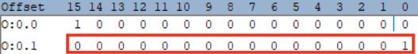

**O0:0,2** First 32 output bits as 2 sets of 16 Boolean values in logical order

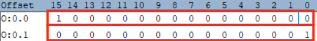

**O0:0/0** First output at offset 0 bit as Boolean value

**O0:0/15** Fifteenth output bit at offset 15 as Boolean value

**Datatype INPUT, Prefix I**

Default file number 1

Syntax: 0\<file number\>:\<element index\>\[/bit offset\]\[,array len\]

**I1:0** First 16 input bits as Boolean values in logical order, the bit at offset 0 becomes the first item in the
array.

**I1:0.1.** Second set of 16 input bites as 16 Boolean values in logical

**I1:0,2** First 32 input bits as 2 sets of 16 Boolean values in logical order

**I1:0/0**. First input bit at offset 0 as Boolean value

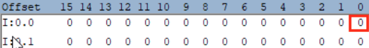

**O0:0/15** Fifteenth output at offset 15 bit as Boolean value

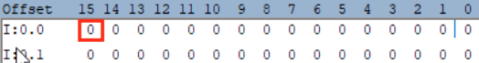

**Datatype BINARY, Prefix B**

Default file number 3

Syntax: B\<file number\>:\<element index\>\[/bit offset\]

**B3:0** First 16 binary bits as Boolean values in logical order, the bit shown below at offset 0 becomes the first item
in the array.

**B3:0.1** Second set of 16 binary bites as 16 Boolean values in logical

**B3:0/0.** First binary bit at offset as Boolean value

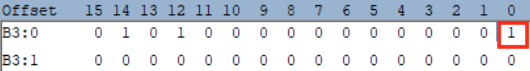

**B3:0/15** Fifteenth binary bit at offset 15 as Boolean value

**Datatype TIMER, Prefix T**

Default file number 4

Syntax: T\<file number\>:\<element index\>\[/bit offset\] for bit values

T\<file number\>:\<element index\>\[.value by name\] for named numeric values

**T4:0** Timer as a structure containing all elements

**T4:0.ACC** Timer numeric ACC value.

**T4:0.EN** Timer Boolean EN bit value

**Datatype COUNTER, Prefix C**

Default file number 5

Syntax: C\<file number\>:\<element index\>\[/bit offset\] for bit values

C\<file number\>:\<element index\>\[.value by name\] for named numeric values

**C5:0** Counter as a structure containing all elements

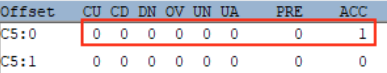

**C5:0.ACC Counter ACC numeric value**

**C5:0.ACC Counter CU bit value**

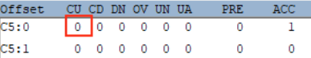

**Datatype CONTROL, Prefix R**

Default file number 6

Syntax: R\<file number\>:\<element index\>\[/bit offset\] for bit values

R\<file number\>:\<element index\>\[.value by name\] for named numeric values

**R6:0** Control as a structure containing all elements

**R6:0.POS Counter POS numeric value**

**R6:0.ACC Control EN bit value**

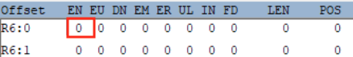

**Datatype INTEGER, Prefix N (16 bit)**

Default file number 7

Syntax: N\<file number\>:\<element index\>\[\<array len\>\]

**N7:0 First 16 bits integer value**

**N7:1 Second 16 bits integer value**

**N7:0,3 First 3 16 bits integer values**

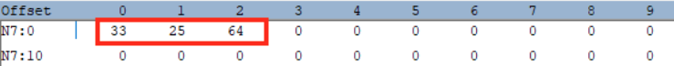

**Datatype FLOAT, Prefix F**

Syntax: F\<file number\>:\<element index\>\[\<array len\>\]

**F8:0 First float value**

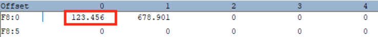

**F8:1 Second float value**

**F8:0,2 First 2 float value**

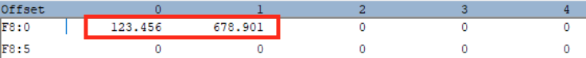

**Datatype STRING, Prefix ST**

Syntax: ST\<file number\>:\<element index\>

**ST9:0 First string value**

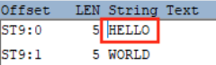

**ST9:1 Second string value**

**Datatype LONG, Prefix L (32 bit)**

Syntax: L\<file number\>:\<element index\>\[\<array len\>\]

**L10:0 First 32 bits integer value**

**L10:1 Second 32 bits integer value**

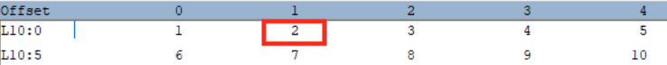

**L10:0,3 First 3 32 bits integer values**

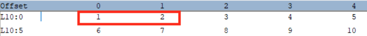

**Datatype ASCII, Prefix A**

Default file number 11

Syntax: A\<file number\>:\<element index\>\[/character offset\]

**A11:0 First character pair**

**A11:0 Second character pair**

**A11:0/0 First character of in first character pair**

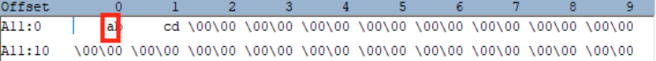

**A11:0/0 Second character of in seconds character pair**

[^top](#pccc-protocol-configuration)

## PcccSourceConfiguration

The PCCCSourceConfiguration extends the common Source configuration with PCCC specific source configuration data

<table>
<colgroup>
<col style="width: 19%" />
<col style="width: 25%" />
<col style="width: 32%" />
<col style="width: 22%" />
</colgroup>

<tbody>
<tr class="odd">
<td><strong>Name</strong></td>
<td><strong>Description</strong></td>
<td><strong>Type</strong></td>
<td><strong>Comments</strong></td>
</tr>

<tr class="even">
<td>Channels</td>
<td>
The channels configuration for a PCCC source holds configuration data to read values from fields on the source controller.

The element is a map indexed by the channel identifier.

Channels can be "commented" out by adding a "#" at the beginning of the identifier of that channel.
</td>
<td>Map[String,<a href="#pcccchannelconfiguration">PcccChannelConfiguration</a>]</td>
<td>At least 1 channel must be configured.</td>
</tr>

<tr class="odd">
<td>AdapterController</td>
<td>Server Identifier for the controller to read from. This referenced server must be present in the Controllers section of the adapter referred to by the ProtocolAdapter attribute of the source.</td>
<td>String</td>
<td>Must be an identifier of a server in the Controllers section of the PCCC adapter used by the source.</td>
</tr>

</tbody>
</table>

[^top](#pccc-protocol-configuration)

## PcccChannelConfiguration

The PcccChannelConfiguration extends the common Channel configuration with PCCC specific channel configuration data

<table>
<colgroup>
<col style="width: 15%" />
<col style="width: 19%" />
<col style="width: 22%" />
<col style="width: 43%" />
</colgroup>

<tbody>
<tr class="odd">
<td><strong>Name</strong></td>
<td><strong>Description</strong></td>
<td><strong>Type</strong></td>
<td><strong>Comments</strong></td>
</tr>

<tr class="even">
<td>Address</td>
<td>A string containing the address of the field to read from the controller.</td>
<td>String</td>
<td>For supported datatype and address syntax see <a href="#pccc-addressing">PCCC Addressing</a>.</td>
</tr>

</tbody>
</table>

[^top](#pccc-protocol-configuration)

## PcccAdapterConfiguration

The PcccAdapterConfiguration extends the common adapter configuration with PCCC specific adapter configuration settings. The AdapterType to use for this adapter is <strong>"PCCC"</strong>

<table>
<colgroup>
<col style="width: 14%" />
<col style="width: 19%" />
<col style="width: 27%" />
<col style="width: 39%" />
</colgroup>

<tbody>
<tr class="odd">
<td><strong>Name</strong></td>
<td><strong>Description</strong></td>
<td><strong>Type</strong></td>
<td><strong>Comments</strong></td>
</tr>

<tr class="even">
<td>Controllers</td>
<td>PLCs servers configured for this adapter. The PCCC source using the adapter must have a reference to one of these in its AdapterController attribute.</td>
<td>Map[String,<a href="#pccccontrollerconfiguration">PcccControllerConfiguration</a>]</td>
<td></td>
</tr>

</tbody>
</table>

[^top](#pccc-protocol-configuration)

## PcccControllerConfiguration

Configuration data for connecting to and reading from sources for controllers using PCCC

<table>
<colgroup>
<col style="width: 19%" />
<col style="width: 27%" />
<col style="width: 28%" />
<col style="width: 24%" />
</colgroup>

<tbody>
<tr class="odd">
<td><strong>Name</strong></td>
<td><strong>Description</strong></td>
<td><strong>Type</strong></td>
<td>Comments</td>
</tr>

<tr class="even">
<td>Address</td>
<td>IP Address of the controller</td>
<td>String</td>
<td>IP address in format aaa.bbb.ccc.ddd</td>
</tr>

<tr class="odd">
<td>Port</td>
<td>Port number</td>
<td>Integer</td>
<td>Default is 44818</td>
</tr>

<tr class="even">
<td>ConnectPath</td>
<td>Connect path for controller</td>
<td><a href="#pcccconnectpathconfiguration">PcccConnectPathConfiguration</a></td>
<td>Optional</td>
</tr>

<tr class="odd">
<td>ConnectTimeout</td>
<td>Timeout for connecting to the controller in milliseconds</td>
<td>Integer</td>
<td>Default is 10000</td>
</tr>

<tr class="even">
<td>ReadTimeout</td>
<td>Timeout for reading response packets from the controller in milliseconds</td>
<td>Integer</td>
<td>Default is 10000</td>
</tr>

<tr class="odd">
<td>WaitAfterConnectError</td>
<td>Time to wait before (re)connecting after a connection error in milliseconds</td>
<td>Integer</td>
<td>Default is 10000</td>
</tr>

<tr class="even">
<td>WaitAfterReadError</td>
<td>Time to wait before reading values from the controller after a read error in milliseconds</td>
<td>Integer</td>
<td>Default is 10000</td>
</tr>

<tr class="odd">
<td>WaitAfterWriteError</td>
<td>Time to wait after an error writing request packets to the controller in milliseconds</td>
<td>Integer</td>
<td>Default is 10000</td>
</tr>

<tr class="even">
<td>OptimizeReads</td>
<td>Optimized the reading of data from the controller by combining the reads for (near) adjacent fields in a single read request.</td>
<td>Boolean</td>
<td>
Default is true

Optimization reduces the calls made to the controller to read data. When troubleshooting optimization it can be disabled to find specific fields that make the (combined) reads to fail.
</td>
</tr>

<tr class="odd">
<td>MaxReadGap</td>
<td>When optimization is used this specified the max number of bytes between near adjacent fields that may be combined in a single read.</td>
<td>Integer</td>
<td>Default is 32</td>
</tr>

</tbody>
</table>

[^top](#pccc-protocol-configuration)

## PcccConnectPathConfiguration

Configuration connect path of a controller used for routing

<table>
<colgroup>
<col style="width: 19%" />
<col style="width: 27%" />
<col style="width: 28%" />
<col style="width: 24%" />

</colgroup>

<tbody>
<tr class="odd">
<td><strong>Name</strong></td>
<td><strong>Description</strong></td>
<td><strong>Type</strong></td>
<td>Comments</td>
</tr>

<tr class="even">
<td>Backplane</td>
<td>Backplane number</td>
<td>Integer</td>
<td>Default is 1</td>
</tr>

<tr class="odd">
<td>Slot</td>
<td>Slot number</td>
<td>Integer</td>
<td>Default is 0</td>
</tr>

</tbody>
</table>

[^top](#pccc-protocol-configuration)