SFC `IPC` setup in Greengrass V2
=======================================

### TOC
  - [Preconditions](#preconditions)
  - [Introduction](#introduction)
  - [Setup](#setup)
    - [Step 1: Preparing the Working Directories](#step-1-preparing-the-working-directories)
    - [Step 2: Downloading the SFC modules](#2step-downloading-the-sfc-modules)
    - [Step 3: Creating Greengrass recipes](#step-3-creating-greengrass-recipes)
    - [Step 4: Local Deployment](#step-4-local-deployment)
    - [Step 5: Testing the deployment](#step-5-testing-the-deployment)
    - [Step 6: Remove the local deployment](#step-6-remove-the-local-deployment)
    - [Step 7: Publish the components](#step-7-publish-the-components)
    - [Step 8: Deploy the components with AWS IoT Core web console on your device](#step-8-deploy-the-components-with-aws-iot-core-web-console-on-your-device)
  - [Removing Components from deployment and IOT Core](#removing-components-from-deployment-and-deleting-components)
    - [Remove SFC components from deployment](#remove-sfc-components-from-deployment)
    - [Delete SFC components from IOT Core](#delete-sfc-components-from-iot-core)

# Preconditions

1. We assume that your Greengrass environment is Linux based as we use bash scripts and the components recipes will target Linux as operating system. 

2. We assume that you have an embedded device or AWS Cloud9 environment already setup with the Greengrass-CLI similar to the chapter <a href="https://catalog.us-east-1.prod.workshops.aws/workshops/5ecc2416-f956-4273-b729-d0d30556013f/en-US/chapter3-greengrasssetup ">3.Greengrass environment </a> of the AWS IoT Greengrass V2 workshop.
3. You have a Greengrass environment and a token exchange role assigned to it.

4. Please make sure that your token exchange role has the following permissions:

```json
{
    "Version": "2012-10-17",
    "Statement": [
        {
            "Sid": "S3BucketActions",
            "Effect": "Allow",
            "Action": [
                "s3:CreateBucket",
                "s3:ListAllMyBuckets",
                "s3:GetBucketLocation",
                "s3:PutObject",
                "s3:GetObject"
            ],
            "Resource": [
                "arn:aws:s3:::*"
            ]
        },
        {
            "Effect": "Allow",
            "Action": [
                "iot:*"
            ],
            "Resource": "*"
        },
        {
            "Sid": "GreengrassActions",
            "Effect": "Allow",
            "Action": [
                "greengrass:*"
            ],
            "Resource": "*"
        }
    ]
}

```
>Note! <br> This permission set is too open for production and should be reduced. It is used here only for simplicity!

5. Furthermore we assume you have the ability to run the following docker container for testing the setup in your Greengrass environment:

```sh
docker run -d -p 4840:4840 ghcr.io/umati/sample-server:main
```

# Introduction

This setup will demonstrate how to integrate SFC into Greengrass V2. After following the steps you will have a docker container with OPCUA server running. The SFC setup will poll the values from this OPCUA server and write those into a logfile, AWS S3 and AWS IOT MQTT channel.

First we create for each SFC module a local component and deploy it locally from within Greengrass. After testing we upload the Greengrass components to AWS S3 and register the components in AWS Iot Core and deploy them remotely with AWS Iot Core web console.

The complete setup will create components for the SFC modules:
- sfc-main
- debug-target
- aws-s3-target
- aws-iot-mqtt-target
- opcua

**The setup will configure all modules to be started in SFC's [`IPC mode`](../../docs#in-process-and-ipc-deployment-models)**. That means that all SFC modules run outside the sfc-main process on a single host.

>Note! <br>
If you have previously installed the modules in SFC's in -process mode you must remove first the components from IOT CORE and from your Greengrass deployment! 


# Setup

## Step 1: Preparing the working directories
Log into the Greengrass environment and switch to your home directory 
and create the working folders with the following command:

```bash
mkdir -p ~/environment/GreengrassSFC/artifacts/com.amazon.sfc.{sfc-main,opcua,aws-s3-target,aws-iot-mqtt-target,debug-target}/1.0.0

mkdir -p ~/environment/GreengrassSFC/recipes
```
You should now see the following directory structure:

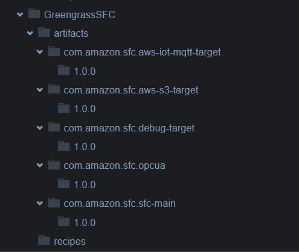

## 2.Step: Downloading the SFC modules
Download the sfc modules and store them into the artifacts folder with the following command:
  
```bash
PATH_TO_REPOSITORY=https://dyy8lqvmsyeqk.cloudfront.net/55b40a6/modules

curl $PATH_TO_REPOSITORY/sfc-main.tar.gz -o ~/environment/GreengrassSFC/artifacts/com.amazon.sfc.sfc-main/1.0.0/sfc-main.tar.gz

curl $PATH_TO_REPOSITORY/debug-target.tar.gz -o ~/environment/GreengrassSFC/artifacts/com.amazon.sfc.debug-target/1.0.0/debug-target.tar.gz

curl $PATH_TO_REPOSITORY/aws-iot-mqtt-target.tar.gz -o ~/environment/GreengrassSFC/artifacts/com.amazon.sfc.aws-iot-mqtt-target/1.0.0/aws-iot-mqtt-target.tar.gz

curl $PATH_TO_REPOSITORY/aws-s3-target.tar.gz -o ~/environment/GreengrassSFC/artifacts/com.amazon.sfc.aws-s3-target/1.0.0/aws-s3-target.tar.gz

curl $PATH_TO_REPOSITORY/opcua.tar.gz -o ~/environment/GreengrassSFC/artifacts/com.amazon.sfc.opcua/1.0.0/opcua.tar.gz
```

You should see now the following directory structure:

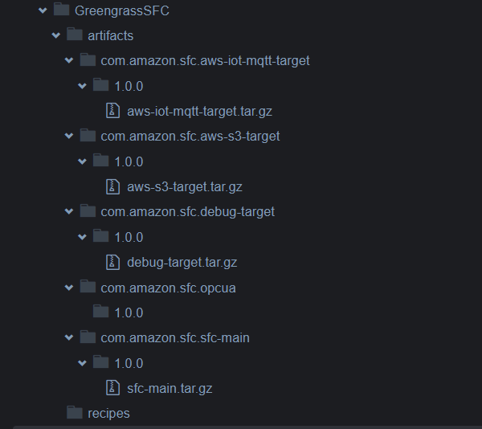


## Step 3: Creating Greengrass recipes 
Now we create the recipes for the sfc modules. Execute the following command:

```sh
touch ~/environment/GreengrassSFC/recipes/com.amazon.sfc.{sfc-main,debug-target,opcua,aws-iot-mqtt-target,aws-s3-target}-1.0.0.json
```

You should see now the following directory structure:

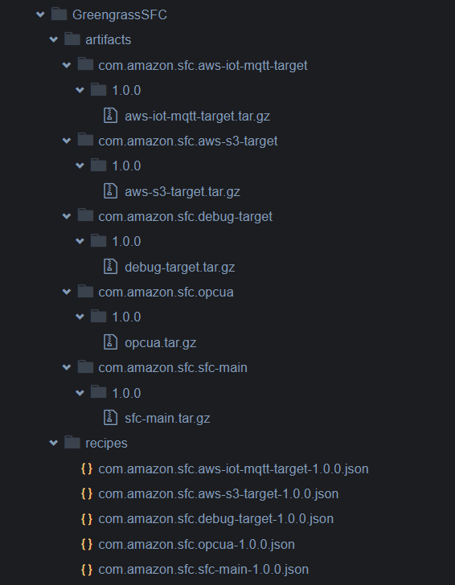


Now copy the following content into the file **~/environment/GreengrassSFC/recipes/com.amazon.sfc.aws-iot-mqtt-target-1.0.0.json**:

```json
{
   "RecipeFormatVersion": "2020-01-25",
   "ComponentName": "com.amazon.sfc.aws-iot-mqtt-target",
   "ComponentVersion": "1.0.0",
   "ComponentDescription": "SFC-com.amazon.sfc.aws-iot-mqtt-target adapter component",
   "ComponentPublisher": "Amazon",
   "ComponentConfiguration": {
      "DefaultConfiguration": {
         "ipc_mode": "true",
         "ipc_port": "50004"
         }
   },
   "Manifests": [
      {
         "Platform": {
            "os": "linux"
         },
         "Lifecycle": {
             
            "Install": {
                "RequiresPrivilege": true,
                "Script": "cd {artifacts:path} && tar -xvf aws-iot-mqtt-target.tar.gz"
            }, 
            "Run": {
                "RequiresPrivilege": true,
                "Script": "if $IPC_MODE; then {artifacts:path}/aws-iot-mqtt-target/bin/aws-iot-mqtt-target -port {configuration:/ipc_port}; fi",
                "Setenv": {
                    "IPC_MODE": "{configuration:/ipc_mode}"
                }
            }
         },
         "Artifacts":[
            {
               "URI": "s3://[REPLACE WITH YOUR S3 BUCKET]/artifacts/com.amazon.sfc.aws-iot-mqtt-target/1.0.0/aws-iot-mqtt-target.tar.gz"
            }
            
         ]
      }
   ]
}

``` 

>Note! <br> Replace the placeholder ***[REPLACE WITH YOUR S3 BUCKET]*** with an S3 bucket name where you want later to store your Greengrass components artifacts and recepies! 


Now copy the following content into the file **~/environment/GreengrassSFC/recipes/com.amazon.sfc.aws-s3-target-1.0.0.json**:
```json
{
   "RecipeFormatVersion": "2020-01-25",
   "ComponentName": "com.amazon.sfc.aws-s3-target",
   "ComponentVersion": "1.0.0",
   "ComponentDescription": "SFC aws-s3-target component",
   "ComponentPublisher": "Amazon",
   "ComponentConfiguration": {
      "DefaultConfiguration": {
         "ipc_mode": "true",
         "ipc_port": "50003"
         }
   },
   "Manifests": [
      {
         "Platform": {
            "os": "linux"
         },
         "Lifecycle": {
             
            "Install": {
                "RequiresPrivilege": true,
                "Script": "cd {artifacts:path} && tar -xvf aws-s3-target.tar.gz"
            }, 
            "Run": {
                "RequiresPrivilege": true,
                "Script": "if $IPC_MODE; then {artifacts:path}/aws-s3-target/bin/aws-s3-target -port {configuration:/ipc_port}; fi",
                "Setenv": {
                    "IPC_MODE": "{configuration:/ipc_mode}"
                }
            }
         },
         "Artifacts":[
            {
               "URI": "s3://[REPLACE WITH YOUR S3 BUCKET]/artifacts/com.amazon.sfc.aws-s3-target/1.0.0/aws-s3-target.tar.gz"
            }
            
         ]
      }
   ]
}

```

>Note! <br> Replace the placeholder ***[REPLACE WITH YOUR S3 BUCKET]*** with an S3 bucket name where you want later to store your Greengrass components artifacts and recepies! 

Now copy the following content into the file **~/environment/GreengrassSFC/recipes/com.amazon.sfc.debug-target-1.0.0.json**:
```json
{
   "RecipeFormatVersion": "2020-01-25",
   "ComponentName": "com.amazon.sfc.debug-target",
   "ComponentVersion": "1.0.0",
   "ComponentDescription": "SFC debug target component",
   "ComponentPublisher": "Amazon",
   "ComponentConfiguration": {
      "DefaultConfiguration": {
         "ipc_mode": "true",
         "ipc_port": "50001"
         }
   },
   "Manifests": [
      {
         "Platform": {
            "os": "linux"
         },
         "Lifecycle": {
             
            "Install": {
                "RequiresPrivilege": true,
                "Script": "cd {artifacts:path} && tar -xvf debug-target.tar.gz"
            }, 
            "Run": {
                "RequiresPrivilege": true,
                "Script": "if $IPC_MODE; then {artifacts:path}/debug-target/bin/debug-target -port {configuration:/ipc_port}; fi",
                "Setenv": {
                    "IPC_MODE": "{configuration:/ipc_mode}"
                }
            }
         },
         "Artifacts":[
            {
               "URI": "s3://[REPLACE WITH YOUR S3 BUCKET]/artifacts/com.amazon.sfc.debug-target/1.0.0/debug-target.tar.gz"
            }
            
         ]
      }
   ]
}

```
>Note! <br> Replace the placeholder ***[REPLACE WITH YOUR S3 BUCKET]*** with an S3 bucket name where you want later to store your Greengrass components artifacts and recepies! 

Now copy the following content into the file **~/environment/GreengrassSFC/recipes/com.amazon.sfc.opcua-1.0.0.json**:
```json
{
   "RecipeFormatVersion": "2020-01-25",
   "ComponentName": "com.amazon.sfc.opcua",
   "ComponentVersion": "1.0.0",
   "ComponentDescription": "SFC-OPCUA adapter component",
   "ComponentPublisher": "Amazon",
   "ComponentConfiguration": {
      "DefaultConfiguration": {
         "ipc_mode": "true",
         "ipc_port": "50002"
         }
   },
   "Manifests": [
      {
         "Platform": {
            "os": "linux"
         },
         "Lifecycle": {
             
            "Install": {
                "RequiresPrivilege": true,
                "Script": "cd {artifacts:path} && tar -xvf opcua.tar.gz"
            }, 
            "Run": {
                "RequiresPrivilege": true,
                "Script": "if $IPC_MODE; then {artifacts:path}/opcua/bin/opcua -port {configuration:/ipc_port}; fi",
                "Setenv": {
                    "IPC_MODE": "{configuration:/ipc_mode}"
                }
            }
         },
         "Artifacts":[
            {
               "URI": "s3://[REPLACE WITH YOUR S3 BUCKET]/artifacts/com.amazon.sfc.opcua/1.0.0/opcua.tar.gz"
            }
            
         ]
      }
   ]
}

```
>Note! <br> Replace the placeholder ***[REPLACE WITH YOUR S3 BUCKET]*** with an S3 bucket name where you want later to store your Greengrass components artifacts and recepies! 

Now copy the following content into the file **~/environment/GreengrassSFC/recipes/com.amazon.sfc.sfc-main-1.0.0.json**:

```json
{
   "RecipeFormatVersion": "2020-01-25",
   "ComponentName": "com.amazon.sfc.sfc-main",
   "ComponentVersion": "1.0.0",
   "ComponentDescription": "SFC-Core component",
   "ComponentPublisher": "Amazon",
   "ComponentDependencies": {
    "com.amazon.sfc.opcua": {
      "VersionRequirement": "^1.0.0",
      "DependencyType": "HARD"
    },
    "com.amazon.sfc.debug-target": {
      "VersionRequirement": "^1.0.0",
      "DependencyType": "HARD"
    },
    "com.amazon.sfc.aws-s3-target": {
      "VersionRequirement": "^1.0.0",
      "DependencyType": "HARD"
    },
    "com.amazon.sfc.aws-iot-mqtt-target": {
      "VersionRequirement": "^1.0.0",
      "DependencyType": "HARD"
    }
  },
   "ComponentConfiguration": {
      "DefaultConfiguration": {
         "SFC_CONFIG_JSON": {
              "AWSVersion": "2022-04-02",
              "Name": "OPCUA to S3, using in process source and targets",
              "Version": 1,
              "LogLevel": "Info",
              "ElementNames": {
                "Value": "value",
                "Timestamp": "timestamp",
                "Metadata": "metadata"
              },
              "Schedules": [
                {
                  "Name": "OpcuaToS3",
                  "Interval": 50,
                  "Description": "Read data of all OPCUA data types once per second and send to S3",
                  "Active": true,
                  "TimestampLevel": "Both",
                  "Sources": {
                    "OPCUA-SOURCE": [
                      "*"
                    ]
                  },
                  "Targets": [
                    "DebugTarget",
                    "S3Target",
                    "IOTCore"
                  ]
                }
              ],
              "Sources": {
                "OPCUA-SOURCE": {
                  "Name": "OPCUA-SOURCE",
                  "ProtocolAdapter": "OPC-UA",
                  "AdapterOpcuaServer": "OPCUA-SERVER-1",
                  "Description": "OPCUA local test server",
                  "SourceReadingMode": "Polling",
                  "SubscribePublishingInterval": 100,
                  "Channels": {
                    "ServerStatus": {
                      "Name": "ServerStatus",
                      "NodeId": "ns=0;i=2256"
                    },
                    "ServerTime": {
                      "Name": "ServerTime",
                      "NodeId": "ns=0;i=2256",
                      "Selector": "@.currentTime"
                    },
                    "State": {
                      "Name": "State",
                      "NodeId": "ns=0;i=2259"
                    },
                    "Machine1AbsoluteErrorTime": {
                      "Name": "AbsoluteErrorTime",
                      "NodeId": "ns=21;i=59048"
                    },
                    "Machine1AbsoluteLength": {
                      "Name": "AbsoluteLength",
                      "NodeId": "ns=21;i=59066"
                    },
                    "Machine1AbsoluteMachineOffTime": {
                      "Name": "AbsoluteMachineOffTime",
                      "NodeId": "ns=21;i=59041"
                    },
                    "Machine1AbsoluteMachineOnTime": {
                      "Name": "AbsoluteMachineOnTime",
                      "NodeId": "ns=21;i=59050"
                    },
                    "Machine1AbsolutePiecesIn": {
                      "Name": "AbsolutePiecesIn",
                      "NodeId": "ns=21;i=59068"
                    },
                    "Machine1FeedSpeed": {
                      "Name": "FeedSpeed",
                      "NodeId": "ns=21;i=59039"
                    }
                  }
                }
              },
              "Targets": {
                
                  "DebugTarget": {
                    "Active": true,
                    "TargetType": "DEBUG-TARGET",
                    "TargetServer":"DebugTargetServer"
                  },
                  "S3Target": {
                    "Active": true,
                    "TargetType": "AWS-S3",
                    "TargetServer":"S3TargetServer",
                    
                    "Region": "[AWS BUCKET REGION]",
                    "BucketName":"[REPLACE WITH YOUR S3 BUCKET FOR OPCUA DATA]",
                    "CredentialProviderClient" :"AwsIotClient",
                    
                    "Interval": 10,
                    "BufferSize": 1,
                    "Prefix": "sfc",
                    "Compression": "NONE"
                    
                  },
                  "IOTCore": {
                    "Active": true,
                    "TargetType": "AWS-IOT-MQTT",
                    "TargetServer":"IOT-MQTT-TargetServer",
                    
                    "Region": "[IOT CORE REGION]",
                    "TopicName":"sfc-greengrass",
                    "Endpoint":"[AWS IOT DATA ENDPOINT]",
                
                    "Certificate": "/greengrass/v2/thingCert.crt",
                    "Key": "/greengrass/v2/privKey.key",
                    "RootCA": "/greengrass/v2/rootCA.pem"
                  }
                
              },
              "TargetServers":{
                
                  "DebugTargetServer":{
                    "Address": "localhost",
                    "Port":"50001"
                  },
                  "S3TargetServer":{
                    "Address": "localhost",
                    "Port":"50003"
                  },
                  "IOT-MQTT-TargetServer":{
                    "Address": "localhost",
                    "Port":"50004"
                  }
      
              },
              "AdapterServers":{
                "OPCUA":{
                  "Address": "localhost",
                  "Port":"50002"
                }
              },
              "ProtocolAdapters": {
                "OPC-UA": {
                  "AdapterType": "OPCUA",
                  "AdapterServer": "OPCUA",
                  "OpcuaServers": {
                    "OPCUA-SERVER-1": {
                      "Address": "opc.tcp://localhost",
                      "Path": "/",
                      "Port": 4840,
                      "ConnectTimeout": "10000",
                      "ReadBatchSize": 500
                    }
                  }
                }
              },
              
              "AwsIotCredentialProviderClients": {
                "AwsIotClient": {
                  "#ThingName": "[IOT Thing Name]",
                  "#IotCredentialEndpoint": "[IOT CREDENTIAL ENDPOINT]",
                  "RoleAlias": "GreengrassV2TokenExchangeRoleAlias",
                  "#Certificate": "/greengrass/v2/thingCert.crt",
                  "#PrivateKey": "/greengrass/v2/privKey.key",
                  "#RootCA": "/greengrass/v2/rootCA.pem",
                  "SkipCredentialsExpiryCheck": false,
                  "GreenGrassDeploymentPath": "/greengrass/v2"
                }
              }
            }
         }
   },
   "Manifests": [
      {
         "Platform": {
            "os": "linux"
         },
         "Lifecycle": {
             
            "Install": {
                "RequiresPrivilege": true,
                "Script": "cd {artifacts:path} && tar -xvf sfc-main.tar.gz"
            }, 
            "Run": {
                "RequiresPrivilege": true,
                "Script": "printf '{configuration:/SFC_CONFIG_JSON}' > {artifacts:path}/conf.json && {artifacts:path}/sfc-main/bin/sfc-main -config {artifacts:path}/conf.json",
                "Setenv": {
                    "SFC_DEPLOYMENT_DIR": "{artifacts:path}"
                }
            }
         },
         "Artifacts":[
            {
               "URI": "s3://[REPLACE WITH YOUR S3 BUCKET]/artifacts/com.amazon.sfc.sfc-main/1.0.0/sfc-main.tar.gz"
            }
            
         ]
      }
   ]
}


```
>Note! <br>
 1. Make sure that after copying the script into the file that the line with the **"Script": "printf '{configuration:/SFC_CONFIG_JSON}' > {artifacts:path}/conf.json && {artifacts:path}/sfc-main/bin/sfc-main -config {artifacts:path}/conf.json""** has the ticks (') and not the less than character (**<**) as some markup viewer replace the (**'**) with (**<**).  
 2. Replace the placeholder ***[REPLACE WITH YOUR S3 BUCKET]*** with an S3 bucket name where you want later to store your Greengrass components artifacts and recepies!
 
 3. Replace the placeholder ***[REPLACE WITH YOUR S3 BUCKET FOR OPCUA DATA]*** with an S3 bucket name and ***[AWS BUCKET REGION]*** with the AWS region where you want to store the data collected from the OPCUA server!

 4. Replace the ***[AWS IOT CORE REGION]*** with the AWS region where you are connecting your Greengrass environment.

 5. Replace ***[AWS IOT DATA ENDPOINT]*** with the value you get with the following command:
 ```
 aws iot describe-endpoint --region [YOUR AWS REGION] --endpoint-type iot:Data-ATS --output text
 ```
Alternatively you can find the device data endpoint name in the AWS IOT Core web console under ***Settings*** (choose the right region!)

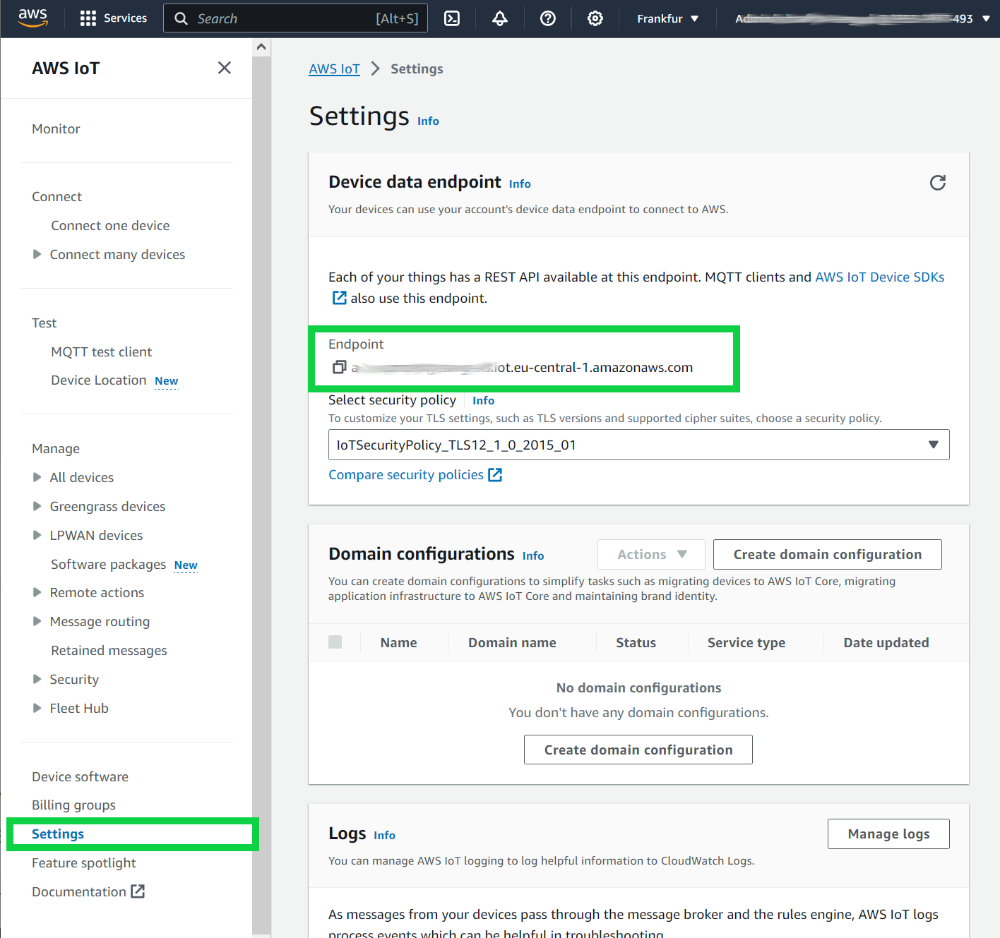


>Notice: <br>
Please pay attention to the section ComponentDependencies in the JSON document. There we define which components are needed for com.amazon.sfc.sfc-main to be able to run. It is important to remember to add dependencies when you want to use other SFC modules in future!

## Step 4: Local Deployment
 Here we deploy locally and start the `com.amazon.sfc.sfc-main` component. As we have defined the other modules as dependencies Greengrass will automatically try to deploy them.


To deploy the component use the following command:
```bash
sudo /greengrass/v2/bin/greengrass-cli deployment create \
--recipeDir ~/environment/GreengrassSFC/recipes \
--artifactDir ~/environment/GreengrassSFC/artifacts \
--merge "com.amazon.sfc.sfc-main=1.0.0"
```

Check if the deployment worked by using the following command:

```bash
 sudo /greengrass/v2/bin/greengrass-cli component list
``` 


You should see all the following lines:

```sh
Component Name: com.amazon.sfc.debug-target
    Version: 1.0.0
    State: RUNNING
    Configuration: {"ipc_mode":"true","ipc_port":"50001"}
Component Name: com.amazon.sfc.aws-s3-target
    Version: 1.0.0
    State: RUNNING
    Configuration: {"ipc_mode":"true","ipc_port":"50003"}
Component Name: com.amazon.sfc.opcua
    Version: 1.0.0
    State: RUNNING
    Configuration: {"ipc_mode":"true","ipc_port":"50002"}
Component Name: com.amazon.sfc.aws-iot-mqtt-target
    Version: 1.0.0
    State: RUNNING
    Configuration: {"ipc_mode":"true","ipc_port":"50004"}
Component Name: com.amazon.sfc.sfc-main
    Version: 1.0.0
    State: RUNNING
    Configuration: {"SFC_CONFIG_JSON":{"AdapterTypes":{"OPCUA": ....
```

>Notice: <br>
Because we use [`in process model`](../../docs#in-process-and-ipc-deployment-models) the components on which sfc-main depends only unpack the the modules during deployment and do not start a process. So they report State: *Finished*. <br>
The component sfc-main is the only component which actually start a process and keeps running.

>Note! <br>
If you do not find this lines then you have to analyze the log files which can be found in directory **/greengrass/v2/logs**.

>Note! <br>
You can remove the deployment the component with the following command:

```bash
sudo /greengrass/v2/bin/greengrass-cli deployment create --remove "com.amazon.sfc.sfc-main"
```

>Note! <br>
If you had not started the OPCUA test docker container before deploying the sfc-main component you will see in the **/greengrass/v2/logs/com.amazon.sfc.sfc-main.log** the following error code which you can ignore: <br>
*ERROR - Error creating client for for source "OPCUA-SOURCE" at  opc.tcp://localhost:4840//, Connection refused: localhost/127.0.0.1:4840*. 


## Step 5: Testing the deployment
To test the deployment we have to start the docker container with the test OPCUA server. Do do this use the following command:

```bash
docker run -d -p 4840:4840 ghcr.io/umati/sample-server:main

```

After starting the docker container with the test OPCUA server use the following command to look into the traces of the **com.amazon.sfc.debug-target** component to see the values read from OPCUA server:

```bash
sudo su
cd /greengrass/v2/logs
more  com.amazon.sfc.debug-target.log | grep -e Absolute* -e FeedSpeed    -A3
``` 

you should see the similar lines written by the debug-target module:

```bash
023-10-30T19:26:38.219Z [INFO] (Copier) com.amazon.sfc.debug-target: stdout. "AbsoluteErrorTime": {. {scriptName=services.com.amazon.sfc.debug-target.lifecycle.Run.Script, serviceName=com.amazon.sfc.debug-target, currentState=RUNNING}
2023-10-30T19:26:38.219Z [INFO] (Copier) com.amazon.sfc.debug-target: stdout. "value": 315335,. {scriptName=services.com.amazon.sfc.debug-target.lifecycle.Run.Script, serviceName=com.amazon.sfc.debug-target, currentState=RUNNING}
2023-10-30T19:26:38.219Z [INFO] (Copier) com.amazon.sfc.debug-target: stdout. "timestamp": "2023-10-30T19:26:38.216859223Z". {scriptName=services.com.amazon.sfc.debug-target.lifecycle.Run.Script, serviceName=com.amazon.sfc.debug-target, currentState=RUNNING}
2023-10-30T19:26:38.219Z [INFO] (Copier) com.amazon.sfc.debug-target: stdout. },. {scriptName=services.com.amazon.sfc.debug-target.lifecycle.Run.Script, serviceName=com.amazon.sfc.debug-target, currentState=RUNNING}
2023-10-30T19:26:38.219Z [INFO] (Copier) com.amazon.sfc.debug-target: stdout. "AbsoluteLength": {. {scriptName=services.com.amazon.sfc.debug-target.lifecycle.Run.Script, serviceName=com.amazon.sfc.debug-target, currentState=RUNNING}
2023-10-30T19:26:38.219Z [INFO] (Copier) com.amazon.sfc.debug-target: stdout. "value": 32706,. {scriptName=services.com.amazon.sfc.debug-target.lifecycle.Run.Script, serviceName=com.amazon.sfc.debug-target, currentState=RUNNING}
2023-10-30T19:26:38.219Z [INFO] (Copier) com.amazon.sfc.debug-target: stdout. "timestamp": "2023-10-30T19:26:38.216859223Z". {scriptName=services.com.amazon.sfc.debug-target.lifecycle.Run.Script, serviceName=com.amazon.sfc.debug-target, currentState=RUNNING}
2023-10-30T19:26:38.219Z [INFO] (Copier) com.amazon.sfc.debug-target: stdout. },. {scriptName=services.com.amazon.sfc.debug-target.lifecycle.Run.Script, serviceName=com.amazon.sfc.debug-target, currentState=RUNNING}
2023-10-30T19:26:38.219Z [INFO] (Copier) com.amazon.sfc.debug-target: stdout. "AbsoluteMachineOffTime": {. {scriptName=services.com.amazon.sfc.debug-target.lifecycle.Run.Script, serviceName=com.amazon.sfc.debug-target, currentState=RUNNING}
2023-10-30T19:26:38.219Z [INFO] (Copier) com.amazon.sfc.debug-target: stdout. "value": 53138,. {scriptName=services.com.amazon.sfc.debug-target.lifecycle.Run.Script, serviceName=com.amazon.sfc.debug-target, currentState=RUNNING}
2023-10-30T19:26:38.219Z [INFO] (Copier) com.amazon.sfc.debug-target: stdout. "timestamp": "2023-10-30T19:26:38.216859223Z". {scriptName=services.com.amazon.sfc.debug-target.lifecycle.Run.Script, serviceName=com.amazon.sfc.debug-target, currentState=RUNNING}
2023-10-30T19:26:38.219Z [INFO] (Copier) com.amazon.sfc.debug-target: stdout. },. {scriptName=services.com.amazon.sfc.debug-target.lifecycle.Run.Script, serviceName=com.amazon.sfc.debug-target, currentState=RUNNING}
2023-10-30T19:26:38.219Z [INFO] (Copier) com.amazon.sfc.debug-target: stdout. "AbsoluteMachineOnTime": {. {scriptName=services.com.amazon.sfc.debug-target.lifecycle.Run.Script, serviceName=com.amazon.sfc.debug-target, currentState=RUNNING}
2023-10-30T19:26:38.219Z [INFO] (Copier) com.amazon.sfc.debug-target: stdout. "value": 54826,. {scriptName=services.com.amazon.sfc.debug-target.lifecycle.Run.Script, serviceName=com.amazon.sfc.debug-target, currentState=RUNNING}
2023-10-30T19:26:38.219Z [INFO] (Copier) com.amazon.sfc.debug-target: stdout. "timestamp": "2023-10-30T19:26:38.216859223Z". {scriptName=services.com.amazon.sfc.debug-target.lifecycle.Run.Script, serviceName=com.amazon.sfc.debug-target, currentState=RUNNING}
2023-10-30T19:26:38.219Z [INFO] (Copier) com.amazon.sfc.debug-target: stdout. },. {scriptName=services.com.amazon.sfc.debug-target.lifecycle.Run.Script, serviceName=com.amazon.sfc.debug-target, currentState=RUNNING}
2023-10-30T19:26:38.219Z [INFO] (Copier) com.amazon.sfc.debug-target: stdout. "AbsolutePiecesIn": {. {scriptName=services.com.amazon.sfc.debug-target.lifecycle.Run.Script, serviceName=com.amazon.sfc.debug-target, currentState=RUNNING}
2023-10-30T19:26:38.219Z [INFO] (Copier) com.amazon.sfc.debug-target: stdout. "value": 7543,. {scriptName=services.com.amazon.sfc.debug-target.lifecycle.Run.Script, serviceName=com.amazon.sfc.debug-target, currentState=RUNNING}
2023-10-30T19:26:38.219Z [INFO] (Copier) com.amazon.sfc.debug-target: stdout. "timestamp": "2023-10-30T19:26:38.216859223Z". {scriptName=services.com.amazon.sfc.debug-target.lifecycle.Run.Script, serviceName=com.amazon.sfc.debug-target, currentState=RUNNING}
2023-10-30T19:26:38.219Z [INFO] (Copier) com.amazon.sfc.debug-target: stdout. },. {scriptName=services.com.amazon.sfc.debug-target.lifecycle.Run.Script, serviceName=com.amazon.sfc.debug-target, currentState=RUNNING}
2023-10-30T19:26:38.219Z [INFO] (Copier) com.amazon.sfc.debug-target: stdout. "FeedSpeed": {. {scriptName=services.com.amazon.sfc.debug-target.lifecycle.Run.Script, serviceName=com.amazon.sfc.debug-target, currentState=RUNNING}
2023-10-30T19:26:38.219Z [INFO] (Copier) com.amazon.sfc.debug-target: stdout. "value": 250.0,. {scriptName=services.com.amazon.sfc.debug-target.lifecycle.Run.Script, serviceName=com.amazon.sfc.debug-target, currentState=RUNNING}
2023-10-30T19:26:38.219Z [INFO] (Copier) com.amazon.sfc.debug-target: stdout. "timestamp": "2023-10-30T19:26:38.216859223Z". {scriptName=services.com.amazon.sfc.debug-target.lifecycle.Run.Script, serviceName=com.amazon.sfc.debug-target, currentState=RUNNING}
2023-10-30T19:26:38.219Z [INFO] (Copier) com.amazon.sfc.debug-target: stdout. },. {scriptName=services.com.amazon.sfc.debug-target.lifecycle.Run.Script, serviceName=com.amazon.sfc.debug-target, currentState=RUNNING}
```

- Now we want to see if the data is written also to the S3 bucket. <br>For that open the AWS S3 web console and look into the S3 bucket with the name you entered for ***[REPLACE WITH YOUR S3 BUCKET FOR OPCUA DATA]*** in the **com.amazon.sfc.sfc-main-1.0.0.json** file.<br>
There you should see the folder with the name **sfc**. In this folder the data is written by the **aws-s3-target** module.

- Now we check if the data is also written to IOT Core MQTT topic: **sfc-greengrass**. <br>
For that open the **IOT Core web console** and select **MQTT test client**.

- Then enter into the topic filter sfc-greengrass and select **Subscribe**.

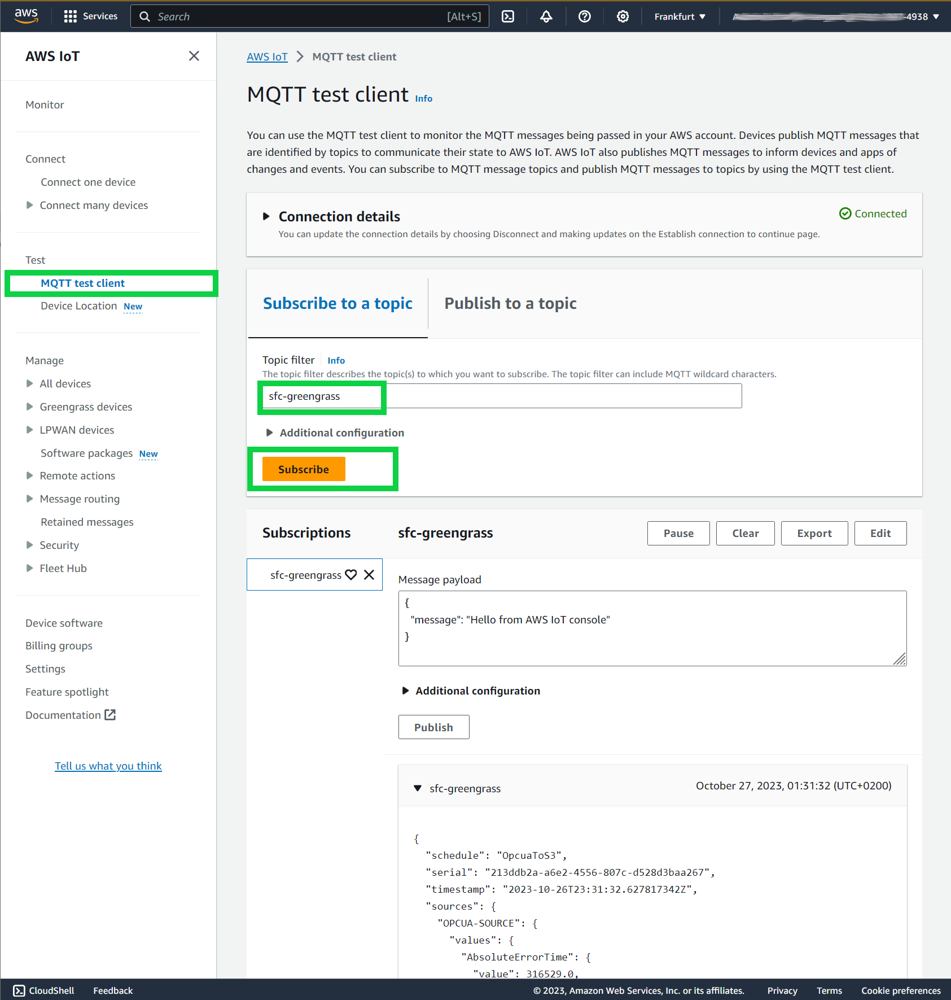

You should be able to see messages beeing received.

## Step 6: Remove the local deployment
After successful testing we remove the deployment which was done locally with the following command:

```bash
sudo /greengrass/v2/bin/greengrass-cli deployment create --remove "com.amazon.sfc.sfc-main"
```


## Step 7: Publish the components
To publish these these components make one more time sure that you have replaced the ***[REPLACE WITH YOUR S3 BUCKET]*** placeholder with the S3 bucket where you want to upload the components in all recipes!

Upload all artifacts and recipies to S3 with the following command:

```bash
aws s3 cp --recursive  ~/environment/GreengrassSFC s3://[REPLACE WITH YOUR S3 BUCKET]
```

First we switch to the recipes folder with the command:

```sh
cd ~/environment/GreengrassSFC/recipes
```
Then we set the AWS_DEFAULT_Region variable:

```sh
AWS_DEFAULT_REGION=[REPLACE WITH YOUR IOT AWS REGION]
``` 

Now we register all components with the following commands:

```bash
aws greengrassv2 create-component-version  --inline-recipe fileb://com.amazon.sfc.sfc-main-1.0.0.json --region $AWS_DEFAULT_REGION

aws greengrassv2 create-component-version  --inline-recipe fileb://com.amazon.sfc.debug-target-1.0.0.json --region $AWS_DEFAULT_REGION

aws greengrassv2 create-component-version  --inline-recipe fileb://com.amazon.sfc.aws-s3-target-1.0.0.json --region $AWS_DEFAULT_REGION

aws greengrassv2 create-component-version  --inline-recipe fileb://com.amazon.sfc.aws-iot-mqtt-target-1.0.0.json --region $AWS_DEFAULT_REGION

aws greengrassv2 create-component-version  --inline-recipe fileb://com.amazon.sfc.opcua-1.0.0.json --region $AWS_DEFAULT_REGION
```

You should see for each component a similar output as in:

```json
{
    "arn": "arn:aws:greengrass:eu-central-1:xxxxx:components:com.amazon.sfc.sfc-main:versions:1.0.0",
    "componentName": "com.amazon.sfc.sfc-maint",
    "componentVersion": "1.0.0",
    "creationTimestamp": "2023-10-27T09:46:02.349000+00:00",
    "status": {
        "componentState": "REQUESTED",
        "message": "NONE",
        "errors": {},
        "vendorGuidance": "ACTIVE",
        "vendorGuidanceMessage": "NONE"
    }
}
```
You also should see in the AWS IoT Core web console under **Manage/Greengrass devices/Components** all components under the tab **"My Components"**:

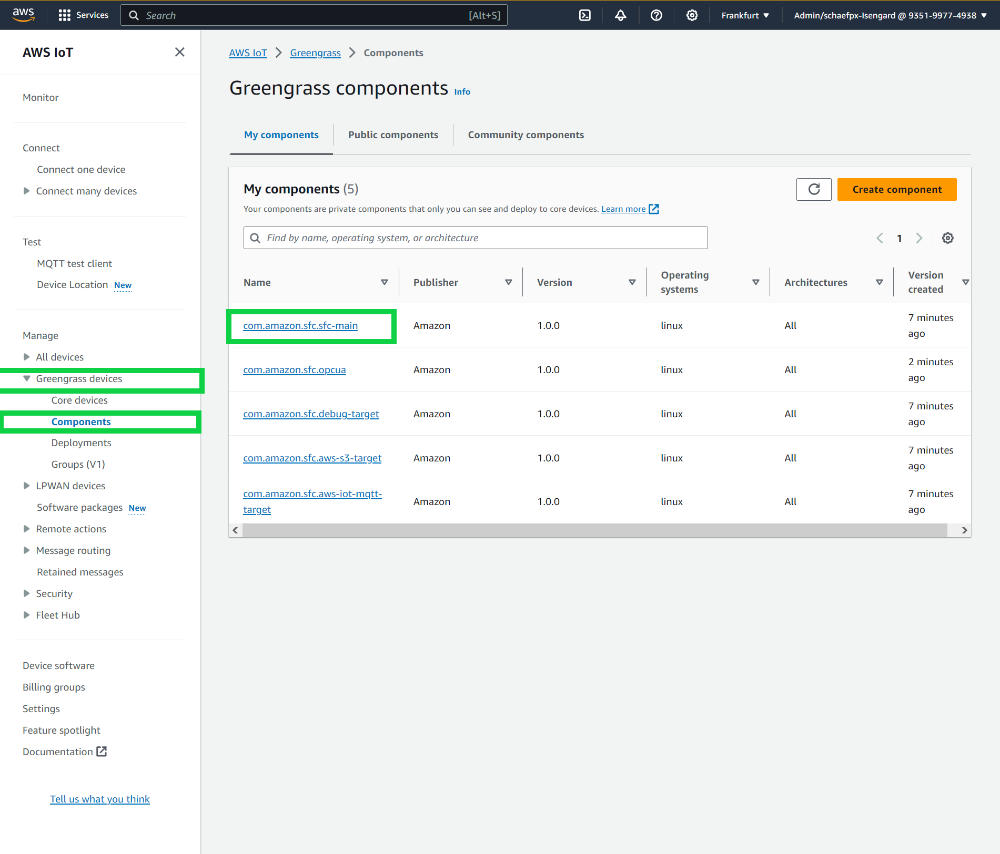

 

## Step 8: Deploy the components with AWS IoT Core web console to your device

Now we can deploy remotely the components from AWS IoT Core console. To do so, follow the following steps:  
1. Go to the AWS IoT Core web console and select **Greengrass devices** then select **Deployments** then check the box before your deployment then select **Revise** 

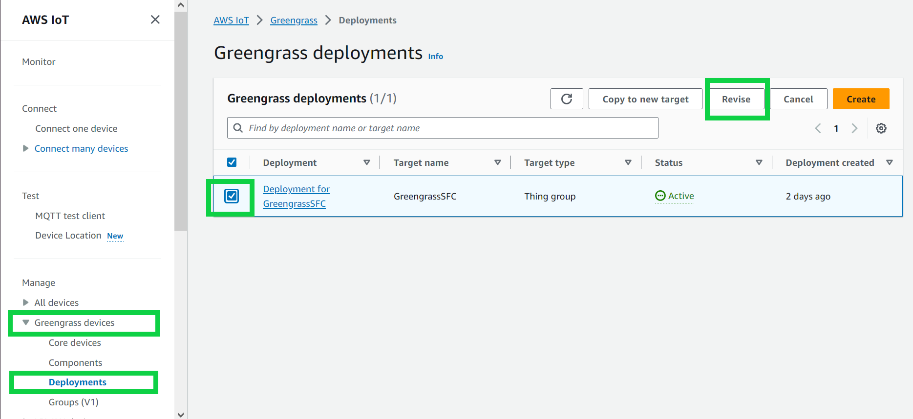

2. In `Step 1` - Specify Target, you can leave all values as default and select **Next**

3. In `Step 2` - select under My components **com.amazon.sfc.sfc-main** and the select **Next**

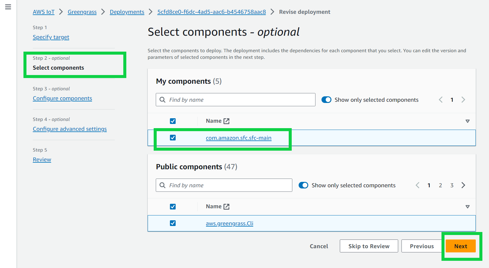

4. In `Step 3` select  **Next** 

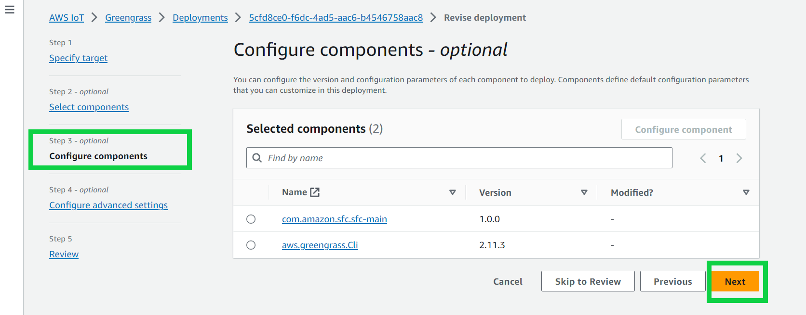

5. In `Step 4` select  **Next** 

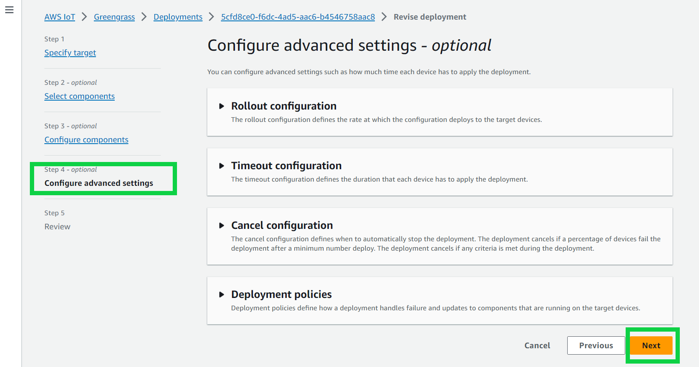

5. In `Step 5` select  **Deploy** 

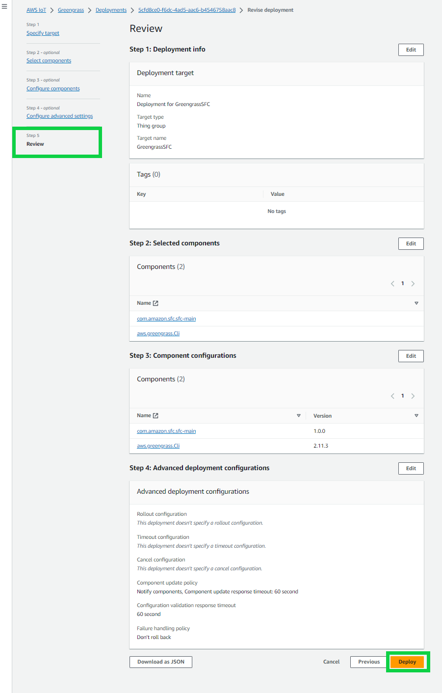


To check if the deployment succeeded select  **Greengrass devices** then select **Core Devices** then select your device

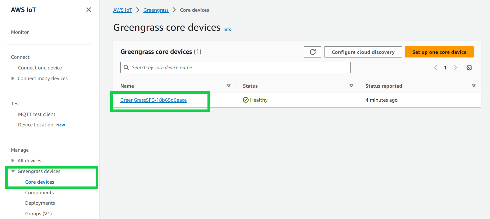

Then select the tab **Components** and in the search box enter **com.amazon.sfc**

There you should see all modules on your device:

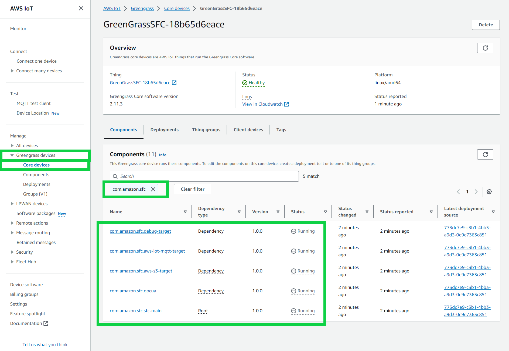


>Notice: <br>
Although we deployed only **com.amazon.sfc.sfc-main** component all components where deployed to fulfill the dependencies!
Because we used SFC's `IPC` model all components which deploy the dependencies are in the state *RUNNING* and  **`com.amazonsfc.sfc-main`** is in the state *Running* and dependency type *Root*.


# Removing components from deployment and deleting components
## Remove SFC components from deployment

To remove the components from the Greengrass environemnt do the following steps:

1. Go to the AWS IoT Core web console and select **Greengrass devices** then select **Deployments** then check the box before your deployment then select **Revise** 


2. In `Step 1` - **Specify Target**, you can leave all values as default and select **Next**

3. In `Step 2`- **Select components**, under **My components** de-select the component **com.amazon.sfc.sfc-main** and the select **Next**

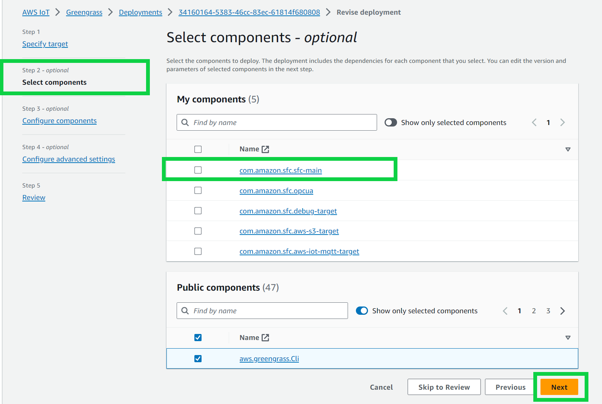

4. In `Step 3` - **Configure components**, select **Next** 

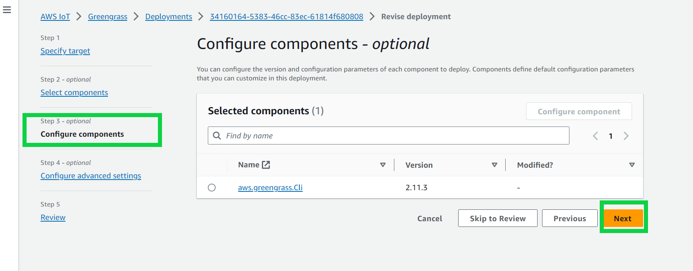

  
5. In `Step 4` - **Configure Advanced settings**, select  **Next** 


6. In `Step 5` -**Review** select  **Deploy** 


## Delete SFC components from IOT Core

To delete the components from IOT Core do the following steps:

1. Go to the AWS IoT Core web console and select **Greengrass devices** then select **Components** then click on the **com.amazon.sfc.sfc-main** 

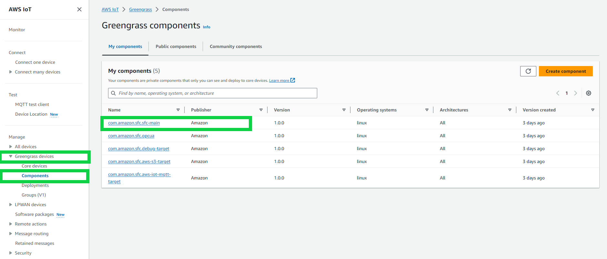


2. Check you have selected the right component **com.amazon.sfc.sfc-main** and select **Delete Version** 

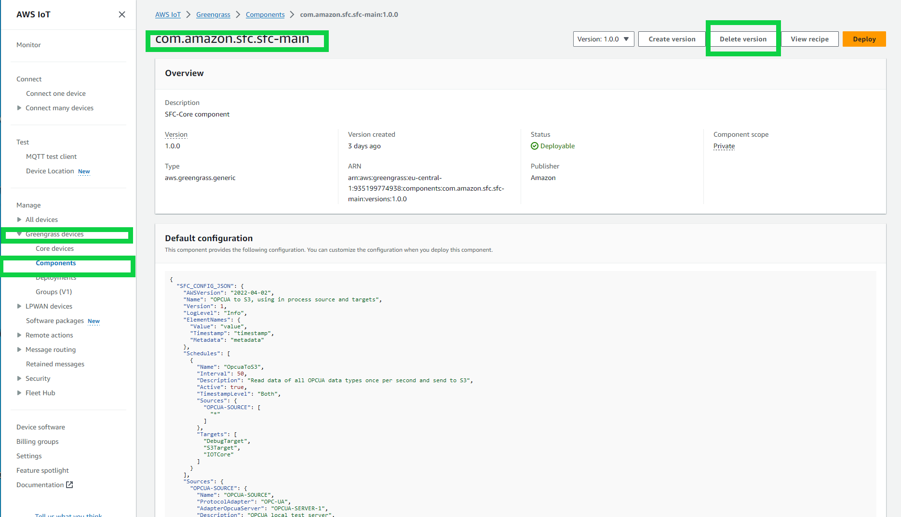

3. Confirm by selecting **Delete** in the confirmation dialog.

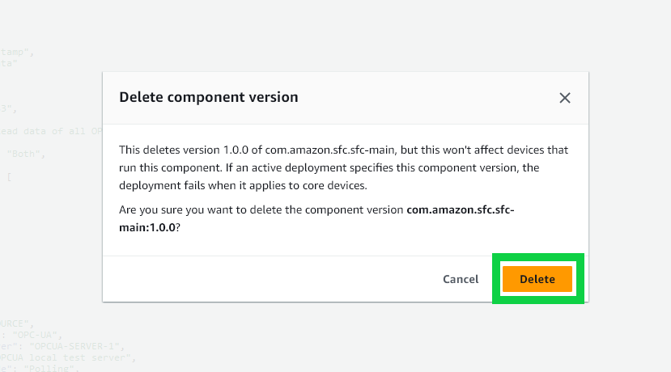


4. Repeat the steps 1 to 3 for all the other modules:
- com.amazon.sfc.opcua
- com.amazon.sfc.aws-s3-target
- com.amazon.sfc.aws-iot-mqtt-target
- com-amazon.svf.debug-tagret
