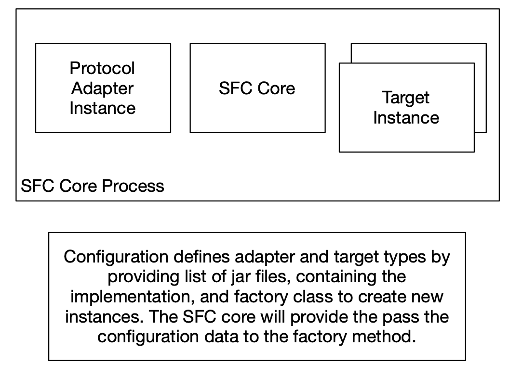

# SFC Deployment

- [Deployment types](#deployment-options)
- [In-process and IPC deployment models](#in-process-and-ipc-deployment-models)
- [Mixed models](#mixed-models)

## Deployment options

The SFC core module is implemented to run in a Java virtual machine. Input adapters and targets can be implemented for
the JVM as well, or other runtimes, depending on the platforms where these are deployed and libraries required for the
implementation of the protocol.

JVM implementations only have the option to be loaded in the same processes as the SFC Core. When other runtimes are
used, any language can be used for the implementation. These adapters and targets run as separate processed and use
streaming gRPC IPC to communicate with the SFC core.

The framework contains classes that speed up the development of JVM protocol and target services as well as an
abstraction layer for the GRPC IPC layer.

The components don’t have any runtime environment-specific dependencies, they can be deployed as:

- *Standalone applications* on the target platform supporting the JVM or runtimes are used to implement additional
  adapters and targets.
- *AWS IoT Greengrass v2 components* or containers
- *Docker* or *Kubernetes* containers
- 

## In-process and IPC deployment models

If implemented as jar files containing Java bytecode Protocol, adapters and targets can be configured to be loaded and
executed in the SFC core process. The configuration for the adapter or target type contains a list of jar files, which
are explicitly loaded by the SFC core process, as well as the name of a static factory class that implements a method,
named newInstance, called by the core to create a new instance. The configuration is passed to this method and is used
to initialize the adapter or the target instance.

    <em>Fig. 7. SFC In-process deployment (e.g. in a single host context)</em>

As an alternative, they can be deployed to run in their processes and communicate with the core using GRPC. Use cases
for this deployment model are to allow the following scenarios:

- Non-JVM execution environment or language to build/execute components
- Flexible deployment on IT/OT networks
- Distribute the load over multiple systems
- Apply lifecycle control with GreenGrass2 or Docker/Kubernetes.

When the processes running the adapter or target services are started, a port number is passed as a parameter on which
the service is listening for requests from the core. Alternatively, the path to a configuration file can be used from
which the process will retrieve just the port number (using an additional target identifier parameter if the
configuration file does contain more than one target for a target type).

When the SFC core initializes it will send an initialization request to the protocol source and/or target servers,
containing just the sections of its configuration that are used by that adapter or target. When the configuration is
modified, and the core process is restarted, it will send an initialization request to each adapter or target with the
newly updated subset of relevant configuration data.

If an adapter or target server is stopped, it will be detected by the SFC Core. It will try to re-connect to the service
and send an initialization request when it succeeds to connect to a new instance of the server.

As the SFC core acts as the provider for configuration data to the servers, these will always work with the latest and
consistent configuration data from a single source. No additions configuration files need to be distributed to the
protocol and adapter processes.

    <em>Fig. 8. SFC IPC deployment (e.g. in a distributed OT/IT context)</em>

## Mixed models

It is possible to mix instances of in-process and IPC adapters and targets in a single configuration.

    <em>Fig. 9. SFC Mixed deployment options</em>

