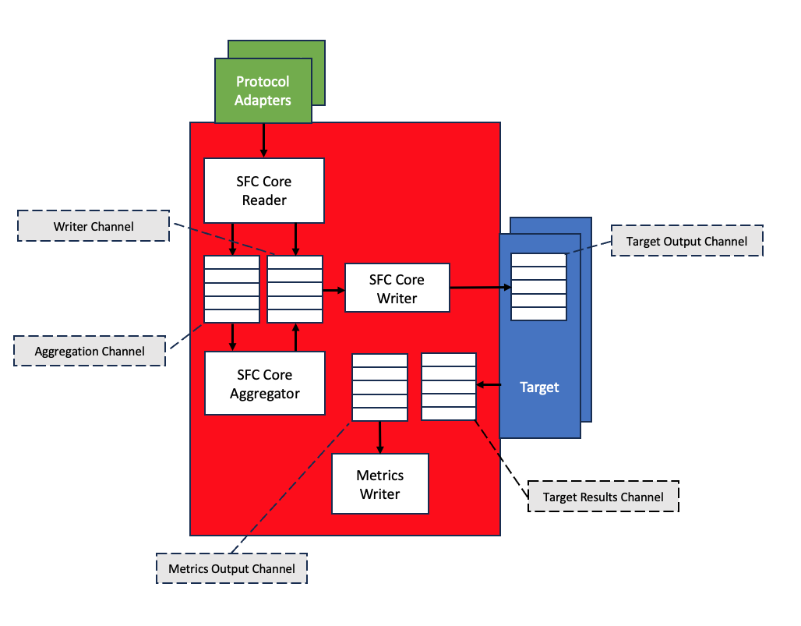

# SFC tuning

This section describes the tuning of SFC using the elements of the [Tuning](./core/tuning-configuration.md) configuration at the top level of the SFC
configuration file.

- [SFC channel tuning](#sfc-channel-tuning)
- [Channel capacity warnings](#channel-capacity-warnings)
 - [Channel capacity errors](#channel-capacity-errors)
 - [SFC memory monitoring](#sfc-memory-monitoring)
 - [Concurrent reading from sources.](#concurrent-reading-from-sources)

This section describes the tuning of SFC using the elements of the [Tuning](./core/tuning-configuration.md) configuration at the top level of the SFC
configuration file.

## SFC channel tuning

The internal processes of SFC use memory buffered channels to communicate. These channels are used to decouple the
process and allow processing of the data in parallel. When SFC is writing data to a channel then it first makes a
non-blocking call to send the data to the channel. If this fails, because the channel has reached it maximum capacity,
as warning is generated, which included the name of the channel, the current size of the parameter and the name of the
tuning parameter that can be used to change the capacity of the channel. SFC will then make blocking call to send the
data to the channel, waiting for available capacity in the channel. If a timeout whilst waiting for the item to be sent
occurs an error message is generated. The message includes the name of the channel, the timeout period and the name of
the tuning parameter to change the timeout period.

As the sizing of the channels is specified by the number of items the actual memory used by the channels depends on the
size of the items which are sent to the channel. All timeouts are specified in milliseconds.

The channel warning and errors typically occur when SFC collects data from the sources faster than it can process and
deliver it to the targets. If this happens incidentally, due to peaks in collected data or targets temporary processing
the data slower, size of the buffer can be incremented.
Other solutions are reducing the interval the schedule uses to read the data or enable batching for targets which support
it.

### Channel capacity warnings

Channel reached full capacity and data cannot be sent directly
Sending data to channelName is blocking, consider setting tuning parameter tuningChannelSizeName to a higher value,
current value is currentChannelSize

Data was sent to channel after waiting for available capacity in channel
Sending date to channelName was blocking for duration, consider setting tuning parameter tuningChannelSizeName to a
higher value, current value is currentChannelSize

### Channel capacity errors

Timeout occurred whilst waiting for capacity in channel.
Sending data to channelName timeout after timeout, consider setting tuning parameter tuningChannelTimeoutName to a
longer value

Out of memory occurred sending the data to the channel
Out of memory while submitting element to channelName, outIfMemoryError, consider setting tuning parameter
tuningChannelSizeName to a lower value, current value is currentChannelSize

The picture below shows the main channels used by SFC.

**Aggregation Channel**

When a schedule is configured to apply aggregation on the collected data then this channel is used to send the data to
the aggregation process. Note that the aggregation process reads the data from the channel and stores it until the
configured size is reached and the data is aggregated.
Tuning parameters: AggregatorChannelSize/AggregatorChannelTimeout

**Writer Channel**

Processed data from either the reading or aggregation process is sent to this channel from where the SFC writer will
read it and send it to the configured targets
Tuning parameters: WriterInputChannelSize / WriterInputChannelTimeout

**Target Output Channel**

Target output data is written to the target output channel of a target from where it is read for sending it to the
target’s specific destination.
Tuning parameters: TargetChannelSize/TargetChannelTimeout

**Metrics Output Channel**

If metrics collection is enabled then this channel is used to send data to an instance of a metrics writer that writes
the metrics data.
Tuning parameters : ChannelSizePerMetricsProvider/MetricsChannelTimeout

**Targets Results Channel**

This channel is used to receive the results from delivering the data by the targets.
Tuning parameters: TargetResultsChannelSize/TargetResultsChannelTimeout

**Additional channel parameters (not in picture)**

Tuning parameters: TargetForwardingChannelSize/TargetForwardingChannelTimeout
Used by targets that do forward data (e.g. store-and-forward-target and router-target) to the next adapter in a
configured adapter chain.

Tuning parameters: TargetResubmitChannelSize/TargetResubmitChannelTimeout
Used by targets that do resubmit data (e.g. store-and-forward-target) to the next adapter in a configured adapter chain.

## SFC memory monitoring

Every minute each SFC component will check the amount of memory it is using. At 10-minute interval the memory allocation
trend will be calculated for the last 10 and 60 minutes. The trend will be a number which is positive if the amount of
memory increases, or negative if it decreases. If the memory usage trend over the last 60 minutes goes up then a warning
is generated. This situation will typically happen if SFC collects data faster than is can process and deliver it to
targets. As too much data in flight will be stored in the channels further in the processing pipeline, the memory used
by these items may cause out of memory errors.
It the memory usage trend goes up over a 60-minute period a warning will be generated.

If tracing is enabled for logging then each minute interval sampling and 10-minute trends will be sent to the logging
output.

## Concurrent reading from sources.

When a schedule is reading data from multiple sources then this will happen in parallel. By default, the maximum number
of sources that are read in parallel is 5. This number can be modified by setting the MaxConcurrentSourceReaders tuning
parameter. This number can be increased to read from more sources at the same time. This number is typically lowered to
limit the load on network and system resources.
The parameter AllSourcesReadTimeout can be used to specify the period within reading from all sources must be completed.

