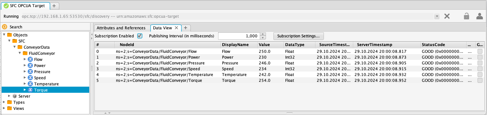
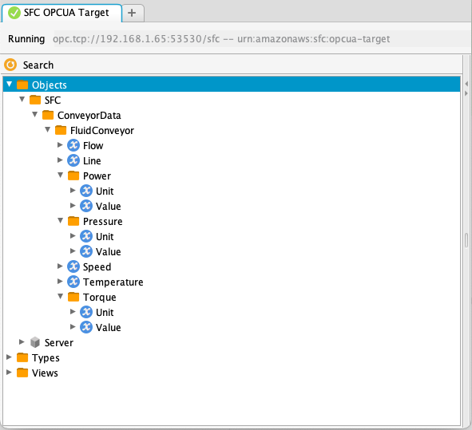
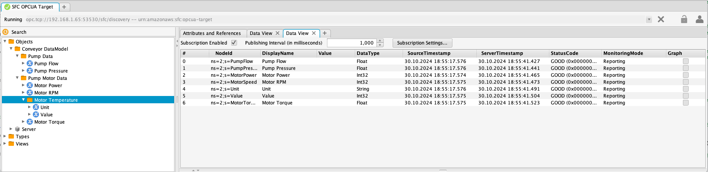

# OPC UA target adapter

- [OPC UA target adapter data models and mapping](#opc-ua-target-adapter-data-models-and-mapping)
  - [Automatic model mapping](#automatic-model-mapping)
  - [Query mapping](#query-mapping)


**Configuration:**

- [OpcuaTargetConfiguration](#OpcuaTargetConfiguration)
- [DataModelConfiguration](#DataModelConfiguration)
- [FolderNodeConfiguration](#FolderNodeConfiguration)
- [OpcuaCertificateValidationConfiguration](#OpcuaCertificateValidationConfiguration)
- [OpcuaCertificateValidationOptions](#OpcuaCertificateValidationOptions-type)
- [VariableNodeConfiguration](#VariableNodeConfiguration)


# OPC UA target adapter data models and mapping

The OPC UA (Open Platform Communications Unified Architecture) target adapter exposes data collected from SFC source adapters as an OPC UA model. 
This model can be generated automatically by the adapter, which uses the structure and types of the received data. Alternatively,
you can configure a data model as part of the target configuration, mapping the received data to that model by specifying queries for its
variables to obtain the corresponding values.

There are two different mapping methods available for associating target data with the nodes of an OPC UA data model:

- [Automatic mapping](#automatic-model-mapping): The adapter generates the model based on incoming data structure and types.
- [Query mapping](#query-mapping): Custom models are defined, and queries are used to extract specific values from the incoming data.

## Automatic model mapping


The most straightforward method to expose the data received by the target adapter as an OPC UA model is to allow the 
adapter to  automatically generate the model based on the structure and values of the incoming data.

Below is an example of the target data received by the adapter. The schedule named "ConveyorData" collects data from a single source called "FluidConveyor," from which five values are read.

```json
{
  "schedule": "ConveyorData",
  "serial": "947a28de-d6c5-4e09-ab45-c8821fed89ba",
  "timestamp": "2024-10-29T12:55:59.665789Z",
  "sources": {
    "FluidConveyor": {
      "values": {
        "Power": {
          "value": 230,
          "timestamp": "2024-10-29T12:55:59.664717Z"
        },
        "Speed": {
          "value": 234,
          "timestamp": "2024-10-29T12:55:59.664717Z"
        },
        "Temperature": {
          "value": 242.0,
          "timestamp": "2024-10-29T12:55:59.664717Z"
        },
        "Pressure": {
          "value": 246.0,
          "timestamp": "2024-10-29T12:55:59.664717Z"
        },
        "Flow": {
          "value": 250.0,
          "timestamp": "2024-10-29T12:55:59.664717Z"
        },
        "Torque": {
          "value": 254.0,
          "timestamp": "2024-10-29T12:55:59.664717Z"
        }
      },
      "timestamp": "2024-10-29T12:55:59.664717Z"
    }
  }
}
```

The configuration below illustrates the minimum requirements to use the OPC UA target adapter, utilizing all defaults and enabling automatic mapping of the
data to a dynamically created model.

```json
  "OpcuaTarget": {
    "TargetType": "OPCUA-TARGET"
  }

```

The automatic creation of OPCUA nodes is controlled by the "AutoCreate" setting, which is enabled by default.

Data is now exposed through an automatically generated model, where all nodes are read-only for clients. 
When a client connects to the server through any of the available endpoints, the model becomes viewable, subject to the configured network interfaces, security policies, and modes.



When new nodes are created from the initial or subsequent target data, a data model change event (ns=0;i=2133) is raised for the server source (ns=0;i=2253).

---

When the target data contains metadata at the schedule, source, and/or channel levels, additional folder and variable nodes are created to store these values.

```json
{
  "schedule": "ConveyorData",
  "serial": "65e10488-d15d-46ba-9c1f-3c630a7a6b87",
  "timestamp": "2024-10-29T14:54:20.234465Z",
  "sources": {
    "FluidConveyor": {
      "values": {
        "Power": {
          "value": 230,
          "metadata": {
            "Unit": "Watt"
          },
          "timestamp": "2024-10-29T14:54:20.233361Z"
        },
        "Speed": {
          "value": 234,
          "timestamp": "2024-10-29T14:54:20.233361Z"
        },
        "Temperature": {
          "value": 242.0,
          "timestamp": "2024-10-29T14:54:20.233361Z"
        },
        "Pressure": {
          "value": 246.0,
          "metadata": {
            "Unit": "Bar"
          },
          "timestamp": "2024-10-29T14:54:20.233361Z"
        },
        "Flow": {
          "value": 250.0,
          "timestamp": "2024-10-29T14:54:20.233361Z"
        },
        "Torque": {
          "value": 254.0,
          "metadata": {
            "Unit": "NM"
          },
          "timestamp": "2024-10-29T14:54:20.233361Z"
        }
      },
      "metadata": {
        "Line": "1"
      },
      "timestamp": "2024-10-29T14:54:20.233361Z"
    }
  }
}
```

In the data above, there is metadata at the source level and for three of the six channel values.




To accommodate metadata, an additional node named "Line" is created within the "FluidConveyor" 
source node to store the metadata value. For the three channel values that include metadata, 
a folder node is created instead of a variable node. This folder contains a variable node 
named "Value" for the actual channel value, along with additional variable nodes for the metadata items.

The rule is that when metadata or aggregated values are present for a value, a folder is created for 
that value. If these are not present, a variable node is created.

Full example at [examples/in-process-s7-opcua, config file s7-opcua-auto-create.json](../../examples/in-process-s7-opcua/README.md)

## Query mapping

For query mapping, one or more data models are created for a target. The variable nodes in these models 
include a JMESPath query, named "ValueQuery," in their definitions, which selects values for the variable nodes 
from the target data. Optionally, a transformation can be specified to apply to the selected value before it 
is written to the node.

The DataModels configuration contains the definition for a single custom model named "ConveyorDataModel," 
which has a structure different from the target data. For each variable node in this model, 
a JMESPath query is specified to query the target data. If the query returns a value, the variable node is 
updated with that value.

"Temperature" is configured as a folder node because it includes metadata. This metadata, along with the actual value, is stored as variable nodes within the "MotorTemperature" folder node. Additionally, this variable has a transformation applied to convert the value into degrees Celsius and round it to an integer to match the datatype in the model. The transformation, "ToCelsius," is defined in the "Transformations" section of the SFC configuration.

<details>
<summary>Show Transformations</summary>

```json
  "Transformations" :{
    "ToCelsius" : [
         { "Operator" : "Celsius"},
         { "Operator" : "ToInt"}

    ]
  },
```

</details>

<details>

<summary>Show target data</summary>


```json
{
  "schedule": "ConveyorData",
  "serial": "20eba6be-398c-47c2-bf1b-a7a7f14fb0c0",
  "timestamp": "2024-10-30T17:51:00.191939Z",
  "sources": {
    "FluidConveyor": {
      "values": {
        "Power": {
          "value": 230,
          "timestamp": "2024-10-30T17:51:00.191409Z"
        },
        "Speed": {
          "value": 234,
          "timestamp": "2024-10-30T17:51:00.191409Z"
        },
        "Temperature": {
          "value": 242.0,
          "metadata": {
            "Unit": "Celsius"
          },
          "timestamp": "2024-10-30T17:51:00.191409Z"
        },
        "Pressure": {
          "value": 246.0,
          "timestamp": "2024-10-30T17:51:00.191409Z"
        },
        "Flow": {
          "value": 250.0,
          "timestamp": "2024-10-30T17:51:00.191409Z"
        },
        "Torque": {
          "value": 254.0,
          "timestamp": "2024-10-30T17:51:00.191409Z"
        }
      },
      "timestamp": "2024-10-30T17:51:00.191409Z"
    }
  }
}

```

</details>

The code below shows the "DataModels" section of the OPC UA target adapter configuration. To keep this 
JSON example brief, optional configuration settings for the nodes, except for "DisplayName," are omitted.

The node configurations allow setting the identifier of NodeId by specifying the "Id" setting as a numeric, 
string, or GUID value. Alternatively, you can use "BrowseName" to set a node's browse name. If these fields are 
not specified, the key's value from the model configuration map is used as the default.

**Note that if the schedule, source, or channel name used in the JMESPath query contains non-alphanumeric characters, 
these names should be enclosed in double quotes. In JSON, double quotes need to be escaped with a \ character.**


```json
 "DataModels": {
      "ConveyorDataModel": {
        "DisplayName": "Conveyor DataModel",
        "Folders": {
          "DeviceData": {
            "DisplayName": "Pump Motor Data",
            "Variables": {
              "MotorPower": {
                "DisplayName": "Motor Power",
                "DataType": "INT32",
                "ValueQuery" : "@.sources.FluidConveyor.values.Power.value"
              },
              "MotorSpeed": {
                "DisplayName": "Motor RPM",
                "DataType": "INT32",
                "ValueQuery" : "@.sources.FluidConveyor.values.Speed.value"

              },
              "MotorTorque": {
                "DisplayName": "Motor Torque",
                "DataType": "REAL",
                "ValueQuery" : "@.sources.FluidConveyor.values.Torque.value"
              }
            },
            "Folders": {
              "MotorTemperature": {
                "DisplayName": "Motor Temperature",
                "Variables" :{
                    "Value" :{
                         "DataType" : "INT",
                         "ValueQuery" : "@.sources.FluidConveyor.values.Temperature.value",
                         "Transformation" : "ToCelsius"
                    },
                    "Unit" : {
                      "DataType" : "STRING",
                      "ValueQuery" : "@.sources.FluidConveyor.values.Temperature.metadata.Unit"
                    }
                }
              }
            }
          },
          "PumpData": {
            "DisplayName": "Pump Data",
            "Variables": {
              "PumpFlow": {
                "DisplayName": "Pump Flow",
                "DataType": "REAL",
                "ValueQuery" : "@.sources.FluidConveyor.values.Flow.value"
              },
              "PumpPressure": {
                "DisplayName": "Pump Pressure",
                "DataType": "REAL",
                "ValueQuery" : "@.sources.FluidConveyor.values.Pressure.value"
              }
            }
          }
        }
      }
    }
```

This configuration results in the model below.



---


## OpcuaTargetConfiguration

OpcuaTargetConfiguration extends the type [TargetConfiguration](../core/target-configuration.md) with specific configuration data for publishing the data through an OPC UA model. The Targets configuration element can contain entries of this type, the TargetType of these entries must be set to **"OPCUA-TARGET"**

- [Schema](#OpcuaTargetConfiguration-Schema)
- [Examples](#OpcuaTargetConfiguration-Examples)

**Properties:**

- [AutoCreate](#AutoCreate)

- [CertificateValidation](#CertificateValidation)

- [DataModels](#DataModels)

- [InitValuesWithNull](#InitValuesWithNull)

- [ServerAnonymousDiscoveryEndPoint](#ServerAnonymousDiscoveryEndPoint)

- [ServerMessageSecurityModes](#ServerMessageSecurityModes)

- [ServerNetworkInterfaces](#ServerNetworkInterfaces)

- [ServerPath](#ServerPath)

- [ServerSecurityPolicies](#ServerSecurityPolicies)

- [ServerCertificate](#ServerCertificate)

- [ServerTcpPort](#ServerTcpPort)

  

---
### AutoCreate
When the value of this value is set to true, the adapter will automatically create nodes for target data elements that are not mapped to a node in the models, or if no models are configured. 
If the value is false, then target data elements for which there is no mapped node in the model, the values will not be stored in the model.

**Type**: Boolean


Default is true

By setting this value to true, and not specifying any model, the data model is completely built based on the target data received by the adapter.


---
### CertificateValidation
Certificate settings for the OPC UA server

**Type**: [OpcuaCertificateValidationConfiguration](#OpcuaCertificateValidationConfiguration)

---
### DataModels
OPC UA data model definitions

**Type**: Map[String, [DataModelConfiguration](#DataModelConfiguration)]

One or more data models that will be exposed through the OPC UA server to which SFC target data can be mapped. If no models are specified then the
target adapter will build a model based on the SFC target data and values it receives.

---
### InitValuesWithNull
If set to true, variable nodes are initialized with a null value when no explicit initialization value is specified for the variable.

**Type**: Boolean


---
### ServerAnonymousDiscoveryEndPoint
When set to true a discovery-specific endpoint with no security is provided for each server address. Having these 
endpoints is a good practice and the usage of the /discovery suffix is defined by OPC UA Part 6


**Type**: Boolean

Default is true

---
### ServerMessageSecurityModes
Supported message security modes for OPC UA server

**Type**: [String]

This setting is an array containing one or more of the following values:

- "None" (Default)
- "Sign"
- "SignAndEncrypt"


---
### ServerNetworkInterfaces
Names of the network interfaces that can be used to access the OPC UA server

**Type**: [String]

The default binds all available network interfaces to the OPC UA server.

---
### ServerPath
Server path section for the server endpoints

**Type**: String

Default is "sfc"


---
### ServerSecurityPolicies
This setting contains the security policies for the OPC UA server

**Type**: [String]


This setting is an array containing one or more of the following values:

- "None" 
- "Basic128Rsa15" : http://opcfoundation.org/UA/SecurityPolicy#Basic128Rsa15
- "Basic256" : http://opcfoundation.org/UA/SecurityPolicy#Basic256
- "Basic256Sha256" : http://opcfoundation.org/UA/SecurityPolicy#Basic256Sha25
- "Aes128Sha256RsaOaep" : http://opcfoundation.org/UA/SecurityPolicy#Aes128_Sha256_RsaOaep

The default value are all security policy types:

["None", "Basic128Rsa15", "Basic256", "Basic256Sha256"]


---
### ServerCertificate

Certificate for the OPCUA server

Type: [CertificateConfiguration](../core/certificate-configuration.md)

No certificate is configured then a default self-signed certificate will be created.

---

### ServerTcpPort

TCP port used by the OPC UA server.

**Type**: Integer

Default is 53530


---
### 
### Certificate

Opcua Server certificate configuration

**Type**: [CertificateConfiguration](../core/certificate-configuration.md)n


### OpcuaTargetConfiguration Schema

```json
{
  "$schema": "http://json-schema.org/draft-07/schema#",
  "title": "OpcuaTargetConfiguration",
  "type": "object",
  "allOf": [
    {
      "$ref": "#/definitions/TargetConfiguration"
    },
    {
      "$ref": "#/definitions/AwsServiceConfig"
    },
    {
      "type": "object",
      "properties": {
        "AutoCreate": {
          "type": "boolean",
          "description": "Automatically create nodes if they don't exist",
          "default": false
        },
        "CertificateValidation": {
          "$ref": "#/definitions/OpcuaCertificateValidationConfiguration",
          "description": "Certificate validation configuration"
        },
        "DataModels": {
          "$ref": "#/definitions/DataModelConfiguration",
          "description": "Data models configuration"
        },
        "InitValuesWithNull": {
          "type": "boolean",
          "description": "Initialize values with null",
          "default": false
        },
        "ServerAnonymousDiscoveryEndPoint": {
          "type": "boolean",
          "description": "Enable anonymous discovery endpoint",
          "default": false
        },
        "ServerMessageSecurityModes": {
          "type": "array",
          "items": {
            "type": "string",
            "enum": ["None", "Sign", "SignAndEncrypt"]
          },
          "description": "Supported message security modes"
        },
        "ServerNetworkInterfaces": {
          "type": "array",
          "items": {
            "type": "string"
          },
          "description": "Network interfaces to bind server to"
        },
        "ServerPath": {
          "type": "string",
          "description": "Server path"
        },
        "ServerSecurityPolicies": {
          "type": "array",
          "items": {
            "type": "string",
            "enum": [
              "None",
              "Basic128Rsa15",
              "Basic256",
              "Basic256Sha256",
              "Aes128_Sha256_RsaOaep",
              "Aes256_Sha256_RsaPss"
            ]
          },
          "description": "Supported security policies"
        },
        "ServerCertificate":{
          "$ref": "#/definitions/CertificateConfiguration",
          "description": "Server Certificate configuration"
        },
        "ServerTcpPort": {
          "type": "integer",
          "description": "Server TCP port",
          "default": 4840
        }
      },
      "required": ["ServerPath"]
    }
  ]
}

```

### OpcuaTargetConfiguration Examples

Basic Configuration, model is created automatically from received data.

```json
{
  "TargetType": "OPCUA-TARGET",
  "ServerPath": "/opcua/server",
  "ServerTcpPort": 4840,
  "ServerNetworkInterfaces": [
    "lo",
    "en1"
  ],
  "ServerSecurityPolicies": [
    "None",
    "Basic128Rsa15",
    "Basic256",
    "Basic256Sha256"
  ],
  "AutoCreate": true
}
```

Configuration with data model

```json
{
  "TargetType": "OPCUA-TARGET",
  "ServerPath": "/opcua/server",
  "ServerTcpPort": 4840,
  "ServerNetworkInterfaces": [
    "lo",
    "en1"
  ],
  "ServerSecurityPolicies": [
    "None",
    "Basic128Rsa15",
    "Basic256",
    "Basic256Sha256"
  ],
  "DataModels": {
    
    "ConveyorDataModel": {
      "DisplayName": "Conveyor DataModel",
      
      "Folders": {
        
        "DeviceData": {
          "DisplayName": "Pump Motor Data",
          "Variables": {
            "MotorPower": {
              "DisplayName": "Motor Power",
              "DataType": "INT32",
              "ValueQuery": "@.sources.FluidConveyor.values.Power.value"
            },
            
            "MotorSpeed": {
              "DisplayName": "Motor RPM",
              "DataType": "INT32",
              "ValueQuery": "@.sources.FluidConveyor.values.Speed.value"
            },
            
            "MotorTorque": {
              "DisplayName": "Motor Torque",
              "DataType": "REAL",
              "ValueQuery": "@.sources.FluidConveyor.values.Torque.value"
            }
          }
        }
      }
    }
  }
}
```


[^top](#opc-ua-target-adapter-data-models-and-mapping)


## DataModelConfiguration

- [Schema](#DataModelConfiguration-Schema)
- [Examples](#DataModelConfiguration-Examples)

**Properties:**
- [BrowseName](#BrowseName)
- [Description](#Description)
- [DisplayName](#DisplayName)
- [Folders](#Folders)
- [Id](#Id)

- [Namespace](#Namespace)
- [Variables](#Variables)

---
### BrowseName
Browse name for the folder.

**Type**: String

Optional, if not specified then the value of the id will be used as the display name

---
### Description
Description for the folder.

**Type**: String

---
### DisplayName
Display name for the folder.

**Type**: String

Optional, if not specified then the value of the id will be used as the display name

---
### Folders
Sub folder nodes to create in this top level folder

**Type**: Map[String, FolderNodeConfiguration]

---
### Id
Id for the node

**Type**: String

Optional, if not specified then the key for the model in the OPC UA target configuration DataModels table is used
The value of the id is used as the identifier in the node id for the folder. 

- Id is a number: "ns=[namespace index];**i**= [numeric id]"
- Id is a guid: "ns=[namespace index];g= [guid id]"
- Id is a string : "ns=[namespace index];s= [guid id]"
- 
The value of the namespace index is set by the server when the model is built from the model specification.

Note that all keys in all tabled in a DataModel configuration must be unique.


---
### Namespace
Namespace for the data model

**Type**: String

Default is "urn:amazonaws.sfc"

---
### Variables
Variable nodes to create at in this top level folder

**Type**: Map[String, VariableNodeConfiguration]


### DataModelConfiguration Schema

```json
{
  "$schema": "http://json-schema.org/draft-07/schema#",
  "title": "DataModelConfiguration",
  "type": "object",
  "properties": {
    "BrowseName": {
      "type": "string",
      "description": "Browse name of the data model"
    },
    "Description": {
      "type": "string",
      "description": "Description of the data model"
    },
    "DisplayName": {
      "type": "string",
      "description": "Display name of the data model"
    },
    "Folders": {
      "type": "object",
      "description": "Map of folder configurations",
      "additionalProperties": {
        "$ref": "#/definitions/FolderNodeConfiguration"
      }
    },
    "Id": {
      "type": "string",
      "description": "Identifier of the data model"
    },
    "Variables": {
      "type": "object",
      "description": "Map of variable configurations",
      "additionalProperties": {
        "$ref": "#/definitions/VariableNodeConfiguration"
      }
    }
  }
}

```

### DataModelConfiguration Examples

```json
{
  "DisplayName": "Conveyor DataModel",
  "Folders": {
    "DeviceData": {
      "DisplayName": "Pump Motor Data",
      "Variables": {
        "MotorPower": {
          "DisplayName": "Motor Power",
          "DataType": "INT32",
          "ValueQuery": "@.sources.FluidConveyor.values.Power.value"
        },
        "MotorSpeed": {
          "DisplayName": "Motor RPM",
          "DataType": "INT32",
          "ValueQuery": "@.sources.FluidConveyor.values.Speed.value"
        },
        "MotorTorque": {
          "DisplayName": "Motor Torque",
          "DataType": "REAL",
          "ValueQuery": "@.sources.FluidConveyor.values.Torque.value"
        }
      },
      "Folders": {
        "MotorTemperature": {
          "DisplayName": "Motor Temperature",
          "Variables": {
            "Value": {
              "DataType": "INT",
              "ValueQuery": "@.sources.FluidConveyor.values.Temperature.value",
              "Transformation": "ToCelsius"
            },
            "Unit": {
              "DataType": "STRING",
              "ValueQuery": "@.sources.FluidConveyor.values.Temperature.metadata.Unit"
            }
          }
        }
      }
    },
    "PumpData": {
      "DisplayName": "Pump Data",
      "Variables": {
        "PumpFlow": {
          "DisplayName": "Pump Flow",
          "DataType": "REAL",
          "ValueQuery": "@.sources.FluidConveyor.values.Flow.value"
        },
        "PumpPressure": {
          "DisplayName": "Pump Pressure",
          "DataType": "REAL",
          "ValueQuery": "@.sources.FluidConveyor.values.Pressure.value"
        }
      }
    }
  }
}
```

[^top](#opc-ua-target-adapter-data-models-and-mapping)


## FolderNodeConfiguration


**Properties:**
- [BrowseName](#BrowseName)
- [Description](#Description)
- [DisplayName](#DisplayName)
- [Folders](#Folders)
- [Id](#Id)

- [Variables](#Variables)

---
### BrowseName
Browse name for the folder node.

**Type**: String

Optional, if not specified then the value of the id will be used as the display name

---
### Description
Description for the folder node.

**Type**: String

---
### DisplayName
Display name for the folder node.

**Type**: String

Optional, if not specified then the value of the id will be used as the display name

---
### Folders
Map with sub folder nodes to create in this folder

**Type**: Map[String, [FolderNodeConfiguration](#FolderNodeConfiguration)]

---
### Id
Id for the node

**Type**: String

Optional; if not specified, the key used in the folder table in the parent folder or data model table is utilized. 
The value of the ID is then used as the identifier in the node ID for the folder.

- Id is a number: "ns=[namespace index];**i**= [numeric id]"
- Id is a guid: "ns=[namespace index];g= [guid id]"
- Id is a string : "ns=[namespace index];s= [guid id]"

The value of the namespace index is set by the server when the model is built from the model specification.

Note that all keys in all tabled in a DataModel configuration must be unique.


---
### Variables
Map with variable nodes to create at top level folder of model

**Type**: Map[String, VariableNodeConfiguration]

### FolderNodeConfiguration Schema

```json
{
  "$schema": "http://json-schema.org/draft-07/schema#",
  "title": "FolderNodeConfiguration",
  "type": "object",
  "properties": {
    "BrowseName": {
      "type": "string",
      "description": "Browse name of the data model"
    },
    "Description": {
      "type": "string",
      "description": "Description of the data model"
    },
    "DisplayName": {
      "type": "string",
      "description": "Display name of the data model"
    },
    "Folders": {
      "type": "object",
      "description": "Map of folder configurations",
      "additionalProperties": {
        "$ref": "#/definitions/FolderNodeConfiguration"
      }
    },
    "Id": {
      "type": "string",
      "description": "Identifier of the folder"
    },
    "Variables": {
      "type": "object",
      "description": "Map of variable configurations",
      "additionalProperties": {
        "$ref": "#/definitions/VariableNodeConfiguration"
      }
    }
  }
}

```

### FolderNodeConfiguration Examples

```json
{
  "DeviceData": {
    "DisplayName": "Pump Motor Data",
    "Variables": {
      "MotorPower": {
        "DisplayName": "Motor Power",
        "DataType": "INT32",
        "ValueQuery": "@.sources.FluidConveyor.values.Power.value"
      },
      "MotorSpeed": {
        "DisplayName": "Motor RPM",
        "DataType": "INT32",
        "ValueQuery": "@.sources.FluidConveyor.values.Speed.value"
      },
      "MotorTorque": {
        "DisplayName": "Motor Torque",
        "DataType": "REAL",
        "ValueQuery": "@.sources.FluidConveyor.values.Torque.value"
      }
    },
    "Folders": {
      "MotorTemperature": {
        "DisplayName": "Motor Temperature",
        "Variables": {
          "Value": {
            "DataType": "INT",
            "ValueQuery": "@.sources.FluidConveyor.values.Temperature.value",
            "Transformation": "ToCelsius"
          },
          "Unit": {
            "DataType": "STRING",
            "ValueQuery": "@.sources.FluidConveyor.values.Temperature.metadata.Unit"
          }
        }
      }
    }
  }
}
```

[^top](#opc-ua-target-adapter-data-models-and-mapping)


## OpcuaCertificateValidationConfiguration

- [Schema](#OpcuaCertificateValidationConfiguration-Schema)
- [Examples](#OpcuaCertificateValidationConfiguration-Example)

**Properties:**

- [Active](#Active)
- [Directory](#Directory)
- [ValidationOptions](#ValidationOptions)

------

### Active

Flag to set to enable or disable the validation of server certificates

**Type**: Boolean

Default is true

------

### Directory

Pathname to base directory under which certificates and certificate revocation lists are stored

**Type**: String

This directory must exist, subdirectories will be created by the adapter if they do not exist.

------

### ValidationOptions

Configuration of op optional checks

**Type**: [OpcuaCertificateValidationOptions](#OpcuaCertificateValidationOptions-type)

When not set then all options are enabled

### OpcuaCertificateValidationConfiguration Schema

```json
 {
  "$schema": "http://json-schema.org/draft-07/schema#",
  "type": "object",
  "description": "Configuration for certificate validation",
  "properties": {
    "Active": {
      "type": "boolean",
      "description": "Enable or disable certificate validation",
      "default": true
    },
    "Directory": {
      "type": "string",
      "description": "Directory path for certificate storage and validation"
    },
    "ValidationOptions": {
      "$ref": "#/definitions/ValidationOptions",tificate-vatificate-validation-configuration
      "description": "Options for certificate validation"
    }
  }
}
```

### OpcuaCertificateValidationConfiguration Example

Basic configuration:

```json
{
  "Directory": "./certificates",
  "Active": true
}
```

With validation options:

```json
{
  "Directory": "./certificates",
  "Active": true,
  "ValidationOptions": {
    "ApplicationUri": false,
    "ExtKeyUsageEndEntity": false,
    "HostOrIp": false,
    "KeyUsageEndEntity": false,
    "KeyUsageIssuer": true,
    "Revocation": true,
    "Validity": true
  }
}
```


## OpcuaCertificateValidationOptions type

- [Schema](#OpcuaCertificateValidationOptions-Type-Schema)
- [Examples](#OpcuaCertificateValidationOptions-Type-Example)

**Properties:**

- [ApplicationUri](#ApplicationUri)
- [ExtKeyUsageEndEntity](#ExtKeyUsageEndEntity)
- [HostOrIp](#HostOrIp)
- [KeyUsageEndEntity](#KeyUsageEndEntity)
- [KeyUsageIssuer](#KeyUsageIssuer)
- [Revocation](#Revocation)
- [Validity](#Validity)

---

### ApplicationUri

Check Application description against the ApplicationUri from Subject Alternative Names

**Type**: Boolean

Default is true

---

### ExtKeyUsageEndEntity

Extended key usage extension must be present and will be validated for end-entity certificates

**Type**: Boolean

Default is true

---

### HostOrIp

Host or IP address must be present in Alternate Subject Names and will be checked

**Type**: Boolean

Default is true

---

### KeyUsageEndEntity

Key usage extension must be present and will be validated for end-entity certificates

**Type**: Boolean

Default is true

---

### KeyUsageIssuer

Key usage must be present and will be checked for CA certificates

**Type**: Boolean

Default is true


---

### Revocation

Revocation checking

**Type**: Boolean

Default is true

---

### Validity

Check certificate expiry

**Type**: Boolean

Default is true

### OpcuaCertificateValidationOptions Type Schema

```json
{
  "$schema": "http://json-schema.org/draft-07/schema#",
  "type": "object",
  "description": "Configuration options for certificate validation",
  "properties": {
    "ApplicationUri": {
      "type": "boolean",
      "description": "Enable validation of application URI",
      "default": true
    },
    "ExtKeyUsageEndEntity": {
      "type": "boolean",
      "description": "Enable validation of extended key usage for end entity certificates",
      "default": true
    },
    "HostOrIp": {
      "type": "boolean",
      "description": "Enable validation of host name or IP address",
      "default": true
    },
    "KeyUsageEndEntity": {
      "type": "boolean",
      "description": "Enable validation of key usage for end entity certificates",
      "default": true
    },
    "KeyUsageIssuer": {
      "type": "boolean",
      "description": "Enable validation of key usage for issuer certificates",
      "default": true
    },
    "Revocation": {
      "type": "boolean",
      "description": "Enable certificate revocation checking",
      "default": true
    },
    "Validity": {
      "type": "boolean",
      "description": "Enable validation of certificate validity period",
      "default": true
    }
  }
}

```

### OpcuaCertificateValidationOptions Type Example

```json
{
  "ApplicationUri": false,
  "ExtKeyUsageEndEntity": false,
  "HostOrIp": false,
  "KeyUsageEndEntity": false,
  "KeyUsageIssuer": true,
  "Revocation": true,
  "Validity": true
}

```


## VariableNodeConfiguration

- [Schema](#VariableNodeConfiguration-Schema)
- [Examples](#VariableNodeConfiguration-Examples)

**Properties:**
- [ArrayDimensions](#ArrayDimensions)
- [BrowseName](#BrowseName)
- [DataType](#DataType)
- [Description](#Description)
- [DisplayName](#DisplayName)
- [Id](#Id)
- [InitValue](#InitValue)

- [TimestampQuery](#TimestampQuery)
- [Transformation](#Transformation)
- [ValueQuery](#ValueQuery)

---
### ArrayDimensions
Dimensions of an array value

**Type**: [Int]


The array contains the sizes for the dimensions for an array variable;
e.g.

[3] : Value array of 3 element
[3,2] : Value array of 3 by 2 elements


---
### BrowseName
Browse name for the variable node.

**Type**: String

Optional, if not specified then the value of the id will be used as the display name

---
### DataType
Data type for the node

**Type**: String

The following data types are supported:

- BOOLEAN
- BYTE, SBYTE (signed byte)
- BYTE_STRING
- DATETIME
- DOUBLE (double)
- REAL (float)
- EXPANDED_NODE_ID
- FLOAT
- INT, INTEGER, INT32 (Int32)
- LOCALIZED_TEXT
- LONG, INT64 (Int64)
- NODE_ID
- QUALIFIED_NAME
- SHORT, INT16 (Int16)
- STRING
- UINT, UINT32, UINTEGER (UInt32)
- UUID
- XML_ELEMENT
- UBYTE,  (unsigned byte)
- ULONG, UINT64 ()
- USHORT, UINT16 (UInt16)
- STRUCT
- VARIANT (note that this type does not support array type)

Note that for selected types alternative names can be used.

The '_' in the type names are used for clarity and can be omitted.

Type names are not case-sensitive.


---
### Description
Description for the variable node.

**Type**: String

---
### DisplayName
Display name for the variable node.

**Type**: String

Optional, if not specified then the value of the id will be used as the display name

---
### Id
Id for the node

**Type**: String

Optional; if not specified then the key used in the variable table in the parent folder or data model table is used
The value of the id is used as the identifier in the node id for the folder. 

- Id is a number: "ns=[namespace index];**i**= [numeric id]"
- Id is a guid: "ns=[namespace index];g= [guid id]"
- Id is a string : "ns=[namespace index];s= [guid id]"
-
The value of the namespace index is set by the server when the model is built from the model specification.

Note that all keys in all tabled in a DataModel configuration must be unique.


---
### InitValue
Initial value for a variable node when created

**Type**: Any


If no initial value is specified, the value of the node will be set to null 
when the "InitValuesWithNull" setting for the target is set to true, or left 
undefined when it is false. The value must match the data type for the node. 
If the value is an array, as described in "ArrayDimensions," the dimensions of 
the initial value must match those of the variable. Initial array values can be 
specified with up to three dimensions.


---
### TimestampQuery
JMESPath Query to select the timestamp for a variable node from the target data

**Type**: String


The value must be a valid JMESPath query https://jmespath.org.

e.g. @.sources..values..timestamp

Note that if the source or channel name contain  characters, not in  the ranges A-Z, a-z, 0-9, then these must be quoted.
These quoted mst be escaped with a '\' character in the JSON configuration.

If no query is specified in addition to the ValueQuery described above then the adapter will try to build a query from that ValueQuery by replacing the 
"value" section of the query with  "timestamp". If that query does not return a timestamp then either the source or schedule timestamp will be used.


---
### Transformation
Transformation to be applied to the value obtained by the ValueQuery before it is written to the variable node.

**Type**: String


The specified transformation must be the ID of an existing transformation in the "Transformations" section of the SFC 
configuration. This transformation can be specifically applied when writing the value to OPC UA variable nodes, in addition 
to the transformation that can be applied to a channel, which is used when the value is read from the source adapter.


---
### ValueQuery
JMESPath Query to select the value for a variable node from the target data

**Type**: String

The value must be a valid JMESPath query https://jmespath.org.

e.g. @.sources..values..value

Note that if the source or channel name contain non-alphanumeric characters, then these elements must be quoted.
The quoted characters must be escaped with a \ character in the JSON configuration.

### VariableNodeConfiguration Schema

```json
{
  "$schema": "http://json-schema.org/draft-07/schema#",
  "title": "VariableNodeConfiguration",
  "type": "object",
  "properties": {
    "ArrayDimensions": {
      "type": "array",
      "items": {
        "type": "integer"
      },
      "description": "Array dimensions for array variables"
    },
    "BrowseName": {
      "type": "string",
      "description": "Browse name of the variable node"
    },
    "DataType": {
      "type": "string",
      "description": "Data type of the variable",
      "enum": [
        "BOOLEAN",
        "BYTE",
        "SBYTE",
        "BYTE_STRING", 
        "DATETIME",
        "DOUBLE",
        "REAL",
        "EXPANDED_NODE_ID",
        "FLOAT",
        "INT",
        "INTEGER",
        "INT32",
        "LOCALIZED_TEXT",
        "LONG",
        "INT64",
        "NODE_ID",
        "QUALIFIED_NAME",
        "SHORT",
        "INT16",
        "STRING",
        "UINT",
        "UINT32",
        "UINTEGER",
        "UUID",
        "XML_ELEMENT",
        "UBYTE",
        "ULONG",
        "UINT64",
        "USHORT",
        "UINT16",
        "STRUCT",
        "VARIANT"
      ]
    },
    "Description": {
      "type": "string",
      "description": "Description of the variable node"
    },
    "DisplayName": {
      "type": "string", 
      "description": "Display name of the variable node"
    },
    "Id": {
      "type": "string",
      "description": "Identifier of the variable node"
    },
    "InitValue": {
      "description": "Initial value of the variable"
    },
    "TimestampQuery": {
      "type": "string",
      "description": "Query to extract timestamp information"
    },
    "Transformation": {
      "type": "string",
      "description": "Transformation to apply to the value"
    },
    "ValueQuery": {
      "type": "string",
      "description": "Query to extract the variable value"
    }
  },
  "required": [ "DataType"]
}

```

### VariableNodeConfiguration Examples

Node with explicit string id, browsename  and displayname. Node id will be `ns:<ns>;s=speed`

```json
{
  "Id" : "speed",
  "DisplayName": "Motor RPM",
  "BrowseName" : "motors-speed"
  "DataType": "INT32",
  "ValueQuery": "@.sources.FluidConveyor.values.Speed.value"
}
```


Node with explicit numeric id, Node id will be `ns:<ns>;i=1001`

```json
{
  "Id" : "1001",
  "DataType": "INT32",
  "ValueQuery": "@.sources.FluidConveyor.values.Speed.value"
}
```


[^top](#opc-ua-target-adapter-data-models-and-mapping)

