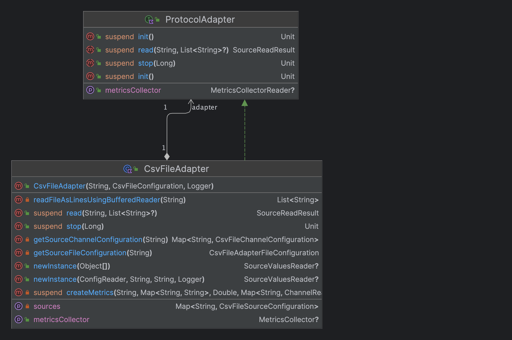

Example: CSV File adapter
=========================

that gradle project contains an example adapter for reading in CSV files to SFC. 
`Comma Separated Value` files typically do have an attribute header and come with various `delimiters` like `;`, `,` etc.

```csv
pos34;volt35;rpm347
0.12;0.345;9.51
0.18;0.34;9.52
0.17;0.344;9.563
...
```
## How to build the SFC csvfile adapter ?

in this directory run gradle like so:
```sh
cd examples/custom-adapter-csvfile
 ../../gradlew build
```

this builds the csvfile adapter in `build/distributions` as a tar.gz file.
We will use that file in the next section. 

## How to run it with sample data ? 

1. Here we create a small sfc-test env for testing out the csv adapter with some csv files:
```sh
# using the build dir here - get's deleted when running a gradle clean
cd build
```
```shell
# Define sfc version and directory
export VERSION="1.0.3"
export SFC_DEPLOYMENT_DIR="sfc"
mkdir $SFC_DEPLOYMENT_DIR && cd $SFC_DEPLOYMENT_DIR
# fetch some sfc-components from github
wget https://github.com/aws-samples/shopfloor-connectivity/releases/download/v$VERSION/\
{aws-s3-target,debug-target,opcua,sfc-main}.tar.gz
# copy our built adapter also here
cp ../distributions/csvfile.tar.gz .
# copy some csv samples
cp -r ../../src/main/resources/csv-samples .
# extract tar.gz
for file in *.tar.gz; do
  tar -xf "$file"
  rm "$file"
done
cd -
```

2. **Create a working SFC Config file**

```shell
cat << EOF > $SFC_DEPLOYMENT_DIR/example.json
  {
  "AWSVersion": "2022-04-02",
  "Name": "OPCUA to S3, using in process source and targets",
  "Version": 1,
  "LogLevel": "Info",
  "ElementNames": {
    "Value": "value",
    "Timestamp": "timestamp",
    "Metadata": "metadata"
  },
  "Schedules": [
    {
      "Name": "CsvFilesToDebugTarget",
      "Interval": 5000,
      "Description": "Read data of CSV files every 5secs and send to Debug Output Target",
      "Active": true,
      "TimestampLevel": "Both",
      "Sources": {
        "CSV-FILE-SOURCE-1-PUMP23": ["*"],
        "CSV-FILE-SOURCE-2-MILL34": ["*"]
      },
      "Targets": [
        "DebugTarget"
      ]
    }
  ],
  "Sources": {
    "CSV-FILE-SOURCE-1-PUMP23": {
      "Name": "CSV-FILE-SOURCE-1",
      "ProtocolAdapter": "CSV-FILE-ADAPTER",
      "AdapterCsvFile": "CsvFile-1-pump23",
      "Channels": {
        "CsvColumnValue-1": {
          "Name": "positionX34",
          "ColName": "pos34",
          "ColIndex": 0
        },
        "CsvColumnValue-2": {
          "Name": "voltageY35",
          "ColName": "volt35",
          "ColIndex": 1
        },
        "CsvColumnValue-3": {
          "Name": "rpmZ347",
          "ColName": "rpm347",
          "ColIndex": 2
        }
      }
    },
    "CSV-FILE-SOURCE-2-MILL34": {
      "Name": "CSV-FILE-SOURCE-2",
      "ProtocolAdapter": "CSV-FILE-ADAPTER",
      "AdapterCsvFile": "CsvFile-2-mill34",
      "Channels": {
        "CsvColumnValue-1": {
          "Name": "spindle1",
          "ColName": "spindle1",
          "ColIndex": 0
        }
      }
    }
  },
  "Targets": {
    "DebugTarget": {
      "Active": true,
      "TargetType": "DEBUG-TARGET"
    }
  },
  "TargetTypes": {
    "DEBUG-TARGET": {
      "JarFiles": [
        "${SFC_DEPLOYMENT_DIR}/debug-target/lib"
      ],
      "FactoryClassName": "com.amazonaws.sfc.debugtarget.DebugTargetWriter"
    }
  },
  "AdapterTypes": {
    "CSVFILE": {
      "JarFiles": [
        "${SFC_DEPLOYMENT_DIR}/csvfile/lib"
      ],
      "FactoryClassName": "com.amazonaws.sfc.csvfile.CsvFileAdapter"
    }
  },
  "ProtocolAdapters": {
    "CSV-FILE-ADAPTER": {
      "AdapterType": "CSVFILE",
      "CsvFiles": {
        "CsvFile-1-pump23": {
          "FilePath":"${SFC_DEPLOYMENT_DIR}//csv-samples//test-having3-channels.csv",
          "Delimiter": ";",
          "LinesToSkip": 1,
          "MaxRowsPerRead": 1
        },
        "CsvFile-2-mill34": {
          "FilePath":"${SFC_DEPLOYMENT_DIR}//csv-samples//test-channels.csv",
          "Delimiter": ";",
          "LinesToSkip": 1,
          "MaxRowsPerRead": 1
        }
      }
    }
  }
}
EOF
```

3. **Run sfc-main**

```shell
sfc/sfc-main/bin/sfc-main -config sfc/example.json
```

Output should look like this:

```txt
2023-11-21 17:26:14.306 INFO  - Creating configuration provider of type ConfigProvider
2023-11-21 17:26:14.331 INFO  - Waiting for configuration
2023-11-21 17:26:14.338 INFO  - Sending initial configuration from file "example.json"
2023-11-21 17:26:14.917 INFO  - Received configuration data from config provider
2023-11-21 17:26:14.919 INFO  - Waiting for configuration
2023-11-21 17:26:14.919 INFO  - Creating and starting new service instance
2023-11-21 17:26:14.961 INFO  - Created instance of service MainControllerService
2023-11-21 17:26:14.961 INFO  - Running service instance
2023-11-21 17:26:14.963 INFO  - Creating an in-process reader for adapter "CSV-FILE-ADAPTER" of protocol adapter type CSVFILE
2023-11-21 17:26:15.01  INFO  - Creating in process target writer for target ID DebugTarget
2023-11-21 17:26:15.43  INFO  - SFC_MODULE DEBUG-TARGET: VERSION=1.0.0, SFC_CORE_VERSION=1.0.3, SFC_IPC_VERSION=1.0.3, BUILD_DATE=2023-11-15
2023-11-21 17:26:15.48  INFO  - No adapter or target metrics are collected
2023-11-21 17:26:15.84  INFO  - {
  "schedule": "CsvFilesToDebugTarget",
  "serial": "af77fe6e-3bea-4cfe-aaeb-4cda721cbf05",
  "timestamp": "2023-11-21T16:26:15.077981Z",
  "sources": {
    "CSV-FILE-SOURCE-1": {
      "values": {
        "positionX34": {
          "value": "0.12345",
          "timestamp": "2023-11-21T16:26:15.055222Z"
        },
        "voltageY35": {
          "value": "0.345",
          "timestamp": "2023-11-21T16:26:15.057135Z"
        },
        "rpmZ347": {
          "value": "9.59",
          "timestamp": "2023-11-21T16:26:15.057415Z"
        }
      },
...
```
^^ The `DebugTarget` log shows the sfc target data format in JSON with our csv attribute values... 

---

## How was this implemented ?

- The class [CsvFileAdapter](src/main/kotlin/com/amazonaws/sfc/csvfile/CsvFileAdapter.kt) implements 
the Interface [ProtocolAdapter](../../core/sfc-core/src/main/kotlin/com/amazonaws/sfc/data/ProtocolAdapter.kt).
That interface is used by all other SFC protocol adapters.

<p>
  
</p>

- The Interface defines a **read** function, which returns data of the 
type [SourceReadResult](../../core/sfc-core/src/main/kotlin/com/amazonaws/sfc/data/SourceReadResult.kt).
Class CsvFileAdpater overrides that Interface method.

```kotlin
/**
     * Reads a values from a source
     * @param sourceID String Source ID
     * @param channels List<String>? Channels to read values for, if null then all values for the source are read
     * @return SourceReadResult
     */
    override suspend fun read(sourceID: String, channels: List<String>?): SourceReadResult {
        val log = logger.getCtxLoggers(className, "read")
        log.trace("Reading ${if (channels.isNullOrEmpty()) "all" else channels.size} channels from CSV-FILE source \"$sourceID\"")

        val metricDimensions = mapOf(METRICS_DIMENSION_SOURCE to sourceID, MetricsCollector.METRICS_DIMENSION_ADAPTER to sources.keys.toString())
        val start = DateTime.systemDateTime().toEpochMilli()
        val skipper = getSourceFileConfiguration(sourceID)?.linesToSkip
        val maxRows = getSourceFileConfiguration(sourceID)?.maxRowsPerRead
        val delim = getSourceFileConfiguration(sourceID)?.delimiter.toString()

        try {
            val readValues = mutableMapOf<String, ChannelReadValue>()
            getSourceChannelConfiguration(sourceID)?.forEach { channel ->
                val timestamp = DateTime.systemDateTime()
                val path = getSourceFileConfiguration(sourceID)?.path.toString()
                var colValueArray : Array<String> = emptyArray()
                readFileAsLinesUsingBufferedReader(path).forEach {line ->
                    colValueArray += line
                }

                if (skipper != null) {
                    if(skipper > 0){
                        colValueArray = colValueArray.drop(skipper).toTypedArray()
                    }
                }
                val value: Any?
                if(maxRows == 1) {
                    value = colValueArray
                        .last()
                        .split(delim)[channel.value.colIdx]
                } else {
                    var lastNcolValues : Array<Any?> = emptyArray()
                    getSourceFileConfiguration(sourceID)?.let { colValueArray.takeLast(it.maxRowsPerRead).forEach { row ->
                        lastNcolValues += row.split(getSourceFileConfiguration(sourceID)?.delimiter.toString())[channel.value.colIdx]
                    } }
                    value = lastNcolValues

                }
                val channelReadValue = ChannelReadValue(value, timestamp)
                readValues[channel.key] = channelReadValue
            }
            //getSourceFileConfiguration(sourceID)?.let { log.trace(it.path+": "+channelCsvColumnList.joinToString()) }
            log.trace("${readValues.size} values read from CSV file ${getSourceFileConfiguration(sourceID)?.path}")
            val readDurationInMillis = (DateTime.systemDateTime().toEpochMilli() - start).toDouble()
            createMetrics(adapterID, metricDimensions, readDurationInMillis, readValues)

            return SourceReadSuccess(readValues)
        } catch (e: Exception) {
            return SourceReadError("Error reading from File $sourceID, $e")
        }
    }
```
---
- Config classes for our csv adapter are built around [CsvFileConfiguration](src/main/kotlin/com/amazonaws/csvfile/sfc/config/CsvFileConfiguration.kt)
Those config-classes build up the json config scheme of SFC. For a valid CSVFILE 
Adapter config [look here](src/main/resources/conf-test-csvfile.json).

<p>
  
</p>


