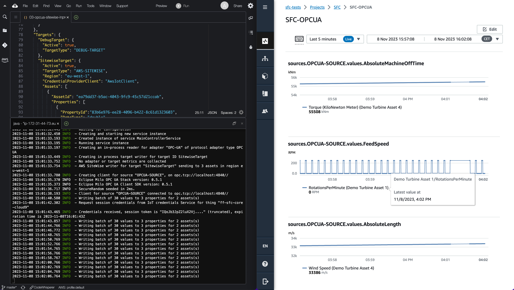
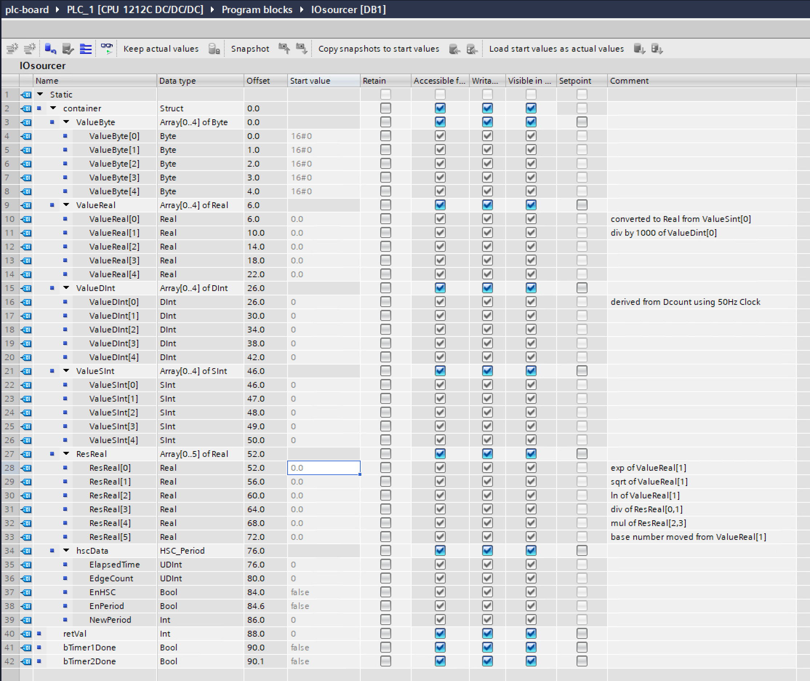

# SFC Example in process configuration for Siemens S7-1200 to AWS IoT Sitewise

The file [`in-process-s7-sitewise.json`](in-process-s7-sitewise.json) contains an example template for
reading data from a Siemens S7-1200 controller using S7 protocol and
sending the data to AWS IoT Sitewise.

In order to use the configuration, make the changes described below, and
use it as the value of the --config parameter when starting sfc-main.

A debug target is included in the example to optionally write the output
to the console.
&nbsp;  
&nbsp;  

<p align="center">
  
</p>
<p align="center">
    <em>Fig. 1. SFC (running in cloud9) sending data to an AWS IoT Sitewise Portal</em>
</p>

## Deployment directory

A Placeholder ${SFC_DEPLOYMENT_DIR} is used in the configuration. SFC
dynamically replaces these placeholders with the value of the
environment variable from the placeholder. In this example it should
have the value of the pathname of the directory where sfc-main, the used
adapters and targets are deployed with the following directory
structure. (This structure can be changed by setting the pathnames in
the AdapterTypes and TargetTypes sections)

${SFC_DEPLOYMENT_DIR}  
&nbsp;&nbsp;&nbsp;|-sfc-main  
&nbsp;&nbsp;&nbsp;|-debug-target    
&nbsp;&nbsp;&nbsp;|-aws-sitewise-target   
&nbsp;&nbsp;&nbsp;|-s7  
&nbsp;  
&nbsp;


## Target section
```json
"Targets": [
  "#DebugTarget",
  "SitewiseTarget"
]
```

In order to write the data to both Sitewise as well as the console
uncomment the DebugTarget by deleting the'#'.  
&nbsp;
&nbsp;  


## SitewiseTarget section

```json
 "SitewiseTarget": {
      "Active": true,
      "TargetType": "AWS-SITEWISE",
      "Region": "<YOUR-REGION>",
      "CredentialProviderClient": "AwsIotClient",
      "Assets": [
        {
          "AssetId": "<SITEWISE-ASSET-ID>",
          "Properties": [
            {
              "PropertyId":"<SITEWISE-PROPERTY-ID>",
              "DataType": "double",
              "DataPath": "sources.S7-SOURCE.values.Ln"
            }
          ]
        },{
          "AssetId": "<SITEWISE-ASSET-ID>",
          "Properties": [
            {
              "PropertyId":"<SITEWISE-PROPERTY-ID>",
              "DataType": "double",
              "DataPath": "sources.S7-SOURCE.values.Exp"
            }
          ]
        },{
          "AssetId": "<SITEWISE-ASSET-ID>",
          "Properties": [
            {
              "PropertyId":"<SITEWISE-PROPERTY-ID>",
              "DataType": "double",
              "DataPath": "sources.S7-SOURCE.values.Sqrt"
            }
          ]
        }
      ]
    }
```

-   \<YOUR-REGION\>, your region e.g., eu-west-1

-  \<SITEWISE-ASSET-ID\>, your sitewise asset ID

-  \<SITEWISE-PROPERTY-ID\>, id of the Sitewise attribute or measurement


`CredentialProviderClient` specifies the credentials provider which is
used to give access to the used AWS service. For more information see
section AwsIotCredentialProviderClients below.
&nbsp;  
&nbsp;  


## Sources Section

```json
"Sources": {
    "S7-SOURCE": {
      "Name": "S7-SOURCE",
      "ProtocolAdapter": "S7",
      "AdapterController": "S7-PLC-1",
      "Description": "S7 PLC local server",
      "Channels": {
        
        "RealValueLn-DB1": {
          "Name": "Ln",
          "Address": "%DB1:60:REAL"
        },
		"RealValueExp-DB1": {
          "Name": "Exp",
          "Address": "%DB1:52:REAL"
        },
		"RealValueSqrt-DB1": {
          "Name": "Sqrt",
          "Address": "%DB1:56:REAL"
        }
      }
    }
  }
```

In this section, the values are defined as channels, which are read from
the controller. In order to change the name of
the value as it is included in the data which is sent to the targets,
include a setting "Name" for the channel.

<p align="center">
  
</p>
<p align="center">
    <em>Fig. 2. Screenshot of Siemens TIA Portal (non-optimized) Datablock DB1; Offset column details refer to the above json config.</em>
</p>

&nbsp;  
&nbsp;  

## ProtocolAdapters section

```json
 "ProtocolAdapters": {
    "S7": {
	  "AdapterType": "S7",
      "Controllers": {
        "S7-PLC-1": {
          "Address": "<CONTROLLER IP ADDRESS>",
		  "ReadPerSingleField": false,
          "LocalRack": 0,
          "LocalSlot": 1,
          "RemoteRack": 0,
          "RemoteSlot": 1,
          "PduSize": 1024,
          "MaxAmqCaller": 8,
          "MaxAmqCallee": 8,
          "ControllerType": "S7-1200",
          "ReadTimeout": 10000,
          "ConnectTimeout": 10000
          
        }
      }
    }
  }

```

-   \<CONTROLLER IP ADDRESS\>, IP address of the controller

This section configures the controller from which the data is read. The
default port 102 is used which can be changed by Including a Port
setting specifying that value.
&nbsp;  
&nbsp;  


## AwsIotCredentialProviderClients

This section configures one or more clients which can be referred to by
targets which need access to AWS services.

A credential provider will make use of the AWS IoT Credentials service
to obtain temporary credentials. This process is described at
<https://aws.amazon.com/blogs/security/how-to-eliminate-the-need-for-hardcoded-aws-credentials-in-devices-by-using-the-aws-iot-credentials-provider/>

The resources used in the configuration can easily be setup by creating
a Thing in the AWS IoT service. The role that `RoleAlias` points to, must
give access to the services used by the target which uses the client.

```json
"AwsIotCredentialProviderClients": {
  "AwsIotClient": {
    "IotCredentialEndpoint": "<ID>.credentials.iot.<YOUR REGION>.amazonaws.com",
    "RoleAlias": "< ROLE EXCHANGE ALIAS >”,
    "ThingName": "< THING NAME > ",
    "Certificate": "< PATH TO DEVICE CERTIFICATE .crt FILE >",
    "PrivateKey": "< PATH TO PRIVATE KEY .key FILE >",
    "RootCa": "< PATH TO ROOT CERTIFICATE .pem FILE >",
  }
}
```


If there is a GreenGrass V2 deployment on the same machine, instead of
all settings a setting named GreenGrassDeploymentPath can be used to
point to that deployment. SFC will use the GreenGrass V2 configurations
setting. Specific setting can be overridden by setting a value for that
setting, which will replace the value from the GreenGrass V2
Configuration. Note that although SFC can be deployed as a GreenGrass
component, it can also run as a standalone process or in a docker
container and still use a GreenGrass configuration.
&nbsp;  
&nbsp;  


```json
"AwsIotCredentialProviderClients": {
  "AwsIotClient": {
    "GreenGrassDeploymentPath": "<GREENGRASS DEPLOYMENT DIR>/v2"
  }
}
```

When the AWS service credentials are provided using one of the options
in the AWS SDK credentials provider chain
(<https://docs.aws.amazon.com/sdk-for-java/latest/developer-guide/credentials-chain.html>)
AwsIotCredentialProviderClients and any references in the targets can be
deleted. Using the temporary credentials provided through a configured
AwsIotCredentialProviderClient for production environment is strongly
recommended.
