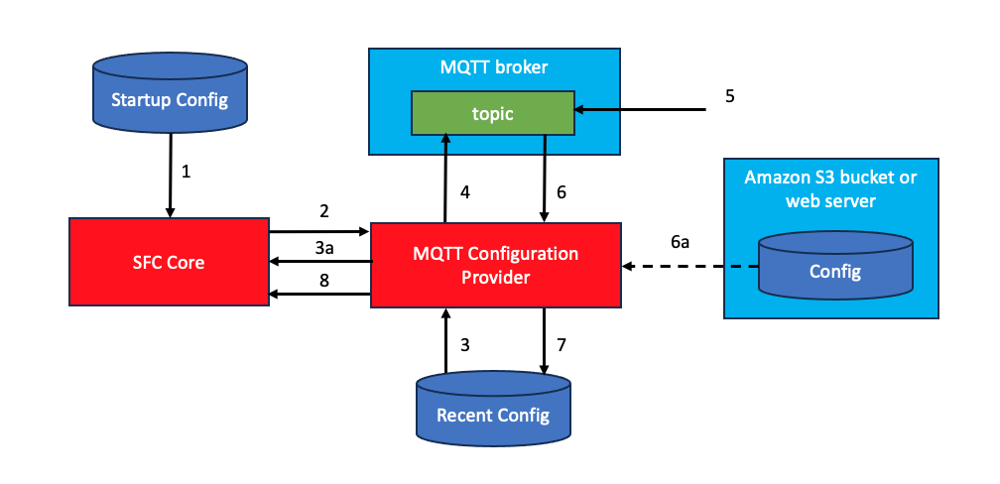

# SFC Example custom MQTT configuration provider

This is an example of a custom config provider allowing submitting configurations to SFC using a MQTT topic. The configuration provider will subscribe to a topic to which SFC configurations can be published.
The payload of the published message can either be 

-  an SFC configuration  in JSON format 
-  a (pre-signed) URL from where the configuration can be downloaded 

The latter can be used if the size of the configuration exceeds the maximum message size of the MQTT broker.

Optionally a local file can be specified to which the last received configuration data can be stored and used next time the SFC main process is started until a new configuration is published.

The  SFC configuration used by to sfc-main  contains the configuration for the MQTT custom provider, including the required information to connect to the MQTT broker.
&nbsp;

### Configuration steps

The image below shows the steps executed by SFC configured to use the MQTT configuration provider.



1. The SFC main process is started with a startup configuration (see example configuration below) which contains the configuration for using the MQTT configuration provider.
2. The SFC main process will create an instance of the provider and will pass the startup configuration to the instance.
3. The provider will look for a recently used configuration (this step is optional) and will load that configuration.
3a.If there was a recently used configuration it will be sent to the SFC which will use it to collect data.
4. The provider connects to the MQTT broker using information from the startup configuration and subscribes to a configured topic.
5. A new configuration is posted to the topic. If the size of the configuration is beyond the maximum payload size of the broker, the configuration is uploaded and instead of the actual configuration an url from where it can be downloaded is published on the topic.
6. The provider receives the messages from the topic, containing either a configuration or an url from where it can be downloaded.
6a.If an url was received the configuration is downloaded making a GET request to the url.
7. After validation the received, or downloaded, configuration is stored as the last recent configuration.
8. The new configuration is sent to the SFC core.

### Example configuration

```json
{
  "ConfigProvider": {
    "JarFiles": ["< DEPLOYMENT DIR > /mqtt-config-provider/build/libs"],
    "FactoryClassName": "com.amazonaws.sfc.config.MqttConfigProvider"
  },
  "LocalConfigFile" : "local-config.json",
  "Port" : < PORT NUMBER >,
  "EndPoint" : "< BROKER ADDRESS >",
  "TopicName" : "< TOPIC NAME >"
}
```


When sfc-main is started with the command

`sfc-main -config config.json`

SFC will load the configured mqtt configuration provider. This provider will optionally use saved configuration data from an earlier program execution and 
subscribe to the configured topic to receive new versions of the configuration.

### MQTT configuration provider configuration

<table>  
<colgroup>  
<col style="width: 17%" />  
<col style="width: 29%" />  
<col style="width: 20%" />  
<col style="width: 32%" />  
</colgroup>   
<tbody>  
<tr class="odd">  
<td><strong>Name</strong></td>  
<td><strong>Description</strong></td>  
<td><strong>Type</strong></td>  
<td><strong>Comments</strong></td>  
</tr>  
<tr class="even">  
<td>EndPoint</td>  
<td>Broker endpoint address</td>  
<td>String</td>  
<td>Optionally with training port number (see Port)


If no scheme is specified in the address, then it will be added based on the Connection type.
("tcp://" for PlainText or "ssl://" for ServerSideTLS or MutualTLS)</td>  
</tr>  
<tr class="odd">  
<td>Port</td>  
<td>Port on MQTT broker</td>  
<td>Integer</td>  
<td>

Commonly port numbers are 
-  1883 for Plaintext
-  8883 for ServerSideTLS
-  8884 for MutualTLS. 
-  443 for AWS IoT Core endpoints

In no port number is specified then the EndPoint address is searched for a training port number.

</td> 
</tr>  
<tr class="even">  
<td>Connection</td>  
<td>Connection type</td>  
<td>String</td>  
<td>

-  "PlainText" (Default)
-  "ServerSideTLS"
-  "MutualTLS"
</td>  
</tr>  
<tr class="even">  
<td>SslServerCertificate</td>  
<td>Path to server certificate file to verify the identity of the broker.</td>  
<td>String</td>  
<td>If no certificate file is specified it is obtained from the server.
<p>Used for connections of type ServerSideTLS and MutualTLS</p></td>  
</tr>  
<tr class="odd">  
<td>PrivateKey</td>  
<td>Path to client private key file</td>  
<td>String</td>  
<td></td>  
</tr>  
<tr class="even">  
<td>RootCA</td>  
<td>Path to root certificate file. The Root CA file in an MQTT client is used for server certificate verification when establishing a secure connection with the broker (using TLS/SSL)</td>  
<td>String</td>  
<td></td>  
</tr>  
<tr class="odd">  
<td>Certificate</td>  
<td>Path to client certificate file. Used if broker used certificate authentication</td>  
<td>String</td>  
<td></td>  
</tr>  
<tr class="even">  
<td>Username</td>  
<td>Username if broker is using username and password authentication</td>  
<td>String</td>  
<td>Username and password should not be included as clear text in the configuration. It is strongly recommended to use placeholders and use the SFC integration with the AWS secrets manager.</td>
<tr class="odd">  
<td>Password</td>  
<td>Password if broker is using username and password authentication</td>  
<td>String</td>  
<td>Username and password should not be included as clear text in the configuration. It is strongly recommended to use placeholders and use the SFC integration with the AWS secrets manager.</td>  
</tr>  
<tr class="even">  
<td>ConnectionTimeout</td>  
<td>Timeout for connecting to the broker in seconds</td>  
<td>Int</td>  
<td>Default is 10 seconds</td>
<tr class="odd">  
<td>WaitAfterConnectError</td>  
<td>Period in seconds to wait before trying to connect after a connection failure</td>  
<td>Int</td>  
<td>Default is 60 seconds</td>
<tr class="even">
<td>TopicName</td>  
<td>Name of the topic which is used to publish configuration data.</td>  
<td>String</td>  
<td></td>  
</tr> 
<tr class="odd">  
<td>LocalConfigFile</td>  
<td>Pathname of a file to which received configurations are written. </td>  
<td>String</td>  
<td>If the SFC process is executed it will check if this file exists and use it to load the 
initial configuration which is sent by the config provider to the SFC core before subscribing and awaiting configurations published to the topic. If this
setting is omitted then received configurations are not saved.</td>
<tr class="even">  
<td>UseLocalConfigFileAtStartUp</td>  
<td>Controls if the last received and stored local configuration file may be used as initial configuration data which is sent to the SFC core.</td>  
<td>String</td>  
<td>Default is true. 

Note that if this is set to false, or no LocalConfigFile is specified SFC can only start collecting and processing data after a first valid configuration
is received on the configured topic.
</td> 
</tr>  
</tbody>  
</table>

